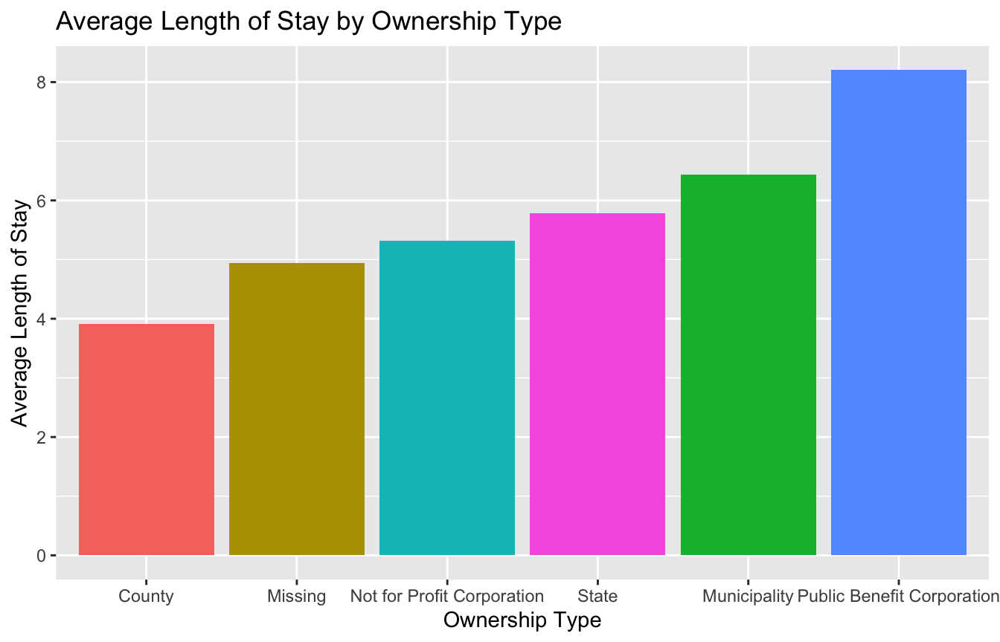
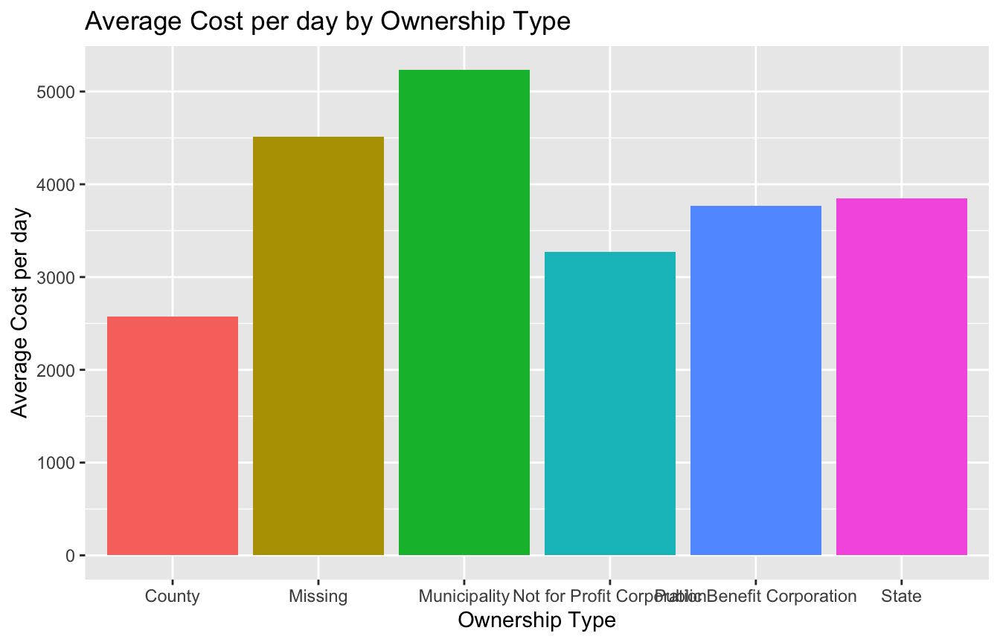

# Introduction
Predicting patient outcomes early in the admission process is an important part of hospital management [@tierneyPredictingInpatientCosts1995;@tsaiLengthHospitalStay2016]. Estimating a patient's length of stay, for instance, assists in logistics such as allocation of hospital resources [@tsaiLengthHospitalStay2016]. The ability to predict patient-specific healthcare costs helps us gain understanding of the situations that lead to high healthcare costs and can inform future decisions in preventative care, which has been shown to be one of the best ways to decrease healthcare cost [@yangMachineLearningApproaches2018].  

For our final project we will be using the Statewide Planning and Research Cooperative System (SPARCS) Inpatient De-identified File dataset (originally provided the New York State Department of Health [@newyorkstatedepartmentofhealthStatewidePlanningResearch2017]) as it appears on Kaggle to predict length of stay (LOS) in days, a metric used to assess hospital efficiency and quality of care [@oecdAverageLengthStay2011;@robinsonPredictionHospitalLength1966;@tsaiLengthHospitalStay2016], and patient cost per day. The full dataset contains nearly 2.35 million de-identified observations and 37 features about hospital inpatient discharge data for 2015.


# Set Up

<style type="text/css">
pre {
  max-height: 300px;
  overflow-y: auto;
}

pre[class] {
  max-height: 600px;
}
</style>


## Libraries


```{.r .fold-show}
library(ggplot2)
library(ggiraph)
library(kableExtra)
library(lme4)
library(spaMM)
spaMM.options(nb_cores = future::availableCores() - 2)
```

## Miscellaneous Functions


```{.r .fold-show}
report_table <- function(x, w = NULL, h = "500px", ec = NULL, rownames = FALSE) {
    scroll_box(kable_paper(kable_styling(kbl(x, row.names = rownames), full_width = T, 
        position = "center", bootstrap_options = c("striped", "hover"), fixed_thead = T), 
        full_width = T), fixed_thead = T, height = h, width = w, extra_css = ec)
}

report_plot <- function(x) {
    girafe_options(girafe(code = print(x)), opts_sizing(rescale = TRUE), opts_tooltip(opacity = 0.9, 
        css = "background-color:gray;color:white;padding:2px;border-radius:2px;"), 
        opts_hover(css = "cursor:pointer;"), htmlwidgets::sizingPolicy(defaultWidth = "800px", 
            defaultHeight = "494px"))
}
```

# Data Import


```{.r .fold-show}
# Import the data
dat <- read.csv("input/Hospital_Inpatient_Discharges__SPARCS_De-Identified___2015.csv", 
    colClasses = c(rep("factor", 10), "character", rep("factor", 21), "numeric", 
        rep("factor", 2), rep("character", 2)), na.strings = c("NA", ""))
```

In addition to the columns found in the Kaggle dataset, we will also be using the New York State Department of Health's "Health Facility General Information" dataset [@newyorkstatedepartmentofhealthHealthFacilityGeneral2014] in order to incorporate Facility Type and Ownership Type variables into our analysis by matching on Facility ID.


```{.r .fold-show}
# read in facility id and description columns from facility information dataset
dat_hf <- read.csv("input/Health_Facility_General_Information.csv", colClasses = c("factor", 
    rep("NULL", 2), "factor", rep("NULL", 28), "factor", rep("NULL", 3)), skipNul = TRUE)

# remove duplicate rows
dat_hf <- dat_hf[!duplicated(dat_hf), ]

# rename columns
colnames(dat_hf) <- c("Facility.Id", "Facility.Type", "Ownership.Type")

# merge datasets by Facility Id
dat <- droplevels(merge(dat, dat_hf, by = "Facility.Id", all.x = TRUE, sort = FALSE))
```


```r
report_table(head(dat, 50))
```

<div style="border: 1px solid #ddd; padding: 0px; overflow-y: scroll; height:500px; "><table class="table table-striped table-hover lightable-paper" style='margin-left: auto; margin-right: auto; font-family: "Arial Narrow", arial, helvetica, sans-serif; margin-left: auto; margin-right: auto;'>
 <thead>
  <tr>
   <th style="text-align:left;position: sticky; top:0; background-color: #FFFFFF;position: sticky; top:0; background-color: #FFFFFF;"> Facility.Id </th>
   <th style="text-align:left;position: sticky; top:0; background-color: #FFFFFF;position: sticky; top:0; background-color: #FFFFFF;"> Health.Service.Area </th>
   <th style="text-align:left;position: sticky; top:0; background-color: #FFFFFF;position: sticky; top:0; background-color: #FFFFFF;"> Hospital.County </th>
   <th style="text-align:left;position: sticky; top:0; background-color: #FFFFFF;position: sticky; top:0; background-color: #FFFFFF;"> Operating.Certificate.Number </th>
   <th style="text-align:left;position: sticky; top:0; background-color: #FFFFFF;position: sticky; top:0; background-color: #FFFFFF;"> Facility.Name </th>
   <th style="text-align:left;position: sticky; top:0; background-color: #FFFFFF;position: sticky; top:0; background-color: #FFFFFF;"> Age.Group </th>
   <th style="text-align:left;position: sticky; top:0; background-color: #FFFFFF;position: sticky; top:0; background-color: #FFFFFF;"> Zip.Code...3.digits </th>
   <th style="text-align:left;position: sticky; top:0; background-color: #FFFFFF;position: sticky; top:0; background-color: #FFFFFF;"> Gender </th>
   <th style="text-align:left;position: sticky; top:0; background-color: #FFFFFF;position: sticky; top:0; background-color: #FFFFFF;"> Race </th>
   <th style="text-align:left;position: sticky; top:0; background-color: #FFFFFF;position: sticky; top:0; background-color: #FFFFFF;"> Ethnicity </th>
   <th style="text-align:left;position: sticky; top:0; background-color: #FFFFFF;position: sticky; top:0; background-color: #FFFFFF;"> Length.of.Stay </th>
   <th style="text-align:left;position: sticky; top:0; background-color: #FFFFFF;position: sticky; top:0; background-color: #FFFFFF;"> Type.of.Admission </th>
   <th style="text-align:left;position: sticky; top:0; background-color: #FFFFFF;position: sticky; top:0; background-color: #FFFFFF;"> Patient.Disposition </th>
   <th style="text-align:left;position: sticky; top:0; background-color: #FFFFFF;position: sticky; top:0; background-color: #FFFFFF;"> Discharge.Year </th>
   <th style="text-align:left;position: sticky; top:0; background-color: #FFFFFF;position: sticky; top:0; background-color: #FFFFFF;"> CCS.Diagnosis.Code </th>
   <th style="text-align:left;position: sticky; top:0; background-color: #FFFFFF;position: sticky; top:0; background-color: #FFFFFF;"> CCS.Diagnosis.Description </th>
   <th style="text-align:left;position: sticky; top:0; background-color: #FFFFFF;position: sticky; top:0; background-color: #FFFFFF;"> CCS.Procedure.Code </th>
   <th style="text-align:left;position: sticky; top:0; background-color: #FFFFFF;position: sticky; top:0; background-color: #FFFFFF;"> CCS.Procedure.Description </th>
   <th style="text-align:left;position: sticky; top:0; background-color: #FFFFFF;position: sticky; top:0; background-color: #FFFFFF;"> APR.DRG.Code </th>
   <th style="text-align:left;position: sticky; top:0; background-color: #FFFFFF;position: sticky; top:0; background-color: #FFFFFF;"> APR.DRG.Description </th>
   <th style="text-align:left;position: sticky; top:0; background-color: #FFFFFF;position: sticky; top:0; background-color: #FFFFFF;"> APR.MDC.Code </th>
   <th style="text-align:left;position: sticky; top:0; background-color: #FFFFFF;position: sticky; top:0; background-color: #FFFFFF;"> APR.MDC.Description </th>
   <th style="text-align:left;position: sticky; top:0; background-color: #FFFFFF;position: sticky; top:0; background-color: #FFFFFF;"> APR.Severity.of.Illness.Code </th>
   <th style="text-align:left;position: sticky; top:0; background-color: #FFFFFF;position: sticky; top:0; background-color: #FFFFFF;"> APR.Severity.of.Illness.Description </th>
   <th style="text-align:left;position: sticky; top:0; background-color: #FFFFFF;position: sticky; top:0; background-color: #FFFFFF;"> APR.Risk.of.Mortality </th>
   <th style="text-align:left;position: sticky; top:0; background-color: #FFFFFF;position: sticky; top:0; background-color: #FFFFFF;"> APR.Medical.Surgical.Description </th>
   <th style="text-align:left;position: sticky; top:0; background-color: #FFFFFF;position: sticky; top:0; background-color: #FFFFFF;"> Payment.Typology.1 </th>
   <th style="text-align:left;position: sticky; top:0; background-color: #FFFFFF;position: sticky; top:0; background-color: #FFFFFF;"> Payment.Typology.2 </th>
   <th style="text-align:left;position: sticky; top:0; background-color: #FFFFFF;position: sticky; top:0; background-color: #FFFFFF;"> Payment.Typology.3 </th>
   <th style="text-align:left;position: sticky; top:0; background-color: #FFFFFF;position: sticky; top:0; background-color: #FFFFFF;"> Attending.Provider.License.Number </th>
   <th style="text-align:left;position: sticky; top:0; background-color: #FFFFFF;position: sticky; top:0; background-color: #FFFFFF;"> Operating.Provider.License.Number </th>
   <th style="text-align:left;position: sticky; top:0; background-color: #FFFFFF;position: sticky; top:0; background-color: #FFFFFF;"> Other.Provider.License.Number </th>
   <th style="text-align:right;position: sticky; top:0; background-color: #FFFFFF;position: sticky; top:0; background-color: #FFFFFF;"> Birth.Weight </th>
   <th style="text-align:left;position: sticky; top:0; background-color: #FFFFFF;position: sticky; top:0; background-color: #FFFFFF;"> Abortion.Edit.Indicator </th>
   <th style="text-align:left;position: sticky; top:0; background-color: #FFFFFF;position: sticky; top:0; background-color: #FFFFFF;"> Emergency.Department.Indicator </th>
   <th style="text-align:left;position: sticky; top:0; background-color: #FFFFFF;position: sticky; top:0; background-color: #FFFFFF;"> Total.Charges </th>
   <th style="text-align:left;position: sticky; top:0; background-color: #FFFFFF;position: sticky; top:0; background-color: #FFFFFF;"> Total.Costs </th>
   <th style="text-align:left;position: sticky; top:0; background-color: #FFFFFF;position: sticky; top:0; background-color: #FFFFFF;"> Facility.Type </th>
   <th style="text-align:left;position: sticky; top:0; background-color: #FFFFFF;position: sticky; top:0; background-color: #FFFFFF;"> Ownership.Type </th>
  </tr>
 </thead>
<tbody>
  <tr>
   <td style="text-align:left;"> 66 </td>
   <td style="text-align:left;"> Western NY </td>
   <td style="text-align:left;"> Cattaraugus </td>
   <td style="text-align:left;"> 0401001 </td>
   <td style="text-align:left;"> Olean General Hospital </td>
   <td style="text-align:left;"> 30 to 49 </td>
   <td style="text-align:left;"> 147 </td>
   <td style="text-align:left;"> F </td>
   <td style="text-align:left;"> White </td>
   <td style="text-align:left;"> Not Span/Hispanic </td>
   <td style="text-align:left;"> 5 </td>
   <td style="text-align:left;"> Emergency </td>
   <td style="text-align:left;"> Home or Self Care </td>
   <td style="text-align:left;"> 2015 </td>
   <td style="text-align:left;"> 127 </td>
   <td style="text-align:left;"> Chronic obstructive pulmonary disease and bronchiectasis </td>
   <td style="text-align:left;"> 0 </td>
   <td style="text-align:left;"> NO PROC </td>
   <td style="text-align:left;"> 140 </td>
   <td style="text-align:left;"> Chronic obstructive pulmonary disease </td>
   <td style="text-align:left;"> 4 </td>
   <td style="text-align:left;"> Diseases and Disorders of the Respiratory System </td>
   <td style="text-align:left;"> 3 </td>
   <td style="text-align:left;"> Major </td>
   <td style="text-align:left;"> Moderate </td>
   <td style="text-align:left;"> Medical </td>
   <td style="text-align:left;"> Medicare </td>
   <td style="text-align:left;"> Medicaid </td>
   <td style="text-align:left;"> NA </td>
   <td style="text-align:left;"> 197453 </td>
   <td style="text-align:left;"> NA </td>
   <td style="text-align:left;"> NA </td>
   <td style="text-align:right;"> 0 </td>
   <td style="text-align:left;"> N </td>
   <td style="text-align:left;"> Y </td>
   <td style="text-align:left;"> $18309.20 </td>
   <td style="text-align:left;"> $10309.98 </td>
   <td style="text-align:left;"> Hospital </td>
   <td style="text-align:left;"> Not for Profit Corporation </td>
  </tr>
  <tr>
   <td style="text-align:left;"> 66 </td>
   <td style="text-align:left;"> Western NY </td>
   <td style="text-align:left;"> Cattaraugus </td>
   <td style="text-align:left;"> 0401001 </td>
   <td style="text-align:left;"> Olean General Hospital </td>
   <td style="text-align:left;"> 70 or Older </td>
   <td style="text-align:left;"> 147 </td>
   <td style="text-align:left;"> M </td>
   <td style="text-align:left;"> White </td>
   <td style="text-align:left;"> Not Span/Hispanic </td>
   <td style="text-align:left;"> 3 </td>
   <td style="text-align:left;"> Emergency </td>
   <td style="text-align:left;"> Home w/ Home Health Services </td>
   <td style="text-align:left;"> 2015 </td>
   <td style="text-align:left;"> 108 </td>
   <td style="text-align:left;"> Congestive heart failure; nonhypertensive </td>
   <td style="text-align:left;"> 58 </td>
   <td style="text-align:left;"> HEMODIALYSIS </td>
   <td style="text-align:left;"> 194 </td>
   <td style="text-align:left;"> Heart failure </td>
   <td style="text-align:left;"> 5 </td>
   <td style="text-align:left;"> Diseases and Disorders of the Circulatory System </td>
   <td style="text-align:left;"> 3 </td>
   <td style="text-align:left;"> Major </td>
   <td style="text-align:left;"> Major </td>
   <td style="text-align:left;"> Medical </td>
   <td style="text-align:left;"> Medicare </td>
   <td style="text-align:left;"> NA </td>
   <td style="text-align:left;"> NA </td>
   <td style="text-align:left;"> 40003993 </td>
   <td style="text-align:left;"> 193890 </td>
   <td style="text-align:left;"> NA </td>
   <td style="text-align:right;"> 0 </td>
   <td style="text-align:left;"> N </td>
   <td style="text-align:left;"> Y </td>
   <td style="text-align:left;"> $12310.76 </td>
   <td style="text-align:left;"> $6034.20 </td>
   <td style="text-align:left;"> Hospital </td>
   <td style="text-align:left;"> Not for Profit Corporation </td>
  </tr>
  <tr>
   <td style="text-align:left;"> 66 </td>
   <td style="text-align:left;"> Western NY </td>
   <td style="text-align:left;"> Cattaraugus </td>
   <td style="text-align:left;"> 0401001 </td>
   <td style="text-align:left;"> Olean General Hospital </td>
   <td style="text-align:left;"> 70 or Older </td>
   <td style="text-align:left;"> 148 </td>
   <td style="text-align:left;"> F </td>
   <td style="text-align:left;"> White </td>
   <td style="text-align:left;"> Not Span/Hispanic </td>
   <td style="text-align:left;"> 9 </td>
   <td style="text-align:left;"> Emergency </td>
   <td style="text-align:left;"> Home or Self Care </td>
   <td style="text-align:left;"> 2015 </td>
   <td style="text-align:left;"> 2 </td>
   <td style="text-align:left;"> Septicemia (except in labor) </td>
   <td style="text-align:left;"> 222 </td>
   <td style="text-align:left;"> BLOOD TRANSFUSION </td>
   <td style="text-align:left;"> 720 </td>
   <td style="text-align:left;"> Septicemia &amp; disseminated infections </td>
   <td style="text-align:left;"> 18 </td>
   <td style="text-align:left;"> Infectious and Parasitic Diseases, Systemic or Unspecified Sites </td>
   <td style="text-align:left;"> 4 </td>
   <td style="text-align:left;"> Extreme </td>
   <td style="text-align:left;"> Major </td>
   <td style="text-align:left;"> Medical </td>
   <td style="text-align:left;"> Medicare </td>
   <td style="text-align:left;"> NA </td>
   <td style="text-align:left;"> NA </td>
   <td style="text-align:left;"> 266409 </td>
   <td style="text-align:left;"> 266335 </td>
   <td style="text-align:left;"> NA </td>
   <td style="text-align:right;"> 0 </td>
   <td style="text-align:left;"> N </td>
   <td style="text-align:left;"> Y </td>
   <td style="text-align:left;"> $48242.20 </td>
   <td style="text-align:left;"> $20494.93 </td>
   <td style="text-align:left;"> Hospital </td>
   <td style="text-align:left;"> Not for Profit Corporation </td>
  </tr>
  <tr>
   <td style="text-align:left;"> 66 </td>
   <td style="text-align:left;"> Western NY </td>
   <td style="text-align:left;"> Cattaraugus </td>
   <td style="text-align:left;"> 0401001 </td>
   <td style="text-align:left;"> Olean General Hospital </td>
   <td style="text-align:left;"> 50 to 69 </td>
   <td style="text-align:left;"> OOS </td>
   <td style="text-align:left;"> F </td>
   <td style="text-align:left;"> White </td>
   <td style="text-align:left;"> Not Span/Hispanic </td>
   <td style="text-align:left;"> 2 </td>
   <td style="text-align:left;"> Elective </td>
   <td style="text-align:left;"> Home or Self Care </td>
   <td style="text-align:left;"> 2015 </td>
   <td style="text-align:left;"> 100 </td>
   <td style="text-align:left;"> Acute myocardial infarction </td>
   <td style="text-align:left;"> 47 </td>
   <td style="text-align:left;"> DX CARDIAC CATHETERIZTN </td>
   <td style="text-align:left;"> 190 </td>
   <td style="text-align:left;"> Acute myocardial infarction </td>
   <td style="text-align:left;"> 5 </td>
   <td style="text-align:left;"> Diseases and Disorders of the Circulatory System </td>
   <td style="text-align:left;"> 2 </td>
   <td style="text-align:left;"> Moderate </td>
   <td style="text-align:left;"> Moderate </td>
   <td style="text-align:left;"> Medical </td>
   <td style="text-align:left;"> Medicaid </td>
   <td style="text-align:left;"> NA </td>
   <td style="text-align:left;"> NA </td>
   <td style="text-align:left;"> 90271326 </td>
   <td style="text-align:left;"> 183914 </td>
   <td style="text-align:left;"> NA </td>
   <td style="text-align:right;"> 0 </td>
   <td style="text-align:left;"> N </td>
   <td style="text-align:left;"> N </td>
   <td style="text-align:left;"> $12794.77 </td>
   <td style="text-align:left;"> $7369.54 </td>
   <td style="text-align:left;"> Hospital </td>
   <td style="text-align:left;"> Not for Profit Corporation </td>
  </tr>
  <tr>
   <td style="text-align:left;"> 66 </td>
   <td style="text-align:left;"> Western NY </td>
   <td style="text-align:left;"> Cattaraugus </td>
   <td style="text-align:left;"> 0401001 </td>
   <td style="text-align:left;"> Olean General Hospital </td>
   <td style="text-align:left;"> 70 or Older </td>
   <td style="text-align:left;"> 147 </td>
   <td style="text-align:left;"> F </td>
   <td style="text-align:left;"> White </td>
   <td style="text-align:left;"> Not Span/Hispanic </td>
   <td style="text-align:left;"> 4 </td>
   <td style="text-align:left;"> Emergency </td>
   <td style="text-align:left;"> Home w/ Home Health Services </td>
   <td style="text-align:left;"> 2015 </td>
   <td style="text-align:left;"> 100 </td>
   <td style="text-align:left;"> Acute myocardial infarction </td>
   <td style="text-align:left;"> 0 </td>
   <td style="text-align:left;"> NO PROC </td>
   <td style="text-align:left;"> 190 </td>
   <td style="text-align:left;"> Acute myocardial infarction </td>
   <td style="text-align:left;"> 5 </td>
   <td style="text-align:left;"> Diseases and Disorders of the Circulatory System </td>
   <td style="text-align:left;"> 2 </td>
   <td style="text-align:left;"> Moderate </td>
   <td style="text-align:left;"> Moderate </td>
   <td style="text-align:left;"> Medical </td>
   <td style="text-align:left;"> Medicare </td>
   <td style="text-align:left;"> NA </td>
   <td style="text-align:left;"> NA </td>
   <td style="text-align:left;"> 266141 </td>
   <td style="text-align:left;"> NA </td>
   <td style="text-align:left;"> NA </td>
   <td style="text-align:right;"> 0 </td>
   <td style="text-align:left;"> N </td>
   <td style="text-align:left;"> Y </td>
   <td style="text-align:left;"> $10292.68 </td>
   <td style="text-align:left;"> $4001.00 </td>
   <td style="text-align:left;"> Hospital </td>
   <td style="text-align:left;"> Not for Profit Corporation </td>
  </tr>
  <tr>
   <td style="text-align:left;"> 66 </td>
   <td style="text-align:left;"> Western NY </td>
   <td style="text-align:left;"> Cattaraugus </td>
   <td style="text-align:left;"> 0401001 </td>
   <td style="text-align:left;"> Olean General Hospital </td>
   <td style="text-align:left;"> 18 to 29 </td>
   <td style="text-align:left;"> 141 </td>
   <td style="text-align:left;"> M </td>
   <td style="text-align:left;"> White </td>
   <td style="text-align:left;"> Not Span/Hispanic </td>
   <td style="text-align:left;"> 7 </td>
   <td style="text-align:left;"> Emergency </td>
   <td style="text-align:left;"> Short-term Hospital </td>
   <td style="text-align:left;"> 2015 </td>
   <td style="text-align:left;"> 130 </td>
   <td style="text-align:left;"> Pleurisy; pneumothorax; pulmonary collapse </td>
   <td style="text-align:left;"> 39 </td>
   <td style="text-align:left;"> INCISION OF PLEURA </td>
   <td style="text-align:left;"> 143 </td>
   <td style="text-align:left;"> Other respiratory diagnoses except signs, symptoms &amp; minor diagnoses </td>
   <td style="text-align:left;"> 4 </td>
   <td style="text-align:left;"> Diseases and Disorders of the Respiratory System </td>
   <td style="text-align:left;"> 1 </td>
   <td style="text-align:left;"> Minor </td>
   <td style="text-align:left;"> Minor </td>
   <td style="text-align:left;"> Medical </td>
   <td style="text-align:left;"> Medicaid </td>
   <td style="text-align:left;"> NA </td>
   <td style="text-align:left;"> NA </td>
   <td style="text-align:left;"> 271326 </td>
   <td style="text-align:left;"> 273279 </td>
   <td style="text-align:left;"> NA </td>
   <td style="text-align:right;"> 0 </td>
   <td style="text-align:left;"> N </td>
   <td style="text-align:left;"> Y </td>
   <td style="text-align:left;"> $14177.09 </td>
   <td style="text-align:left;"> $7711.28 </td>
   <td style="text-align:left;"> Hospital </td>
   <td style="text-align:left;"> Not for Profit Corporation </td>
  </tr>
  <tr>
   <td style="text-align:left;"> 66 </td>
   <td style="text-align:left;"> Western NY </td>
   <td style="text-align:left;"> Cattaraugus </td>
   <td style="text-align:left;"> 0401001 </td>
   <td style="text-align:left;"> Olean General Hospital </td>
   <td style="text-align:left;"> 50 to 69 </td>
   <td style="text-align:left;"> 141 </td>
   <td style="text-align:left;"> M </td>
   <td style="text-align:left;"> White </td>
   <td style="text-align:left;"> Not Span/Hispanic </td>
   <td style="text-align:left;"> 9 </td>
   <td style="text-align:left;"> Emergency </td>
   <td style="text-align:left;"> Home w/ Home Health Services </td>
   <td style="text-align:left;"> 2015 </td>
   <td style="text-align:left;"> 660 </td>
   <td style="text-align:left;"> Alcohol-related disorders </td>
   <td style="text-align:left;"> 231 </td>
   <td style="text-align:left;"> OTHER THERAPEUTIC PRCS </td>
   <td style="text-align:left;"> 280 </td>
   <td style="text-align:left;"> Alcoholic liver disease </td>
   <td style="text-align:left;"> 7 </td>
   <td style="text-align:left;"> Diseases and Disorders of the Hepatobiliary System and Pancreas </td>
   <td style="text-align:left;"> 3 </td>
   <td style="text-align:left;"> Major </td>
   <td style="text-align:left;"> Major </td>
   <td style="text-align:left;"> Medical </td>
   <td style="text-align:left;"> Medicare </td>
   <td style="text-align:left;"> NA </td>
   <td style="text-align:left;"> NA </td>
   <td style="text-align:left;"> 40003993 </td>
   <td style="text-align:left;"> 239912 </td>
   <td style="text-align:left;"> NA </td>
   <td style="text-align:right;"> 0 </td>
   <td style="text-align:left;"> N </td>
   <td style="text-align:left;"> Y </td>
   <td style="text-align:left;"> $21448.73 </td>
   <td style="text-align:left;"> $9511.37 </td>
   <td style="text-align:left;"> Hospital </td>
   <td style="text-align:left;"> Not for Profit Corporation </td>
  </tr>
  <tr>
   <td style="text-align:left;"> 66 </td>
   <td style="text-align:left;"> Western NY </td>
   <td style="text-align:left;"> Cattaraugus </td>
   <td style="text-align:left;"> 0401001 </td>
   <td style="text-align:left;"> Olean General Hospital </td>
   <td style="text-align:left;"> 0 to 17 </td>
   <td style="text-align:left;"> 147 </td>
   <td style="text-align:left;"> F </td>
   <td style="text-align:left;"> White </td>
   <td style="text-align:left;"> Not Span/Hispanic </td>
   <td style="text-align:left;"> 3 </td>
   <td style="text-align:left;"> Newborn </td>
   <td style="text-align:left;"> Home or Self Care </td>
   <td style="text-align:left;"> 2015 </td>
   <td style="text-align:left;"> 218 </td>
   <td style="text-align:left;"> Liveborn </td>
   <td style="text-align:left;"> 0 </td>
   <td style="text-align:left;"> NO PROC </td>
   <td style="text-align:left;"> 640 </td>
   <td style="text-align:left;"> Neonate birthwt &gt;2499g, normal newborn or neonate w other problem </td>
   <td style="text-align:left;"> 15 </td>
   <td style="text-align:left;"> Newborns and Other Neonates with Conditions Originating in the Perinatal Period </td>
   <td style="text-align:left;"> 1 </td>
   <td style="text-align:left;"> Minor </td>
   <td style="text-align:left;"> Minor </td>
   <td style="text-align:left;"> Medical </td>
   <td style="text-align:left;"> Medicaid </td>
   <td style="text-align:left;"> NA </td>
   <td style="text-align:left;"> NA </td>
   <td style="text-align:left;"> 256322 </td>
   <td style="text-align:left;"> NA </td>
   <td style="text-align:left;"> NA </td>
   <td style="text-align:right;"> 3400 </td>
   <td style="text-align:left;"> N </td>
   <td style="text-align:left;"> N </td>
   <td style="text-align:left;"> $2393.10 </td>
   <td style="text-align:left;"> $1327.02 </td>
   <td style="text-align:left;"> Hospital </td>
   <td style="text-align:left;"> Not for Profit Corporation </td>
  </tr>
  <tr>
   <td style="text-align:left;"> 66 </td>
   <td style="text-align:left;"> Western NY </td>
   <td style="text-align:left;"> Cattaraugus </td>
   <td style="text-align:left;"> 0401001 </td>
   <td style="text-align:left;"> Olean General Hospital </td>
   <td style="text-align:left;"> 0 to 17 </td>
   <td style="text-align:left;"> 147 </td>
   <td style="text-align:left;"> F </td>
   <td style="text-align:left;"> White </td>
   <td style="text-align:left;"> Not Span/Hispanic </td>
   <td style="text-align:left;"> 4 </td>
   <td style="text-align:left;"> Newborn </td>
   <td style="text-align:left;"> Home or Self Care </td>
   <td style="text-align:left;"> 2015 </td>
   <td style="text-align:left;"> 218 </td>
   <td style="text-align:left;"> Liveborn </td>
   <td style="text-align:left;"> 0 </td>
   <td style="text-align:left;"> NO PROC </td>
   <td style="text-align:left;"> 640 </td>
   <td style="text-align:left;"> Neonate birthwt &gt;2499g, normal newborn or neonate w other problem </td>
   <td style="text-align:left;"> 15 </td>
   <td style="text-align:left;"> Newborns and Other Neonates with Conditions Originating in the Perinatal Period </td>
   <td style="text-align:left;"> 2 </td>
   <td style="text-align:left;"> Moderate </td>
   <td style="text-align:left;"> Minor </td>
   <td style="text-align:left;"> Medical </td>
   <td style="text-align:left;"> Medicaid </td>
   <td style="text-align:left;"> NA </td>
   <td style="text-align:left;"> NA </td>
   <td style="text-align:left;"> 182357 </td>
   <td style="text-align:left;"> NA </td>
   <td style="text-align:left;"> NA </td>
   <td style="text-align:right;"> 2900 </td>
   <td style="text-align:left;"> N </td>
   <td style="text-align:left;"> N </td>
   <td style="text-align:left;"> $4191.00 </td>
   <td style="text-align:left;"> $2136.17 </td>
   <td style="text-align:left;"> Hospital </td>
   <td style="text-align:left;"> Not for Profit Corporation </td>
  </tr>
  <tr>
   <td style="text-align:left;"> 66 </td>
   <td style="text-align:left;"> Western NY </td>
   <td style="text-align:left;"> Cattaraugus </td>
   <td style="text-align:left;"> 0401001 </td>
   <td style="text-align:left;"> Olean General Hospital </td>
   <td style="text-align:left;"> 70 or Older </td>
   <td style="text-align:left;"> 147 </td>
   <td style="text-align:left;"> F </td>
   <td style="text-align:left;"> White </td>
   <td style="text-align:left;"> Not Span/Hispanic </td>
   <td style="text-align:left;"> 4 </td>
   <td style="text-align:left;"> Elective </td>
   <td style="text-align:left;"> Skilled Nursing Home </td>
   <td style="text-align:left;"> 2015 </td>
   <td style="text-align:left;"> 204 </td>
   <td style="text-align:left;"> Other non-traumatic joint disorders </td>
   <td style="text-align:left;"> 152 </td>
   <td style="text-align:left;"> ARTHROPLASTY KNEE </td>
   <td style="text-align:left;"> 302 </td>
   <td style="text-align:left;"> Knee joint replacement </td>
   <td style="text-align:left;"> 8 </td>
   <td style="text-align:left;"> Diseases and Disorders of the Musculoskeletal System and Conn Tissue </td>
   <td style="text-align:left;"> 1 </td>
   <td style="text-align:left;"> Minor </td>
   <td style="text-align:left;"> Minor </td>
   <td style="text-align:left;"> Surgical </td>
   <td style="text-align:left;"> Medicare </td>
   <td style="text-align:left;"> Private Health Insurance </td>
   <td style="text-align:left;"> NA </td>
   <td style="text-align:left;"> 257934 </td>
   <td style="text-align:left;"> 257934 </td>
   <td style="text-align:left;"> NA </td>
   <td style="text-align:right;"> 0 </td>
   <td style="text-align:left;"> N </td>
   <td style="text-align:left;"> N </td>
   <td style="text-align:left;"> $29514.01 </td>
   <td style="text-align:left;"> $59253.25 </td>
   <td style="text-align:left;"> Hospital </td>
   <td style="text-align:left;"> Not for Profit Corporation </td>
  </tr>
  <tr>
   <td style="text-align:left;"> 66 </td>
   <td style="text-align:left;"> Western NY </td>
   <td style="text-align:left;"> Cattaraugus </td>
   <td style="text-align:left;"> 0401001 </td>
   <td style="text-align:left;"> Olean General Hospital </td>
   <td style="text-align:left;"> 0 to 17 </td>
   <td style="text-align:left;"> 147 </td>
   <td style="text-align:left;"> F </td>
   <td style="text-align:left;"> White </td>
   <td style="text-align:left;"> Not Span/Hispanic </td>
   <td style="text-align:left;"> 1 </td>
   <td style="text-align:left;"> Newborn </td>
   <td style="text-align:left;"> Home or Self Care </td>
   <td style="text-align:left;"> 2015 </td>
   <td style="text-align:left;"> 218 </td>
   <td style="text-align:left;"> Liveborn </td>
   <td style="text-align:left;"> 0 </td>
   <td style="text-align:left;"> NO PROC </td>
   <td style="text-align:left;"> 640 </td>
   <td style="text-align:left;"> Neonate birthwt &gt;2499g, normal newborn or neonate w other problem </td>
   <td style="text-align:left;"> 15 </td>
   <td style="text-align:left;"> Newborns and Other Neonates with Conditions Originating in the Perinatal Period </td>
   <td style="text-align:left;"> 1 </td>
   <td style="text-align:left;"> Minor </td>
   <td style="text-align:left;"> Minor </td>
   <td style="text-align:left;"> Medical </td>
   <td style="text-align:left;"> Medicaid </td>
   <td style="text-align:left;"> NA </td>
   <td style="text-align:left;"> NA </td>
   <td style="text-align:left;"> 231077 </td>
   <td style="text-align:left;"> NA </td>
   <td style="text-align:left;"> NA </td>
   <td style="text-align:right;"> 2700 </td>
   <td style="text-align:left;"> N </td>
   <td style="text-align:left;"> N </td>
   <td style="text-align:left;"> $813.50 </td>
   <td style="text-align:left;"> $459.49 </td>
   <td style="text-align:left;"> Hospital </td>
   <td style="text-align:left;"> Not for Profit Corporation </td>
  </tr>
  <tr>
   <td style="text-align:left;"> 66 </td>
   <td style="text-align:left;"> Western NY </td>
   <td style="text-align:left;"> Cattaraugus </td>
   <td style="text-align:left;"> 0401001 </td>
   <td style="text-align:left;"> Olean General Hospital </td>
   <td style="text-align:left;"> 50 to 69 </td>
   <td style="text-align:left;"> 140 </td>
   <td style="text-align:left;"> M </td>
   <td style="text-align:left;"> White </td>
   <td style="text-align:left;"> Not Span/Hispanic </td>
   <td style="text-align:left;"> 4 </td>
   <td style="text-align:left;"> Emergency </td>
   <td style="text-align:left;"> Home or Self Care </td>
   <td style="text-align:left;"> 2015 </td>
   <td style="text-align:left;"> 2 </td>
   <td style="text-align:left;"> Septicemia (except in labor) </td>
   <td style="text-align:left;"> 0 </td>
   <td style="text-align:left;"> NO PROC </td>
   <td style="text-align:left;"> 720 </td>
   <td style="text-align:left;"> Septicemia &amp; disseminated infections </td>
   <td style="text-align:left;"> 18 </td>
   <td style="text-align:left;"> Infectious and Parasitic Diseases, Systemic or Unspecified Sites </td>
   <td style="text-align:left;"> 3 </td>
   <td style="text-align:left;"> Major </td>
   <td style="text-align:left;"> Major </td>
   <td style="text-align:left;"> Medical </td>
   <td style="text-align:left;"> Medicare </td>
   <td style="text-align:left;"> Blue Cross/Blue Shield </td>
   <td style="text-align:left;"> NA </td>
   <td style="text-align:left;"> 271326 </td>
   <td style="text-align:left;"> NA </td>
   <td style="text-align:left;"> NA </td>
   <td style="text-align:right;"> 0 </td>
   <td style="text-align:left;"> N </td>
   <td style="text-align:left;"> Y </td>
   <td style="text-align:left;"> $10114.85 </td>
   <td style="text-align:left;"> $4943.62 </td>
   <td style="text-align:left;"> Hospital </td>
   <td style="text-align:left;"> Not for Profit Corporation </td>
  </tr>
  <tr>
   <td style="text-align:left;"> 66 </td>
   <td style="text-align:left;"> Western NY </td>
   <td style="text-align:left;"> Cattaraugus </td>
   <td style="text-align:left;"> 0401001 </td>
   <td style="text-align:left;"> Olean General Hospital </td>
   <td style="text-align:left;"> 0 to 17 </td>
   <td style="text-align:left;"> 147 </td>
   <td style="text-align:left;"> M </td>
   <td style="text-align:left;"> White </td>
   <td style="text-align:left;"> Not Span/Hispanic </td>
   <td style="text-align:left;"> 2 </td>
   <td style="text-align:left;"> Newborn </td>
   <td style="text-align:left;"> Home or Self Care </td>
   <td style="text-align:left;"> 2015 </td>
   <td style="text-align:left;"> 218 </td>
   <td style="text-align:left;"> Liveborn </td>
   <td style="text-align:left;"> 115 </td>
   <td style="text-align:left;"> CIRCUMCISION </td>
   <td style="text-align:left;"> 640 </td>
   <td style="text-align:left;"> Neonate birthwt &gt;2499g, normal newborn or neonate w other problem </td>
   <td style="text-align:left;"> 15 </td>
   <td style="text-align:left;"> Newborns and Other Neonates with Conditions Originating in the Perinatal Period </td>
   <td style="text-align:left;"> 1 </td>
   <td style="text-align:left;"> Minor </td>
   <td style="text-align:left;"> Minor </td>
   <td style="text-align:left;"> Medical </td>
   <td style="text-align:left;"> Medicaid </td>
   <td style="text-align:left;"> NA </td>
   <td style="text-align:left;"> NA </td>
   <td style="text-align:left;"> 231077 </td>
   <td style="text-align:left;"> 231077 </td>
   <td style="text-align:left;"> NA </td>
   <td style="text-align:right;"> 2600 </td>
   <td style="text-align:left;"> N </td>
   <td style="text-align:left;"> N </td>
   <td style="text-align:left;"> $1510.00 </td>
   <td style="text-align:left;"> $929.25 </td>
   <td style="text-align:left;"> Hospital </td>
   <td style="text-align:left;"> Not for Profit Corporation </td>
  </tr>
  <tr>
   <td style="text-align:left;"> 66 </td>
   <td style="text-align:left;"> Western NY </td>
   <td style="text-align:left;"> Cattaraugus </td>
   <td style="text-align:left;"> 0401001 </td>
   <td style="text-align:left;"> Olean General Hospital </td>
   <td style="text-align:left;"> 50 to 69 </td>
   <td style="text-align:left;"> 147 </td>
   <td style="text-align:left;"> M </td>
   <td style="text-align:left;"> White </td>
   <td style="text-align:left;"> Not Span/Hispanic </td>
   <td style="text-align:left;"> 2 </td>
   <td style="text-align:left;"> Emergency </td>
   <td style="text-align:left;"> Home or Self Care </td>
   <td style="text-align:left;"> 2015 </td>
   <td style="text-align:left;"> 129 </td>
   <td style="text-align:left;"> Aspiration pneumonitis; food/vomitus </td>
   <td style="text-align:left;"> 0 </td>
   <td style="text-align:left;"> NO PROC </td>
   <td style="text-align:left;"> 137 </td>
   <td style="text-align:left;"> Major respiratory infections &amp; inflammations </td>
   <td style="text-align:left;"> 4 </td>
   <td style="text-align:left;"> Diseases and Disorders of the Respiratory System </td>
   <td style="text-align:left;"> 3 </td>
   <td style="text-align:left;"> Major </td>
   <td style="text-align:left;"> Moderate </td>
   <td style="text-align:left;"> Medical </td>
   <td style="text-align:left;"> Medicaid </td>
   <td style="text-align:left;"> NA </td>
   <td style="text-align:left;"> NA </td>
   <td style="text-align:left;"> 266141 </td>
   <td style="text-align:left;"> NA </td>
   <td style="text-align:left;"> NA </td>
   <td style="text-align:right;"> 0 </td>
   <td style="text-align:left;"> N </td>
   <td style="text-align:left;"> Y </td>
   <td style="text-align:left;"> $7330.35 </td>
   <td style="text-align:left;"> $2502.54 </td>
   <td style="text-align:left;"> Hospital </td>
   <td style="text-align:left;"> Not for Profit Corporation </td>
  </tr>
  <tr>
   <td style="text-align:left;"> 66 </td>
   <td style="text-align:left;"> Western NY </td>
   <td style="text-align:left;"> Cattaraugus </td>
   <td style="text-align:left;"> 0401001 </td>
   <td style="text-align:left;"> Olean General Hospital </td>
   <td style="text-align:left;"> 0 to 17 </td>
   <td style="text-align:left;"> 147 </td>
   <td style="text-align:left;"> F </td>
   <td style="text-align:left;"> White </td>
   <td style="text-align:left;"> Not Span/Hispanic </td>
   <td style="text-align:left;"> 2 </td>
   <td style="text-align:left;"> Newborn </td>
   <td style="text-align:left;"> Home or Self Care </td>
   <td style="text-align:left;"> 2015 </td>
   <td style="text-align:left;"> 218 </td>
   <td style="text-align:left;"> Liveborn </td>
   <td style="text-align:left;"> 0 </td>
   <td style="text-align:left;"> NO PROC </td>
   <td style="text-align:left;"> 640 </td>
   <td style="text-align:left;"> Neonate birthwt &gt;2499g, normal newborn or neonate w other problem </td>
   <td style="text-align:left;"> 15 </td>
   <td style="text-align:left;"> Newborns and Other Neonates with Conditions Originating in the Perinatal Period </td>
   <td style="text-align:left;"> 2 </td>
   <td style="text-align:left;"> Moderate </td>
   <td style="text-align:left;"> Minor </td>
   <td style="text-align:left;"> Medical </td>
   <td style="text-align:left;"> Medicaid </td>
   <td style="text-align:left;"> NA </td>
   <td style="text-align:left;"> NA </td>
   <td style="text-align:left;"> 237701 </td>
   <td style="text-align:left;"> NA </td>
   <td style="text-align:left;"> NA </td>
   <td style="text-align:right;"> 2900 </td>
   <td style="text-align:left;"> N </td>
   <td style="text-align:left;"> N </td>
   <td style="text-align:left;"> $1528.50 </td>
   <td style="text-align:left;"> $907.69 </td>
   <td style="text-align:left;"> Hospital </td>
   <td style="text-align:left;"> Not for Profit Corporation </td>
  </tr>
  <tr>
   <td style="text-align:left;"> 66 </td>
   <td style="text-align:left;"> Western NY </td>
   <td style="text-align:left;"> Cattaraugus </td>
   <td style="text-align:left;"> 0401001 </td>
   <td style="text-align:left;"> Olean General Hospital </td>
   <td style="text-align:left;"> 0 to 17 </td>
   <td style="text-align:left;"> 148 </td>
   <td style="text-align:left;"> M </td>
   <td style="text-align:left;"> White </td>
   <td style="text-align:left;"> Not Span/Hispanic </td>
   <td style="text-align:left;"> 1 </td>
   <td style="text-align:left;"> Newborn </td>
   <td style="text-align:left;"> Home or Self Care </td>
   <td style="text-align:left;"> 2015 </td>
   <td style="text-align:left;"> 218 </td>
   <td style="text-align:left;"> Liveborn </td>
   <td style="text-align:left;"> 115 </td>
   <td style="text-align:left;"> CIRCUMCISION </td>
   <td style="text-align:left;"> 640 </td>
   <td style="text-align:left;"> Neonate birthwt &gt;2499g, normal newborn or neonate w other problem </td>
   <td style="text-align:left;"> 15 </td>
   <td style="text-align:left;"> Newborns and Other Neonates with Conditions Originating in the Perinatal Period </td>
   <td style="text-align:left;"> 1 </td>
   <td style="text-align:left;"> Minor </td>
   <td style="text-align:left;"> Minor </td>
   <td style="text-align:left;"> Medical </td>
   <td style="text-align:left;"> Medicaid </td>
   <td style="text-align:left;"> Medicaid </td>
   <td style="text-align:left;"> NA </td>
   <td style="text-align:left;"> 237701 </td>
   <td style="text-align:left;"> 60001091 </td>
   <td style="text-align:left;"> NA </td>
   <td style="text-align:right;"> 3200 </td>
   <td style="text-align:left;"> N </td>
   <td style="text-align:left;"> N </td>
   <td style="text-align:left;"> $851.50 </td>
   <td style="text-align:left;"> $496.77 </td>
   <td style="text-align:left;"> Hospital </td>
   <td style="text-align:left;"> Not for Profit Corporation </td>
  </tr>
  <tr>
   <td style="text-align:left;"> 66 </td>
   <td style="text-align:left;"> Western NY </td>
   <td style="text-align:left;"> Cattaraugus </td>
   <td style="text-align:left;"> 0401001 </td>
   <td style="text-align:left;"> Olean General Hospital </td>
   <td style="text-align:left;"> 18 to 29 </td>
   <td style="text-align:left;"> 147 </td>
   <td style="text-align:left;"> F </td>
   <td style="text-align:left;"> White </td>
   <td style="text-align:left;"> Not Span/Hispanic </td>
   <td style="text-align:left;"> 3 </td>
   <td style="text-align:left;"> Elective </td>
   <td style="text-align:left;"> Home or Self Care </td>
   <td style="text-align:left;"> 2015 </td>
   <td style="text-align:left;"> 187 </td>
   <td style="text-align:left;"> Malposition; malpresentation </td>
   <td style="text-align:left;"> 134 </td>
   <td style="text-align:left;"> CESAREAN SECTION </td>
   <td style="text-align:left;"> 540 </td>
   <td style="text-align:left;"> Cesarean delivery </td>
   <td style="text-align:left;"> 14 </td>
   <td style="text-align:left;"> Pregnancy, Childbirth and the Puerperium </td>
   <td style="text-align:left;"> 1 </td>
   <td style="text-align:left;"> Minor </td>
   <td style="text-align:left;"> Minor </td>
   <td style="text-align:left;"> Surgical </td>
   <td style="text-align:left;"> Medicaid </td>
   <td style="text-align:left;"> NA </td>
   <td style="text-align:left;"> NA </td>
   <td style="text-align:left;"> 147483 </td>
   <td style="text-align:left;"> 147483 </td>
   <td style="text-align:left;"> NA </td>
   <td style="text-align:right;"> 0 </td>
   <td style="text-align:left;"> N </td>
   <td style="text-align:left;"> N </td>
   <td style="text-align:left;"> $8550.41 </td>
   <td style="text-align:left;"> $4645.93 </td>
   <td style="text-align:left;"> Hospital </td>
   <td style="text-align:left;"> Not for Profit Corporation </td>
  </tr>
  <tr>
   <td style="text-align:left;"> 66 </td>
   <td style="text-align:left;"> Western NY </td>
   <td style="text-align:left;"> Cattaraugus </td>
   <td style="text-align:left;"> 0401001 </td>
   <td style="text-align:left;"> Olean General Hospital </td>
   <td style="text-align:left;"> 70 or Older </td>
   <td style="text-align:left;"> 147 </td>
   <td style="text-align:left;"> F </td>
   <td style="text-align:left;"> White </td>
   <td style="text-align:left;"> Not Span/Hispanic </td>
   <td style="text-align:left;"> 10 </td>
   <td style="text-align:left;"> Emergency </td>
   <td style="text-align:left;"> Inpatient Rehabilitation Facility </td>
   <td style="text-align:left;"> 2015 </td>
   <td style="text-align:left;"> 51 </td>
   <td style="text-align:left;"> Other endocrine disorders </td>
   <td style="text-align:left;"> 0 </td>
   <td style="text-align:left;"> NO PROC </td>
   <td style="text-align:left;"> 424 </td>
   <td style="text-align:left;"> Other endocrine disorders </td>
   <td style="text-align:left;"> 10 </td>
   <td style="text-align:left;"> Endocrine, Nutritional and Metabolic Diseases and Disorders </td>
   <td style="text-align:left;"> 3 </td>
   <td style="text-align:left;"> Major </td>
   <td style="text-align:left;"> Major </td>
   <td style="text-align:left;"> Medical </td>
   <td style="text-align:left;"> Medicare </td>
   <td style="text-align:left;"> NA </td>
   <td style="text-align:left;"> NA </td>
   <td style="text-align:left;"> 40003993 </td>
   <td style="text-align:left;"> NA </td>
   <td style="text-align:left;"> NA </td>
   <td style="text-align:right;"> 0 </td>
   <td style="text-align:left;"> N </td>
   <td style="text-align:left;"> Y </td>
   <td style="text-align:left;"> $17076.26 </td>
   <td style="text-align:left;"> $9286.99 </td>
   <td style="text-align:left;"> Hospital </td>
   <td style="text-align:left;"> Not for Profit Corporation </td>
  </tr>
  <tr>
   <td style="text-align:left;"> 66 </td>
   <td style="text-align:left;"> Western NY </td>
   <td style="text-align:left;"> Cattaraugus </td>
   <td style="text-align:left;"> 0401001 </td>
   <td style="text-align:left;"> Olean General Hospital </td>
   <td style="text-align:left;"> 50 to 69 </td>
   <td style="text-align:left;"> 147 </td>
   <td style="text-align:left;"> F </td>
   <td style="text-align:left;"> White </td>
   <td style="text-align:left;"> Not Span/Hispanic </td>
   <td style="text-align:left;"> 13 </td>
   <td style="text-align:left;"> Emergency </td>
   <td style="text-align:left;"> Skilled Nursing Home </td>
   <td style="text-align:left;"> 2015 </td>
   <td style="text-align:left;"> 2 </td>
   <td style="text-align:left;"> Septicemia (except in labor) </td>
   <td style="text-align:left;"> 54 </td>
   <td style="text-align:left;"> OT VASC CATH; NOT HEART </td>
   <td style="text-align:left;"> 720 </td>
   <td style="text-align:left;"> Septicemia &amp; disseminated infections </td>
   <td style="text-align:left;"> 18 </td>
   <td style="text-align:left;"> Infectious and Parasitic Diseases, Systemic or Unspecified Sites </td>
   <td style="text-align:left;"> 4 </td>
   <td style="text-align:left;"> Extreme </td>
   <td style="text-align:left;"> Extreme </td>
   <td style="text-align:left;"> Medical </td>
   <td style="text-align:left;"> Medicare </td>
   <td style="text-align:left;"> Private Health Insurance </td>
   <td style="text-align:left;"> NA </td>
   <td style="text-align:left;"> 197563 </td>
   <td style="text-align:left;"> 258490 </td>
   <td style="text-align:left;"> NA </td>
   <td style="text-align:right;"> 0 </td>
   <td style="text-align:left;"> N </td>
   <td style="text-align:left;"> Y </td>
   <td style="text-align:left;"> $58394.67 </td>
   <td style="text-align:left;"> $40505.88 </td>
   <td style="text-align:left;"> Hospital </td>
   <td style="text-align:left;"> Not for Profit Corporation </td>
  </tr>
  <tr>
   <td style="text-align:left;"> 66 </td>
   <td style="text-align:left;"> Western NY </td>
   <td style="text-align:left;"> Cattaraugus </td>
   <td style="text-align:left;"> 0401001 </td>
   <td style="text-align:left;"> Olean General Hospital </td>
   <td style="text-align:left;"> 70 or Older </td>
   <td style="text-align:left;"> OOS </td>
   <td style="text-align:left;"> F </td>
   <td style="text-align:left;"> White </td>
   <td style="text-align:left;"> Not Span/Hispanic </td>
   <td style="text-align:left;"> 7 </td>
   <td style="text-align:left;"> Emergency </td>
   <td style="text-align:left;"> Home w/ Home Health Services </td>
   <td style="text-align:left;"> 2015 </td>
   <td style="text-align:left;"> 127 </td>
   <td style="text-align:left;"> Chronic obstructive pulmonary disease and bronchiectasis </td>
   <td style="text-align:left;"> 0 </td>
   <td style="text-align:left;"> NO PROC </td>
   <td style="text-align:left;"> 140 </td>
   <td style="text-align:left;"> Chronic obstructive pulmonary disease </td>
   <td style="text-align:left;"> 4 </td>
   <td style="text-align:left;"> Diseases and Disorders of the Respiratory System </td>
   <td style="text-align:left;"> 2 </td>
   <td style="text-align:left;"> Moderate </td>
   <td style="text-align:left;"> Moderate </td>
   <td style="text-align:left;"> Medical </td>
   <td style="text-align:left;"> Medicare </td>
   <td style="text-align:left;"> Federal/State/Local/VA </td>
   <td style="text-align:left;"> NA </td>
   <td style="text-align:left;"> 271326 </td>
   <td style="text-align:left;"> NA </td>
   <td style="text-align:left;"> NA </td>
   <td style="text-align:right;"> 0 </td>
   <td style="text-align:left;"> N </td>
   <td style="text-align:left;"> Y </td>
   <td style="text-align:left;"> $17623.18 </td>
   <td style="text-align:left;"> $8901.52 </td>
   <td style="text-align:left;"> Hospital </td>
   <td style="text-align:left;"> Not for Profit Corporation </td>
  </tr>
  <tr>
   <td style="text-align:left;"> 66 </td>
   <td style="text-align:left;"> Western NY </td>
   <td style="text-align:left;"> Cattaraugus </td>
   <td style="text-align:left;"> 0401001 </td>
   <td style="text-align:left;"> Olean General Hospital </td>
   <td style="text-align:left;"> 50 to 69 </td>
   <td style="text-align:left;"> 147 </td>
   <td style="text-align:left;"> M </td>
   <td style="text-align:left;"> White </td>
   <td style="text-align:left;"> Not Span/Hispanic </td>
   <td style="text-align:left;"> 2 </td>
   <td style="text-align:left;"> Emergency </td>
   <td style="text-align:left;"> Home or Self Care </td>
   <td style="text-align:left;"> 2015 </td>
   <td style="text-align:left;"> 103 </td>
   <td style="text-align:left;"> Pulmonary heart disease </td>
   <td style="text-align:left;"> 0 </td>
   <td style="text-align:left;"> NO PROC </td>
   <td style="text-align:left;"> 134 </td>
   <td style="text-align:left;"> Pulmonary embolism </td>
   <td style="text-align:left;"> 4 </td>
   <td style="text-align:left;"> Diseases and Disorders of the Respiratory System </td>
   <td style="text-align:left;"> 1 </td>
   <td style="text-align:left;"> Minor </td>
   <td style="text-align:left;"> Minor </td>
   <td style="text-align:left;"> Medical </td>
   <td style="text-align:left;"> Medicaid </td>
   <td style="text-align:left;"> NA </td>
   <td style="text-align:left;"> NA </td>
   <td style="text-align:left;"> 271326 </td>
   <td style="text-align:left;"> NA </td>
   <td style="text-align:left;"> NA </td>
   <td style="text-align:right;"> 0 </td>
   <td style="text-align:left;"> N </td>
   <td style="text-align:left;"> Y </td>
   <td style="text-align:left;"> $8016.13 </td>
   <td style="text-align:left;"> $2608.73 </td>
   <td style="text-align:left;"> Hospital </td>
   <td style="text-align:left;"> Not for Profit Corporation </td>
  </tr>
  <tr>
   <td style="text-align:left;"> 66 </td>
   <td style="text-align:left;"> Western NY </td>
   <td style="text-align:left;"> Cattaraugus </td>
   <td style="text-align:left;"> 0401001 </td>
   <td style="text-align:left;"> Olean General Hospital </td>
   <td style="text-align:left;"> 30 to 49 </td>
   <td style="text-align:left;"> 147 </td>
   <td style="text-align:left;"> F </td>
   <td style="text-align:left;"> White </td>
   <td style="text-align:left;"> Not Span/Hispanic </td>
   <td style="text-align:left;"> 7 </td>
   <td style="text-align:left;"> Emergency </td>
   <td style="text-align:left;"> Home or Self Care </td>
   <td style="text-align:left;"> 2015 </td>
   <td style="text-align:left;"> 657 </td>
   <td style="text-align:left;"> Mood disorders </td>
   <td style="text-align:left;"> 0 </td>
   <td style="text-align:left;"> NO PROC </td>
   <td style="text-align:left;"> 753 </td>
   <td style="text-align:left;"> Bipolar disorders </td>
   <td style="text-align:left;"> 19 </td>
   <td style="text-align:left;"> Mental Diseases and Disorders </td>
   <td style="text-align:left;"> 2 </td>
   <td style="text-align:left;"> Moderate </td>
   <td style="text-align:left;"> Minor </td>
   <td style="text-align:left;"> Medical </td>
   <td style="text-align:left;"> Medicaid </td>
   <td style="text-align:left;"> NA </td>
   <td style="text-align:left;"> NA </td>
   <td style="text-align:left;"> 40003856 </td>
   <td style="text-align:left;"> NA </td>
   <td style="text-align:left;"> NA </td>
   <td style="text-align:right;"> 0 </td>
   <td style="text-align:left;"> N </td>
   <td style="text-align:left;"> Y </td>
   <td style="text-align:left;"> $7380.68 </td>
   <td style="text-align:left;"> $9880.01 </td>
   <td style="text-align:left;"> Hospital </td>
   <td style="text-align:left;"> Not for Profit Corporation </td>
  </tr>
  <tr>
   <td style="text-align:left;"> 66 </td>
   <td style="text-align:left;"> Western NY </td>
   <td style="text-align:left;"> Cattaraugus </td>
   <td style="text-align:left;"> 0401001 </td>
   <td style="text-align:left;"> Olean General Hospital </td>
   <td style="text-align:left;"> 0 to 17 </td>
   <td style="text-align:left;"> 147 </td>
   <td style="text-align:left;"> M </td>
   <td style="text-align:left;"> White </td>
   <td style="text-align:left;"> Not Span/Hispanic </td>
   <td style="text-align:left;"> 3 </td>
   <td style="text-align:left;"> Newborn </td>
   <td style="text-align:left;"> Home or Self Care </td>
   <td style="text-align:left;"> 2015 </td>
   <td style="text-align:left;"> 218 </td>
   <td style="text-align:left;"> Liveborn </td>
   <td style="text-align:left;"> 115 </td>
   <td style="text-align:left;"> CIRCUMCISION </td>
   <td style="text-align:left;"> 640 </td>
   <td style="text-align:left;"> Neonate birthwt &gt;2499g, normal newborn or neonate w other problem </td>
   <td style="text-align:left;"> 15 </td>
   <td style="text-align:left;"> Newborns and Other Neonates with Conditions Originating in the Perinatal Period </td>
   <td style="text-align:left;"> 1 </td>
   <td style="text-align:left;"> Minor </td>
   <td style="text-align:left;"> Minor </td>
   <td style="text-align:left;"> Medical </td>
   <td style="text-align:left;"> Blue Cross/Blue Shield </td>
   <td style="text-align:left;"> NA </td>
   <td style="text-align:left;"> NA </td>
   <td style="text-align:left;"> 182357 </td>
   <td style="text-align:left;"> 182357 </td>
   <td style="text-align:left;"> NA </td>
   <td style="text-align:right;"> 3200 </td>
   <td style="text-align:left;"> N </td>
   <td style="text-align:left;"> N </td>
   <td style="text-align:left;"> $1964.00 </td>
   <td style="text-align:left;"> $1261.62 </td>
   <td style="text-align:left;"> Hospital </td>
   <td style="text-align:left;"> Not for Profit Corporation </td>
  </tr>
  <tr>
   <td style="text-align:left;"> 66 </td>
   <td style="text-align:left;"> Western NY </td>
   <td style="text-align:left;"> Cattaraugus </td>
   <td style="text-align:left;"> 0401001 </td>
   <td style="text-align:left;"> Olean General Hospital </td>
   <td style="text-align:left;"> 50 to 69 </td>
   <td style="text-align:left;"> 147 </td>
   <td style="text-align:left;"> M </td>
   <td style="text-align:left;"> White </td>
   <td style="text-align:left;"> Not Span/Hispanic </td>
   <td style="text-align:left;"> 4 </td>
   <td style="text-align:left;"> Emergency </td>
   <td style="text-align:left;"> Home w/ Home Health Services </td>
   <td style="text-align:left;"> 2015 </td>
   <td style="text-align:left;"> 11 </td>
   <td style="text-align:left;"> Cancer of head and neck </td>
   <td style="text-align:left;"> 71 </td>
   <td style="text-align:left;"> GASTROSTOMY; TEMP/PERM </td>
   <td style="text-align:left;"> 110 </td>
   <td style="text-align:left;"> Ear, nose, mouth, throat, cranial/facial malignancies </td>
   <td style="text-align:left;"> 3 </td>
   <td style="text-align:left;"> Ear, Nose, Mouth, Throat and Craniofacial Diseases and Disorders </td>
   <td style="text-align:left;"> 3 </td>
   <td style="text-align:left;"> Major </td>
   <td style="text-align:left;"> Moderate </td>
   <td style="text-align:left;"> Medical </td>
   <td style="text-align:left;"> Private Health Insurance </td>
   <td style="text-align:left;"> Federal/State/Local/VA </td>
   <td style="text-align:left;"> NA </td>
   <td style="text-align:left;"> 256322 </td>
   <td style="text-align:left;"> 251671 </td>
   <td style="text-align:left;"> NA </td>
   <td style="text-align:right;"> 0 </td>
   <td style="text-align:left;"> N </td>
   <td style="text-align:left;"> Y </td>
   <td style="text-align:left;"> $7568.00 </td>
   <td style="text-align:left;"> $5248.66 </td>
   <td style="text-align:left;"> Hospital </td>
   <td style="text-align:left;"> Not for Profit Corporation </td>
  </tr>
  <tr>
   <td style="text-align:left;"> 66 </td>
   <td style="text-align:left;"> Western NY </td>
   <td style="text-align:left;"> Cattaraugus </td>
   <td style="text-align:left;"> 0401001 </td>
   <td style="text-align:left;"> Olean General Hospital </td>
   <td style="text-align:left;"> 70 or Older </td>
   <td style="text-align:left;"> 148 </td>
   <td style="text-align:left;"> M </td>
   <td style="text-align:left;"> White </td>
   <td style="text-align:left;"> Not Span/Hispanic </td>
   <td style="text-align:left;"> 6 </td>
   <td style="text-align:left;"> Emergency </td>
   <td style="text-align:left;"> Skilled Nursing Home </td>
   <td style="text-align:left;"> 2015 </td>
   <td style="text-align:left;"> 50 </td>
   <td style="text-align:left;"> Diabetes mellitus with complications </td>
   <td style="text-align:left;"> 0 </td>
   <td style="text-align:left;"> NO PROC </td>
   <td style="text-align:left;"> 468 </td>
   <td style="text-align:left;"> Other kidney &amp; urinary tract diagnoses, signs &amp; symptoms </td>
   <td style="text-align:left;"> 11 </td>
   <td style="text-align:left;"> Diseases and Disorders of the Kidney and Urinary Tract </td>
   <td style="text-align:left;"> 3 </td>
   <td style="text-align:left;"> Major </td>
   <td style="text-align:left;"> Major </td>
   <td style="text-align:left;"> Medical </td>
   <td style="text-align:left;"> Medicare </td>
   <td style="text-align:left;"> Private Health Insurance </td>
   <td style="text-align:left;"> NA </td>
   <td style="text-align:left;"> 276511 </td>
   <td style="text-align:left;"> NA </td>
   <td style="text-align:left;"> NA </td>
   <td style="text-align:right;"> 0 </td>
   <td style="text-align:left;"> N </td>
   <td style="text-align:left;"> Y </td>
   <td style="text-align:left;"> $10902.98 </td>
   <td style="text-align:left;"> $5216.32 </td>
   <td style="text-align:left;"> Hospital </td>
   <td style="text-align:left;"> Not for Profit Corporation </td>
  </tr>
  <tr>
   <td style="text-align:left;"> 66 </td>
   <td style="text-align:left;"> Western NY </td>
   <td style="text-align:left;"> Cattaraugus </td>
   <td style="text-align:left;"> 0401001 </td>
   <td style="text-align:left;"> Olean General Hospital </td>
   <td style="text-align:left;"> 50 to 69 </td>
   <td style="text-align:left;"> 147 </td>
   <td style="text-align:left;"> F </td>
   <td style="text-align:left;"> White </td>
   <td style="text-align:left;"> Not Span/Hispanic </td>
   <td style="text-align:left;"> 4 </td>
   <td style="text-align:left;"> Emergency </td>
   <td style="text-align:left;"> Home or Self Care </td>
   <td style="text-align:left;"> 2015 </td>
   <td style="text-align:left;"> 127 </td>
   <td style="text-align:left;"> Chronic obstructive pulmonary disease and bronchiectasis </td>
   <td style="text-align:left;"> 216 </td>
   <td style="text-align:left;"> RESP INTUB/MECH VENTIL </td>
   <td style="text-align:left;"> 140 </td>
   <td style="text-align:left;"> Chronic obstructive pulmonary disease </td>
   <td style="text-align:left;"> 4 </td>
   <td style="text-align:left;"> Diseases and Disorders of the Respiratory System </td>
   <td style="text-align:left;"> 3 </td>
   <td style="text-align:left;"> Major </td>
   <td style="text-align:left;"> Extreme </td>
   <td style="text-align:left;"> Medical </td>
   <td style="text-align:left;"> Medicare </td>
   <td style="text-align:left;"> NA </td>
   <td style="text-align:left;"> NA </td>
   <td style="text-align:left;"> 165169 </td>
   <td style="text-align:left;"> 273279 </td>
   <td style="text-align:left;"> NA </td>
   <td style="text-align:right;"> 0 </td>
   <td style="text-align:left;"> N </td>
   <td style="text-align:left;"> Y </td>
   <td style="text-align:left;"> $14544.13 </td>
   <td style="text-align:left;"> $6380.94 </td>
   <td style="text-align:left;"> Hospital </td>
   <td style="text-align:left;"> Not for Profit Corporation </td>
  </tr>
  <tr>
   <td style="text-align:left;"> 66 </td>
   <td style="text-align:left;"> Western NY </td>
   <td style="text-align:left;"> Cattaraugus </td>
   <td style="text-align:left;"> 0401001 </td>
   <td style="text-align:left;"> Olean General Hospital </td>
   <td style="text-align:left;"> 0 to 17 </td>
   <td style="text-align:left;"> 141 </td>
   <td style="text-align:left;"> F </td>
   <td style="text-align:left;"> White </td>
   <td style="text-align:left;"> Not Span/Hispanic </td>
   <td style="text-align:left;"> 2 </td>
   <td style="text-align:left;"> Newborn </td>
   <td style="text-align:left;"> Home or Self Care </td>
   <td style="text-align:left;"> 2015 </td>
   <td style="text-align:left;"> 218 </td>
   <td style="text-align:left;"> Liveborn </td>
   <td style="text-align:left;"> 0 </td>
   <td style="text-align:left;"> NO PROC </td>
   <td style="text-align:left;"> 640 </td>
   <td style="text-align:left;"> Neonate birthwt &gt;2499g, normal newborn or neonate w other problem </td>
   <td style="text-align:left;"> 15 </td>
   <td style="text-align:left;"> Newborns and Other Neonates with Conditions Originating in the Perinatal Period </td>
   <td style="text-align:left;"> 1 </td>
   <td style="text-align:left;"> Minor </td>
   <td style="text-align:left;"> Minor </td>
   <td style="text-align:left;"> Medical </td>
   <td style="text-align:left;"> Blue Cross/Blue Shield </td>
   <td style="text-align:left;"> NA </td>
   <td style="text-align:left;"> NA </td>
   <td style="text-align:left;"> 182357 </td>
   <td style="text-align:left;"> NA </td>
   <td style="text-align:left;"> NA </td>
   <td style="text-align:right;"> 2500 </td>
   <td style="text-align:left;"> N </td>
   <td style="text-align:left;"> N </td>
   <td style="text-align:left;"> $1216.42 </td>
   <td style="text-align:left;"> $811.52 </td>
   <td style="text-align:left;"> Hospital </td>
   <td style="text-align:left;"> Not for Profit Corporation </td>
  </tr>
  <tr>
   <td style="text-align:left;"> 66 </td>
   <td style="text-align:left;"> Western NY </td>
   <td style="text-align:left;"> Cattaraugus </td>
   <td style="text-align:left;"> 0401001 </td>
   <td style="text-align:left;"> Olean General Hospital </td>
   <td style="text-align:left;"> 30 to 49 </td>
   <td style="text-align:left;"> 148 </td>
   <td style="text-align:left;"> F </td>
   <td style="text-align:left;"> White </td>
   <td style="text-align:left;"> Not Span/Hispanic </td>
   <td style="text-align:left;"> 2 </td>
   <td style="text-align:left;"> Emergency </td>
   <td style="text-align:left;"> Home or Self Care </td>
   <td style="text-align:left;"> 2015 </td>
   <td style="text-align:left;"> 657 </td>
   <td style="text-align:left;"> Mood disorders </td>
   <td style="text-align:left;"> 0 </td>
   <td style="text-align:left;"> NO PROC </td>
   <td style="text-align:left;"> 753 </td>
   <td style="text-align:left;"> Bipolar disorders </td>
   <td style="text-align:left;"> 19 </td>
   <td style="text-align:left;"> Mental Diseases and Disorders </td>
   <td style="text-align:left;"> 1 </td>
   <td style="text-align:left;"> Minor </td>
   <td style="text-align:left;"> Minor </td>
   <td style="text-align:left;"> Medical </td>
   <td style="text-align:left;"> Federal/State/Local/VA </td>
   <td style="text-align:left;"> NA </td>
   <td style="text-align:left;"> NA </td>
   <td style="text-align:left;"> 267162 </td>
   <td style="text-align:left;"> NA </td>
   <td style="text-align:left;"> NA </td>
   <td style="text-align:right;"> 0 </td>
   <td style="text-align:left;"> N </td>
   <td style="text-align:left;"> Y </td>
   <td style="text-align:left;"> $2415.05 </td>
   <td style="text-align:left;"> $1876.09 </td>
   <td style="text-align:left;"> Hospital </td>
   <td style="text-align:left;"> Not for Profit Corporation </td>
  </tr>
  <tr>
   <td style="text-align:left;"> 66 </td>
   <td style="text-align:left;"> Western NY </td>
   <td style="text-align:left;"> Cattaraugus </td>
   <td style="text-align:left;"> 0401001 </td>
   <td style="text-align:left;"> Olean General Hospital </td>
   <td style="text-align:left;"> 30 to 49 </td>
   <td style="text-align:left;"> 147 </td>
   <td style="text-align:left;"> F </td>
   <td style="text-align:left;"> White </td>
   <td style="text-align:left;"> Not Span/Hispanic </td>
   <td style="text-align:left;"> 1 </td>
   <td style="text-align:left;"> Elective </td>
   <td style="text-align:left;"> Home or Self Care </td>
   <td style="text-align:left;"> 2015 </td>
   <td style="text-align:left;"> 196 </td>
   <td style="text-align:left;"> Other pregnancy and delivery including normal </td>
   <td style="text-align:left;"> 137 </td>
   <td style="text-align:left;"> OT PRCS TO ASSIST DELIV </td>
   <td style="text-align:left;"> 541 </td>
   <td style="text-align:left;"> Vaginal delivery w sterilization &amp;/or D&amp;C </td>
   <td style="text-align:left;"> 14 </td>
   <td style="text-align:left;"> Pregnancy, Childbirth and the Puerperium </td>
   <td style="text-align:left;"> 1 </td>
   <td style="text-align:left;"> Minor </td>
   <td style="text-align:left;"> Minor </td>
   <td style="text-align:left;"> Surgical </td>
   <td style="text-align:left;"> Federal/State/Local/VA </td>
   <td style="text-align:left;"> NA </td>
   <td style="text-align:left;"> NA </td>
   <td style="text-align:left;"> 197563 </td>
   <td style="text-align:left;"> 197563 </td>
   <td style="text-align:left;"> NA </td>
   <td style="text-align:right;"> 0 </td>
   <td style="text-align:left;"> N </td>
   <td style="text-align:left;"> N </td>
   <td style="text-align:left;"> $4256.44 </td>
   <td style="text-align:left;"> $3224.37 </td>
   <td style="text-align:left;"> Hospital </td>
   <td style="text-align:left;"> Not for Profit Corporation </td>
  </tr>
  <tr>
   <td style="text-align:left;"> 66 </td>
   <td style="text-align:left;"> Western NY </td>
   <td style="text-align:left;"> Cattaraugus </td>
   <td style="text-align:left;"> 0401001 </td>
   <td style="text-align:left;"> Olean General Hospital </td>
   <td style="text-align:left;"> 18 to 29 </td>
   <td style="text-align:left;"> 147 </td>
   <td style="text-align:left;"> M </td>
   <td style="text-align:left;"> White </td>
   <td style="text-align:left;"> Not Span/Hispanic </td>
   <td style="text-align:left;"> 5 </td>
   <td style="text-align:left;"> Emergency </td>
   <td style="text-align:left;"> Home or Self Care </td>
   <td style="text-align:left;"> 2015 </td>
   <td style="text-align:left;"> 657 </td>
   <td style="text-align:left;"> Mood disorders </td>
   <td style="text-align:left;"> 0 </td>
   <td style="text-align:left;"> NO PROC </td>
   <td style="text-align:left;"> 751 </td>
   <td style="text-align:left;"> Major depressive disorders &amp; other/unspecified psychoses </td>
   <td style="text-align:left;"> 19 </td>
   <td style="text-align:left;"> Mental Diseases and Disorders </td>
   <td style="text-align:left;"> 1 </td>
   <td style="text-align:left;"> Minor </td>
   <td style="text-align:left;"> Minor </td>
   <td style="text-align:left;"> Medical </td>
   <td style="text-align:left;"> Blue Cross/Blue Shield </td>
   <td style="text-align:left;"> Medicaid </td>
   <td style="text-align:left;"> NA </td>
   <td style="text-align:left;"> 267162 </td>
   <td style="text-align:left;"> NA </td>
   <td style="text-align:left;"> NA </td>
   <td style="text-align:right;"> 0 </td>
   <td style="text-align:left;"> N </td>
   <td style="text-align:left;"> Y </td>
   <td style="text-align:left;"> $5176.78 </td>
   <td style="text-align:left;"> $6235.63 </td>
   <td style="text-align:left;"> Hospital </td>
   <td style="text-align:left;"> Not for Profit Corporation </td>
  </tr>
  <tr>
   <td style="text-align:left;"> 66 </td>
   <td style="text-align:left;"> Western NY </td>
   <td style="text-align:left;"> Cattaraugus </td>
   <td style="text-align:left;"> 0401001 </td>
   <td style="text-align:left;"> Olean General Hospital </td>
   <td style="text-align:left;"> 50 to 69 </td>
   <td style="text-align:left;"> 147 </td>
   <td style="text-align:left;"> F </td>
   <td style="text-align:left;"> White </td>
   <td style="text-align:left;"> Not Span/Hispanic </td>
   <td style="text-align:left;"> 9 </td>
   <td style="text-align:left;"> Emergency </td>
   <td style="text-align:left;"> Skilled Nursing Home </td>
   <td style="text-align:left;"> 2015 </td>
   <td style="text-align:left;"> 42 </td>
   <td style="text-align:left;"> Secondary malignancies </td>
   <td style="text-align:left;"> 231 </td>
   <td style="text-align:left;"> OTHER THERAPEUTIC PRCS </td>
   <td style="text-align:left;"> 952 </td>
   <td style="text-align:left;"> Nonextensive procedure unrelated to principal diagnosis </td>
   <td style="text-align:left;"> 4 </td>
   <td style="text-align:left;"> Diseases and Disorders of the Respiratory System </td>
   <td style="text-align:left;"> 3 </td>
   <td style="text-align:left;"> Major </td>
   <td style="text-align:left;"> Major </td>
   <td style="text-align:left;"> Surgical </td>
   <td style="text-align:left;"> Medicare </td>
   <td style="text-align:left;"> Medicaid </td>
   <td style="text-align:left;"> NA </td>
   <td style="text-align:left;"> 271326 </td>
   <td style="text-align:left;"> 239912 </td>
   <td style="text-align:left;"> NA </td>
   <td style="text-align:right;"> 0 </td>
   <td style="text-align:left;"> N </td>
   <td style="text-align:left;"> Y </td>
   <td style="text-align:left;"> $22783.03 </td>
   <td style="text-align:left;"> $12623.80 </td>
   <td style="text-align:left;"> Hospital </td>
   <td style="text-align:left;"> Not for Profit Corporation </td>
  </tr>
  <tr>
   <td style="text-align:left;"> 66 </td>
   <td style="text-align:left;"> Western NY </td>
   <td style="text-align:left;"> Cattaraugus </td>
   <td style="text-align:left;"> 0401001 </td>
   <td style="text-align:left;"> Olean General Hospital </td>
   <td style="text-align:left;"> 50 to 69 </td>
   <td style="text-align:left;"> 147 </td>
   <td style="text-align:left;"> F </td>
   <td style="text-align:left;"> White </td>
   <td style="text-align:left;"> Not Span/Hispanic </td>
   <td style="text-align:left;"> 2 </td>
   <td style="text-align:left;"> Emergency </td>
   <td style="text-align:left;"> Home w/ Home Health Services </td>
   <td style="text-align:left;"> 2015 </td>
   <td style="text-align:left;"> 127 </td>
   <td style="text-align:left;"> Chronic obstructive pulmonary disease and bronchiectasis </td>
   <td style="text-align:left;"> 0 </td>
   <td style="text-align:left;"> NO PROC </td>
   <td style="text-align:left;"> 140 </td>
   <td style="text-align:left;"> Chronic obstructive pulmonary disease </td>
   <td style="text-align:left;"> 4 </td>
   <td style="text-align:left;"> Diseases and Disorders of the Respiratory System </td>
   <td style="text-align:left;"> 2 </td>
   <td style="text-align:left;"> Moderate </td>
   <td style="text-align:left;"> Moderate </td>
   <td style="text-align:left;"> Medical </td>
   <td style="text-align:left;"> Medicare </td>
   <td style="text-align:left;"> NA </td>
   <td style="text-align:left;"> NA </td>
   <td style="text-align:left;"> 271326 </td>
   <td style="text-align:left;"> NA </td>
   <td style="text-align:left;"> NA </td>
   <td style="text-align:right;"> 0 </td>
   <td style="text-align:left;"> N </td>
   <td style="text-align:left;"> Y </td>
   <td style="text-align:left;"> $15927.38 </td>
   <td style="text-align:left;"> $5406.24 </td>
   <td style="text-align:left;"> Hospital </td>
   <td style="text-align:left;"> Not for Profit Corporation </td>
  </tr>
  <tr>
   <td style="text-align:left;"> 66 </td>
   <td style="text-align:left;"> Western NY </td>
   <td style="text-align:left;"> Cattaraugus </td>
   <td style="text-align:left;"> 0401001 </td>
   <td style="text-align:left;"> Olean General Hospital </td>
   <td style="text-align:left;"> 70 or Older </td>
   <td style="text-align:left;"> 147 </td>
   <td style="text-align:left;"> M </td>
   <td style="text-align:left;"> White </td>
   <td style="text-align:left;"> Not Span/Hispanic </td>
   <td style="text-align:left;"> 3 </td>
   <td style="text-align:left;"> Emergency </td>
   <td style="text-align:left;"> Home or Self Care </td>
   <td style="text-align:left;"> 2015 </td>
   <td style="text-align:left;"> 62 </td>
   <td style="text-align:left;"> Coagulation and hemorrhagic disorders </td>
   <td style="text-align:left;"> 76 </td>
   <td style="text-align:left;"> COLONOSCOPY AND BIOPSY </td>
   <td style="text-align:left;"> 661 </td>
   <td style="text-align:left;"> Coagulation &amp; platelet disorders </td>
   <td style="text-align:left;"> 16 </td>
   <td style="text-align:left;"> Diseases and Disorders of Blood, Blood Forming Organs and Immunological Disorders </td>
   <td style="text-align:left;"> 3 </td>
   <td style="text-align:left;"> Major </td>
   <td style="text-align:left;"> Moderate </td>
   <td style="text-align:left;"> Medical </td>
   <td style="text-align:left;"> Medicare </td>
   <td style="text-align:left;"> NA </td>
   <td style="text-align:left;"> NA </td>
   <td style="text-align:left;"> 40003993 </td>
   <td style="text-align:left;"> 137074 </td>
   <td style="text-align:left;"> NA </td>
   <td style="text-align:right;"> 0 </td>
   <td style="text-align:left;"> N </td>
   <td style="text-align:left;"> Y </td>
   <td style="text-align:left;"> $12730.75 </td>
   <td style="text-align:left;"> $4252.01 </td>
   <td style="text-align:left;"> Hospital </td>
   <td style="text-align:left;"> Not for Profit Corporation </td>
  </tr>
  <tr>
   <td style="text-align:left;"> 66 </td>
   <td style="text-align:left;"> Western NY </td>
   <td style="text-align:left;"> Cattaraugus </td>
   <td style="text-align:left;"> 0401001 </td>
   <td style="text-align:left;"> Olean General Hospital </td>
   <td style="text-align:left;"> 50 to 69 </td>
   <td style="text-align:left;"> 147 </td>
   <td style="text-align:left;"> F </td>
   <td style="text-align:left;"> White </td>
   <td style="text-align:left;"> Not Span/Hispanic </td>
   <td style="text-align:left;"> 6 </td>
   <td style="text-align:left;"> Emergency </td>
   <td style="text-align:left;"> Inpatient Rehabilitation Facility </td>
   <td style="text-align:left;"> 2015 </td>
   <td style="text-align:left;"> 135 </td>
   <td style="text-align:left;"> Intestinal infection </td>
   <td style="text-align:left;"> 222 </td>
   <td style="text-align:left;"> BLOOD TRANSFUSION </td>
   <td style="text-align:left;"> 248 </td>
   <td style="text-align:left;"> Major gastrointestinal &amp; peritoneal infections </td>
   <td style="text-align:left;"> 6 </td>
   <td style="text-align:left;"> Diseases and Disorders of the Digestive System </td>
   <td style="text-align:left;"> 4 </td>
   <td style="text-align:left;"> Extreme </td>
   <td style="text-align:left;"> Major </td>
   <td style="text-align:left;"> Medical </td>
   <td style="text-align:left;"> Medicare </td>
   <td style="text-align:left;"> Medicaid </td>
   <td style="text-align:left;"> NA </td>
   <td style="text-align:left;"> 266141 </td>
   <td style="text-align:left;"> 251437 </td>
   <td style="text-align:left;"> NA </td>
   <td style="text-align:right;"> 0 </td>
   <td style="text-align:left;"> N </td>
   <td style="text-align:left;"> Y </td>
   <td style="text-align:left;"> $17490.31 </td>
   <td style="text-align:left;"> $9772.47 </td>
   <td style="text-align:left;"> Hospital </td>
   <td style="text-align:left;"> Not for Profit Corporation </td>
  </tr>
  <tr>
   <td style="text-align:left;"> 66 </td>
   <td style="text-align:left;"> Western NY </td>
   <td style="text-align:left;"> Cattaraugus </td>
   <td style="text-align:left;"> 0401001 </td>
   <td style="text-align:left;"> Olean General Hospital </td>
   <td style="text-align:left;"> 70 or Older </td>
   <td style="text-align:left;"> 147 </td>
   <td style="text-align:left;"> F </td>
   <td style="text-align:left;"> White </td>
   <td style="text-align:left;"> Not Span/Hispanic </td>
   <td style="text-align:left;"> 10 </td>
   <td style="text-align:left;"> Emergency </td>
   <td style="text-align:left;"> Skilled Nursing Home </td>
   <td style="text-align:left;"> 2015 </td>
   <td style="text-align:left;"> 157 </td>
   <td style="text-align:left;"> Acute and unspecified renal failure </td>
   <td style="text-align:left;"> 222 </td>
   <td style="text-align:left;"> BLOOD TRANSFUSION </td>
   <td style="text-align:left;"> 460 </td>
   <td style="text-align:left;"> RENAL FAILURE </td>
   <td style="text-align:left;"> 11 </td>
   <td style="text-align:left;"> Diseases and Disorders of the Kidney and Urinary Tract </td>
   <td style="text-align:left;"> 4 </td>
   <td style="text-align:left;"> Extreme </td>
   <td style="text-align:left;"> Extreme </td>
   <td style="text-align:left;"> Medical </td>
   <td style="text-align:left;"> Medicare </td>
   <td style="text-align:left;"> Private Health Insurance </td>
   <td style="text-align:left;"> NA </td>
   <td style="text-align:left;"> 266141 </td>
   <td style="text-align:left;"> 276511 </td>
   <td style="text-align:left;"> NA </td>
   <td style="text-align:right;"> 0 </td>
   <td style="text-align:left;"> N </td>
   <td style="text-align:left;"> Y </td>
   <td style="text-align:left;"> $19586.28 </td>
   <td style="text-align:left;"> $8822.05 </td>
   <td style="text-align:left;"> Hospital </td>
   <td style="text-align:left;"> Not for Profit Corporation </td>
  </tr>
  <tr>
   <td style="text-align:left;"> 66 </td>
   <td style="text-align:left;"> Western NY </td>
   <td style="text-align:left;"> Cattaraugus </td>
   <td style="text-align:left;"> 0401001 </td>
   <td style="text-align:left;"> Olean General Hospital </td>
   <td style="text-align:left;"> 18 to 29 </td>
   <td style="text-align:left;"> 147 </td>
   <td style="text-align:left;"> F </td>
   <td style="text-align:left;"> White </td>
   <td style="text-align:left;"> Not Span/Hispanic </td>
   <td style="text-align:left;"> 1 </td>
   <td style="text-align:left;"> Emergency </td>
   <td style="text-align:left;"> Left Against Medical Advice </td>
   <td style="text-align:left;"> 2015 </td>
   <td style="text-align:left;"> 196 </td>
   <td style="text-align:left;"> Other pregnancy and delivery including normal </td>
   <td style="text-align:left;"> 0 </td>
   <td style="text-align:left;"> NO PROC </td>
   <td style="text-align:left;"> 561 </td>
   <td style="text-align:left;"> Postpartum &amp; post abortion diagnoses w/o procedure </td>
   <td style="text-align:left;"> 14 </td>
   <td style="text-align:left;"> Pregnancy, Childbirth and the Puerperium </td>
   <td style="text-align:left;"> 1 </td>
   <td style="text-align:left;"> Minor </td>
   <td style="text-align:left;"> Minor </td>
   <td style="text-align:left;"> Medical </td>
   <td style="text-align:left;"> Private Health Insurance </td>
   <td style="text-align:left;"> NA </td>
   <td style="text-align:left;"> NA </td>
   <td style="text-align:left;"> 256322 </td>
   <td style="text-align:left;"> NA </td>
   <td style="text-align:left;"> NA </td>
   <td style="text-align:right;"> 0 </td>
   <td style="text-align:left;"> N </td>
   <td style="text-align:left;"> Y </td>
   <td style="text-align:left;"> $2203.28 </td>
   <td style="text-align:left;"> $894.46 </td>
   <td style="text-align:left;"> Hospital </td>
   <td style="text-align:left;"> Not for Profit Corporation </td>
  </tr>
  <tr>
   <td style="text-align:left;"> 66 </td>
   <td style="text-align:left;"> Western NY </td>
   <td style="text-align:left;"> Cattaraugus </td>
   <td style="text-align:left;"> 0401001 </td>
   <td style="text-align:left;"> Olean General Hospital </td>
   <td style="text-align:left;"> 70 or Older </td>
   <td style="text-align:left;"> 140 </td>
   <td style="text-align:left;"> F </td>
   <td style="text-align:left;"> White </td>
   <td style="text-align:left;"> Not Span/Hispanic </td>
   <td style="text-align:left;"> 6 </td>
   <td style="text-align:left;"> Emergency </td>
   <td style="text-align:left;"> Skilled Nursing Home </td>
   <td style="text-align:left;"> 2015 </td>
   <td style="text-align:left;"> 159 </td>
   <td style="text-align:left;"> Urinary tract infections </td>
   <td style="text-align:left;"> 0 </td>
   <td style="text-align:left;"> NO PROC </td>
   <td style="text-align:left;"> 463 </td>
   <td style="text-align:left;"> Kidney &amp; urinary tract infections </td>
   <td style="text-align:left;"> 11 </td>
   <td style="text-align:left;"> Diseases and Disorders of the Kidney and Urinary Tract </td>
   <td style="text-align:left;"> 3 </td>
   <td style="text-align:left;"> Major </td>
   <td style="text-align:left;"> Major </td>
   <td style="text-align:left;"> Medical </td>
   <td style="text-align:left;"> Medicare </td>
   <td style="text-align:left;"> NA </td>
   <td style="text-align:left;"> NA </td>
   <td style="text-align:left;"> 170599 </td>
   <td style="text-align:left;"> NA </td>
   <td style="text-align:left;"> NA </td>
   <td style="text-align:right;"> 0 </td>
   <td style="text-align:left;"> N </td>
   <td style="text-align:left;"> Y </td>
   <td style="text-align:left;"> $10387.40 </td>
   <td style="text-align:left;"> $4716.31 </td>
   <td style="text-align:left;"> Hospital </td>
   <td style="text-align:left;"> Not for Profit Corporation </td>
  </tr>
  <tr>
   <td style="text-align:left;"> 66 </td>
   <td style="text-align:left;"> Western NY </td>
   <td style="text-align:left;"> Cattaraugus </td>
   <td style="text-align:left;"> 0401001 </td>
   <td style="text-align:left;"> Olean General Hospital </td>
   <td style="text-align:left;"> 50 to 69 </td>
   <td style="text-align:left;"> 147 </td>
   <td style="text-align:left;"> F </td>
   <td style="text-align:left;"> White </td>
   <td style="text-align:left;"> Not Span/Hispanic </td>
   <td style="text-align:left;"> 2 </td>
   <td style="text-align:left;"> Elective </td>
   <td style="text-align:left;"> Home or Self Care </td>
   <td style="text-align:left;"> 2015 </td>
   <td style="text-align:left;"> 44 </td>
   <td style="text-align:left;"> Neoplasms of unspecified nature or uncertain behavior </td>
   <td style="text-align:left;"> 124 </td>
   <td style="text-align:left;"> HYSTERECTOMY; AB/VAG </td>
   <td style="text-align:left;"> 513 </td>
   <td style="text-align:left;"> Uterine &amp; adnexa procedures for non-malignancy except leiomyoma </td>
   <td style="text-align:left;"> 13 </td>
   <td style="text-align:left;"> Diseases and Disorders of the Female Reproductive System </td>
   <td style="text-align:left;"> 1 </td>
   <td style="text-align:left;"> Minor </td>
   <td style="text-align:left;"> Minor </td>
   <td style="text-align:left;"> Surgical </td>
   <td style="text-align:left;"> Blue Cross/Blue Shield </td>
   <td style="text-align:left;"> NA </td>
   <td style="text-align:left;"> NA </td>
   <td style="text-align:left;"> 155651 </td>
   <td style="text-align:left;"> 155651 </td>
   <td style="text-align:left;"> NA </td>
   <td style="text-align:right;"> 0 </td>
   <td style="text-align:left;"> N </td>
   <td style="text-align:left;"> N </td>
   <td style="text-align:left;"> $15570.16 </td>
   <td style="text-align:left;"> $12042.57 </td>
   <td style="text-align:left;"> Hospital </td>
   <td style="text-align:left;"> Not for Profit Corporation </td>
  </tr>
  <tr>
   <td style="text-align:left;"> 66 </td>
   <td style="text-align:left;"> Western NY </td>
   <td style="text-align:left;"> Cattaraugus </td>
   <td style="text-align:left;"> 0401001 </td>
   <td style="text-align:left;"> Olean General Hospital </td>
   <td style="text-align:left;"> 70 or Older </td>
   <td style="text-align:left;"> 147 </td>
   <td style="text-align:left;"> F </td>
   <td style="text-align:left;"> White </td>
   <td style="text-align:left;"> Not Span/Hispanic </td>
   <td style="text-align:left;"> 6 </td>
   <td style="text-align:left;"> Emergency </td>
   <td style="text-align:left;"> Home w/ Home Health Services </td>
   <td style="text-align:left;"> 2015 </td>
   <td style="text-align:left;"> 159 </td>
   <td style="text-align:left;"> Urinary tract infections </td>
   <td style="text-align:left;"> 54 </td>
   <td style="text-align:left;"> OT VASC CATH; NOT HEART </td>
   <td style="text-align:left;"> 463 </td>
   <td style="text-align:left;"> Kidney &amp; urinary tract infections </td>
   <td style="text-align:left;"> 11 </td>
   <td style="text-align:left;"> Diseases and Disorders of the Kidney and Urinary Tract </td>
   <td style="text-align:left;"> 2 </td>
   <td style="text-align:left;"> Moderate </td>
   <td style="text-align:left;"> Major </td>
   <td style="text-align:left;"> Medical </td>
   <td style="text-align:left;"> Medicare </td>
   <td style="text-align:left;"> NA </td>
   <td style="text-align:left;"> NA </td>
   <td style="text-align:left;"> 161469 </td>
   <td style="text-align:left;"> 161469 </td>
   <td style="text-align:left;"> NA </td>
   <td style="text-align:right;"> 0 </td>
   <td style="text-align:left;"> N </td>
   <td style="text-align:left;"> Y </td>
   <td style="text-align:left;"> $17509.05 </td>
   <td style="text-align:left;"> $9587.57 </td>
   <td style="text-align:left;"> Hospital </td>
   <td style="text-align:left;"> Not for Profit Corporation </td>
  </tr>
  <tr>
   <td style="text-align:left;"> 66 </td>
   <td style="text-align:left;"> Western NY </td>
   <td style="text-align:left;"> Cattaraugus </td>
   <td style="text-align:left;"> 0401001 </td>
   <td style="text-align:left;"> Olean General Hospital </td>
   <td style="text-align:left;"> 30 to 49 </td>
   <td style="text-align:left;"> 147 </td>
   <td style="text-align:left;"> F </td>
   <td style="text-align:left;"> White </td>
   <td style="text-align:left;"> Not Span/Hispanic </td>
   <td style="text-align:left;"> 2 </td>
   <td style="text-align:left;"> Emergency </td>
   <td style="text-align:left;"> Inpatient Rehabilitation Facility </td>
   <td style="text-align:left;"> 2015 </td>
   <td style="text-align:left;"> 3 </td>
   <td style="text-align:left;"> Bacterial infection; unspecified site </td>
   <td style="text-align:left;"> 54 </td>
   <td style="text-align:left;"> OT VASC CATH; NOT HEART </td>
   <td style="text-align:left;"> 724 </td>
   <td style="text-align:left;"> Other infectious &amp; parasitic diseases </td>
   <td style="text-align:left;"> 18 </td>
   <td style="text-align:left;"> Infectious and Parasitic Diseases, Systemic or Unspecified Sites </td>
   <td style="text-align:left;"> 3 </td>
   <td style="text-align:left;"> Major </td>
   <td style="text-align:left;"> Minor </td>
   <td style="text-align:left;"> Medical </td>
   <td style="text-align:left;"> Medicaid </td>
   <td style="text-align:left;"> NA </td>
   <td style="text-align:left;"> NA </td>
   <td style="text-align:left;"> 197563 </td>
   <td style="text-align:left;"> 197563 </td>
   <td style="text-align:left;"> NA </td>
   <td style="text-align:right;"> 0 </td>
   <td style="text-align:left;"> N </td>
   <td style="text-align:left;"> Y </td>
   <td style="text-align:left;"> $12811.88 </td>
   <td style="text-align:left;"> $6991.10 </td>
   <td style="text-align:left;"> Hospital </td>
   <td style="text-align:left;"> Not for Profit Corporation </td>
  </tr>
  <tr>
   <td style="text-align:left;"> 66 </td>
   <td style="text-align:left;"> Western NY </td>
   <td style="text-align:left;"> Cattaraugus </td>
   <td style="text-align:left;"> 0401001 </td>
   <td style="text-align:left;"> Olean General Hospital </td>
   <td style="text-align:left;"> 50 to 69 </td>
   <td style="text-align:left;"> 147 </td>
   <td style="text-align:left;"> F </td>
   <td style="text-align:left;"> White </td>
   <td style="text-align:left;"> Not Span/Hispanic </td>
   <td style="text-align:left;"> 6 </td>
   <td style="text-align:left;"> Elective </td>
   <td style="text-align:left;"> Home w/ Home Health Services </td>
   <td style="text-align:left;"> 2015 </td>
   <td style="text-align:left;"> 197 </td>
   <td style="text-align:left;"> Skin and subcutaneous tissue infections </td>
   <td style="text-align:left;"> 0 </td>
   <td style="text-align:left;"> NO PROC </td>
   <td style="text-align:left;"> 383 </td>
   <td style="text-align:left;"> Cellulitis &amp; other skin infections </td>
   <td style="text-align:left;"> 9 </td>
   <td style="text-align:left;"> Diseases and Disorders of the Skin, Subcutaneous Tissue and Breast </td>
   <td style="text-align:left;"> 2 </td>
   <td style="text-align:left;"> Moderate </td>
   <td style="text-align:left;"> Minor </td>
   <td style="text-align:left;"> Medical </td>
   <td style="text-align:left;"> Medicare </td>
   <td style="text-align:left;"> NA </td>
   <td style="text-align:left;"> NA </td>
   <td style="text-align:left;"> 161469 </td>
   <td style="text-align:left;"> NA </td>
   <td style="text-align:left;"> NA </td>
   <td style="text-align:right;"> 0 </td>
   <td style="text-align:left;"> N </td>
   <td style="text-align:left;"> N </td>
   <td style="text-align:left;"> $10372.37 </td>
   <td style="text-align:left;"> $5325.48 </td>
   <td style="text-align:left;"> Hospital </td>
   <td style="text-align:left;"> Not for Profit Corporation </td>
  </tr>
  <tr>
   <td style="text-align:left;"> 66 </td>
   <td style="text-align:left;"> Western NY </td>
   <td style="text-align:left;"> Cattaraugus </td>
   <td style="text-align:left;"> 0401001 </td>
   <td style="text-align:left;"> Olean General Hospital </td>
   <td style="text-align:left;"> 50 to 69 </td>
   <td style="text-align:left;"> 141 </td>
   <td style="text-align:left;"> F </td>
   <td style="text-align:left;"> White </td>
   <td style="text-align:left;"> Not Span/Hispanic </td>
   <td style="text-align:left;"> 3 </td>
   <td style="text-align:left;"> Emergency </td>
   <td style="text-align:left;"> Home or Self Care </td>
   <td style="text-align:left;"> 2015 </td>
   <td style="text-align:left;"> 657 </td>
   <td style="text-align:left;"> Mood disorders </td>
   <td style="text-align:left;"> 0 </td>
   <td style="text-align:left;"> NO PROC </td>
   <td style="text-align:left;"> 751 </td>
   <td style="text-align:left;"> Major depressive disorders &amp; other/unspecified psychoses </td>
   <td style="text-align:left;"> 19 </td>
   <td style="text-align:left;"> Mental Diseases and Disorders </td>
   <td style="text-align:left;"> 2 </td>
   <td style="text-align:left;"> Moderate </td>
   <td style="text-align:left;"> Minor </td>
   <td style="text-align:left;"> Medical </td>
   <td style="text-align:left;"> Blue Cross/Blue Shield </td>
   <td style="text-align:left;"> NA </td>
   <td style="text-align:left;"> NA </td>
   <td style="text-align:left;"> 275408 </td>
   <td style="text-align:left;"> NA </td>
   <td style="text-align:left;"> NA </td>
   <td style="text-align:right;"> 0 </td>
   <td style="text-align:left;"> N </td>
   <td style="text-align:left;"> Y </td>
   <td style="text-align:left;"> $3688.28 </td>
   <td style="text-align:left;"> $2800.36 </td>
   <td style="text-align:left;"> Hospital </td>
   <td style="text-align:left;"> Not for Profit Corporation </td>
  </tr>
  <tr>
   <td style="text-align:left;"> 66 </td>
   <td style="text-align:left;"> Western NY </td>
   <td style="text-align:left;"> Cattaraugus </td>
   <td style="text-align:left;"> 0401001 </td>
   <td style="text-align:left;"> Olean General Hospital </td>
   <td style="text-align:left;"> 70 or Older </td>
   <td style="text-align:left;"> 147 </td>
   <td style="text-align:left;"> F </td>
   <td style="text-align:left;"> White </td>
   <td style="text-align:left;"> Not Span/Hispanic </td>
   <td style="text-align:left;"> 4 </td>
   <td style="text-align:left;"> Emergency </td>
   <td style="text-align:left;"> Skilled Nursing Home </td>
   <td style="text-align:left;"> 2015 </td>
   <td style="text-align:left;"> 153 </td>
   <td style="text-align:left;"> Gastrointestinal hemorrhage </td>
   <td style="text-align:left;"> 92 </td>
   <td style="text-align:left;"> OTHER BOWEL DX PRCS </td>
   <td style="text-align:left;"> 253 </td>
   <td style="text-align:left;"> Other &amp; unspecified gastrointestinal hemorrhage </td>
   <td style="text-align:left;"> 6 </td>
   <td style="text-align:left;"> Diseases and Disorders of the Digestive System </td>
   <td style="text-align:left;"> 3 </td>
   <td style="text-align:left;"> Major </td>
   <td style="text-align:left;"> Extreme </td>
   <td style="text-align:left;"> Medical </td>
   <td style="text-align:left;"> Medicare </td>
   <td style="text-align:left;"> Medicaid </td>
   <td style="text-align:left;"> NA </td>
   <td style="text-align:left;"> 141658 </td>
   <td style="text-align:left;"> 251671 </td>
   <td style="text-align:left;"> NA </td>
   <td style="text-align:right;"> 0 </td>
   <td style="text-align:left;"> N </td>
   <td style="text-align:left;"> Y </td>
   <td style="text-align:left;"> $11755.70 </td>
   <td style="text-align:left;"> $4987.86 </td>
   <td style="text-align:left;"> Hospital </td>
   <td style="text-align:left;"> Not for Profit Corporation </td>
  </tr>
  <tr>
   <td style="text-align:left;"> 66 </td>
   <td style="text-align:left;"> Western NY </td>
   <td style="text-align:left;"> Cattaraugus </td>
   <td style="text-align:left;"> 0401001 </td>
   <td style="text-align:left;"> Olean General Hospital </td>
   <td style="text-align:left;"> 50 to 69 </td>
   <td style="text-align:left;"> 148 </td>
   <td style="text-align:left;"> F </td>
   <td style="text-align:left;"> White </td>
   <td style="text-align:left;"> Not Span/Hispanic </td>
   <td style="text-align:left;"> 6 </td>
   <td style="text-align:left;"> Emergency </td>
   <td style="text-align:left;"> Hosp Basd Medicare Approved Swing Bed </td>
   <td style="text-align:left;"> 2015 </td>
   <td style="text-align:left;"> 197 </td>
   <td style="text-align:left;"> Skin and subcutaneous tissue infections </td>
   <td style="text-align:left;"> 54 </td>
   <td style="text-align:left;"> OT VASC CATH; NOT HEART </td>
   <td style="text-align:left;"> 383 </td>
   <td style="text-align:left;"> Cellulitis &amp; other skin infections </td>
   <td style="text-align:left;"> 9 </td>
   <td style="text-align:left;"> Diseases and Disorders of the Skin, Subcutaneous Tissue and Breast </td>
   <td style="text-align:left;"> 1 </td>
   <td style="text-align:left;"> Minor </td>
   <td style="text-align:left;"> Moderate </td>
   <td style="text-align:left;"> Medical </td>
   <td style="text-align:left;"> Blue Cross/Blue Shield </td>
   <td style="text-align:left;"> NA </td>
   <td style="text-align:left;"> NA </td>
   <td style="text-align:left;"> 266141 </td>
   <td style="text-align:left;"> 252850 </td>
   <td style="text-align:left;"> NA </td>
   <td style="text-align:right;"> 0 </td>
   <td style="text-align:left;"> N </td>
   <td style="text-align:left;"> Y </td>
   <td style="text-align:left;"> $14615.33 </td>
   <td style="text-align:left;"> $8883.59 </td>
   <td style="text-align:left;"> Hospital </td>
   <td style="text-align:left;"> Not for Profit Corporation </td>
  </tr>
  <tr>
   <td style="text-align:left;"> 66 </td>
   <td style="text-align:left;"> Western NY </td>
   <td style="text-align:left;"> Cattaraugus </td>
   <td style="text-align:left;"> 0401001 </td>
   <td style="text-align:left;"> Olean General Hospital </td>
   <td style="text-align:left;"> 50 to 69 </td>
   <td style="text-align:left;"> 147 </td>
   <td style="text-align:left;"> F </td>
   <td style="text-align:left;"> White </td>
   <td style="text-align:left;"> Not Span/Hispanic </td>
   <td style="text-align:left;"> 2 </td>
   <td style="text-align:left;"> Emergency </td>
   <td style="text-align:left;"> Home or Self Care </td>
   <td style="text-align:left;"> 2015 </td>
   <td style="text-align:left;"> 153 </td>
   <td style="text-align:left;"> Gastrointestinal hemorrhage </td>
   <td style="text-align:left;"> 92 </td>
   <td style="text-align:left;"> OTHER BOWEL DX PRCS </td>
   <td style="text-align:left;"> 253 </td>
   <td style="text-align:left;"> Other &amp; unspecified gastrointestinal hemorrhage </td>
   <td style="text-align:left;"> 6 </td>
   <td style="text-align:left;"> Diseases and Disorders of the Digestive System </td>
   <td style="text-align:left;"> 1 </td>
   <td style="text-align:left;"> Minor </td>
   <td style="text-align:left;"> Minor </td>
   <td style="text-align:left;"> Medical </td>
   <td style="text-align:left;"> Blue Cross/Blue Shield </td>
   <td style="text-align:left;"> NA </td>
   <td style="text-align:left;"> NA </td>
   <td style="text-align:left;"> 256322 </td>
   <td style="text-align:left;"> 137074 </td>
   <td style="text-align:left;"> NA </td>
   <td style="text-align:right;"> 0 </td>
   <td style="text-align:left;"> N </td>
   <td style="text-align:left;"> Y </td>
   <td style="text-align:left;"> $7648.80 </td>
   <td style="text-align:left;"> $2457.26 </td>
   <td style="text-align:left;"> Hospital </td>
   <td style="text-align:left;"> Not for Profit Corporation </td>
  </tr>
  <tr>
   <td style="text-align:left;"> 66 </td>
   <td style="text-align:left;"> Western NY </td>
   <td style="text-align:left;"> Cattaraugus </td>
   <td style="text-align:left;"> 0401001 </td>
   <td style="text-align:left;"> Olean General Hospital </td>
   <td style="text-align:left;"> 18 to 29 </td>
   <td style="text-align:left;"> 147 </td>
   <td style="text-align:left;"> F </td>
   <td style="text-align:left;"> White </td>
   <td style="text-align:left;"> Not Span/Hispanic </td>
   <td style="text-align:left;"> 3 </td>
   <td style="text-align:left;"> Elective </td>
   <td style="text-align:left;"> Home or Self Care </td>
   <td style="text-align:left;"> 2015 </td>
   <td style="text-align:left;"> 184 </td>
   <td style="text-align:left;"> Early or threatened labor </td>
   <td style="text-align:left;"> 137 </td>
   <td style="text-align:left;"> OT PRCS TO ASSIST DELIV </td>
   <td style="text-align:left;"> 560 </td>
   <td style="text-align:left;"> Vaginal delivery </td>
   <td style="text-align:left;"> 14 </td>
   <td style="text-align:left;"> Pregnancy, Childbirth and the Puerperium </td>
   <td style="text-align:left;"> 2 </td>
   <td style="text-align:left;"> Moderate </td>
   <td style="text-align:left;"> Minor </td>
   <td style="text-align:left;"> Medical </td>
   <td style="text-align:left;"> Medicaid </td>
   <td style="text-align:left;"> NA </td>
   <td style="text-align:left;"> NA </td>
   <td style="text-align:left;"> 60420192 </td>
   <td style="text-align:left;"> 60420192 </td>
   <td style="text-align:left;"> NA </td>
   <td style="text-align:right;"> 0 </td>
   <td style="text-align:left;"> N </td>
   <td style="text-align:left;"> N </td>
   <td style="text-align:left;"> $5429.70 </td>
   <td style="text-align:left;"> $3396.63 </td>
   <td style="text-align:left;"> Hospital </td>
   <td style="text-align:left;"> Not for Profit Corporation </td>
  </tr>
  <tr>
   <td style="text-align:left;"> 66 </td>
   <td style="text-align:left;"> Western NY </td>
   <td style="text-align:left;"> Cattaraugus </td>
   <td style="text-align:left;"> 0401001 </td>
   <td style="text-align:left;"> Olean General Hospital </td>
   <td style="text-align:left;"> 70 or Older </td>
   <td style="text-align:left;"> 147 </td>
   <td style="text-align:left;"> M </td>
   <td style="text-align:left;"> White </td>
   <td style="text-align:left;"> Not Span/Hispanic </td>
   <td style="text-align:left;"> 2 </td>
   <td style="text-align:left;"> Emergency </td>
   <td style="text-align:left;"> Home or Self Care </td>
   <td style="text-align:left;"> 2015 </td>
   <td style="text-align:left;"> 146 </td>
   <td style="text-align:left;"> Diverticulosis and diverticulitis </td>
   <td style="text-align:left;"> 0 </td>
   <td style="text-align:left;"> NO PROC </td>
   <td style="text-align:left;"> 244 </td>
   <td style="text-align:left;"> Diverticulitis &amp; diverticulosis </td>
   <td style="text-align:left;"> 6 </td>
   <td style="text-align:left;"> Diseases and Disorders of the Digestive System </td>
   <td style="text-align:left;"> 2 </td>
   <td style="text-align:left;"> Moderate </td>
   <td style="text-align:left;"> Moderate </td>
   <td style="text-align:left;"> Medical </td>
   <td style="text-align:left;"> Medicare </td>
   <td style="text-align:left;"> Blue Cross/Blue Shield </td>
   <td style="text-align:left;"> Private Health Insurance </td>
   <td style="text-align:left;"> 197453 </td>
   <td style="text-align:left;"> NA </td>
   <td style="text-align:left;"> NA </td>
   <td style="text-align:right;"> 0 </td>
   <td style="text-align:left;"> N </td>
   <td style="text-align:left;"> Y </td>
   <td style="text-align:left;"> $4622.00 </td>
   <td style="text-align:left;"> $1691.56 </td>
   <td style="text-align:left;"> Hospital </td>
   <td style="text-align:left;"> Not for Profit Corporation </td>
  </tr>
  <tr>
   <td style="text-align:left;"> 66 </td>
   <td style="text-align:left;"> Western NY </td>
   <td style="text-align:left;"> Cattaraugus </td>
   <td style="text-align:left;"> 0401001 </td>
   <td style="text-align:left;"> Olean General Hospital </td>
   <td style="text-align:left;"> 50 to 69 </td>
   <td style="text-align:left;"> OOS </td>
   <td style="text-align:left;"> M </td>
   <td style="text-align:left;"> White </td>
   <td style="text-align:left;"> Not Span/Hispanic </td>
   <td style="text-align:left;"> 2 </td>
   <td style="text-align:left;"> Elective </td>
   <td style="text-align:left;"> Short-term Hospital </td>
   <td style="text-align:left;"> 2015 </td>
   <td style="text-align:left;"> 100 </td>
   <td style="text-align:left;"> Acute myocardial infarction </td>
   <td style="text-align:left;"> 47 </td>
   <td style="text-align:left;"> DX CARDIAC CATHETERIZTN </td>
   <td style="text-align:left;"> 190 </td>
   <td style="text-align:left;"> Acute myocardial infarction </td>
   <td style="text-align:left;"> 5 </td>
   <td style="text-align:left;"> Diseases and Disorders of the Circulatory System </td>
   <td style="text-align:left;"> 1 </td>
   <td style="text-align:left;"> Minor </td>
   <td style="text-align:left;"> Minor </td>
   <td style="text-align:left;"> Medical </td>
   <td style="text-align:left;"> Blue Cross/Blue Shield </td>
   <td style="text-align:left;"> NA </td>
   <td style="text-align:left;"> NA </td>
   <td style="text-align:left;"> 271326 </td>
   <td style="text-align:left;"> 183914 </td>
   <td style="text-align:left;"> NA </td>
   <td style="text-align:right;"> 0 </td>
   <td style="text-align:left;"> N </td>
   <td style="text-align:left;"> N </td>
   <td style="text-align:left;"> $22161.20 </td>
   <td style="text-align:left;"> $12458.00 </td>
   <td style="text-align:left;"> Hospital </td>
   <td style="text-align:left;"> Not for Profit Corporation </td>
  </tr>
  <tr>
   <td style="text-align:left;"> 66 </td>
   <td style="text-align:left;"> Western NY </td>
   <td style="text-align:left;"> Cattaraugus </td>
   <td style="text-align:left;"> 0401001 </td>
   <td style="text-align:left;"> Olean General Hospital </td>
   <td style="text-align:left;"> 50 to 69 </td>
   <td style="text-align:left;"> 147 </td>
   <td style="text-align:left;"> M </td>
   <td style="text-align:left;"> White </td>
   <td style="text-align:left;"> Not Span/Hispanic </td>
   <td style="text-align:left;"> 3 </td>
   <td style="text-align:left;"> Emergency </td>
   <td style="text-align:left;"> Home w/ Home Health Services </td>
   <td style="text-align:left;"> 2015 </td>
   <td style="text-align:left;"> 226 </td>
   <td style="text-align:left;"> Fracture of neck of femur (hip) </td>
   <td style="text-align:left;"> 153 </td>
   <td style="text-align:left;"> HIP REPLACEMENT,TOT/PRT </td>
   <td style="text-align:left;"> 301 </td>
   <td style="text-align:left;"> Hip joint replacement </td>
   <td style="text-align:left;"> 8 </td>
   <td style="text-align:left;"> Diseases and Disorders of the Musculoskeletal System and Conn Tissue </td>
   <td style="text-align:left;"> 1 </td>
   <td style="text-align:left;"> Minor </td>
   <td style="text-align:left;"> Minor </td>
   <td style="text-align:left;"> Surgical </td>
   <td style="text-align:left;"> Blue Cross/Blue Shield </td>
   <td style="text-align:left;"> Private Health Insurance </td>
   <td style="text-align:left;"> NA </td>
   <td style="text-align:left;"> 172880 </td>
   <td style="text-align:left;"> 172880 </td>
   <td style="text-align:left;"> 90012432 </td>
   <td style="text-align:right;"> 0 </td>
   <td style="text-align:left;"> N </td>
   <td style="text-align:left;"> Y </td>
   <td style="text-align:left;"> $30155.82 </td>
   <td style="text-align:left;"> $55346.46 </td>
   <td style="text-align:left;"> Hospital </td>
   <td style="text-align:left;"> Not for Profit Corporation </td>
  </tr>
  <tr>
   <td style="text-align:left;"> 66 </td>
   <td style="text-align:left;"> Western NY </td>
   <td style="text-align:left;"> Cattaraugus </td>
   <td style="text-align:left;"> 0401001 </td>
   <td style="text-align:left;"> Olean General Hospital </td>
   <td style="text-align:left;"> 70 or Older </td>
   <td style="text-align:left;"> 147 </td>
   <td style="text-align:left;"> M </td>
   <td style="text-align:left;"> White </td>
   <td style="text-align:left;"> Not Span/Hispanic </td>
   <td style="text-align:left;"> 4 </td>
   <td style="text-align:left;"> Emergency </td>
   <td style="text-align:left;"> Skilled Nursing Home </td>
   <td style="text-align:left;"> 2015 </td>
   <td style="text-align:left;"> 149 </td>
   <td style="text-align:left;"> Biliary tract disease </td>
   <td style="text-align:left;"> 0 </td>
   <td style="text-align:left;"> NO PROC </td>
   <td style="text-align:left;"> 284 </td>
   <td style="text-align:left;"> Disorders of gallbladder &amp; biliary tract </td>
   <td style="text-align:left;"> 7 </td>
   <td style="text-align:left;"> Diseases and Disorders of the Hepatobiliary System and Pancreas </td>
   <td style="text-align:left;"> 3 </td>
   <td style="text-align:left;"> Major </td>
   <td style="text-align:left;"> Major </td>
   <td style="text-align:left;"> Medical </td>
   <td style="text-align:left;"> Medicare </td>
   <td style="text-align:left;"> Medicaid </td>
   <td style="text-align:left;"> NA </td>
   <td style="text-align:left;"> 165169 </td>
   <td style="text-align:left;"> NA </td>
   <td style="text-align:left;"> NA </td>
   <td style="text-align:right;"> 0 </td>
   <td style="text-align:left;"> N </td>
   <td style="text-align:left;"> Y </td>
   <td style="text-align:left;"> $13651.03 </td>
   <td style="text-align:left;"> $5599.37 </td>
   <td style="text-align:left;"> Hospital </td>
   <td style="text-align:left;"> Not for Profit Corporation </td>
  </tr>
</tbody>
</table></div>

## Data Cleaning

```{.r .fold-show}
# rename Zip.Code...3.digits
colnames(dat)[which(colnames(dat) == "Zip.Code...3.digits")] <- "Zip"

# make Length.of.Stay numeric
dat[which(dat$Length.of.Stay == "120 +"), "Length.of.Stay"] <- "121"
dat$Length.of.Stay <- as.numeric(dat$Length.of.Stay)

# Remove dollar sign from Total Costs and Total Charges and make numeric
dat$Total.Charges <- as.numeric(substring(dat$Total.Charges, 2))
dat$Total.Costs <- as.numeric(substring(dat$Total.Costs, 2))

# Create cost per day variable
dat$Cost.per.Day <- dat$Total.Costs/dat$Length.of.Stay

# Re-order factors
dat$APR.MDC.Code <- factor(dat$APR.MDC.Code, levels = as.character(0:25))

dat$APR.Severity.of.Illness.Description <- factor(dat$APR.Severity.of.Illness.Description, 
    levels = c("Minor", "Moderate", "Major", "Extreme"))

# Remove columns: discharge year is 2015 for all rows provider license numbers
# are many-leveled factors unused in analysis patient disposition information is
# known at end of hospital stay, not at admission
dat <- dat[, which(!(colnames(dat) %in% c("Discharge.Year", "Operating.Certificate.Number", 
    "Attending.Provider.License.Number", "Operating.Provider.License.Number", "Other.Provider.License.Number", 
    "Patient.Disposition")))]
```


```{.r .fold-show}
# Look at makeup of dataset
summary(dat)
```

```
##   Facility.Id          Health.Service.Area   Hospital.County   
##  1456   :  55896   New York City :1092224   Manhattan: 400991  
##  541    :  47712   Long Island   : 339277   Kings    : 248955  
##  1464   :  47518   Hudson Valley : 245945   Queens   : 197202  
##  1458   :  42997   Capital/Adiron: 167367   Bronx    : 188160  
##  1169   :  42720   Western NY    : 163927   Nassau   : 181164  
##  (Other):2107006   (Other)       : 335109   (Other)  :1127377  
##  NA's   :   2911   NA's          :   2911   NA's     :   2911  
##                                                         Facility.Name    
##  Mount Sinai Hospital                                          :  55896  
##  North Shore University Hospital                               :  47712  
##  New York Presbyterian Hospital - Columbia Presbyterian Center :  47518  
##  New York Presbyterian Hospital - New York Weill Cornell Center:  42997  
##  Montefiore Medical Center - Henry & Lucy Moses Div            :  42720  
##  Maimonides Medical Center                                     :  41909  
##  (Other)                                                       :2068008  
##        Age.Group           Zip          Gender     
##  0 to 17    :352588   112    : 313548   F:1307507  
##  18 to 29   :247223   104    : 224997   M:1039206  
##  30 to 49   :458457   117    : 182030   U:     47  
##  50 to 69   :645004   100    : 170127              
##  70 or Older:643488   113    : 121512              
##                       (Other):1330119              
##                       NA's   :   4427              
##                      Race                     Ethnicity       Length.of.Stay   
##  Black/African American: 444944   Multi-ethnic     :   8693   Min.   :  1.000  
##  Multi-racial          :  22380   Not Span/Hispanic:1954468   1st Qu.:  2.000  
##  Other Race            : 544559   Spanish/Hispanic : 278587   Median :  3.000  
##  White                 :1334877   Unknown          : 105012   Mean   :  5.476  
##                                                               3rd Qu.:  6.000  
##                                                               Max.   :121.000  
##                                                                                
##      Type.of.Admission   CCS.Diagnosis.Code
##  Elective     : 447280   218    : 226813   
##  Emergency    :1488031   2      : 108709   
##  Newborn      : 227100   203    :  63476   
##  Not Available:   1173   108    :  58760   
##  Trauma       :   6394   657    :  56950   
##  Urgent       : 176782   122    :  47082   
##                          (Other):1784970   
##                                                                   CCS.Diagnosis.Description
##  Liveborn                                                                      : 226813    
##  Septicemia (except in labor)                                                  : 108709    
##  Osteoarthritis                                                                :  63476    
##  Congestive heart failure; nonhypertensive                                     :  58760    
##  Mood disorders                                                                :  56950    
##  Pneumonia (except that caused by tuberculosis or sexually transmitted disease):  47082    
##  (Other)                                                                       :1784970    
##  CCS.Procedure.Code           CCS.Procedure.Description  APR.DRG.Code    
##  0      : 610252    NO PROC                : 610252     640    : 198114  
##  231    : 175510    OTHER THERAPEUTIC PRCS : 175510     560    : 147035  
##  137    :  83658    OT PRCS TO ASSIST DELIV:  83658     720    :  94966  
##  228    :  81060    PROPHYLACTIC VAC/INOCUL:  81060     540    :  76059  
##  134    :  74806    CESAREAN SECTION       :  74806     194    :  56375  
##  216    :  74069    RESP INTUB/MECH VENTIL :  74069     139    :  43040  
##  (Other):1247405    (Other)                :1247405     (Other):1731171  
##                                                         APR.DRG.Description 
##  Neonate birthwt >2499g, normal newborn or neonate w other problem: 198114  
##  Vaginal delivery                                                 : 147035  
##  Septicemia & disseminated infections                             :  94966  
##  Cesarean delivery                                                :  76059  
##  Heart failure                                                    :  56375  
##  Other pneumonia                                                  :  43040  
##  (Other)                                                          :1731171  
##   APR.MDC.Code   
##  5      :289531  
##  14     :254079  
##  15     :231854  
##  8      :204675  
##  6      :197654  
##  4      :196486  
##  (Other):972481  
##                                                                       APR.MDC.Description
##  Diseases and Disorders of the Circulatory System                               :289531  
##  Pregnancy, Childbirth and the Puerperium                                       :254079  
##  Newborns and Other Neonates with Conditions Originating in the Perinatal Period:231854  
##  Diseases and Disorders of the Musculoskeletal System and Conn Tissue           :204675  
##  Diseases and Disorders of the Digestive System                                 :197654  
##  Diseases and Disorders of the Respiratory System                               :196486  
##  (Other)                                                                        :972481  
##  APR.Severity.of.Illness.Code APR.Severity.of.Illness.Description
##  0:   112                     Minor   :785526                    
##  1:785526                     Moderate:897251                    
##  2:897251                     Major   :517129                    
##  3:517129                     Extreme :146742                    
##  4:146742                     NA's    :   112                    
##                                                                  
##                                                                  
##  APR.Risk.of.Mortality APR.Medical.Surgical.Description
##  Extreme : 121749      Medical       :1779501          
##  Major   : 335242      Not Applicable:    112          
##  Minor   :1389588      Surgical      : 567147          
##  Moderate: 500069                                      
##  NA's    :    112                                      
##                                                        
##                                                        
##                 Payment.Typology.1                Payment.Typology.2
##  Medicare                :876258   Medicaid                :554720  
##  Medicaid                :717285   Self-Pay                :366081  
##  Private Health Insurance:334558   Medicare                :336787  
##  Blue Cross/Blue Shield  :275552   Private Health Insurance:161646  
##  Self-Pay                : 67879   Blue Cross/Blue Shield  :124393  
##  Miscellaneous/Other     : 28985   (Other)                 : 40787  
##  (Other)                 : 46243   NA's                    :762346  
##                 Payment.Typology.3   Birth.Weight    Abortion.Edit.Indicator
##  Self-Pay                : 479620   Min.   :   0.0   N:2343849              
##  Medicaid                : 124629   1st Qu.:   0.0   Y:   2911              
##  Private Health Insurance:  34861   Median :   0.0                          
##  Blue Cross/Blue Shield  :  21473   Mean   : 326.4                          
##  Medicare                :  18971   3rd Qu.:   0.0                          
##  (Other)                 :  21636   Max.   :9900.0                          
##  NA's                    :1645570                                           
##  Emergency.Department.Indicator Total.Charges      Total.Costs     
##  N: 977695                      Min.   :      0   Min.   :      0  
##  Y:1369065                      1st Qu.:  12027   1st Qu.:   4724  
##                                 Median :  23481   Median :   8791  
##                                 Mean   :  43206   Mean   :  15985  
##                                 3rd Qu.:  46607   3rd Qu.:  16835  
##                                 Max.   :7248391   Max.   :5236615  
##                                                                    
##                                           Facility.Type    
##  Hospital                                        :2296627  
##  Primary Care Hospital - Critical Access Hospital:   9361  
##  NA's                                            :  40772  
##                                                            
##                                                            
##                                                            
##                                                            
##                     Ownership.Type     Cost.per.Day    
##  County                    :   3711   Min.   :      0  
##  Municipality              : 186339   1st Qu.:   1611  
##  Not for Profit Corporation:1979711   Median :   2465  
##  Public Benefit Corporation:  47937   Mean   :   3482  
##  State                     :  88290   3rd Qu.:   4098  
##  NA's                      :  40772   Max.   :1017571  
## 
```


```r
report_table(head(dat, 50))
```

<div style="border: 1px solid #ddd; padding: 0px; overflow-y: scroll; height:500px; "><table class="table table-striped table-hover lightable-paper" style='margin-left: auto; margin-right: auto; font-family: "Arial Narrow", arial, helvetica, sans-serif; margin-left: auto; margin-right: auto;'>
 <thead>
  <tr>
   <th style="text-align:left;position: sticky; top:0; background-color: #FFFFFF;position: sticky; top:0; background-color: #FFFFFF;"> Facility.Id </th>
   <th style="text-align:left;position: sticky; top:0; background-color: #FFFFFF;position: sticky; top:0; background-color: #FFFFFF;"> Health.Service.Area </th>
   <th style="text-align:left;position: sticky; top:0; background-color: #FFFFFF;position: sticky; top:0; background-color: #FFFFFF;"> Hospital.County </th>
   <th style="text-align:left;position: sticky; top:0; background-color: #FFFFFF;position: sticky; top:0; background-color: #FFFFFF;"> Facility.Name </th>
   <th style="text-align:left;position: sticky; top:0; background-color: #FFFFFF;position: sticky; top:0; background-color: #FFFFFF;"> Age.Group </th>
   <th style="text-align:left;position: sticky; top:0; background-color: #FFFFFF;position: sticky; top:0; background-color: #FFFFFF;"> Zip </th>
   <th style="text-align:left;position: sticky; top:0; background-color: #FFFFFF;position: sticky; top:0; background-color: #FFFFFF;"> Gender </th>
   <th style="text-align:left;position: sticky; top:0; background-color: #FFFFFF;position: sticky; top:0; background-color: #FFFFFF;"> Race </th>
   <th style="text-align:left;position: sticky; top:0; background-color: #FFFFFF;position: sticky; top:0; background-color: #FFFFFF;"> Ethnicity </th>
   <th style="text-align:right;position: sticky; top:0; background-color: #FFFFFF;position: sticky; top:0; background-color: #FFFFFF;"> Length.of.Stay </th>
   <th style="text-align:left;position: sticky; top:0; background-color: #FFFFFF;position: sticky; top:0; background-color: #FFFFFF;"> Type.of.Admission </th>
   <th style="text-align:left;position: sticky; top:0; background-color: #FFFFFF;position: sticky; top:0; background-color: #FFFFFF;"> CCS.Diagnosis.Code </th>
   <th style="text-align:left;position: sticky; top:0; background-color: #FFFFFF;position: sticky; top:0; background-color: #FFFFFF;"> CCS.Diagnosis.Description </th>
   <th style="text-align:left;position: sticky; top:0; background-color: #FFFFFF;position: sticky; top:0; background-color: #FFFFFF;"> CCS.Procedure.Code </th>
   <th style="text-align:left;position: sticky; top:0; background-color: #FFFFFF;position: sticky; top:0; background-color: #FFFFFF;"> CCS.Procedure.Description </th>
   <th style="text-align:left;position: sticky; top:0; background-color: #FFFFFF;position: sticky; top:0; background-color: #FFFFFF;"> APR.DRG.Code </th>
   <th style="text-align:left;position: sticky; top:0; background-color: #FFFFFF;position: sticky; top:0; background-color: #FFFFFF;"> APR.DRG.Description </th>
   <th style="text-align:left;position: sticky; top:0; background-color: #FFFFFF;position: sticky; top:0; background-color: #FFFFFF;"> APR.MDC.Code </th>
   <th style="text-align:left;position: sticky; top:0; background-color: #FFFFFF;position: sticky; top:0; background-color: #FFFFFF;"> APR.MDC.Description </th>
   <th style="text-align:left;position: sticky; top:0; background-color: #FFFFFF;position: sticky; top:0; background-color: #FFFFFF;"> APR.Severity.of.Illness.Code </th>
   <th style="text-align:left;position: sticky; top:0; background-color: #FFFFFF;position: sticky; top:0; background-color: #FFFFFF;"> APR.Severity.of.Illness.Description </th>
   <th style="text-align:left;position: sticky; top:0; background-color: #FFFFFF;position: sticky; top:0; background-color: #FFFFFF;"> APR.Risk.of.Mortality </th>
   <th style="text-align:left;position: sticky; top:0; background-color: #FFFFFF;position: sticky; top:0; background-color: #FFFFFF;"> APR.Medical.Surgical.Description </th>
   <th style="text-align:left;position: sticky; top:0; background-color: #FFFFFF;position: sticky; top:0; background-color: #FFFFFF;"> Payment.Typology.1 </th>
   <th style="text-align:left;position: sticky; top:0; background-color: #FFFFFF;position: sticky; top:0; background-color: #FFFFFF;"> Payment.Typology.2 </th>
   <th style="text-align:left;position: sticky; top:0; background-color: #FFFFFF;position: sticky; top:0; background-color: #FFFFFF;"> Payment.Typology.3 </th>
   <th style="text-align:right;position: sticky; top:0; background-color: #FFFFFF;position: sticky; top:0; background-color: #FFFFFF;"> Birth.Weight </th>
   <th style="text-align:left;position: sticky; top:0; background-color: #FFFFFF;position: sticky; top:0; background-color: #FFFFFF;"> Abortion.Edit.Indicator </th>
   <th style="text-align:left;position: sticky; top:0; background-color: #FFFFFF;position: sticky; top:0; background-color: #FFFFFF;"> Emergency.Department.Indicator </th>
   <th style="text-align:right;position: sticky; top:0; background-color: #FFFFFF;position: sticky; top:0; background-color: #FFFFFF;"> Total.Charges </th>
   <th style="text-align:right;position: sticky; top:0; background-color: #FFFFFF;position: sticky; top:0; background-color: #FFFFFF;"> Total.Costs </th>
   <th style="text-align:left;position: sticky; top:0; background-color: #FFFFFF;position: sticky; top:0; background-color: #FFFFFF;"> Facility.Type </th>
   <th style="text-align:left;position: sticky; top:0; background-color: #FFFFFF;position: sticky; top:0; background-color: #FFFFFF;"> Ownership.Type </th>
   <th style="text-align:right;position: sticky; top:0; background-color: #FFFFFF;position: sticky; top:0; background-color: #FFFFFF;"> Cost.per.Day </th>
  </tr>
 </thead>
<tbody>
  <tr>
   <td style="text-align:left;"> 66 </td>
   <td style="text-align:left;"> Western NY </td>
   <td style="text-align:left;"> Cattaraugus </td>
   <td style="text-align:left;"> Olean General Hospital </td>
   <td style="text-align:left;"> 30 to 49 </td>
   <td style="text-align:left;"> 147 </td>
   <td style="text-align:left;"> F </td>
   <td style="text-align:left;"> White </td>
   <td style="text-align:left;"> Not Span/Hispanic </td>
   <td style="text-align:right;"> 5 </td>
   <td style="text-align:left;"> Emergency </td>
   <td style="text-align:left;"> 127 </td>
   <td style="text-align:left;"> Chronic obstructive pulmonary disease and bronchiectasis </td>
   <td style="text-align:left;"> 0 </td>
   <td style="text-align:left;"> NO PROC </td>
   <td style="text-align:left;"> 140 </td>
   <td style="text-align:left;"> Chronic obstructive pulmonary disease </td>
   <td style="text-align:left;"> 4 </td>
   <td style="text-align:left;"> Diseases and Disorders of the Respiratory System </td>
   <td style="text-align:left;"> 3 </td>
   <td style="text-align:left;"> Major </td>
   <td style="text-align:left;"> Moderate </td>
   <td style="text-align:left;"> Medical </td>
   <td style="text-align:left;"> Medicare </td>
   <td style="text-align:left;"> Medicaid </td>
   <td style="text-align:left;"> NA </td>
   <td style="text-align:right;"> 0 </td>
   <td style="text-align:left;"> N </td>
   <td style="text-align:left;"> Y </td>
   <td style="text-align:right;"> 18309.20 </td>
   <td style="text-align:right;"> 10309.98 </td>
   <td style="text-align:left;"> Hospital </td>
   <td style="text-align:left;"> Not for Profit Corporation </td>
   <td style="text-align:right;"> 2061.9960 </td>
  </tr>
  <tr>
   <td style="text-align:left;"> 66 </td>
   <td style="text-align:left;"> Western NY </td>
   <td style="text-align:left;"> Cattaraugus </td>
   <td style="text-align:left;"> Olean General Hospital </td>
   <td style="text-align:left;"> 70 or Older </td>
   <td style="text-align:left;"> 147 </td>
   <td style="text-align:left;"> M </td>
   <td style="text-align:left;"> White </td>
   <td style="text-align:left;"> Not Span/Hispanic </td>
   <td style="text-align:right;"> 3 </td>
   <td style="text-align:left;"> Emergency </td>
   <td style="text-align:left;"> 108 </td>
   <td style="text-align:left;"> Congestive heart failure; nonhypertensive </td>
   <td style="text-align:left;"> 58 </td>
   <td style="text-align:left;"> HEMODIALYSIS </td>
   <td style="text-align:left;"> 194 </td>
   <td style="text-align:left;"> Heart failure </td>
   <td style="text-align:left;"> 5 </td>
   <td style="text-align:left;"> Diseases and Disorders of the Circulatory System </td>
   <td style="text-align:left;"> 3 </td>
   <td style="text-align:left;"> Major </td>
   <td style="text-align:left;"> Major </td>
   <td style="text-align:left;"> Medical </td>
   <td style="text-align:left;"> Medicare </td>
   <td style="text-align:left;"> NA </td>
   <td style="text-align:left;"> NA </td>
   <td style="text-align:right;"> 0 </td>
   <td style="text-align:left;"> N </td>
   <td style="text-align:left;"> Y </td>
   <td style="text-align:right;"> 12310.76 </td>
   <td style="text-align:right;"> 6034.20 </td>
   <td style="text-align:left;"> Hospital </td>
   <td style="text-align:left;"> Not for Profit Corporation </td>
   <td style="text-align:right;"> 2011.4000 </td>
  </tr>
  <tr>
   <td style="text-align:left;"> 66 </td>
   <td style="text-align:left;"> Western NY </td>
   <td style="text-align:left;"> Cattaraugus </td>
   <td style="text-align:left;"> Olean General Hospital </td>
   <td style="text-align:left;"> 70 or Older </td>
   <td style="text-align:left;"> 148 </td>
   <td style="text-align:left;"> F </td>
   <td style="text-align:left;"> White </td>
   <td style="text-align:left;"> Not Span/Hispanic </td>
   <td style="text-align:right;"> 9 </td>
   <td style="text-align:left;"> Emergency </td>
   <td style="text-align:left;"> 2 </td>
   <td style="text-align:left;"> Septicemia (except in labor) </td>
   <td style="text-align:left;"> 222 </td>
   <td style="text-align:left;"> BLOOD TRANSFUSION </td>
   <td style="text-align:left;"> 720 </td>
   <td style="text-align:left;"> Septicemia &amp; disseminated infections </td>
   <td style="text-align:left;"> 18 </td>
   <td style="text-align:left;"> Infectious and Parasitic Diseases, Systemic or Unspecified Sites </td>
   <td style="text-align:left;"> 4 </td>
   <td style="text-align:left;"> Extreme </td>
   <td style="text-align:left;"> Major </td>
   <td style="text-align:left;"> Medical </td>
   <td style="text-align:left;"> Medicare </td>
   <td style="text-align:left;"> NA </td>
   <td style="text-align:left;"> NA </td>
   <td style="text-align:right;"> 0 </td>
   <td style="text-align:left;"> N </td>
   <td style="text-align:left;"> Y </td>
   <td style="text-align:right;"> 48242.20 </td>
   <td style="text-align:right;"> 20494.93 </td>
   <td style="text-align:left;"> Hospital </td>
   <td style="text-align:left;"> Not for Profit Corporation </td>
   <td style="text-align:right;"> 2277.2144 </td>
  </tr>
  <tr>
   <td style="text-align:left;"> 66 </td>
   <td style="text-align:left;"> Western NY </td>
   <td style="text-align:left;"> Cattaraugus </td>
   <td style="text-align:left;"> Olean General Hospital </td>
   <td style="text-align:left;"> 50 to 69 </td>
   <td style="text-align:left;"> OOS </td>
   <td style="text-align:left;"> F </td>
   <td style="text-align:left;"> White </td>
   <td style="text-align:left;"> Not Span/Hispanic </td>
   <td style="text-align:right;"> 2 </td>
   <td style="text-align:left;"> Elective </td>
   <td style="text-align:left;"> 100 </td>
   <td style="text-align:left;"> Acute myocardial infarction </td>
   <td style="text-align:left;"> 47 </td>
   <td style="text-align:left;"> DX CARDIAC CATHETERIZTN </td>
   <td style="text-align:left;"> 190 </td>
   <td style="text-align:left;"> Acute myocardial infarction </td>
   <td style="text-align:left;"> 5 </td>
   <td style="text-align:left;"> Diseases and Disorders of the Circulatory System </td>
   <td style="text-align:left;"> 2 </td>
   <td style="text-align:left;"> Moderate </td>
   <td style="text-align:left;"> Moderate </td>
   <td style="text-align:left;"> Medical </td>
   <td style="text-align:left;"> Medicaid </td>
   <td style="text-align:left;"> NA </td>
   <td style="text-align:left;"> NA </td>
   <td style="text-align:right;"> 0 </td>
   <td style="text-align:left;"> N </td>
   <td style="text-align:left;"> N </td>
   <td style="text-align:right;"> 12794.77 </td>
   <td style="text-align:right;"> 7369.54 </td>
   <td style="text-align:left;"> Hospital </td>
   <td style="text-align:left;"> Not for Profit Corporation </td>
   <td style="text-align:right;"> 3684.7700 </td>
  </tr>
  <tr>
   <td style="text-align:left;"> 66 </td>
   <td style="text-align:left;"> Western NY </td>
   <td style="text-align:left;"> Cattaraugus </td>
   <td style="text-align:left;"> Olean General Hospital </td>
   <td style="text-align:left;"> 70 or Older </td>
   <td style="text-align:left;"> 147 </td>
   <td style="text-align:left;"> F </td>
   <td style="text-align:left;"> White </td>
   <td style="text-align:left;"> Not Span/Hispanic </td>
   <td style="text-align:right;"> 4 </td>
   <td style="text-align:left;"> Emergency </td>
   <td style="text-align:left;"> 100 </td>
   <td style="text-align:left;"> Acute myocardial infarction </td>
   <td style="text-align:left;"> 0 </td>
   <td style="text-align:left;"> NO PROC </td>
   <td style="text-align:left;"> 190 </td>
   <td style="text-align:left;"> Acute myocardial infarction </td>
   <td style="text-align:left;"> 5 </td>
   <td style="text-align:left;"> Diseases and Disorders of the Circulatory System </td>
   <td style="text-align:left;"> 2 </td>
   <td style="text-align:left;"> Moderate </td>
   <td style="text-align:left;"> Moderate </td>
   <td style="text-align:left;"> Medical </td>
   <td style="text-align:left;"> Medicare </td>
   <td style="text-align:left;"> NA </td>
   <td style="text-align:left;"> NA </td>
   <td style="text-align:right;"> 0 </td>
   <td style="text-align:left;"> N </td>
   <td style="text-align:left;"> Y </td>
   <td style="text-align:right;"> 10292.68 </td>
   <td style="text-align:right;"> 4001.00 </td>
   <td style="text-align:left;"> Hospital </td>
   <td style="text-align:left;"> Not for Profit Corporation </td>
   <td style="text-align:right;"> 1000.2500 </td>
  </tr>
  <tr>
   <td style="text-align:left;"> 66 </td>
   <td style="text-align:left;"> Western NY </td>
   <td style="text-align:left;"> Cattaraugus </td>
   <td style="text-align:left;"> Olean General Hospital </td>
   <td style="text-align:left;"> 18 to 29 </td>
   <td style="text-align:left;"> 141 </td>
   <td style="text-align:left;"> M </td>
   <td style="text-align:left;"> White </td>
   <td style="text-align:left;"> Not Span/Hispanic </td>
   <td style="text-align:right;"> 7 </td>
   <td style="text-align:left;"> Emergency </td>
   <td style="text-align:left;"> 130 </td>
   <td style="text-align:left;"> Pleurisy; pneumothorax; pulmonary collapse </td>
   <td style="text-align:left;"> 39 </td>
   <td style="text-align:left;"> INCISION OF PLEURA </td>
   <td style="text-align:left;"> 143 </td>
   <td style="text-align:left;"> Other respiratory diagnoses except signs, symptoms &amp; minor diagnoses </td>
   <td style="text-align:left;"> 4 </td>
   <td style="text-align:left;"> Diseases and Disorders of the Respiratory System </td>
   <td style="text-align:left;"> 1 </td>
   <td style="text-align:left;"> Minor </td>
   <td style="text-align:left;"> Minor </td>
   <td style="text-align:left;"> Medical </td>
   <td style="text-align:left;"> Medicaid </td>
   <td style="text-align:left;"> NA </td>
   <td style="text-align:left;"> NA </td>
   <td style="text-align:right;"> 0 </td>
   <td style="text-align:left;"> N </td>
   <td style="text-align:left;"> Y </td>
   <td style="text-align:right;"> 14177.09 </td>
   <td style="text-align:right;"> 7711.28 </td>
   <td style="text-align:left;"> Hospital </td>
   <td style="text-align:left;"> Not for Profit Corporation </td>
   <td style="text-align:right;"> 1101.6114 </td>
  </tr>
  <tr>
   <td style="text-align:left;"> 66 </td>
   <td style="text-align:left;"> Western NY </td>
   <td style="text-align:left;"> Cattaraugus </td>
   <td style="text-align:left;"> Olean General Hospital </td>
   <td style="text-align:left;"> 50 to 69 </td>
   <td style="text-align:left;"> 141 </td>
   <td style="text-align:left;"> M </td>
   <td style="text-align:left;"> White </td>
   <td style="text-align:left;"> Not Span/Hispanic </td>
   <td style="text-align:right;"> 9 </td>
   <td style="text-align:left;"> Emergency </td>
   <td style="text-align:left;"> 660 </td>
   <td style="text-align:left;"> Alcohol-related disorders </td>
   <td style="text-align:left;"> 231 </td>
   <td style="text-align:left;"> OTHER THERAPEUTIC PRCS </td>
   <td style="text-align:left;"> 280 </td>
   <td style="text-align:left;"> Alcoholic liver disease </td>
   <td style="text-align:left;"> 7 </td>
   <td style="text-align:left;"> Diseases and Disorders of the Hepatobiliary System and Pancreas </td>
   <td style="text-align:left;"> 3 </td>
   <td style="text-align:left;"> Major </td>
   <td style="text-align:left;"> Major </td>
   <td style="text-align:left;"> Medical </td>
   <td style="text-align:left;"> Medicare </td>
   <td style="text-align:left;"> NA </td>
   <td style="text-align:left;"> NA </td>
   <td style="text-align:right;"> 0 </td>
   <td style="text-align:left;"> N </td>
   <td style="text-align:left;"> Y </td>
   <td style="text-align:right;"> 21448.73 </td>
   <td style="text-align:right;"> 9511.37 </td>
   <td style="text-align:left;"> Hospital </td>
   <td style="text-align:left;"> Not for Profit Corporation </td>
   <td style="text-align:right;"> 1056.8189 </td>
  </tr>
  <tr>
   <td style="text-align:left;"> 66 </td>
   <td style="text-align:left;"> Western NY </td>
   <td style="text-align:left;"> Cattaraugus </td>
   <td style="text-align:left;"> Olean General Hospital </td>
   <td style="text-align:left;"> 0 to 17 </td>
   <td style="text-align:left;"> 147 </td>
   <td style="text-align:left;"> F </td>
   <td style="text-align:left;"> White </td>
   <td style="text-align:left;"> Not Span/Hispanic </td>
   <td style="text-align:right;"> 3 </td>
   <td style="text-align:left;"> Newborn </td>
   <td style="text-align:left;"> 218 </td>
   <td style="text-align:left;"> Liveborn </td>
   <td style="text-align:left;"> 0 </td>
   <td style="text-align:left;"> NO PROC </td>
   <td style="text-align:left;"> 640 </td>
   <td style="text-align:left;"> Neonate birthwt &gt;2499g, normal newborn or neonate w other problem </td>
   <td style="text-align:left;"> 15 </td>
   <td style="text-align:left;"> Newborns and Other Neonates with Conditions Originating in the Perinatal Period </td>
   <td style="text-align:left;"> 1 </td>
   <td style="text-align:left;"> Minor </td>
   <td style="text-align:left;"> Minor </td>
   <td style="text-align:left;"> Medical </td>
   <td style="text-align:left;"> Medicaid </td>
   <td style="text-align:left;"> NA </td>
   <td style="text-align:left;"> NA </td>
   <td style="text-align:right;"> 3400 </td>
   <td style="text-align:left;"> N </td>
   <td style="text-align:left;"> N </td>
   <td style="text-align:right;"> 2393.10 </td>
   <td style="text-align:right;"> 1327.02 </td>
   <td style="text-align:left;"> Hospital </td>
   <td style="text-align:left;"> Not for Profit Corporation </td>
   <td style="text-align:right;"> 442.3400 </td>
  </tr>
  <tr>
   <td style="text-align:left;"> 66 </td>
   <td style="text-align:left;"> Western NY </td>
   <td style="text-align:left;"> Cattaraugus </td>
   <td style="text-align:left;"> Olean General Hospital </td>
   <td style="text-align:left;"> 0 to 17 </td>
   <td style="text-align:left;"> 147 </td>
   <td style="text-align:left;"> F </td>
   <td style="text-align:left;"> White </td>
   <td style="text-align:left;"> Not Span/Hispanic </td>
   <td style="text-align:right;"> 4 </td>
   <td style="text-align:left;"> Newborn </td>
   <td style="text-align:left;"> 218 </td>
   <td style="text-align:left;"> Liveborn </td>
   <td style="text-align:left;"> 0 </td>
   <td style="text-align:left;"> NO PROC </td>
   <td style="text-align:left;"> 640 </td>
   <td style="text-align:left;"> Neonate birthwt &gt;2499g, normal newborn or neonate w other problem </td>
   <td style="text-align:left;"> 15 </td>
   <td style="text-align:left;"> Newborns and Other Neonates with Conditions Originating in the Perinatal Period </td>
   <td style="text-align:left;"> 2 </td>
   <td style="text-align:left;"> Moderate </td>
   <td style="text-align:left;"> Minor </td>
   <td style="text-align:left;"> Medical </td>
   <td style="text-align:left;"> Medicaid </td>
   <td style="text-align:left;"> NA </td>
   <td style="text-align:left;"> NA </td>
   <td style="text-align:right;"> 2900 </td>
   <td style="text-align:left;"> N </td>
   <td style="text-align:left;"> N </td>
   <td style="text-align:right;"> 4191.00 </td>
   <td style="text-align:right;"> 2136.17 </td>
   <td style="text-align:left;"> Hospital </td>
   <td style="text-align:left;"> Not for Profit Corporation </td>
   <td style="text-align:right;"> 534.0425 </td>
  </tr>
  <tr>
   <td style="text-align:left;"> 66 </td>
   <td style="text-align:left;"> Western NY </td>
   <td style="text-align:left;"> Cattaraugus </td>
   <td style="text-align:left;"> Olean General Hospital </td>
   <td style="text-align:left;"> 70 or Older </td>
   <td style="text-align:left;"> 147 </td>
   <td style="text-align:left;"> F </td>
   <td style="text-align:left;"> White </td>
   <td style="text-align:left;"> Not Span/Hispanic </td>
   <td style="text-align:right;"> 4 </td>
   <td style="text-align:left;"> Elective </td>
   <td style="text-align:left;"> 204 </td>
   <td style="text-align:left;"> Other non-traumatic joint disorders </td>
   <td style="text-align:left;"> 152 </td>
   <td style="text-align:left;"> ARTHROPLASTY KNEE </td>
   <td style="text-align:left;"> 302 </td>
   <td style="text-align:left;"> Knee joint replacement </td>
   <td style="text-align:left;"> 8 </td>
   <td style="text-align:left;"> Diseases and Disorders of the Musculoskeletal System and Conn Tissue </td>
   <td style="text-align:left;"> 1 </td>
   <td style="text-align:left;"> Minor </td>
   <td style="text-align:left;"> Minor </td>
   <td style="text-align:left;"> Surgical </td>
   <td style="text-align:left;"> Medicare </td>
   <td style="text-align:left;"> Private Health Insurance </td>
   <td style="text-align:left;"> NA </td>
   <td style="text-align:right;"> 0 </td>
   <td style="text-align:left;"> N </td>
   <td style="text-align:left;"> N </td>
   <td style="text-align:right;"> 29514.01 </td>
   <td style="text-align:right;"> 59253.25 </td>
   <td style="text-align:left;"> Hospital </td>
   <td style="text-align:left;"> Not for Profit Corporation </td>
   <td style="text-align:right;"> 14813.3125 </td>
  </tr>
  <tr>
   <td style="text-align:left;"> 66 </td>
   <td style="text-align:left;"> Western NY </td>
   <td style="text-align:left;"> Cattaraugus </td>
   <td style="text-align:left;"> Olean General Hospital </td>
   <td style="text-align:left;"> 0 to 17 </td>
   <td style="text-align:left;"> 147 </td>
   <td style="text-align:left;"> F </td>
   <td style="text-align:left;"> White </td>
   <td style="text-align:left;"> Not Span/Hispanic </td>
   <td style="text-align:right;"> 1 </td>
   <td style="text-align:left;"> Newborn </td>
   <td style="text-align:left;"> 218 </td>
   <td style="text-align:left;"> Liveborn </td>
   <td style="text-align:left;"> 0 </td>
   <td style="text-align:left;"> NO PROC </td>
   <td style="text-align:left;"> 640 </td>
   <td style="text-align:left;"> Neonate birthwt &gt;2499g, normal newborn or neonate w other problem </td>
   <td style="text-align:left;"> 15 </td>
   <td style="text-align:left;"> Newborns and Other Neonates with Conditions Originating in the Perinatal Period </td>
   <td style="text-align:left;"> 1 </td>
   <td style="text-align:left;"> Minor </td>
   <td style="text-align:left;"> Minor </td>
   <td style="text-align:left;"> Medical </td>
   <td style="text-align:left;"> Medicaid </td>
   <td style="text-align:left;"> NA </td>
   <td style="text-align:left;"> NA </td>
   <td style="text-align:right;"> 2700 </td>
   <td style="text-align:left;"> N </td>
   <td style="text-align:left;"> N </td>
   <td style="text-align:right;"> 813.50 </td>
   <td style="text-align:right;"> 459.49 </td>
   <td style="text-align:left;"> Hospital </td>
   <td style="text-align:left;"> Not for Profit Corporation </td>
   <td style="text-align:right;"> 459.4900 </td>
  </tr>
  <tr>
   <td style="text-align:left;"> 66 </td>
   <td style="text-align:left;"> Western NY </td>
   <td style="text-align:left;"> Cattaraugus </td>
   <td style="text-align:left;"> Olean General Hospital </td>
   <td style="text-align:left;"> 50 to 69 </td>
   <td style="text-align:left;"> 140 </td>
   <td style="text-align:left;"> M </td>
   <td style="text-align:left;"> White </td>
   <td style="text-align:left;"> Not Span/Hispanic </td>
   <td style="text-align:right;"> 4 </td>
   <td style="text-align:left;"> Emergency </td>
   <td style="text-align:left;"> 2 </td>
   <td style="text-align:left;"> Septicemia (except in labor) </td>
   <td style="text-align:left;"> 0 </td>
   <td style="text-align:left;"> NO PROC </td>
   <td style="text-align:left;"> 720 </td>
   <td style="text-align:left;"> Septicemia &amp; disseminated infections </td>
   <td style="text-align:left;"> 18 </td>
   <td style="text-align:left;"> Infectious and Parasitic Diseases, Systemic or Unspecified Sites </td>
   <td style="text-align:left;"> 3 </td>
   <td style="text-align:left;"> Major </td>
   <td style="text-align:left;"> Major </td>
   <td style="text-align:left;"> Medical </td>
   <td style="text-align:left;"> Medicare </td>
   <td style="text-align:left;"> Blue Cross/Blue Shield </td>
   <td style="text-align:left;"> NA </td>
   <td style="text-align:right;"> 0 </td>
   <td style="text-align:left;"> N </td>
   <td style="text-align:left;"> Y </td>
   <td style="text-align:right;"> 10114.85 </td>
   <td style="text-align:right;"> 4943.62 </td>
   <td style="text-align:left;"> Hospital </td>
   <td style="text-align:left;"> Not for Profit Corporation </td>
   <td style="text-align:right;"> 1235.9050 </td>
  </tr>
  <tr>
   <td style="text-align:left;"> 66 </td>
   <td style="text-align:left;"> Western NY </td>
   <td style="text-align:left;"> Cattaraugus </td>
   <td style="text-align:left;"> Olean General Hospital </td>
   <td style="text-align:left;"> 0 to 17 </td>
   <td style="text-align:left;"> 147 </td>
   <td style="text-align:left;"> M </td>
   <td style="text-align:left;"> White </td>
   <td style="text-align:left;"> Not Span/Hispanic </td>
   <td style="text-align:right;"> 2 </td>
   <td style="text-align:left;"> Newborn </td>
   <td style="text-align:left;"> 218 </td>
   <td style="text-align:left;"> Liveborn </td>
   <td style="text-align:left;"> 115 </td>
   <td style="text-align:left;"> CIRCUMCISION </td>
   <td style="text-align:left;"> 640 </td>
   <td style="text-align:left;"> Neonate birthwt &gt;2499g, normal newborn or neonate w other problem </td>
   <td style="text-align:left;"> 15 </td>
   <td style="text-align:left;"> Newborns and Other Neonates with Conditions Originating in the Perinatal Period </td>
   <td style="text-align:left;"> 1 </td>
   <td style="text-align:left;"> Minor </td>
   <td style="text-align:left;"> Minor </td>
   <td style="text-align:left;"> Medical </td>
   <td style="text-align:left;"> Medicaid </td>
   <td style="text-align:left;"> NA </td>
   <td style="text-align:left;"> NA </td>
   <td style="text-align:right;"> 2600 </td>
   <td style="text-align:left;"> N </td>
   <td style="text-align:left;"> N </td>
   <td style="text-align:right;"> 1510.00 </td>
   <td style="text-align:right;"> 929.25 </td>
   <td style="text-align:left;"> Hospital </td>
   <td style="text-align:left;"> Not for Profit Corporation </td>
   <td style="text-align:right;"> 464.6250 </td>
  </tr>
  <tr>
   <td style="text-align:left;"> 66 </td>
   <td style="text-align:left;"> Western NY </td>
   <td style="text-align:left;"> Cattaraugus </td>
   <td style="text-align:left;"> Olean General Hospital </td>
   <td style="text-align:left;"> 50 to 69 </td>
   <td style="text-align:left;"> 147 </td>
   <td style="text-align:left;"> M </td>
   <td style="text-align:left;"> White </td>
   <td style="text-align:left;"> Not Span/Hispanic </td>
   <td style="text-align:right;"> 2 </td>
   <td style="text-align:left;"> Emergency </td>
   <td style="text-align:left;"> 129 </td>
   <td style="text-align:left;"> Aspiration pneumonitis; food/vomitus </td>
   <td style="text-align:left;"> 0 </td>
   <td style="text-align:left;"> NO PROC </td>
   <td style="text-align:left;"> 137 </td>
   <td style="text-align:left;"> Major respiratory infections &amp; inflammations </td>
   <td style="text-align:left;"> 4 </td>
   <td style="text-align:left;"> Diseases and Disorders of the Respiratory System </td>
   <td style="text-align:left;"> 3 </td>
   <td style="text-align:left;"> Major </td>
   <td style="text-align:left;"> Moderate </td>
   <td style="text-align:left;"> Medical </td>
   <td style="text-align:left;"> Medicaid </td>
   <td style="text-align:left;"> NA </td>
   <td style="text-align:left;"> NA </td>
   <td style="text-align:right;"> 0 </td>
   <td style="text-align:left;"> N </td>
   <td style="text-align:left;"> Y </td>
   <td style="text-align:right;"> 7330.35 </td>
   <td style="text-align:right;"> 2502.54 </td>
   <td style="text-align:left;"> Hospital </td>
   <td style="text-align:left;"> Not for Profit Corporation </td>
   <td style="text-align:right;"> 1251.2700 </td>
  </tr>
  <tr>
   <td style="text-align:left;"> 66 </td>
   <td style="text-align:left;"> Western NY </td>
   <td style="text-align:left;"> Cattaraugus </td>
   <td style="text-align:left;"> Olean General Hospital </td>
   <td style="text-align:left;"> 0 to 17 </td>
   <td style="text-align:left;"> 147 </td>
   <td style="text-align:left;"> F </td>
   <td style="text-align:left;"> White </td>
   <td style="text-align:left;"> Not Span/Hispanic </td>
   <td style="text-align:right;"> 2 </td>
   <td style="text-align:left;"> Newborn </td>
   <td style="text-align:left;"> 218 </td>
   <td style="text-align:left;"> Liveborn </td>
   <td style="text-align:left;"> 0 </td>
   <td style="text-align:left;"> NO PROC </td>
   <td style="text-align:left;"> 640 </td>
   <td style="text-align:left;"> Neonate birthwt &gt;2499g, normal newborn or neonate w other problem </td>
   <td style="text-align:left;"> 15 </td>
   <td style="text-align:left;"> Newborns and Other Neonates with Conditions Originating in the Perinatal Period </td>
   <td style="text-align:left;"> 2 </td>
   <td style="text-align:left;"> Moderate </td>
   <td style="text-align:left;"> Minor </td>
   <td style="text-align:left;"> Medical </td>
   <td style="text-align:left;"> Medicaid </td>
   <td style="text-align:left;"> NA </td>
   <td style="text-align:left;"> NA </td>
   <td style="text-align:right;"> 2900 </td>
   <td style="text-align:left;"> N </td>
   <td style="text-align:left;"> N </td>
   <td style="text-align:right;"> 1528.50 </td>
   <td style="text-align:right;"> 907.69 </td>
   <td style="text-align:left;"> Hospital </td>
   <td style="text-align:left;"> Not for Profit Corporation </td>
   <td style="text-align:right;"> 453.8450 </td>
  </tr>
  <tr>
   <td style="text-align:left;"> 66 </td>
   <td style="text-align:left;"> Western NY </td>
   <td style="text-align:left;"> Cattaraugus </td>
   <td style="text-align:left;"> Olean General Hospital </td>
   <td style="text-align:left;"> 0 to 17 </td>
   <td style="text-align:left;"> 148 </td>
   <td style="text-align:left;"> M </td>
   <td style="text-align:left;"> White </td>
   <td style="text-align:left;"> Not Span/Hispanic </td>
   <td style="text-align:right;"> 1 </td>
   <td style="text-align:left;"> Newborn </td>
   <td style="text-align:left;"> 218 </td>
   <td style="text-align:left;"> Liveborn </td>
   <td style="text-align:left;"> 115 </td>
   <td style="text-align:left;"> CIRCUMCISION </td>
   <td style="text-align:left;"> 640 </td>
   <td style="text-align:left;"> Neonate birthwt &gt;2499g, normal newborn or neonate w other problem </td>
   <td style="text-align:left;"> 15 </td>
   <td style="text-align:left;"> Newborns and Other Neonates with Conditions Originating in the Perinatal Period </td>
   <td style="text-align:left;"> 1 </td>
   <td style="text-align:left;"> Minor </td>
   <td style="text-align:left;"> Minor </td>
   <td style="text-align:left;"> Medical </td>
   <td style="text-align:left;"> Medicaid </td>
   <td style="text-align:left;"> Medicaid </td>
   <td style="text-align:left;"> NA </td>
   <td style="text-align:right;"> 3200 </td>
   <td style="text-align:left;"> N </td>
   <td style="text-align:left;"> N </td>
   <td style="text-align:right;"> 851.50 </td>
   <td style="text-align:right;"> 496.77 </td>
   <td style="text-align:left;"> Hospital </td>
   <td style="text-align:left;"> Not for Profit Corporation </td>
   <td style="text-align:right;"> 496.7700 </td>
  </tr>
  <tr>
   <td style="text-align:left;"> 66 </td>
   <td style="text-align:left;"> Western NY </td>
   <td style="text-align:left;"> Cattaraugus </td>
   <td style="text-align:left;"> Olean General Hospital </td>
   <td style="text-align:left;"> 18 to 29 </td>
   <td style="text-align:left;"> 147 </td>
   <td style="text-align:left;"> F </td>
   <td style="text-align:left;"> White </td>
   <td style="text-align:left;"> Not Span/Hispanic </td>
   <td style="text-align:right;"> 3 </td>
   <td style="text-align:left;"> Elective </td>
   <td style="text-align:left;"> 187 </td>
   <td style="text-align:left;"> Malposition; malpresentation </td>
   <td style="text-align:left;"> 134 </td>
   <td style="text-align:left;"> CESAREAN SECTION </td>
   <td style="text-align:left;"> 540 </td>
   <td style="text-align:left;"> Cesarean delivery </td>
   <td style="text-align:left;"> 14 </td>
   <td style="text-align:left;"> Pregnancy, Childbirth and the Puerperium </td>
   <td style="text-align:left;"> 1 </td>
   <td style="text-align:left;"> Minor </td>
   <td style="text-align:left;"> Minor </td>
   <td style="text-align:left;"> Surgical </td>
   <td style="text-align:left;"> Medicaid </td>
   <td style="text-align:left;"> NA </td>
   <td style="text-align:left;"> NA </td>
   <td style="text-align:right;"> 0 </td>
   <td style="text-align:left;"> N </td>
   <td style="text-align:left;"> N </td>
   <td style="text-align:right;"> 8550.41 </td>
   <td style="text-align:right;"> 4645.93 </td>
   <td style="text-align:left;"> Hospital </td>
   <td style="text-align:left;"> Not for Profit Corporation </td>
   <td style="text-align:right;"> 1548.6433 </td>
  </tr>
  <tr>
   <td style="text-align:left;"> 66 </td>
   <td style="text-align:left;"> Western NY </td>
   <td style="text-align:left;"> Cattaraugus </td>
   <td style="text-align:left;"> Olean General Hospital </td>
   <td style="text-align:left;"> 70 or Older </td>
   <td style="text-align:left;"> 147 </td>
   <td style="text-align:left;"> F </td>
   <td style="text-align:left;"> White </td>
   <td style="text-align:left;"> Not Span/Hispanic </td>
   <td style="text-align:right;"> 10 </td>
   <td style="text-align:left;"> Emergency </td>
   <td style="text-align:left;"> 51 </td>
   <td style="text-align:left;"> Other endocrine disorders </td>
   <td style="text-align:left;"> 0 </td>
   <td style="text-align:left;"> NO PROC </td>
   <td style="text-align:left;"> 424 </td>
   <td style="text-align:left;"> Other endocrine disorders </td>
   <td style="text-align:left;"> 10 </td>
   <td style="text-align:left;"> Endocrine, Nutritional and Metabolic Diseases and Disorders </td>
   <td style="text-align:left;"> 3 </td>
   <td style="text-align:left;"> Major </td>
   <td style="text-align:left;"> Major </td>
   <td style="text-align:left;"> Medical </td>
   <td style="text-align:left;"> Medicare </td>
   <td style="text-align:left;"> NA </td>
   <td style="text-align:left;"> NA </td>
   <td style="text-align:right;"> 0 </td>
   <td style="text-align:left;"> N </td>
   <td style="text-align:left;"> Y </td>
   <td style="text-align:right;"> 17076.26 </td>
   <td style="text-align:right;"> 9286.99 </td>
   <td style="text-align:left;"> Hospital </td>
   <td style="text-align:left;"> Not for Profit Corporation </td>
   <td style="text-align:right;"> 928.6990 </td>
  </tr>
  <tr>
   <td style="text-align:left;"> 66 </td>
   <td style="text-align:left;"> Western NY </td>
   <td style="text-align:left;"> Cattaraugus </td>
   <td style="text-align:left;"> Olean General Hospital </td>
   <td style="text-align:left;"> 50 to 69 </td>
   <td style="text-align:left;"> 147 </td>
   <td style="text-align:left;"> F </td>
   <td style="text-align:left;"> White </td>
   <td style="text-align:left;"> Not Span/Hispanic </td>
   <td style="text-align:right;"> 13 </td>
   <td style="text-align:left;"> Emergency </td>
   <td style="text-align:left;"> 2 </td>
   <td style="text-align:left;"> Septicemia (except in labor) </td>
   <td style="text-align:left;"> 54 </td>
   <td style="text-align:left;"> OT VASC CATH; NOT HEART </td>
   <td style="text-align:left;"> 720 </td>
   <td style="text-align:left;"> Septicemia &amp; disseminated infections </td>
   <td style="text-align:left;"> 18 </td>
   <td style="text-align:left;"> Infectious and Parasitic Diseases, Systemic or Unspecified Sites </td>
   <td style="text-align:left;"> 4 </td>
   <td style="text-align:left;"> Extreme </td>
   <td style="text-align:left;"> Extreme </td>
   <td style="text-align:left;"> Medical </td>
   <td style="text-align:left;"> Medicare </td>
   <td style="text-align:left;"> Private Health Insurance </td>
   <td style="text-align:left;"> NA </td>
   <td style="text-align:right;"> 0 </td>
   <td style="text-align:left;"> N </td>
   <td style="text-align:left;"> Y </td>
   <td style="text-align:right;"> 58394.67 </td>
   <td style="text-align:right;"> 40505.88 </td>
   <td style="text-align:left;"> Hospital </td>
   <td style="text-align:left;"> Not for Profit Corporation </td>
   <td style="text-align:right;"> 3115.8369 </td>
  </tr>
  <tr>
   <td style="text-align:left;"> 66 </td>
   <td style="text-align:left;"> Western NY </td>
   <td style="text-align:left;"> Cattaraugus </td>
   <td style="text-align:left;"> Olean General Hospital </td>
   <td style="text-align:left;"> 70 or Older </td>
   <td style="text-align:left;"> OOS </td>
   <td style="text-align:left;"> F </td>
   <td style="text-align:left;"> White </td>
   <td style="text-align:left;"> Not Span/Hispanic </td>
   <td style="text-align:right;"> 7 </td>
   <td style="text-align:left;"> Emergency </td>
   <td style="text-align:left;"> 127 </td>
   <td style="text-align:left;"> Chronic obstructive pulmonary disease and bronchiectasis </td>
   <td style="text-align:left;"> 0 </td>
   <td style="text-align:left;"> NO PROC </td>
   <td style="text-align:left;"> 140 </td>
   <td style="text-align:left;"> Chronic obstructive pulmonary disease </td>
   <td style="text-align:left;"> 4 </td>
   <td style="text-align:left;"> Diseases and Disorders of the Respiratory System </td>
   <td style="text-align:left;"> 2 </td>
   <td style="text-align:left;"> Moderate </td>
   <td style="text-align:left;"> Moderate </td>
   <td style="text-align:left;"> Medical </td>
   <td style="text-align:left;"> Medicare </td>
   <td style="text-align:left;"> Federal/State/Local/VA </td>
   <td style="text-align:left;"> NA </td>
   <td style="text-align:right;"> 0 </td>
   <td style="text-align:left;"> N </td>
   <td style="text-align:left;"> Y </td>
   <td style="text-align:right;"> 17623.18 </td>
   <td style="text-align:right;"> 8901.52 </td>
   <td style="text-align:left;"> Hospital </td>
   <td style="text-align:left;"> Not for Profit Corporation </td>
   <td style="text-align:right;"> 1271.6457 </td>
  </tr>
  <tr>
   <td style="text-align:left;"> 66 </td>
   <td style="text-align:left;"> Western NY </td>
   <td style="text-align:left;"> Cattaraugus </td>
   <td style="text-align:left;"> Olean General Hospital </td>
   <td style="text-align:left;"> 50 to 69 </td>
   <td style="text-align:left;"> 147 </td>
   <td style="text-align:left;"> M </td>
   <td style="text-align:left;"> White </td>
   <td style="text-align:left;"> Not Span/Hispanic </td>
   <td style="text-align:right;"> 2 </td>
   <td style="text-align:left;"> Emergency </td>
   <td style="text-align:left;"> 103 </td>
   <td style="text-align:left;"> Pulmonary heart disease </td>
   <td style="text-align:left;"> 0 </td>
   <td style="text-align:left;"> NO PROC </td>
   <td style="text-align:left;"> 134 </td>
   <td style="text-align:left;"> Pulmonary embolism </td>
   <td style="text-align:left;"> 4 </td>
   <td style="text-align:left;"> Diseases and Disorders of the Respiratory System </td>
   <td style="text-align:left;"> 1 </td>
   <td style="text-align:left;"> Minor </td>
   <td style="text-align:left;"> Minor </td>
   <td style="text-align:left;"> Medical </td>
   <td style="text-align:left;"> Medicaid </td>
   <td style="text-align:left;"> NA </td>
   <td style="text-align:left;"> NA </td>
   <td style="text-align:right;"> 0 </td>
   <td style="text-align:left;"> N </td>
   <td style="text-align:left;"> Y </td>
   <td style="text-align:right;"> 8016.13 </td>
   <td style="text-align:right;"> 2608.73 </td>
   <td style="text-align:left;"> Hospital </td>
   <td style="text-align:left;"> Not for Profit Corporation </td>
   <td style="text-align:right;"> 1304.3650 </td>
  </tr>
  <tr>
   <td style="text-align:left;"> 66 </td>
   <td style="text-align:left;"> Western NY </td>
   <td style="text-align:left;"> Cattaraugus </td>
   <td style="text-align:left;"> Olean General Hospital </td>
   <td style="text-align:left;"> 30 to 49 </td>
   <td style="text-align:left;"> 147 </td>
   <td style="text-align:left;"> F </td>
   <td style="text-align:left;"> White </td>
   <td style="text-align:left;"> Not Span/Hispanic </td>
   <td style="text-align:right;"> 7 </td>
   <td style="text-align:left;"> Emergency </td>
   <td style="text-align:left;"> 657 </td>
   <td style="text-align:left;"> Mood disorders </td>
   <td style="text-align:left;"> 0 </td>
   <td style="text-align:left;"> NO PROC </td>
   <td style="text-align:left;"> 753 </td>
   <td style="text-align:left;"> Bipolar disorders </td>
   <td style="text-align:left;"> 19 </td>
   <td style="text-align:left;"> Mental Diseases and Disorders </td>
   <td style="text-align:left;"> 2 </td>
   <td style="text-align:left;"> Moderate </td>
   <td style="text-align:left;"> Minor </td>
   <td style="text-align:left;"> Medical </td>
   <td style="text-align:left;"> Medicaid </td>
   <td style="text-align:left;"> NA </td>
   <td style="text-align:left;"> NA </td>
   <td style="text-align:right;"> 0 </td>
   <td style="text-align:left;"> N </td>
   <td style="text-align:left;"> Y </td>
   <td style="text-align:right;"> 7380.68 </td>
   <td style="text-align:right;"> 9880.01 </td>
   <td style="text-align:left;"> Hospital </td>
   <td style="text-align:left;"> Not for Profit Corporation </td>
   <td style="text-align:right;"> 1411.4300 </td>
  </tr>
  <tr>
   <td style="text-align:left;"> 66 </td>
   <td style="text-align:left;"> Western NY </td>
   <td style="text-align:left;"> Cattaraugus </td>
   <td style="text-align:left;"> Olean General Hospital </td>
   <td style="text-align:left;"> 0 to 17 </td>
   <td style="text-align:left;"> 147 </td>
   <td style="text-align:left;"> M </td>
   <td style="text-align:left;"> White </td>
   <td style="text-align:left;"> Not Span/Hispanic </td>
   <td style="text-align:right;"> 3 </td>
   <td style="text-align:left;"> Newborn </td>
   <td style="text-align:left;"> 218 </td>
   <td style="text-align:left;"> Liveborn </td>
   <td style="text-align:left;"> 115 </td>
   <td style="text-align:left;"> CIRCUMCISION </td>
   <td style="text-align:left;"> 640 </td>
   <td style="text-align:left;"> Neonate birthwt &gt;2499g, normal newborn or neonate w other problem </td>
   <td style="text-align:left;"> 15 </td>
   <td style="text-align:left;"> Newborns and Other Neonates with Conditions Originating in the Perinatal Period </td>
   <td style="text-align:left;"> 1 </td>
   <td style="text-align:left;"> Minor </td>
   <td style="text-align:left;"> Minor </td>
   <td style="text-align:left;"> Medical </td>
   <td style="text-align:left;"> Blue Cross/Blue Shield </td>
   <td style="text-align:left;"> NA </td>
   <td style="text-align:left;"> NA </td>
   <td style="text-align:right;"> 3200 </td>
   <td style="text-align:left;"> N </td>
   <td style="text-align:left;"> N </td>
   <td style="text-align:right;"> 1964.00 </td>
   <td style="text-align:right;"> 1261.62 </td>
   <td style="text-align:left;"> Hospital </td>
   <td style="text-align:left;"> Not for Profit Corporation </td>
   <td style="text-align:right;"> 420.5400 </td>
  </tr>
  <tr>
   <td style="text-align:left;"> 66 </td>
   <td style="text-align:left;"> Western NY </td>
   <td style="text-align:left;"> Cattaraugus </td>
   <td style="text-align:left;"> Olean General Hospital </td>
   <td style="text-align:left;"> 50 to 69 </td>
   <td style="text-align:left;"> 147 </td>
   <td style="text-align:left;"> M </td>
   <td style="text-align:left;"> White </td>
   <td style="text-align:left;"> Not Span/Hispanic </td>
   <td style="text-align:right;"> 4 </td>
   <td style="text-align:left;"> Emergency </td>
   <td style="text-align:left;"> 11 </td>
   <td style="text-align:left;"> Cancer of head and neck </td>
   <td style="text-align:left;"> 71 </td>
   <td style="text-align:left;"> GASTROSTOMY; TEMP/PERM </td>
   <td style="text-align:left;"> 110 </td>
   <td style="text-align:left;"> Ear, nose, mouth, throat, cranial/facial malignancies </td>
   <td style="text-align:left;"> 3 </td>
   <td style="text-align:left;"> Ear, Nose, Mouth, Throat and Craniofacial Diseases and Disorders </td>
   <td style="text-align:left;"> 3 </td>
   <td style="text-align:left;"> Major </td>
   <td style="text-align:left;"> Moderate </td>
   <td style="text-align:left;"> Medical </td>
   <td style="text-align:left;"> Private Health Insurance </td>
   <td style="text-align:left;"> Federal/State/Local/VA </td>
   <td style="text-align:left;"> NA </td>
   <td style="text-align:right;"> 0 </td>
   <td style="text-align:left;"> N </td>
   <td style="text-align:left;"> Y </td>
   <td style="text-align:right;"> 7568.00 </td>
   <td style="text-align:right;"> 5248.66 </td>
   <td style="text-align:left;"> Hospital </td>
   <td style="text-align:left;"> Not for Profit Corporation </td>
   <td style="text-align:right;"> 1312.1650 </td>
  </tr>
  <tr>
   <td style="text-align:left;"> 66 </td>
   <td style="text-align:left;"> Western NY </td>
   <td style="text-align:left;"> Cattaraugus </td>
   <td style="text-align:left;"> Olean General Hospital </td>
   <td style="text-align:left;"> 70 or Older </td>
   <td style="text-align:left;"> 148 </td>
   <td style="text-align:left;"> M </td>
   <td style="text-align:left;"> White </td>
   <td style="text-align:left;"> Not Span/Hispanic </td>
   <td style="text-align:right;"> 6 </td>
   <td style="text-align:left;"> Emergency </td>
   <td style="text-align:left;"> 50 </td>
   <td style="text-align:left;"> Diabetes mellitus with complications </td>
   <td style="text-align:left;"> 0 </td>
   <td style="text-align:left;"> NO PROC </td>
   <td style="text-align:left;"> 468 </td>
   <td style="text-align:left;"> Other kidney &amp; urinary tract diagnoses, signs &amp; symptoms </td>
   <td style="text-align:left;"> 11 </td>
   <td style="text-align:left;"> Diseases and Disorders of the Kidney and Urinary Tract </td>
   <td style="text-align:left;"> 3 </td>
   <td style="text-align:left;"> Major </td>
   <td style="text-align:left;"> Major </td>
   <td style="text-align:left;"> Medical </td>
   <td style="text-align:left;"> Medicare </td>
   <td style="text-align:left;"> Private Health Insurance </td>
   <td style="text-align:left;"> NA </td>
   <td style="text-align:right;"> 0 </td>
   <td style="text-align:left;"> N </td>
   <td style="text-align:left;"> Y </td>
   <td style="text-align:right;"> 10902.98 </td>
   <td style="text-align:right;"> 5216.32 </td>
   <td style="text-align:left;"> Hospital </td>
   <td style="text-align:left;"> Not for Profit Corporation </td>
   <td style="text-align:right;"> 869.3867 </td>
  </tr>
  <tr>
   <td style="text-align:left;"> 66 </td>
   <td style="text-align:left;"> Western NY </td>
   <td style="text-align:left;"> Cattaraugus </td>
   <td style="text-align:left;"> Olean General Hospital </td>
   <td style="text-align:left;"> 50 to 69 </td>
   <td style="text-align:left;"> 147 </td>
   <td style="text-align:left;"> F </td>
   <td style="text-align:left;"> White </td>
   <td style="text-align:left;"> Not Span/Hispanic </td>
   <td style="text-align:right;"> 4 </td>
   <td style="text-align:left;"> Emergency </td>
   <td style="text-align:left;"> 127 </td>
   <td style="text-align:left;"> Chronic obstructive pulmonary disease and bronchiectasis </td>
   <td style="text-align:left;"> 216 </td>
   <td style="text-align:left;"> RESP INTUB/MECH VENTIL </td>
   <td style="text-align:left;"> 140 </td>
   <td style="text-align:left;"> Chronic obstructive pulmonary disease </td>
   <td style="text-align:left;"> 4 </td>
   <td style="text-align:left;"> Diseases and Disorders of the Respiratory System </td>
   <td style="text-align:left;"> 3 </td>
   <td style="text-align:left;"> Major </td>
   <td style="text-align:left;"> Extreme </td>
   <td style="text-align:left;"> Medical </td>
   <td style="text-align:left;"> Medicare </td>
   <td style="text-align:left;"> NA </td>
   <td style="text-align:left;"> NA </td>
   <td style="text-align:right;"> 0 </td>
   <td style="text-align:left;"> N </td>
   <td style="text-align:left;"> Y </td>
   <td style="text-align:right;"> 14544.13 </td>
   <td style="text-align:right;"> 6380.94 </td>
   <td style="text-align:left;"> Hospital </td>
   <td style="text-align:left;"> Not for Profit Corporation </td>
   <td style="text-align:right;"> 1595.2350 </td>
  </tr>
  <tr>
   <td style="text-align:left;"> 66 </td>
   <td style="text-align:left;"> Western NY </td>
   <td style="text-align:left;"> Cattaraugus </td>
   <td style="text-align:left;"> Olean General Hospital </td>
   <td style="text-align:left;"> 0 to 17 </td>
   <td style="text-align:left;"> 141 </td>
   <td style="text-align:left;"> F </td>
   <td style="text-align:left;"> White </td>
   <td style="text-align:left;"> Not Span/Hispanic </td>
   <td style="text-align:right;"> 2 </td>
   <td style="text-align:left;"> Newborn </td>
   <td style="text-align:left;"> 218 </td>
   <td style="text-align:left;"> Liveborn </td>
   <td style="text-align:left;"> 0 </td>
   <td style="text-align:left;"> NO PROC </td>
   <td style="text-align:left;"> 640 </td>
   <td style="text-align:left;"> Neonate birthwt &gt;2499g, normal newborn or neonate w other problem </td>
   <td style="text-align:left;"> 15 </td>
   <td style="text-align:left;"> Newborns and Other Neonates with Conditions Originating in the Perinatal Period </td>
   <td style="text-align:left;"> 1 </td>
   <td style="text-align:left;"> Minor </td>
   <td style="text-align:left;"> Minor </td>
   <td style="text-align:left;"> Medical </td>
   <td style="text-align:left;"> Blue Cross/Blue Shield </td>
   <td style="text-align:left;"> NA </td>
   <td style="text-align:left;"> NA </td>
   <td style="text-align:right;"> 2500 </td>
   <td style="text-align:left;"> N </td>
   <td style="text-align:left;"> N </td>
   <td style="text-align:right;"> 1216.42 </td>
   <td style="text-align:right;"> 811.52 </td>
   <td style="text-align:left;"> Hospital </td>
   <td style="text-align:left;"> Not for Profit Corporation </td>
   <td style="text-align:right;"> 405.7600 </td>
  </tr>
  <tr>
   <td style="text-align:left;"> 66 </td>
   <td style="text-align:left;"> Western NY </td>
   <td style="text-align:left;"> Cattaraugus </td>
   <td style="text-align:left;"> Olean General Hospital </td>
   <td style="text-align:left;"> 30 to 49 </td>
   <td style="text-align:left;"> 148 </td>
   <td style="text-align:left;"> F </td>
   <td style="text-align:left;"> White </td>
   <td style="text-align:left;"> Not Span/Hispanic </td>
   <td style="text-align:right;"> 2 </td>
   <td style="text-align:left;"> Emergency </td>
   <td style="text-align:left;"> 657 </td>
   <td style="text-align:left;"> Mood disorders </td>
   <td style="text-align:left;"> 0 </td>
   <td style="text-align:left;"> NO PROC </td>
   <td style="text-align:left;"> 753 </td>
   <td style="text-align:left;"> Bipolar disorders </td>
   <td style="text-align:left;"> 19 </td>
   <td style="text-align:left;"> Mental Diseases and Disorders </td>
   <td style="text-align:left;"> 1 </td>
   <td style="text-align:left;"> Minor </td>
   <td style="text-align:left;"> Minor </td>
   <td style="text-align:left;"> Medical </td>
   <td style="text-align:left;"> Federal/State/Local/VA </td>
   <td style="text-align:left;"> NA </td>
   <td style="text-align:left;"> NA </td>
   <td style="text-align:right;"> 0 </td>
   <td style="text-align:left;"> N </td>
   <td style="text-align:left;"> Y </td>
   <td style="text-align:right;"> 2415.05 </td>
   <td style="text-align:right;"> 1876.09 </td>
   <td style="text-align:left;"> Hospital </td>
   <td style="text-align:left;"> Not for Profit Corporation </td>
   <td style="text-align:right;"> 938.0450 </td>
  </tr>
  <tr>
   <td style="text-align:left;"> 66 </td>
   <td style="text-align:left;"> Western NY </td>
   <td style="text-align:left;"> Cattaraugus </td>
   <td style="text-align:left;"> Olean General Hospital </td>
   <td style="text-align:left;"> 30 to 49 </td>
   <td style="text-align:left;"> 147 </td>
   <td style="text-align:left;"> F </td>
   <td style="text-align:left;"> White </td>
   <td style="text-align:left;"> Not Span/Hispanic </td>
   <td style="text-align:right;"> 1 </td>
   <td style="text-align:left;"> Elective </td>
   <td style="text-align:left;"> 196 </td>
   <td style="text-align:left;"> Other pregnancy and delivery including normal </td>
   <td style="text-align:left;"> 137 </td>
   <td style="text-align:left;"> OT PRCS TO ASSIST DELIV </td>
   <td style="text-align:left;"> 541 </td>
   <td style="text-align:left;"> Vaginal delivery w sterilization &amp;/or D&amp;C </td>
   <td style="text-align:left;"> 14 </td>
   <td style="text-align:left;"> Pregnancy, Childbirth and the Puerperium </td>
   <td style="text-align:left;"> 1 </td>
   <td style="text-align:left;"> Minor </td>
   <td style="text-align:left;"> Minor </td>
   <td style="text-align:left;"> Surgical </td>
   <td style="text-align:left;"> Federal/State/Local/VA </td>
   <td style="text-align:left;"> NA </td>
   <td style="text-align:left;"> NA </td>
   <td style="text-align:right;"> 0 </td>
   <td style="text-align:left;"> N </td>
   <td style="text-align:left;"> N </td>
   <td style="text-align:right;"> 4256.44 </td>
   <td style="text-align:right;"> 3224.37 </td>
   <td style="text-align:left;"> Hospital </td>
   <td style="text-align:left;"> Not for Profit Corporation </td>
   <td style="text-align:right;"> 3224.3700 </td>
  </tr>
  <tr>
   <td style="text-align:left;"> 66 </td>
   <td style="text-align:left;"> Western NY </td>
   <td style="text-align:left;"> Cattaraugus </td>
   <td style="text-align:left;"> Olean General Hospital </td>
   <td style="text-align:left;"> 18 to 29 </td>
   <td style="text-align:left;"> 147 </td>
   <td style="text-align:left;"> M </td>
   <td style="text-align:left;"> White </td>
   <td style="text-align:left;"> Not Span/Hispanic </td>
   <td style="text-align:right;"> 5 </td>
   <td style="text-align:left;"> Emergency </td>
   <td style="text-align:left;"> 657 </td>
   <td style="text-align:left;"> Mood disorders </td>
   <td style="text-align:left;"> 0 </td>
   <td style="text-align:left;"> NO PROC </td>
   <td style="text-align:left;"> 751 </td>
   <td style="text-align:left;"> Major depressive disorders &amp; other/unspecified psychoses </td>
   <td style="text-align:left;"> 19 </td>
   <td style="text-align:left;"> Mental Diseases and Disorders </td>
   <td style="text-align:left;"> 1 </td>
   <td style="text-align:left;"> Minor </td>
   <td style="text-align:left;"> Minor </td>
   <td style="text-align:left;"> Medical </td>
   <td style="text-align:left;"> Blue Cross/Blue Shield </td>
   <td style="text-align:left;"> Medicaid </td>
   <td style="text-align:left;"> NA </td>
   <td style="text-align:right;"> 0 </td>
   <td style="text-align:left;"> N </td>
   <td style="text-align:left;"> Y </td>
   <td style="text-align:right;"> 5176.78 </td>
   <td style="text-align:right;"> 6235.63 </td>
   <td style="text-align:left;"> Hospital </td>
   <td style="text-align:left;"> Not for Profit Corporation </td>
   <td style="text-align:right;"> 1247.1260 </td>
  </tr>
  <tr>
   <td style="text-align:left;"> 66 </td>
   <td style="text-align:left;"> Western NY </td>
   <td style="text-align:left;"> Cattaraugus </td>
   <td style="text-align:left;"> Olean General Hospital </td>
   <td style="text-align:left;"> 50 to 69 </td>
   <td style="text-align:left;"> 147 </td>
   <td style="text-align:left;"> F </td>
   <td style="text-align:left;"> White </td>
   <td style="text-align:left;"> Not Span/Hispanic </td>
   <td style="text-align:right;"> 9 </td>
   <td style="text-align:left;"> Emergency </td>
   <td style="text-align:left;"> 42 </td>
   <td style="text-align:left;"> Secondary malignancies </td>
   <td style="text-align:left;"> 231 </td>
   <td style="text-align:left;"> OTHER THERAPEUTIC PRCS </td>
   <td style="text-align:left;"> 952 </td>
   <td style="text-align:left;"> Nonextensive procedure unrelated to principal diagnosis </td>
   <td style="text-align:left;"> 4 </td>
   <td style="text-align:left;"> Diseases and Disorders of the Respiratory System </td>
   <td style="text-align:left;"> 3 </td>
   <td style="text-align:left;"> Major </td>
   <td style="text-align:left;"> Major </td>
   <td style="text-align:left;"> Surgical </td>
   <td style="text-align:left;"> Medicare </td>
   <td style="text-align:left;"> Medicaid </td>
   <td style="text-align:left;"> NA </td>
   <td style="text-align:right;"> 0 </td>
   <td style="text-align:left;"> N </td>
   <td style="text-align:left;"> Y </td>
   <td style="text-align:right;"> 22783.03 </td>
   <td style="text-align:right;"> 12623.80 </td>
   <td style="text-align:left;"> Hospital </td>
   <td style="text-align:left;"> Not for Profit Corporation </td>
   <td style="text-align:right;"> 1402.6444 </td>
  </tr>
  <tr>
   <td style="text-align:left;"> 66 </td>
   <td style="text-align:left;"> Western NY </td>
   <td style="text-align:left;"> Cattaraugus </td>
   <td style="text-align:left;"> Olean General Hospital </td>
   <td style="text-align:left;"> 50 to 69 </td>
   <td style="text-align:left;"> 147 </td>
   <td style="text-align:left;"> F </td>
   <td style="text-align:left;"> White </td>
   <td style="text-align:left;"> Not Span/Hispanic </td>
   <td style="text-align:right;"> 2 </td>
   <td style="text-align:left;"> Emergency </td>
   <td style="text-align:left;"> 127 </td>
   <td style="text-align:left;"> Chronic obstructive pulmonary disease and bronchiectasis </td>
   <td style="text-align:left;"> 0 </td>
   <td style="text-align:left;"> NO PROC </td>
   <td style="text-align:left;"> 140 </td>
   <td style="text-align:left;"> Chronic obstructive pulmonary disease </td>
   <td style="text-align:left;"> 4 </td>
   <td style="text-align:left;"> Diseases and Disorders of the Respiratory System </td>
   <td style="text-align:left;"> 2 </td>
   <td style="text-align:left;"> Moderate </td>
   <td style="text-align:left;"> Moderate </td>
   <td style="text-align:left;"> Medical </td>
   <td style="text-align:left;"> Medicare </td>
   <td style="text-align:left;"> NA </td>
   <td style="text-align:left;"> NA </td>
   <td style="text-align:right;"> 0 </td>
   <td style="text-align:left;"> N </td>
   <td style="text-align:left;"> Y </td>
   <td style="text-align:right;"> 15927.38 </td>
   <td style="text-align:right;"> 5406.24 </td>
   <td style="text-align:left;"> Hospital </td>
   <td style="text-align:left;"> Not for Profit Corporation </td>
   <td style="text-align:right;"> 2703.1200 </td>
  </tr>
  <tr>
   <td style="text-align:left;"> 66 </td>
   <td style="text-align:left;"> Western NY </td>
   <td style="text-align:left;"> Cattaraugus </td>
   <td style="text-align:left;"> Olean General Hospital </td>
   <td style="text-align:left;"> 70 or Older </td>
   <td style="text-align:left;"> 147 </td>
   <td style="text-align:left;"> M </td>
   <td style="text-align:left;"> White </td>
   <td style="text-align:left;"> Not Span/Hispanic </td>
   <td style="text-align:right;"> 3 </td>
   <td style="text-align:left;"> Emergency </td>
   <td style="text-align:left;"> 62 </td>
   <td style="text-align:left;"> Coagulation and hemorrhagic disorders </td>
   <td style="text-align:left;"> 76 </td>
   <td style="text-align:left;"> COLONOSCOPY AND BIOPSY </td>
   <td style="text-align:left;"> 661 </td>
   <td style="text-align:left;"> Coagulation &amp; platelet disorders </td>
   <td style="text-align:left;"> 16 </td>
   <td style="text-align:left;"> Diseases and Disorders of Blood, Blood Forming Organs and Immunological Disorders </td>
   <td style="text-align:left;"> 3 </td>
   <td style="text-align:left;"> Major </td>
   <td style="text-align:left;"> Moderate </td>
   <td style="text-align:left;"> Medical </td>
   <td style="text-align:left;"> Medicare </td>
   <td style="text-align:left;"> NA </td>
   <td style="text-align:left;"> NA </td>
   <td style="text-align:right;"> 0 </td>
   <td style="text-align:left;"> N </td>
   <td style="text-align:left;"> Y </td>
   <td style="text-align:right;"> 12730.75 </td>
   <td style="text-align:right;"> 4252.01 </td>
   <td style="text-align:left;"> Hospital </td>
   <td style="text-align:left;"> Not for Profit Corporation </td>
   <td style="text-align:right;"> 1417.3367 </td>
  </tr>
  <tr>
   <td style="text-align:left;"> 66 </td>
   <td style="text-align:left;"> Western NY </td>
   <td style="text-align:left;"> Cattaraugus </td>
   <td style="text-align:left;"> Olean General Hospital </td>
   <td style="text-align:left;"> 50 to 69 </td>
   <td style="text-align:left;"> 147 </td>
   <td style="text-align:left;"> F </td>
   <td style="text-align:left;"> White </td>
   <td style="text-align:left;"> Not Span/Hispanic </td>
   <td style="text-align:right;"> 6 </td>
   <td style="text-align:left;"> Emergency </td>
   <td style="text-align:left;"> 135 </td>
   <td style="text-align:left;"> Intestinal infection </td>
   <td style="text-align:left;"> 222 </td>
   <td style="text-align:left;"> BLOOD TRANSFUSION </td>
   <td style="text-align:left;"> 248 </td>
   <td style="text-align:left;"> Major gastrointestinal &amp; peritoneal infections </td>
   <td style="text-align:left;"> 6 </td>
   <td style="text-align:left;"> Diseases and Disorders of the Digestive System </td>
   <td style="text-align:left;"> 4 </td>
   <td style="text-align:left;"> Extreme </td>
   <td style="text-align:left;"> Major </td>
   <td style="text-align:left;"> Medical </td>
   <td style="text-align:left;"> Medicare </td>
   <td style="text-align:left;"> Medicaid </td>
   <td style="text-align:left;"> NA </td>
   <td style="text-align:right;"> 0 </td>
   <td style="text-align:left;"> N </td>
   <td style="text-align:left;"> Y </td>
   <td style="text-align:right;"> 17490.31 </td>
   <td style="text-align:right;"> 9772.47 </td>
   <td style="text-align:left;"> Hospital </td>
   <td style="text-align:left;"> Not for Profit Corporation </td>
   <td style="text-align:right;"> 1628.7450 </td>
  </tr>
  <tr>
   <td style="text-align:left;"> 66 </td>
   <td style="text-align:left;"> Western NY </td>
   <td style="text-align:left;"> Cattaraugus </td>
   <td style="text-align:left;"> Olean General Hospital </td>
   <td style="text-align:left;"> 70 or Older </td>
   <td style="text-align:left;"> 147 </td>
   <td style="text-align:left;"> F </td>
   <td style="text-align:left;"> White </td>
   <td style="text-align:left;"> Not Span/Hispanic </td>
   <td style="text-align:right;"> 10 </td>
   <td style="text-align:left;"> Emergency </td>
   <td style="text-align:left;"> 157 </td>
   <td style="text-align:left;"> Acute and unspecified renal failure </td>
   <td style="text-align:left;"> 222 </td>
   <td style="text-align:left;"> BLOOD TRANSFUSION </td>
   <td style="text-align:left;"> 460 </td>
   <td style="text-align:left;"> RENAL FAILURE </td>
   <td style="text-align:left;"> 11 </td>
   <td style="text-align:left;"> Diseases and Disorders of the Kidney and Urinary Tract </td>
   <td style="text-align:left;"> 4 </td>
   <td style="text-align:left;"> Extreme </td>
   <td style="text-align:left;"> Extreme </td>
   <td style="text-align:left;"> Medical </td>
   <td style="text-align:left;"> Medicare </td>
   <td style="text-align:left;"> Private Health Insurance </td>
   <td style="text-align:left;"> NA </td>
   <td style="text-align:right;"> 0 </td>
   <td style="text-align:left;"> N </td>
   <td style="text-align:left;"> Y </td>
   <td style="text-align:right;"> 19586.28 </td>
   <td style="text-align:right;"> 8822.05 </td>
   <td style="text-align:left;"> Hospital </td>
   <td style="text-align:left;"> Not for Profit Corporation </td>
   <td style="text-align:right;"> 882.2050 </td>
  </tr>
  <tr>
   <td style="text-align:left;"> 66 </td>
   <td style="text-align:left;"> Western NY </td>
   <td style="text-align:left;"> Cattaraugus </td>
   <td style="text-align:left;"> Olean General Hospital </td>
   <td style="text-align:left;"> 18 to 29 </td>
   <td style="text-align:left;"> 147 </td>
   <td style="text-align:left;"> F </td>
   <td style="text-align:left;"> White </td>
   <td style="text-align:left;"> Not Span/Hispanic </td>
   <td style="text-align:right;"> 1 </td>
   <td style="text-align:left;"> Emergency </td>
   <td style="text-align:left;"> 196 </td>
   <td style="text-align:left;"> Other pregnancy and delivery including normal </td>
   <td style="text-align:left;"> 0 </td>
   <td style="text-align:left;"> NO PROC </td>
   <td style="text-align:left;"> 561 </td>
   <td style="text-align:left;"> Postpartum &amp; post abortion diagnoses w/o procedure </td>
   <td style="text-align:left;"> 14 </td>
   <td style="text-align:left;"> Pregnancy, Childbirth and the Puerperium </td>
   <td style="text-align:left;"> 1 </td>
   <td style="text-align:left;"> Minor </td>
   <td style="text-align:left;"> Minor </td>
   <td style="text-align:left;"> Medical </td>
   <td style="text-align:left;"> Private Health Insurance </td>
   <td style="text-align:left;"> NA </td>
   <td style="text-align:left;"> NA </td>
   <td style="text-align:right;"> 0 </td>
   <td style="text-align:left;"> N </td>
   <td style="text-align:left;"> Y </td>
   <td style="text-align:right;"> 2203.28 </td>
   <td style="text-align:right;"> 894.46 </td>
   <td style="text-align:left;"> Hospital </td>
   <td style="text-align:left;"> Not for Profit Corporation </td>
   <td style="text-align:right;"> 894.4600 </td>
  </tr>
  <tr>
   <td style="text-align:left;"> 66 </td>
   <td style="text-align:left;"> Western NY </td>
   <td style="text-align:left;"> Cattaraugus </td>
   <td style="text-align:left;"> Olean General Hospital </td>
   <td style="text-align:left;"> 70 or Older </td>
   <td style="text-align:left;"> 140 </td>
   <td style="text-align:left;"> F </td>
   <td style="text-align:left;"> White </td>
   <td style="text-align:left;"> Not Span/Hispanic </td>
   <td style="text-align:right;"> 6 </td>
   <td style="text-align:left;"> Emergency </td>
   <td style="text-align:left;"> 159 </td>
   <td style="text-align:left;"> Urinary tract infections </td>
   <td style="text-align:left;"> 0 </td>
   <td style="text-align:left;"> NO PROC </td>
   <td style="text-align:left;"> 463 </td>
   <td style="text-align:left;"> Kidney &amp; urinary tract infections </td>
   <td style="text-align:left;"> 11 </td>
   <td style="text-align:left;"> Diseases and Disorders of the Kidney and Urinary Tract </td>
   <td style="text-align:left;"> 3 </td>
   <td style="text-align:left;"> Major </td>
   <td style="text-align:left;"> Major </td>
   <td style="text-align:left;"> Medical </td>
   <td style="text-align:left;"> Medicare </td>
   <td style="text-align:left;"> NA </td>
   <td style="text-align:left;"> NA </td>
   <td style="text-align:right;"> 0 </td>
   <td style="text-align:left;"> N </td>
   <td style="text-align:left;"> Y </td>
   <td style="text-align:right;"> 10387.40 </td>
   <td style="text-align:right;"> 4716.31 </td>
   <td style="text-align:left;"> Hospital </td>
   <td style="text-align:left;"> Not for Profit Corporation </td>
   <td style="text-align:right;"> 786.0517 </td>
  </tr>
  <tr>
   <td style="text-align:left;"> 66 </td>
   <td style="text-align:left;"> Western NY </td>
   <td style="text-align:left;"> Cattaraugus </td>
   <td style="text-align:left;"> Olean General Hospital </td>
   <td style="text-align:left;"> 50 to 69 </td>
   <td style="text-align:left;"> 147 </td>
   <td style="text-align:left;"> F </td>
   <td style="text-align:left;"> White </td>
   <td style="text-align:left;"> Not Span/Hispanic </td>
   <td style="text-align:right;"> 2 </td>
   <td style="text-align:left;"> Elective </td>
   <td style="text-align:left;"> 44 </td>
   <td style="text-align:left;"> Neoplasms of unspecified nature or uncertain behavior </td>
   <td style="text-align:left;"> 124 </td>
   <td style="text-align:left;"> HYSTERECTOMY; AB/VAG </td>
   <td style="text-align:left;"> 513 </td>
   <td style="text-align:left;"> Uterine &amp; adnexa procedures for non-malignancy except leiomyoma </td>
   <td style="text-align:left;"> 13 </td>
   <td style="text-align:left;"> Diseases and Disorders of the Female Reproductive System </td>
   <td style="text-align:left;"> 1 </td>
   <td style="text-align:left;"> Minor </td>
   <td style="text-align:left;"> Minor </td>
   <td style="text-align:left;"> Surgical </td>
   <td style="text-align:left;"> Blue Cross/Blue Shield </td>
   <td style="text-align:left;"> NA </td>
   <td style="text-align:left;"> NA </td>
   <td style="text-align:right;"> 0 </td>
   <td style="text-align:left;"> N </td>
   <td style="text-align:left;"> N </td>
   <td style="text-align:right;"> 15570.16 </td>
   <td style="text-align:right;"> 12042.57 </td>
   <td style="text-align:left;"> Hospital </td>
   <td style="text-align:left;"> Not for Profit Corporation </td>
   <td style="text-align:right;"> 6021.2850 </td>
  </tr>
  <tr>
   <td style="text-align:left;"> 66 </td>
   <td style="text-align:left;"> Western NY </td>
   <td style="text-align:left;"> Cattaraugus </td>
   <td style="text-align:left;"> Olean General Hospital </td>
   <td style="text-align:left;"> 70 or Older </td>
   <td style="text-align:left;"> 147 </td>
   <td style="text-align:left;"> F </td>
   <td style="text-align:left;"> White </td>
   <td style="text-align:left;"> Not Span/Hispanic </td>
   <td style="text-align:right;"> 6 </td>
   <td style="text-align:left;"> Emergency </td>
   <td style="text-align:left;"> 159 </td>
   <td style="text-align:left;"> Urinary tract infections </td>
   <td style="text-align:left;"> 54 </td>
   <td style="text-align:left;"> OT VASC CATH; NOT HEART </td>
   <td style="text-align:left;"> 463 </td>
   <td style="text-align:left;"> Kidney &amp; urinary tract infections </td>
   <td style="text-align:left;"> 11 </td>
   <td style="text-align:left;"> Diseases and Disorders of the Kidney and Urinary Tract </td>
   <td style="text-align:left;"> 2 </td>
   <td style="text-align:left;"> Moderate </td>
   <td style="text-align:left;"> Major </td>
   <td style="text-align:left;"> Medical </td>
   <td style="text-align:left;"> Medicare </td>
   <td style="text-align:left;"> NA </td>
   <td style="text-align:left;"> NA </td>
   <td style="text-align:right;"> 0 </td>
   <td style="text-align:left;"> N </td>
   <td style="text-align:left;"> Y </td>
   <td style="text-align:right;"> 17509.05 </td>
   <td style="text-align:right;"> 9587.57 </td>
   <td style="text-align:left;"> Hospital </td>
   <td style="text-align:left;"> Not for Profit Corporation </td>
   <td style="text-align:right;"> 1597.9283 </td>
  </tr>
  <tr>
   <td style="text-align:left;"> 66 </td>
   <td style="text-align:left;"> Western NY </td>
   <td style="text-align:left;"> Cattaraugus </td>
   <td style="text-align:left;"> Olean General Hospital </td>
   <td style="text-align:left;"> 30 to 49 </td>
   <td style="text-align:left;"> 147 </td>
   <td style="text-align:left;"> F </td>
   <td style="text-align:left;"> White </td>
   <td style="text-align:left;"> Not Span/Hispanic </td>
   <td style="text-align:right;"> 2 </td>
   <td style="text-align:left;"> Emergency </td>
   <td style="text-align:left;"> 3 </td>
   <td style="text-align:left;"> Bacterial infection; unspecified site </td>
   <td style="text-align:left;"> 54 </td>
   <td style="text-align:left;"> OT VASC CATH; NOT HEART </td>
   <td style="text-align:left;"> 724 </td>
   <td style="text-align:left;"> Other infectious &amp; parasitic diseases </td>
   <td style="text-align:left;"> 18 </td>
   <td style="text-align:left;"> Infectious and Parasitic Diseases, Systemic or Unspecified Sites </td>
   <td style="text-align:left;"> 3 </td>
   <td style="text-align:left;"> Major </td>
   <td style="text-align:left;"> Minor </td>
   <td style="text-align:left;"> Medical </td>
   <td style="text-align:left;"> Medicaid </td>
   <td style="text-align:left;"> NA </td>
   <td style="text-align:left;"> NA </td>
   <td style="text-align:right;"> 0 </td>
   <td style="text-align:left;"> N </td>
   <td style="text-align:left;"> Y </td>
   <td style="text-align:right;"> 12811.88 </td>
   <td style="text-align:right;"> 6991.10 </td>
   <td style="text-align:left;"> Hospital </td>
   <td style="text-align:left;"> Not for Profit Corporation </td>
   <td style="text-align:right;"> 3495.5500 </td>
  </tr>
  <tr>
   <td style="text-align:left;"> 66 </td>
   <td style="text-align:left;"> Western NY </td>
   <td style="text-align:left;"> Cattaraugus </td>
   <td style="text-align:left;"> Olean General Hospital </td>
   <td style="text-align:left;"> 50 to 69 </td>
   <td style="text-align:left;"> 147 </td>
   <td style="text-align:left;"> F </td>
   <td style="text-align:left;"> White </td>
   <td style="text-align:left;"> Not Span/Hispanic </td>
   <td style="text-align:right;"> 6 </td>
   <td style="text-align:left;"> Elective </td>
   <td style="text-align:left;"> 197 </td>
   <td style="text-align:left;"> Skin and subcutaneous tissue infections </td>
   <td style="text-align:left;"> 0 </td>
   <td style="text-align:left;"> NO PROC </td>
   <td style="text-align:left;"> 383 </td>
   <td style="text-align:left;"> Cellulitis &amp; other skin infections </td>
   <td style="text-align:left;"> 9 </td>
   <td style="text-align:left;"> Diseases and Disorders of the Skin, Subcutaneous Tissue and Breast </td>
   <td style="text-align:left;"> 2 </td>
   <td style="text-align:left;"> Moderate </td>
   <td style="text-align:left;"> Minor </td>
   <td style="text-align:left;"> Medical </td>
   <td style="text-align:left;"> Medicare </td>
   <td style="text-align:left;"> NA </td>
   <td style="text-align:left;"> NA </td>
   <td style="text-align:right;"> 0 </td>
   <td style="text-align:left;"> N </td>
   <td style="text-align:left;"> N </td>
   <td style="text-align:right;"> 10372.37 </td>
   <td style="text-align:right;"> 5325.48 </td>
   <td style="text-align:left;"> Hospital </td>
   <td style="text-align:left;"> Not for Profit Corporation </td>
   <td style="text-align:right;"> 887.5800 </td>
  </tr>
  <tr>
   <td style="text-align:left;"> 66 </td>
   <td style="text-align:left;"> Western NY </td>
   <td style="text-align:left;"> Cattaraugus </td>
   <td style="text-align:left;"> Olean General Hospital </td>
   <td style="text-align:left;"> 50 to 69 </td>
   <td style="text-align:left;"> 141 </td>
   <td style="text-align:left;"> F </td>
   <td style="text-align:left;"> White </td>
   <td style="text-align:left;"> Not Span/Hispanic </td>
   <td style="text-align:right;"> 3 </td>
   <td style="text-align:left;"> Emergency </td>
   <td style="text-align:left;"> 657 </td>
   <td style="text-align:left;"> Mood disorders </td>
   <td style="text-align:left;"> 0 </td>
   <td style="text-align:left;"> NO PROC </td>
   <td style="text-align:left;"> 751 </td>
   <td style="text-align:left;"> Major depressive disorders &amp; other/unspecified psychoses </td>
   <td style="text-align:left;"> 19 </td>
   <td style="text-align:left;"> Mental Diseases and Disorders </td>
   <td style="text-align:left;"> 2 </td>
   <td style="text-align:left;"> Moderate </td>
   <td style="text-align:left;"> Minor </td>
   <td style="text-align:left;"> Medical </td>
   <td style="text-align:left;"> Blue Cross/Blue Shield </td>
   <td style="text-align:left;"> NA </td>
   <td style="text-align:left;"> NA </td>
   <td style="text-align:right;"> 0 </td>
   <td style="text-align:left;"> N </td>
   <td style="text-align:left;"> Y </td>
   <td style="text-align:right;"> 3688.28 </td>
   <td style="text-align:right;"> 2800.36 </td>
   <td style="text-align:left;"> Hospital </td>
   <td style="text-align:left;"> Not for Profit Corporation </td>
   <td style="text-align:right;"> 933.4533 </td>
  </tr>
  <tr>
   <td style="text-align:left;"> 66 </td>
   <td style="text-align:left;"> Western NY </td>
   <td style="text-align:left;"> Cattaraugus </td>
   <td style="text-align:left;"> Olean General Hospital </td>
   <td style="text-align:left;"> 70 or Older </td>
   <td style="text-align:left;"> 147 </td>
   <td style="text-align:left;"> F </td>
   <td style="text-align:left;"> White </td>
   <td style="text-align:left;"> Not Span/Hispanic </td>
   <td style="text-align:right;"> 4 </td>
   <td style="text-align:left;"> Emergency </td>
   <td style="text-align:left;"> 153 </td>
   <td style="text-align:left;"> Gastrointestinal hemorrhage </td>
   <td style="text-align:left;"> 92 </td>
   <td style="text-align:left;"> OTHER BOWEL DX PRCS </td>
   <td style="text-align:left;"> 253 </td>
   <td style="text-align:left;"> Other &amp; unspecified gastrointestinal hemorrhage </td>
   <td style="text-align:left;"> 6 </td>
   <td style="text-align:left;"> Diseases and Disorders of the Digestive System </td>
   <td style="text-align:left;"> 3 </td>
   <td style="text-align:left;"> Major </td>
   <td style="text-align:left;"> Extreme </td>
   <td style="text-align:left;"> Medical </td>
   <td style="text-align:left;"> Medicare </td>
   <td style="text-align:left;"> Medicaid </td>
   <td style="text-align:left;"> NA </td>
   <td style="text-align:right;"> 0 </td>
   <td style="text-align:left;"> N </td>
   <td style="text-align:left;"> Y </td>
   <td style="text-align:right;"> 11755.70 </td>
   <td style="text-align:right;"> 4987.86 </td>
   <td style="text-align:left;"> Hospital </td>
   <td style="text-align:left;"> Not for Profit Corporation </td>
   <td style="text-align:right;"> 1246.9650 </td>
  </tr>
  <tr>
   <td style="text-align:left;"> 66 </td>
   <td style="text-align:left;"> Western NY </td>
   <td style="text-align:left;"> Cattaraugus </td>
   <td style="text-align:left;"> Olean General Hospital </td>
   <td style="text-align:left;"> 50 to 69 </td>
   <td style="text-align:left;"> 148 </td>
   <td style="text-align:left;"> F </td>
   <td style="text-align:left;"> White </td>
   <td style="text-align:left;"> Not Span/Hispanic </td>
   <td style="text-align:right;"> 6 </td>
   <td style="text-align:left;"> Emergency </td>
   <td style="text-align:left;"> 197 </td>
   <td style="text-align:left;"> Skin and subcutaneous tissue infections </td>
   <td style="text-align:left;"> 54 </td>
   <td style="text-align:left;"> OT VASC CATH; NOT HEART </td>
   <td style="text-align:left;"> 383 </td>
   <td style="text-align:left;"> Cellulitis &amp; other skin infections </td>
   <td style="text-align:left;"> 9 </td>
   <td style="text-align:left;"> Diseases and Disorders of the Skin, Subcutaneous Tissue and Breast </td>
   <td style="text-align:left;"> 1 </td>
   <td style="text-align:left;"> Minor </td>
   <td style="text-align:left;"> Moderate </td>
   <td style="text-align:left;"> Medical </td>
   <td style="text-align:left;"> Blue Cross/Blue Shield </td>
   <td style="text-align:left;"> NA </td>
   <td style="text-align:left;"> NA </td>
   <td style="text-align:right;"> 0 </td>
   <td style="text-align:left;"> N </td>
   <td style="text-align:left;"> Y </td>
   <td style="text-align:right;"> 14615.33 </td>
   <td style="text-align:right;"> 8883.59 </td>
   <td style="text-align:left;"> Hospital </td>
   <td style="text-align:left;"> Not for Profit Corporation </td>
   <td style="text-align:right;"> 1480.5983 </td>
  </tr>
  <tr>
   <td style="text-align:left;"> 66 </td>
   <td style="text-align:left;"> Western NY </td>
   <td style="text-align:left;"> Cattaraugus </td>
   <td style="text-align:left;"> Olean General Hospital </td>
   <td style="text-align:left;"> 50 to 69 </td>
   <td style="text-align:left;"> 147 </td>
   <td style="text-align:left;"> F </td>
   <td style="text-align:left;"> White </td>
   <td style="text-align:left;"> Not Span/Hispanic </td>
   <td style="text-align:right;"> 2 </td>
   <td style="text-align:left;"> Emergency </td>
   <td style="text-align:left;"> 153 </td>
   <td style="text-align:left;"> Gastrointestinal hemorrhage </td>
   <td style="text-align:left;"> 92 </td>
   <td style="text-align:left;"> OTHER BOWEL DX PRCS </td>
   <td style="text-align:left;"> 253 </td>
   <td style="text-align:left;"> Other &amp; unspecified gastrointestinal hemorrhage </td>
   <td style="text-align:left;"> 6 </td>
   <td style="text-align:left;"> Diseases and Disorders of the Digestive System </td>
   <td style="text-align:left;"> 1 </td>
   <td style="text-align:left;"> Minor </td>
   <td style="text-align:left;"> Minor </td>
   <td style="text-align:left;"> Medical </td>
   <td style="text-align:left;"> Blue Cross/Blue Shield </td>
   <td style="text-align:left;"> NA </td>
   <td style="text-align:left;"> NA </td>
   <td style="text-align:right;"> 0 </td>
   <td style="text-align:left;"> N </td>
   <td style="text-align:left;"> Y </td>
   <td style="text-align:right;"> 7648.80 </td>
   <td style="text-align:right;"> 2457.26 </td>
   <td style="text-align:left;"> Hospital </td>
   <td style="text-align:left;"> Not for Profit Corporation </td>
   <td style="text-align:right;"> 1228.6300 </td>
  </tr>
  <tr>
   <td style="text-align:left;"> 66 </td>
   <td style="text-align:left;"> Western NY </td>
   <td style="text-align:left;"> Cattaraugus </td>
   <td style="text-align:left;"> Olean General Hospital </td>
   <td style="text-align:left;"> 18 to 29 </td>
   <td style="text-align:left;"> 147 </td>
   <td style="text-align:left;"> F </td>
   <td style="text-align:left;"> White </td>
   <td style="text-align:left;"> Not Span/Hispanic </td>
   <td style="text-align:right;"> 3 </td>
   <td style="text-align:left;"> Elective </td>
   <td style="text-align:left;"> 184 </td>
   <td style="text-align:left;"> Early or threatened labor </td>
   <td style="text-align:left;"> 137 </td>
   <td style="text-align:left;"> OT PRCS TO ASSIST DELIV </td>
   <td style="text-align:left;"> 560 </td>
   <td style="text-align:left;"> Vaginal delivery </td>
   <td style="text-align:left;"> 14 </td>
   <td style="text-align:left;"> Pregnancy, Childbirth and the Puerperium </td>
   <td style="text-align:left;"> 2 </td>
   <td style="text-align:left;"> Moderate </td>
   <td style="text-align:left;"> Minor </td>
   <td style="text-align:left;"> Medical </td>
   <td style="text-align:left;"> Medicaid </td>
   <td style="text-align:left;"> NA </td>
   <td style="text-align:left;"> NA </td>
   <td style="text-align:right;"> 0 </td>
   <td style="text-align:left;"> N </td>
   <td style="text-align:left;"> N </td>
   <td style="text-align:right;"> 5429.70 </td>
   <td style="text-align:right;"> 3396.63 </td>
   <td style="text-align:left;"> Hospital </td>
   <td style="text-align:left;"> Not for Profit Corporation </td>
   <td style="text-align:right;"> 1132.2100 </td>
  </tr>
  <tr>
   <td style="text-align:left;"> 66 </td>
   <td style="text-align:left;"> Western NY </td>
   <td style="text-align:left;"> Cattaraugus </td>
   <td style="text-align:left;"> Olean General Hospital </td>
   <td style="text-align:left;"> 70 or Older </td>
   <td style="text-align:left;"> 147 </td>
   <td style="text-align:left;"> M </td>
   <td style="text-align:left;"> White </td>
   <td style="text-align:left;"> Not Span/Hispanic </td>
   <td style="text-align:right;"> 2 </td>
   <td style="text-align:left;"> Emergency </td>
   <td style="text-align:left;"> 146 </td>
   <td style="text-align:left;"> Diverticulosis and diverticulitis </td>
   <td style="text-align:left;"> 0 </td>
   <td style="text-align:left;"> NO PROC </td>
   <td style="text-align:left;"> 244 </td>
   <td style="text-align:left;"> Diverticulitis &amp; diverticulosis </td>
   <td style="text-align:left;"> 6 </td>
   <td style="text-align:left;"> Diseases and Disorders of the Digestive System </td>
   <td style="text-align:left;"> 2 </td>
   <td style="text-align:left;"> Moderate </td>
   <td style="text-align:left;"> Moderate </td>
   <td style="text-align:left;"> Medical </td>
   <td style="text-align:left;"> Medicare </td>
   <td style="text-align:left;"> Blue Cross/Blue Shield </td>
   <td style="text-align:left;"> Private Health Insurance </td>
   <td style="text-align:right;"> 0 </td>
   <td style="text-align:left;"> N </td>
   <td style="text-align:left;"> Y </td>
   <td style="text-align:right;"> 4622.00 </td>
   <td style="text-align:right;"> 1691.56 </td>
   <td style="text-align:left;"> Hospital </td>
   <td style="text-align:left;"> Not for Profit Corporation </td>
   <td style="text-align:right;"> 845.7800 </td>
  </tr>
  <tr>
   <td style="text-align:left;"> 66 </td>
   <td style="text-align:left;"> Western NY </td>
   <td style="text-align:left;"> Cattaraugus </td>
   <td style="text-align:left;"> Olean General Hospital </td>
   <td style="text-align:left;"> 50 to 69 </td>
   <td style="text-align:left;"> OOS </td>
   <td style="text-align:left;"> M </td>
   <td style="text-align:left;"> White </td>
   <td style="text-align:left;"> Not Span/Hispanic </td>
   <td style="text-align:right;"> 2 </td>
   <td style="text-align:left;"> Elective </td>
   <td style="text-align:left;"> 100 </td>
   <td style="text-align:left;"> Acute myocardial infarction </td>
   <td style="text-align:left;"> 47 </td>
   <td style="text-align:left;"> DX CARDIAC CATHETERIZTN </td>
   <td style="text-align:left;"> 190 </td>
   <td style="text-align:left;"> Acute myocardial infarction </td>
   <td style="text-align:left;"> 5 </td>
   <td style="text-align:left;"> Diseases and Disorders of the Circulatory System </td>
   <td style="text-align:left;"> 1 </td>
   <td style="text-align:left;"> Minor </td>
   <td style="text-align:left;"> Minor </td>
   <td style="text-align:left;"> Medical </td>
   <td style="text-align:left;"> Blue Cross/Blue Shield </td>
   <td style="text-align:left;"> NA </td>
   <td style="text-align:left;"> NA </td>
   <td style="text-align:right;"> 0 </td>
   <td style="text-align:left;"> N </td>
   <td style="text-align:left;"> N </td>
   <td style="text-align:right;"> 22161.20 </td>
   <td style="text-align:right;"> 12458.00 </td>
   <td style="text-align:left;"> Hospital </td>
   <td style="text-align:left;"> Not for Profit Corporation </td>
   <td style="text-align:right;"> 6229.0000 </td>
  </tr>
  <tr>
   <td style="text-align:left;"> 66 </td>
   <td style="text-align:left;"> Western NY </td>
   <td style="text-align:left;"> Cattaraugus </td>
   <td style="text-align:left;"> Olean General Hospital </td>
   <td style="text-align:left;"> 50 to 69 </td>
   <td style="text-align:left;"> 147 </td>
   <td style="text-align:left;"> M </td>
   <td style="text-align:left;"> White </td>
   <td style="text-align:left;"> Not Span/Hispanic </td>
   <td style="text-align:right;"> 3 </td>
   <td style="text-align:left;"> Emergency </td>
   <td style="text-align:left;"> 226 </td>
   <td style="text-align:left;"> Fracture of neck of femur (hip) </td>
   <td style="text-align:left;"> 153 </td>
   <td style="text-align:left;"> HIP REPLACEMENT,TOT/PRT </td>
   <td style="text-align:left;"> 301 </td>
   <td style="text-align:left;"> Hip joint replacement </td>
   <td style="text-align:left;"> 8 </td>
   <td style="text-align:left;"> Diseases and Disorders of the Musculoskeletal System and Conn Tissue </td>
   <td style="text-align:left;"> 1 </td>
   <td style="text-align:left;"> Minor </td>
   <td style="text-align:left;"> Minor </td>
   <td style="text-align:left;"> Surgical </td>
   <td style="text-align:left;"> Blue Cross/Blue Shield </td>
   <td style="text-align:left;"> Private Health Insurance </td>
   <td style="text-align:left;"> NA </td>
   <td style="text-align:right;"> 0 </td>
   <td style="text-align:left;"> N </td>
   <td style="text-align:left;"> Y </td>
   <td style="text-align:right;"> 30155.82 </td>
   <td style="text-align:right;"> 55346.46 </td>
   <td style="text-align:left;"> Hospital </td>
   <td style="text-align:left;"> Not for Profit Corporation </td>
   <td style="text-align:right;"> 18448.8200 </td>
  </tr>
  <tr>
   <td style="text-align:left;"> 66 </td>
   <td style="text-align:left;"> Western NY </td>
   <td style="text-align:left;"> Cattaraugus </td>
   <td style="text-align:left;"> Olean General Hospital </td>
   <td style="text-align:left;"> 70 or Older </td>
   <td style="text-align:left;"> 147 </td>
   <td style="text-align:left;"> M </td>
   <td style="text-align:left;"> White </td>
   <td style="text-align:left;"> Not Span/Hispanic </td>
   <td style="text-align:right;"> 4 </td>
   <td style="text-align:left;"> Emergency </td>
   <td style="text-align:left;"> 149 </td>
   <td style="text-align:left;"> Biliary tract disease </td>
   <td style="text-align:left;"> 0 </td>
   <td style="text-align:left;"> NO PROC </td>
   <td style="text-align:left;"> 284 </td>
   <td style="text-align:left;"> Disorders of gallbladder &amp; biliary tract </td>
   <td style="text-align:left;"> 7 </td>
   <td style="text-align:left;"> Diseases and Disorders of the Hepatobiliary System and Pancreas </td>
   <td style="text-align:left;"> 3 </td>
   <td style="text-align:left;"> Major </td>
   <td style="text-align:left;"> Major </td>
   <td style="text-align:left;"> Medical </td>
   <td style="text-align:left;"> Medicare </td>
   <td style="text-align:left;"> Medicaid </td>
   <td style="text-align:left;"> NA </td>
   <td style="text-align:right;"> 0 </td>
   <td style="text-align:left;"> N </td>
   <td style="text-align:left;"> Y </td>
   <td style="text-align:right;"> 13651.03 </td>
   <td style="text-align:right;"> 5599.37 </td>
   <td style="text-align:left;"> Hospital </td>
   <td style="text-align:left;"> Not for Profit Corporation </td>
   <td style="text-align:right;"> 1399.8425 </td>
  </tr>
</tbody>
</table></div>


# Preliminary Data Exploration

## MDC Codes

The following codes are Major Diagnostic Categories (MDC) that generally correspond to a major organ system. The original 1-23 MDC codes are grouped by primary diagnosis. In 1986 MDC codes were expanded to include MDC Codes 0 (Pre-MDC), 24 (Human Immunodeficiency Virus or HIV), and 25 (Multiple Significant Trauma), the latter of which, unlike codes 1-23, are based on both the primary and secondary diagnosis. <!-- To receive an MDC code of 24, a patient must either have a primary diagnosis of HIV with a secondary diagnosis of an HIV infection complication or the primary diagnosis could be the HIV complication with the secondary diagnosis being  an HIV infection. Patient diagnosis of MDC code 25 is based on having two or more significant traumas to different systems of the body. --> Patients are assigned Pre-MDC when their Diagnosis-Related Group (DRG) is based on a procedure, mostly transplants (heart, liver, intestinal, bone marrow, etc.) and tracheostomies in this dataset, instead of a primary diagnosis and are grouped separately due to the very resource intensive nature of these procedures which may be used to treat numerous different diagnoses across MDCs [@centersformedicaremedicaidservicesICD10CMPCSMSDRG2020].


```r
# get row of first instance of each APR.MDC.Code in order
mdc_codes <- dat[match(levels(dat$APR.MDC.Code), dat$APR.MDC.Code), c("APR.MDC.Code", 
    "APR.MDC.Description")]

report_table(mdc_codes, w = "650px", ec = "position: center; display: block; margin: auto;")
```

<div style="border: 1px solid #ddd; padding: 0px; position: center; display: block; margin: auto;overflow-y: scroll; height:500px; overflow-x: scroll; width:650px; "><table class="table table-striped table-hover lightable-paper" style='margin-left: auto; margin-right: auto; font-family: "Arial Narrow", arial, helvetica, sans-serif; margin-left: auto; margin-right: auto;'>
 <thead>
  <tr>
   <th style="text-align:left;position: sticky; top:0; background-color: #FFFFFF;position: sticky; top:0; background-color: #FFFFFF;"> APR.MDC.Code </th>
   <th style="text-align:left;position: sticky; top:0; background-color: #FFFFFF;position: sticky; top:0; background-color: #FFFFFF;"> APR.MDC.Description </th>
  </tr>
 </thead>
<tbody>
  <tr>
   <td style="text-align:left;"> 0 </td>
   <td style="text-align:left;"> Pre-MDC or Ungroupable </td>
  </tr>
  <tr>
   <td style="text-align:left;"> 1 </td>
   <td style="text-align:left;"> Diseases and Disorders of the Nervous System </td>
  </tr>
  <tr>
   <td style="text-align:left;"> 2 </td>
   <td style="text-align:left;"> Diseases and Disorders of the Eye </td>
  </tr>
  <tr>
   <td style="text-align:left;"> 3 </td>
   <td style="text-align:left;"> Ear, Nose, Mouth, Throat and Craniofacial Diseases and Disorders </td>
  </tr>
  <tr>
   <td style="text-align:left;"> 4 </td>
   <td style="text-align:left;"> Diseases and Disorders of the Respiratory System </td>
  </tr>
  <tr>
   <td style="text-align:left;"> 5 </td>
   <td style="text-align:left;"> Diseases and Disorders of the Circulatory System </td>
  </tr>
  <tr>
   <td style="text-align:left;"> 6 </td>
   <td style="text-align:left;"> Diseases and Disorders of the Digestive System </td>
  </tr>
  <tr>
   <td style="text-align:left;"> 7 </td>
   <td style="text-align:left;"> Diseases and Disorders of the Hepatobiliary System and Pancreas </td>
  </tr>
  <tr>
   <td style="text-align:left;"> 8 </td>
   <td style="text-align:left;"> Diseases and Disorders of the Musculoskeletal System and Conn Tissue </td>
  </tr>
  <tr>
   <td style="text-align:left;"> 9 </td>
   <td style="text-align:left;"> Diseases and Disorders of the Skin, Subcutaneous Tissue and Breast </td>
  </tr>
  <tr>
   <td style="text-align:left;"> 10 </td>
   <td style="text-align:left;"> Endocrine, Nutritional and Metabolic Diseases and Disorders </td>
  </tr>
  <tr>
   <td style="text-align:left;"> 11 </td>
   <td style="text-align:left;"> Diseases and Disorders of the Kidney and Urinary Tract </td>
  </tr>
  <tr>
   <td style="text-align:left;"> 12 </td>
   <td style="text-align:left;"> Diseases and Disorders of the Male Reproductive System </td>
  </tr>
  <tr>
   <td style="text-align:left;"> 13 </td>
   <td style="text-align:left;"> Diseases and Disorders of the Female Reproductive System </td>
  </tr>
  <tr>
   <td style="text-align:left;"> 14 </td>
   <td style="text-align:left;"> Pregnancy, Childbirth and the Puerperium </td>
  </tr>
  <tr>
   <td style="text-align:left;"> 15 </td>
   <td style="text-align:left;"> Newborns and Other Neonates with Conditions Originating in the Perinatal Period </td>
  </tr>
  <tr>
   <td style="text-align:left;"> 16 </td>
   <td style="text-align:left;"> Diseases and Disorders of Blood, Blood Forming Organs and Immunological Disorders </td>
  </tr>
  <tr>
   <td style="text-align:left;"> 17 </td>
   <td style="text-align:left;"> Lymphatic, Hematopoietic, Other Malignancies, Chemotherapy and Radiotherapy </td>
  </tr>
  <tr>
   <td style="text-align:left;"> 18 </td>
   <td style="text-align:left;"> Infectious and Parasitic Diseases, Systemic or Unspecified Sites </td>
  </tr>
  <tr>
   <td style="text-align:left;"> 19 </td>
   <td style="text-align:left;"> Mental Diseases and Disorders </td>
  </tr>
  <tr>
   <td style="text-align:left;"> 20 </td>
   <td style="text-align:left;"> Alcohol/Drug Use and Alcohol/Drug Induced Organic Mental Disorders </td>
  </tr>
  <tr>
   <td style="text-align:left;"> 21 </td>
   <td style="text-align:left;"> Poisonings, Toxic Effects, Other Injuries and Other Complications of Treatment </td>
  </tr>
  <tr>
   <td style="text-align:left;"> 22 </td>
   <td style="text-align:left;"> Burns </td>
  </tr>
  <tr>
   <td style="text-align:left;"> 23 </td>
   <td style="text-align:left;"> Rehabilitation, Aftercare, Other Factors Influencing Health Status and Other Health Service Contacts </td>
  </tr>
  <tr>
   <td style="text-align:left;"> 24 </td>
   <td style="text-align:left;"> Human Immunodeficiency Virus Infections </td>
  </tr>
  <tr>
   <td style="text-align:left;"> 25 </td>
   <td style="text-align:left;"> Multiple Significant Trauma </td>
  </tr>
</tbody>
</table></div>


## Figures {.tabset}

### LOS {-}

Length of stay goes from 1 to 121 (previously 120+) but the majority of the data lies between 1 and 30. With the most patients having stayed 2 days. 


```r
report_plot(ggplot(dat) + geom_histogram_interactive(aes(x = Length.of.Stay, tooltip = ..count..), 
    binwidth = 1, fill = "#69b3a2", color = "#e9ecef", alpha = 0.9) + ggtitle("Distribution of Length of Stay") + 
    xlab("Length of Stay") + ylab("Frequency") + scale_x_continuous(breaks = c(1, 
    10, 20, 30, 40), limits = c(0, 40)) + scale_y_continuous(labels = scales::comma))
```

<!--html_preserve--><div id="htmlwidget-785363e1cf19796e3892" style="width:672px;height:432px;" class="girafe html-widget"></div>
<script type="application/json" data-for="htmlwidget-785363e1cf19796e3892">{"x":{"html":"<?xml version=\"1.0\" encoding=\"UTF-8\"?>\n<svg xmlns='http://www.w3.org/2000/svg' xmlns:xlink='http://www.w3.org/1999/xlink' id='svg_f8df03a5-d51b-427a-9b09-0ae4da25f22c' viewBox='0 0 432.00 360.00'>\n  <g>\n    <defs>\n      <clipPath id='svg_f8df03a5-d51b-427a-9b09-0ae4da25f22c_cl_1'>\n        <rect x='0.00' y='0.00' width='432.00' height='360.00'/>\n      <\/clipPath>\n    <\/defs>\n    <rect x='0.00' y='0.00' width='432.00' height='360.00' id='svg_f8df03a5-d51b-427a-9b09-0ae4da25f22c_el_1' clip-path='url(#svg_f8df03a5-d51b-427a-9b09-0ae4da25f22c_cl_1)' fill='#FFFFFF' fill-opacity='1' stroke='#FFFFFF' stroke-opacity='1' stroke-width='0.75' stroke-linejoin='round' stroke-linecap='round'/>\n    <defs>\n      <clipPath id='svg_f8df03a5-d51b-427a-9b09-0ae4da25f22c_cl_2'>\n        <rect x='0.00' y='0.00' width='432.00' height='360.00'/>\n      <\/clipPath>\n    <\/defs>\n    <rect x='0.00' y='0.00' width='432.00' height='360.00' id='svg_f8df03a5-d51b-427a-9b09-0ae4da25f22c_el_2' clip-path='url(#svg_f8df03a5-d51b-427a-9b09-0ae4da25f22c_cl_2)' fill='#FFFFFF' fill-opacity='1' stroke='#FFFFFF' stroke-opacity='1' stroke-width='1.07' stroke-linejoin='round' stroke-linecap='round'/>\n    <defs>\n      <clipPath id='svg_f8df03a5-d51b-427a-9b09-0ae4da25f22c_cl_3'>\n        <rect x='55.28' y='23.35' width='371.24' height='304.92'/>\n      <\/clipPath>\n    <\/defs>\n    <rect x='55.28' y='23.35' width='371.24' height='304.92' id='svg_f8df03a5-d51b-427a-9b09-0ae4da25f22c_el_3' clip-path='url(#svg_f8df03a5-d51b-427a-9b09-0ae4da25f22c_cl_3)' fill='#EBEBEB' fill-opacity='1' stroke='none'/>\n    <polyline points='55.28,263.39 426.52,263.39' id='svg_f8df03a5-d51b-427a-9b09-0ae4da25f22c_el_4' clip-path='url(#svg_f8df03a5-d51b-427a-9b09-0ae4da25f22c_cl_3)' fill='none' stroke='#FFFFFF' stroke-opacity='1' stroke-width='0.53' stroke-linejoin='round' stroke-linecap='butt'/>\n    <polyline points='55.28,161.36 426.52,161.36' id='svg_f8df03a5-d51b-427a-9b09-0ae4da25f22c_el_5' clip-path='url(#svg_f8df03a5-d51b-427a-9b09-0ae4da25f22c_cl_3)' fill='none' stroke='#FFFFFF' stroke-opacity='1' stroke-width='0.53' stroke-linejoin='round' stroke-linecap='butt'/>\n    <polyline points='55.28,59.33 426.52,59.33' id='svg_f8df03a5-d51b-427a-9b09-0ae4da25f22c_el_6' clip-path='url(#svg_f8df03a5-d51b-427a-9b09-0ae4da25f22c_cl_3)' fill='none' stroke='#FFFFFF' stroke-opacity='1' stroke-width='0.53' stroke-linejoin='round' stroke-linecap='butt'/>\n    <polyline points='118.56,328.27 118.56,23.35' id='svg_f8df03a5-d51b-427a-9b09-0ae4da25f22c_el_7' clip-path='url(#svg_f8df03a5-d51b-427a-9b09-0ae4da25f22c_cl_3)' fill='none' stroke='#FFFFFF' stroke-opacity='1' stroke-width='0.53' stroke-linejoin='round' stroke-linecap='butt'/>\n    <polyline points='198.72,328.27 198.72,23.35' id='svg_f8df03a5-d51b-427a-9b09-0ae4da25f22c_el_8' clip-path='url(#svg_f8df03a5-d51b-427a-9b09-0ae4da25f22c_cl_3)' fill='none' stroke='#FFFFFF' stroke-opacity='1' stroke-width='0.53' stroke-linejoin='round' stroke-linecap='butt'/>\n    <polyline points='283.09,328.27 283.09,23.35' id='svg_f8df03a5-d51b-427a-9b09-0ae4da25f22c_el_9' clip-path='url(#svg_f8df03a5-d51b-427a-9b09-0ae4da25f22c_cl_3)' fill='none' stroke='#FFFFFF' stroke-opacity='1' stroke-width='0.53' stroke-linejoin='round' stroke-linecap='butt'/>\n    <polyline points='367.46,328.27 367.46,23.35' id='svg_f8df03a5-d51b-427a-9b09-0ae4da25f22c_el_10' clip-path='url(#svg_f8df03a5-d51b-427a-9b09-0ae4da25f22c_cl_3)' fill='none' stroke='#FFFFFF' stroke-opacity='1' stroke-width='0.53' stroke-linejoin='round' stroke-linecap='butt'/>\n    <polyline points='55.28,314.41 426.52,314.41' id='svg_f8df03a5-d51b-427a-9b09-0ae4da25f22c_el_11' clip-path='url(#svg_f8df03a5-d51b-427a-9b09-0ae4da25f22c_cl_3)' fill='none' stroke='#FFFFFF' stroke-opacity='1' stroke-width='1.07' stroke-linejoin='round' stroke-linecap='butt'/>\n    <polyline points='55.28,212.38 426.52,212.38' id='svg_f8df03a5-d51b-427a-9b09-0ae4da25f22c_el_12' clip-path='url(#svg_f8df03a5-d51b-427a-9b09-0ae4da25f22c_cl_3)' fill='none' stroke='#FFFFFF' stroke-opacity='1' stroke-width='1.07' stroke-linejoin='round' stroke-linecap='butt'/>\n    <polyline points='55.28,110.35 426.52,110.35' id='svg_f8df03a5-d51b-427a-9b09-0ae4da25f22c_el_13' clip-path='url(#svg_f8df03a5-d51b-427a-9b09-0ae4da25f22c_cl_3)' fill='none' stroke='#FFFFFF' stroke-opacity='1' stroke-width='1.07' stroke-linejoin='round' stroke-linecap='butt'/>\n    <polyline points='80.60,328.27 80.60,23.35' id='svg_f8df03a5-d51b-427a-9b09-0ae4da25f22c_el_14' clip-path='url(#svg_f8df03a5-d51b-427a-9b09-0ae4da25f22c_cl_3)' fill='none' stroke='#FFFFFF' stroke-opacity='1' stroke-width='1.07' stroke-linejoin='round' stroke-linecap='butt'/>\n    <polyline points='156.53,328.27 156.53,23.35' id='svg_f8df03a5-d51b-427a-9b09-0ae4da25f22c_el_15' clip-path='url(#svg_f8df03a5-d51b-427a-9b09-0ae4da25f22c_cl_3)' fill='none' stroke='#FFFFFF' stroke-opacity='1' stroke-width='1.07' stroke-linejoin='round' stroke-linecap='butt'/>\n    <polyline points='240.90,328.27 240.90,23.35' id='svg_f8df03a5-d51b-427a-9b09-0ae4da25f22c_el_16' clip-path='url(#svg_f8df03a5-d51b-427a-9b09-0ae4da25f22c_cl_3)' fill='none' stroke='#FFFFFF' stroke-opacity='1' stroke-width='1.07' stroke-linejoin='round' stroke-linecap='butt'/>\n    <polyline points='325.27,328.27 325.27,23.35' id='svg_f8df03a5-d51b-427a-9b09-0ae4da25f22c_el_17' clip-path='url(#svg_f8df03a5-d51b-427a-9b09-0ae4da25f22c_cl_3)' fill='none' stroke='#FFFFFF' stroke-opacity='1' stroke-width='1.07' stroke-linejoin='round' stroke-linecap='butt'/>\n    <polyline points='409.65,328.27 409.65,23.35' id='svg_f8df03a5-d51b-427a-9b09-0ae4da25f22c_el_18' clip-path='url(#svg_f8df03a5-d51b-427a-9b09-0ae4da25f22c_cl_3)' fill='none' stroke='#FFFFFF' stroke-opacity='1' stroke-width='1.07' stroke-linejoin='round' stroke-linecap='butt'/>\n    <rect x='76.38' y='141.34' width='8.44' height='173.06' id='svg_f8df03a5-d51b-427a-9b09-0ae4da25f22c_el_19' clip-path='url(#svg_f8df03a5-d51b-427a-9b09-0ae4da25f22c_cl_3)' fill='#69B3A2' fill-opacity='0.9' stroke='#E9ECEF' stroke-opacity='1' stroke-width='1.07' stroke-linejoin='miter' stroke-linecap='square' title='339239'/>\n    <rect x='84.81' y='37.21' width='8.44' height='277.20' id='svg_f8df03a5-d51b-427a-9b09-0ae4da25f22c_el_20' clip-path='url(#svg_f8df03a5-d51b-427a-9b09-0ae4da25f22c_cl_3)' fill='#69B3A2' fill-opacity='0.9' stroke='#E9ECEF' stroke-opacity='1' stroke-width='1.07' stroke-linejoin='miter' stroke-linecap='square' title='543368'/>\n    <rect x='93.25' y='97.76' width='8.44' height='216.65' id='svg_f8df03a5-d51b-427a-9b09-0ae4da25f22c_el_21' clip-path='url(#svg_f8df03a5-d51b-427a-9b09-0ae4da25f22c_cl_3)' fill='#69B3A2' fill-opacity='0.9' stroke='#E9ECEF' stroke-opacity='1' stroke-width='1.07' stroke-linejoin='miter' stroke-linecap='square' title='424678'/>\n    <rect x='101.69' y='188.07' width='8.44' height='126.33' id='svg_f8df03a5-d51b-427a-9b09-0ae4da25f22c_el_22' clip-path='url(#svg_f8df03a5-d51b-427a-9b09-0ae4da25f22c_cl_3)' fill='#69B3A2' fill-opacity='0.9' stroke='#E9ECEF' stroke-opacity='1' stroke-width='1.07' stroke-linejoin='miter' stroke-linecap='square' title='247637'/>\n    <rect x='110.13' y='232.45' width='8.44' height='81.96' id='svg_f8df03a5-d51b-427a-9b09-0ae4da25f22c_el_23' clip-path='url(#svg_f8df03a5-d51b-427a-9b09-0ae4da25f22c_cl_3)' fill='#69B3A2' fill-opacity='0.9' stroke='#E9ECEF' stroke-opacity='1' stroke-width='1.07' stroke-linejoin='miter' stroke-linecap='square' title='160653'/>\n    <rect x='118.56' y='254.56' width='8.44' height='59.84' id='svg_f8df03a5-d51b-427a-9b09-0ae4da25f22c_el_24' clip-path='url(#svg_f8df03a5-d51b-427a-9b09-0ae4da25f22c_cl_3)' fill='#69B3A2' fill-opacity='0.9' stroke='#E9ECEF' stroke-opacity='1' stroke-width='1.07' stroke-linejoin='miter' stroke-linecap='square' title='117306'/>\n    <rect x='127.00' y='266.78' width='8.44' height='47.62' id='svg_f8df03a5-d51b-427a-9b09-0ae4da25f22c_el_25' clip-path='url(#svg_f8df03a5-d51b-427a-9b09-0ae4da25f22c_cl_3)' fill='#69B3A2' fill-opacity='0.9' stroke='#E9ECEF' stroke-opacity='1' stroke-width='1.07' stroke-linejoin='miter' stroke-linecap='square' title='93352'/>\n    <rect x='135.44' y='279.73' width='8.44' height='34.67' id='svg_f8df03a5-d51b-427a-9b09-0ae4da25f22c_el_26' clip-path='url(#svg_f8df03a5-d51b-427a-9b09-0ae4da25f22c_cl_3)' fill='#69B3A2' fill-opacity='0.9' stroke='#E9ECEF' stroke-opacity='1' stroke-width='1.07' stroke-linejoin='miter' stroke-linecap='square' title='67967'/>\n    <rect x='143.87' y='288.41' width='8.44' height='26.00' id='svg_f8df03a5-d51b-427a-9b09-0ae4da25f22c_el_27' clip-path='url(#svg_f8df03a5-d51b-427a-9b09-0ae4da25f22c_cl_3)' fill='#69B3A2' fill-opacity='0.9' stroke='#E9ECEF' stroke-opacity='1' stroke-width='1.07' stroke-linejoin='miter' stroke-linecap='square' title='50957'/>\n    <rect x='152.31' y='293.83' width='8.44' height='20.58' id='svg_f8df03a5-d51b-427a-9b09-0ae4da25f22c_el_28' clip-path='url(#svg_f8df03a5-d51b-427a-9b09-0ae4da25f22c_cl_3)' fill='#69B3A2' fill-opacity='0.9' stroke='#E9ECEF' stroke-opacity='1' stroke-width='1.07' stroke-linejoin='miter' stroke-linecap='square' title='40335'/>\n    <rect x='160.75' y='297.99' width='8.44' height='16.42' id='svg_f8df03a5-d51b-427a-9b09-0ae4da25f22c_el_29' clip-path='url(#svg_f8df03a5-d51b-427a-9b09-0ae4da25f22c_cl_3)' fill='#69B3A2' fill-opacity='0.9' stroke='#E9ECEF' stroke-opacity='1' stroke-width='1.07' stroke-linejoin='miter' stroke-linecap='square' title='32188'/>\n    <rect x='169.19' y='300.66' width='8.44' height='13.74' id='svg_f8df03a5-d51b-427a-9b09-0ae4da25f22c_el_30' clip-path='url(#svg_f8df03a5-d51b-427a-9b09-0ae4da25f22c_cl_3)' fill='#69B3A2' fill-opacity='0.9' stroke='#E9ECEF' stroke-opacity='1' stroke-width='1.07' stroke-linejoin='miter' stroke-linecap='square' title='26939'/>\n    <rect x='177.62' y='302.07' width='8.44' height='12.33' id='svg_f8df03a5-d51b-427a-9b09-0ae4da25f22c_el_31' clip-path='url(#svg_f8df03a5-d51b-427a-9b09-0ae4da25f22c_cl_3)' fill='#69B3A2' fill-opacity='0.9' stroke='#E9ECEF' stroke-opacity='1' stroke-width='1.07' stroke-linejoin='miter' stroke-linecap='square' title='24177'/>\n    <rect x='186.06' y='302.44' width='8.44' height='11.97' id='svg_f8df03a5-d51b-427a-9b09-0ae4da25f22c_el_32' clip-path='url(#svg_f8df03a5-d51b-427a-9b09-0ae4da25f22c_cl_3)' fill='#69B3A2' fill-opacity='0.9' stroke='#E9ECEF' stroke-opacity='1' stroke-width='1.07' stroke-linejoin='miter' stroke-linecap='square' title='23461'/>\n    <rect x='194.50' y='305.60' width='8.44' height='8.81' id='svg_f8df03a5-d51b-427a-9b09-0ae4da25f22c_el_33' clip-path='url(#svg_f8df03a5-d51b-427a-9b09-0ae4da25f22c_cl_3)' fill='#69B3A2' fill-opacity='0.9' stroke='#E9ECEF' stroke-opacity='1' stroke-width='1.07' stroke-linejoin='miter' stroke-linecap='square' title='17274'/>\n    <rect x='202.93' y='307.34' width='8.44' height='7.07' id='svg_f8df03a5-d51b-427a-9b09-0ae4da25f22c_el_34' clip-path='url(#svg_f8df03a5-d51b-427a-9b09-0ae4da25f22c_cl_3)' fill='#69B3A2' fill-opacity='0.9' stroke='#E9ECEF' stroke-opacity='1' stroke-width='1.07' stroke-linejoin='miter' stroke-linecap='square' title='13850'/>\n    <rect x='211.37' y='308.40' width='8.44' height='6.01' id='svg_f8df03a5-d51b-427a-9b09-0ae4da25f22c_el_35' clip-path='url(#svg_f8df03a5-d51b-427a-9b09-0ae4da25f22c_cl_3)' fill='#69B3A2' fill-opacity='0.9' stroke='#E9ECEF' stroke-opacity='1' stroke-width='1.07' stroke-linejoin='miter' stroke-linecap='square' title='11780'/>\n    <rect x='219.81' y='309.29' width='8.44' height='5.11' id='svg_f8df03a5-d51b-427a-9b09-0ae4da25f22c_el_36' clip-path='url(#svg_f8df03a5-d51b-427a-9b09-0ae4da25f22c_cl_3)' fill='#69B3A2' fill-opacity='0.9' stroke='#E9ECEF' stroke-opacity='1' stroke-width='1.07' stroke-linejoin='miter' stroke-linecap='square' title='10026'/>\n    <rect x='228.25' y='309.99' width='8.44' height='4.42' id='svg_f8df03a5-d51b-427a-9b09-0ae4da25f22c_el_37' clip-path='url(#svg_f8df03a5-d51b-427a-9b09-0ae4da25f22c_cl_3)' fill='#69B3A2' fill-opacity='0.9' stroke='#E9ECEF' stroke-opacity='1' stroke-width='1.07' stroke-linejoin='miter' stroke-linecap='square' title='8657'/>\n    <rect x='236.68' y='310.14' width='8.44' height='4.27' id='svg_f8df03a5-d51b-427a-9b09-0ae4da25f22c_el_38' clip-path='url(#svg_f8df03a5-d51b-427a-9b09-0ae4da25f22c_cl_3)' fill='#69B3A2' fill-opacity='0.9' stroke='#E9ECEF' stroke-opacity='1' stroke-width='1.07' stroke-linejoin='miter' stroke-linecap='square' title='8364'/>\n    <rect x='245.12' y='309.87' width='8.44' height='4.54' id='svg_f8df03a5-d51b-427a-9b09-0ae4da25f22c_el_39' clip-path='url(#svg_f8df03a5-d51b-427a-9b09-0ae4da25f22c_cl_3)' fill='#69B3A2' fill-opacity='0.9' stroke='#E9ECEF' stroke-opacity='1' stroke-width='1.07' stroke-linejoin='miter' stroke-linecap='square' title='8902'/>\n    <rect x='253.56' y='311.10' width='8.44' height='3.31' id='svg_f8df03a5-d51b-427a-9b09-0ae4da25f22c_el_40' clip-path='url(#svg_f8df03a5-d51b-427a-9b09-0ae4da25f22c_cl_3)' fill='#69B3A2' fill-opacity='0.9' stroke='#E9ECEF' stroke-opacity='1' stroke-width='1.07' stroke-linejoin='miter' stroke-linecap='square' title='6483'/>\n    <rect x='262.00' y='311.74' width='8.44' height='2.67' id='svg_f8df03a5-d51b-427a-9b09-0ae4da25f22c_el_41' clip-path='url(#svg_f8df03a5-d51b-427a-9b09-0ae4da25f22c_cl_3)' fill='#69B3A2' fill-opacity='0.9' stroke='#E9ECEF' stroke-opacity='1' stroke-width='1.07' stroke-linejoin='miter' stroke-linecap='square' title='5238'/>\n    <rect x='270.43' y='312.06' width='8.44' height='2.35' id='svg_f8df03a5-d51b-427a-9b09-0ae4da25f22c_el_42' clip-path='url(#svg_f8df03a5-d51b-427a-9b09-0ae4da25f22c_cl_3)' fill='#69B3A2' fill-opacity='0.9' stroke='#E9ECEF' stroke-opacity='1' stroke-width='1.07' stroke-linejoin='miter' stroke-linecap='square' title='4606'/>\n    <rect x='278.87' y='312.31' width='8.44' height='2.10' id='svg_f8df03a5-d51b-427a-9b09-0ae4da25f22c_el_43' clip-path='url(#svg_f8df03a5-d51b-427a-9b09-0ae4da25f22c_cl_3)' fill='#69B3A2' fill-opacity='0.9' stroke='#E9ECEF' stroke-opacity='1' stroke-width='1.07' stroke-linejoin='miter' stroke-linecap='square' title='4121'/>\n    <rect x='287.31' y='312.46' width='8.44' height='1.95' id='svg_f8df03a5-d51b-427a-9b09-0ae4da25f22c_el_44' clip-path='url(#svg_f8df03a5-d51b-427a-9b09-0ae4da25f22c_cl_3)' fill='#69B3A2' fill-opacity='0.9' stroke='#E9ECEF' stroke-opacity='1' stroke-width='1.07' stroke-linejoin='miter' stroke-linecap='square' title='3813'/>\n    <rect x='295.74' y='312.41' width='8.44' height='2.00' id='svg_f8df03a5-d51b-427a-9b09-0ae4da25f22c_el_45' clip-path='url(#svg_f8df03a5-d51b-427a-9b09-0ae4da25f22c_cl_3)' fill='#69B3A2' fill-opacity='0.9' stroke='#E9ECEF' stroke-opacity='1' stroke-width='1.07' stroke-linejoin='miter' stroke-linecap='square' title='3915'/>\n    <rect x='304.18' y='311.37' width='8.44' height='3.03' id='svg_f8df03a5-d51b-427a-9b09-0ae4da25f22c_el_46' clip-path='url(#svg_f8df03a5-d51b-427a-9b09-0ae4da25f22c_cl_3)' fill='#69B3A2' fill-opacity='0.9' stroke='#E9ECEF' stroke-opacity='1' stroke-width='1.07' stroke-linejoin='miter' stroke-linecap='square' title='5946'/>\n    <rect x='312.62' y='312.88' width='8.44' height='1.52' id='svg_f8df03a5-d51b-427a-9b09-0ae4da25f22c_el_47' clip-path='url(#svg_f8df03a5-d51b-427a-9b09-0ae4da25f22c_cl_3)' fill='#69B3A2' fill-opacity='0.9' stroke='#E9ECEF' stroke-opacity='1' stroke-width='1.07' stroke-linejoin='miter' stroke-linecap='square' title='2985'/>\n    <rect x='321.06' y='313.17' width='8.44' height='1.23' id='svg_f8df03a5-d51b-427a-9b09-0ae4da25f22c_el_48' clip-path='url(#svg_f8df03a5-d51b-427a-9b09-0ae4da25f22c_cl_3)' fill='#69B3A2' fill-opacity='0.9' stroke='#E9ECEF' stroke-opacity='1' stroke-width='1.07' stroke-linejoin='miter' stroke-linecap='square' title='2419'/>\n    <rect x='329.49' y='313.27' width='8.44' height='1.14' id='svg_f8df03a5-d51b-427a-9b09-0ae4da25f22c_el_49' clip-path='url(#svg_f8df03a5-d51b-427a-9b09-0ae4da25f22c_cl_3)' fill='#69B3A2' fill-opacity='0.9' stroke='#E9ECEF' stroke-opacity='1' stroke-width='1.07' stroke-linejoin='miter' stroke-linecap='square' title='2231'/>\n    <rect x='337.93' y='313.38' width='8.44' height='1.02' id='svg_f8df03a5-d51b-427a-9b09-0ae4da25f22c_el_50' clip-path='url(#svg_f8df03a5-d51b-427a-9b09-0ae4da25f22c_cl_3)' fill='#69B3A2' fill-opacity='0.9' stroke='#E9ECEF' stroke-opacity='1' stroke-width='1.07' stroke-linejoin='miter' stroke-linecap='square' title='2009'/>\n    <rect x='346.37' y='313.48' width='8.44' height='0.93' id='svg_f8df03a5-d51b-427a-9b09-0ae4da25f22c_el_51' clip-path='url(#svg_f8df03a5-d51b-427a-9b09-0ae4da25f22c_cl_3)' fill='#69B3A2' fill-opacity='0.9' stroke='#E9ECEF' stroke-opacity='1' stroke-width='1.07' stroke-linejoin='miter' stroke-linecap='square' title='1816'/>\n    <rect x='354.80' y='313.50' width='8.44' height='0.91' id='svg_f8df03a5-d51b-427a-9b09-0ae4da25f22c_el_52' clip-path='url(#svg_f8df03a5-d51b-427a-9b09-0ae4da25f22c_cl_3)' fill='#69B3A2' fill-opacity='0.9' stroke='#E9ECEF' stroke-opacity='1' stroke-width='1.07' stroke-linejoin='miter' stroke-linecap='square' title='1774'/>\n    <rect x='363.24' y='313.50' width='8.44' height='0.91' id='svg_f8df03a5-d51b-427a-9b09-0ae4da25f22c_el_53' clip-path='url(#svg_f8df03a5-d51b-427a-9b09-0ae4da25f22c_cl_3)' fill='#69B3A2' fill-opacity='0.9' stroke='#E9ECEF' stroke-opacity='1' stroke-width='1.07' stroke-linejoin='miter' stroke-linecap='square' title='1780'/>\n    <rect x='371.68' y='313.66' width='8.44' height='0.75' id='svg_f8df03a5-d51b-427a-9b09-0ae4da25f22c_el_54' clip-path='url(#svg_f8df03a5-d51b-427a-9b09-0ae4da25f22c_cl_3)' fill='#69B3A2' fill-opacity='0.9' stroke='#E9ECEF' stroke-opacity='1' stroke-width='1.07' stroke-linejoin='miter' stroke-linecap='square' title='1471'/>\n    <rect x='380.12' y='313.76' width='8.44' height='0.65' id='svg_f8df03a5-d51b-427a-9b09-0ae4da25f22c_el_55' clip-path='url(#svg_f8df03a5-d51b-427a-9b09-0ae4da25f22c_cl_3)' fill='#69B3A2' fill-opacity='0.9' stroke='#E9ECEF' stroke-opacity='1' stroke-width='1.07' stroke-linejoin='miter' stroke-linecap='square' title='1272'/>\n    <rect x='388.55' y='313.81' width='8.44' height='0.60' id='svg_f8df03a5-d51b-427a-9b09-0ae4da25f22c_el_56' clip-path='url(#svg_f8df03a5-d51b-427a-9b09-0ae4da25f22c_cl_3)' fill='#69B3A2' fill-opacity='0.9' stroke='#E9ECEF' stroke-opacity='1' stroke-width='1.07' stroke-linejoin='miter' stroke-linecap='square' title='1180'/>\n    <rect x='396.99' y='313.86' width='8.44' height='0.55' id='svg_f8df03a5-d51b-427a-9b09-0ae4da25f22c_el_57' clip-path='url(#svg_f8df03a5-d51b-427a-9b09-0ae4da25f22c_cl_3)' fill='#69B3A2' fill-opacity='0.9' stroke='#E9ECEF' stroke-opacity='1' stroke-width='1.07' stroke-linejoin='miter' stroke-linecap='square' title='1075'/>\n    <defs>\n      <clipPath id='svg_f8df03a5-d51b-427a-9b09-0ae4da25f22c_cl_4'>\n        <rect x='0.00' y='0.00' width='432.00' height='360.00'/>\n      <\/clipPath>\n    <\/defs>\n    <g clip-path='url(#svg_f8df03a5-d51b-427a-9b09-0ae4da25f22c_cl_4)'>\n      <text x='45.46' y='317.56' id='svg_f8df03a5-d51b-427a-9b09-0ae4da25f22c_el_58' font-size='6.60pt' fill='#4D4D4D' fill-opacity='1' font-family='Helvetica'>0<\/text>\n    <\/g>\n    <g clip-path='url(#svg_f8df03a5-d51b-427a-9b09-0ae4da25f22c_cl_4)'>\n      <text x='18.54' y='215.53' id='svg_f8df03a5-d51b-427a-9b09-0ae4da25f22c_el_59' font-size='6.60pt' fill='#4D4D4D' fill-opacity='1' font-family='Helvetica'>200,000<\/text>\n    <\/g>\n    <g clip-path='url(#svg_f8df03a5-d51b-427a-9b09-0ae4da25f22c_cl_4)'>\n      <text x='18.54' y='113.50' id='svg_f8df03a5-d51b-427a-9b09-0ae4da25f22c_el_60' font-size='6.60pt' fill='#4D4D4D' fill-opacity='1' font-family='Helvetica'>400,000<\/text>\n    <\/g>\n    <polyline points='52.54,314.41 55.28,314.41' id='svg_f8df03a5-d51b-427a-9b09-0ae4da25f22c_el_61' clip-path='url(#svg_f8df03a5-d51b-427a-9b09-0ae4da25f22c_cl_4)' fill='none' stroke='#333333' stroke-opacity='1' stroke-width='1.07' stroke-linejoin='round' stroke-linecap='butt'/>\n    <polyline points='52.54,212.38 55.28,212.38' id='svg_f8df03a5-d51b-427a-9b09-0ae4da25f22c_el_62' clip-path='url(#svg_f8df03a5-d51b-427a-9b09-0ae4da25f22c_cl_4)' fill='none' stroke='#333333' stroke-opacity='1' stroke-width='1.07' stroke-linejoin='round' stroke-linecap='butt'/>\n    <polyline points='52.54,110.35 55.28,110.35' id='svg_f8df03a5-d51b-427a-9b09-0ae4da25f22c_el_63' clip-path='url(#svg_f8df03a5-d51b-427a-9b09-0ae4da25f22c_cl_4)' fill='none' stroke='#333333' stroke-opacity='1' stroke-width='1.07' stroke-linejoin='round' stroke-linecap='butt'/>\n    <polyline points='80.60,331.01 80.60,328.27' id='svg_f8df03a5-d51b-427a-9b09-0ae4da25f22c_el_64' clip-path='url(#svg_f8df03a5-d51b-427a-9b09-0ae4da25f22c_cl_4)' fill='none' stroke='#333333' stroke-opacity='1' stroke-width='1.07' stroke-linejoin='round' stroke-linecap='butt'/>\n    <polyline points='156.53,331.01 156.53,328.27' id='svg_f8df03a5-d51b-427a-9b09-0ae4da25f22c_el_65' clip-path='url(#svg_f8df03a5-d51b-427a-9b09-0ae4da25f22c_cl_4)' fill='none' stroke='#333333' stroke-opacity='1' stroke-width='1.07' stroke-linejoin='round' stroke-linecap='butt'/>\n    <polyline points='240.90,331.01 240.90,328.27' id='svg_f8df03a5-d51b-427a-9b09-0ae4da25f22c_el_66' clip-path='url(#svg_f8df03a5-d51b-427a-9b09-0ae4da25f22c_cl_4)' fill='none' stroke='#333333' stroke-opacity='1' stroke-width='1.07' stroke-linejoin='round' stroke-linecap='butt'/>\n    <polyline points='325.27,331.01 325.27,328.27' id='svg_f8df03a5-d51b-427a-9b09-0ae4da25f22c_el_67' clip-path='url(#svg_f8df03a5-d51b-427a-9b09-0ae4da25f22c_cl_4)' fill='none' stroke='#333333' stroke-opacity='1' stroke-width='1.07' stroke-linejoin='round' stroke-linecap='butt'/>\n    <polyline points='409.65,331.01 409.65,328.27' id='svg_f8df03a5-d51b-427a-9b09-0ae4da25f22c_el_68' clip-path='url(#svg_f8df03a5-d51b-427a-9b09-0ae4da25f22c_cl_4)' fill='none' stroke='#333333' stroke-opacity='1' stroke-width='1.07' stroke-linejoin='round' stroke-linecap='butt'/>\n    <g clip-path='url(#svg_f8df03a5-d51b-427a-9b09-0ae4da25f22c_cl_4)'>\n      <text x='78.15' y='339.51' id='svg_f8df03a5-d51b-427a-9b09-0ae4da25f22c_el_69' font-size='6.60pt' fill='#4D4D4D' fill-opacity='1' font-family='Helvetica'>1<\/text>\n    <\/g>\n    <g clip-path='url(#svg_f8df03a5-d51b-427a-9b09-0ae4da25f22c_cl_4)'>\n      <text x='151.64' y='339.51' id='svg_f8df03a5-d51b-427a-9b09-0ae4da25f22c_el_70' font-size='6.60pt' fill='#4D4D4D' fill-opacity='1' font-family='Helvetica'>10<\/text>\n    <\/g>\n    <g clip-path='url(#svg_f8df03a5-d51b-427a-9b09-0ae4da25f22c_cl_4)'>\n      <text x='236.01' y='339.51' id='svg_f8df03a5-d51b-427a-9b09-0ae4da25f22c_el_71' font-size='6.60pt' fill='#4D4D4D' fill-opacity='1' font-family='Helvetica'>20<\/text>\n    <\/g>\n    <g clip-path='url(#svg_f8df03a5-d51b-427a-9b09-0ae4da25f22c_cl_4)'>\n      <text x='320.38' y='339.51' id='svg_f8df03a5-d51b-427a-9b09-0ae4da25f22c_el_72' font-size='6.60pt' fill='#4D4D4D' fill-opacity='1' font-family='Helvetica'>30<\/text>\n    <\/g>\n    <g clip-path='url(#svg_f8df03a5-d51b-427a-9b09-0ae4da25f22c_cl_4)'>\n      <text x='404.75' y='339.51' id='svg_f8df03a5-d51b-427a-9b09-0ae4da25f22c_el_73' font-size='6.60pt' fill='#4D4D4D' fill-opacity='1' font-family='Helvetica'>40<\/text>\n    <\/g>\n    <g clip-path='url(#svg_f8df03a5-d51b-427a-9b09-0ae4da25f22c_cl_4)'>\n      <text x='205.43' y='352.09' id='svg_f8df03a5-d51b-427a-9b09-0ae4da25f22c_el_74' font-size='8.25pt' font-family='Helvetica'>Length of Stay<\/text>\n    <\/g>\n    <g clip-path='url(#svg_f8df03a5-d51b-427a-9b09-0ae4da25f22c_cl_4)'>\n      <text transform='translate(13.37,201.79) rotate(-90.00)' id='svg_f8df03a5-d51b-427a-9b09-0ae4da25f22c_el_75' font-size='8.25pt' font-family='Helvetica'>Frequency<\/text>\n    <\/g>\n    <g clip-path='url(#svg_f8df03a5-d51b-427a-9b09-0ae4da25f22c_cl_4)'>\n      <text x='55.28' y='14.95' id='svg_f8df03a5-d51b-427a-9b09-0ae4da25f22c_el_76' font-size='9.90pt' font-family='Helvetica'>Distribution of Length of Stay<\/text>\n    <\/g>\n  <\/g>\n<\/svg>","js":null,"uid":"svg_f8df03a5-d51b-427a-9b09-0ae4da25f22c","ratio":1.2,"settings":{"tooltip":{"css":".tooltip_SVGID_ { background-color:gray;color:white;padding:2px;border-radius:2px; ; position:absolute;pointer-events:none;z-index:999;}\n","offx":10,"offy":0,"use_cursor_pos":true,"opacity":0.9,"usefill":false,"usestroke":false,"delay":{"over":200,"out":500}},"hover":{"css":".hover_SVGID_ { cursor:pointer; }\n","reactive":false},"hoverkey":{"css":".hover_key_SVGID_ { stroke:red; }\n","reactive":false},"hovertheme":{"css":".hover_theme_SVGID_ { fill:green; }\n","reactive":false},"hoverinv":{"css":""},"zoom":{"min":1,"max":1},"capture":{"css":".selected_SVGID_ { fill:red;stroke:gray; }\n","type":"multiple","only_shiny":true,"selected":[]},"capturekey":{"css":".selected_key_SVGID_ { stroke:gray; }\n","type":"single","only_shiny":true,"selected":[]},"capturetheme":{"css":".selected_theme_SVGID_ { stroke:gray; }\n","type":"single","only_shiny":true,"selected":[]},"toolbar":{"position":"topright","saveaspng":true,"pngname":"diagram"},"sizing":{"rescale":true,"width":1}}},"evals":[],"jsHooks":[]}</script><!--/html_preserve-->

***

### LOS by Age {-}

Median length of stay increases as age group increases. The interquartile range of length of stay also increases as age group increases.


```r
ggplot(dat, aes(x = Age.Group, y = Length.of.Stay, fill = Age.Group)) + geom_boxplot() + 
    theme(legend.position = "none") + ggtitle("Length of Stay by Age Group") + xlab("Age Group") + 
    ylab("Length of Stay") + scale_y_continuous(breaks = c(1, 10, 20), limits = c(0, 
    20))
```


***


### Avg LOS by MDC {-}

The longest average length of stay among MDC groups was the 0 MDC group which corresponds to Pre-MDC or Ungroupable. As discussed earlier, the Pre-MDC group is primarily composed of transplant patients which explains the longer average time spent as an inpatient.


```r
report_plot(ggplot(dat, aes(x = APR.MDC.Code, y = Length.of.Stay, tooltip = APR.MDC.Description)) + 
    geom_bar_interactive(stat = "summary", fun = "mean", fill = "#69b3a2") + ggtitle("Average Length of Stay by APR MDC Code") + 
    xlab("APR MDC Code") + ylab("Average Length of Stay"))
```

<!--html_preserve--><div id="htmlwidget-554a3581d8eb5dab350f" style="width:672px;height:432px;" class="girafe html-widget"></div>
<script type="application/json" data-for="htmlwidget-554a3581d8eb5dab350f">{"x":{"html":"<?xml version=\"1.0\" encoding=\"UTF-8\"?>\n<svg xmlns='http://www.w3.org/2000/svg' xmlns:xlink='http://www.w3.org/1999/xlink' id='svg_3b027da9-d28c-44c0-83a6-f8716e034c59' viewBox='0 0 432.00 360.00'>\n  <g>\n    <defs>\n      <clipPath id='svg_3b027da9-d28c-44c0-83a6-f8716e034c59_cl_1'>\n        <rect x='0.00' y='0.00' width='432.00' height='360.00'/>\n      <\/clipPath>\n    <\/defs>\n    <rect x='0.00' y='0.00' width='432.00' height='360.00' id='svg_3b027da9-d28c-44c0-83a6-f8716e034c59_el_1' clip-path='url(#svg_3b027da9-d28c-44c0-83a6-f8716e034c59_cl_1)' fill='#FFFFFF' fill-opacity='1' stroke='#FFFFFF' stroke-opacity='1' stroke-width='0.75' stroke-linejoin='round' stroke-linecap='round'/>\n    <defs>\n      <clipPath id='svg_3b027da9-d28c-44c0-83a6-f8716e034c59_cl_2'>\n        <rect x='0.00' y='0.00' width='432.00' height='360.00'/>\n      <\/clipPath>\n    <\/defs>\n    <rect x='0.00' y='0.00' width='432.00' height='360.00' id='svg_3b027da9-d28c-44c0-83a6-f8716e034c59_el_2' clip-path='url(#svg_3b027da9-d28c-44c0-83a6-f8716e034c59_cl_2)' fill='#FFFFFF' fill-opacity='1' stroke='#FFFFFF' stroke-opacity='1' stroke-width='1.07' stroke-linejoin='round' stroke-linecap='round'/>\n    <defs>\n      <clipPath id='svg_3b027da9-d28c-44c0-83a6-f8716e034c59_cl_3'>\n        <rect x='33.26' y='23.35' width='393.26' height='304.92'/>\n      <\/clipPath>\n    <\/defs>\n    <rect x='33.26' y='23.35' width='393.26' height='304.92' id='svg_3b027da9-d28c-44c0-83a6-f8716e034c59_el_3' clip-path='url(#svg_3b027da9-d28c-44c0-83a6-f8716e034c59_cl_3)' fill='#EBEBEB' fill-opacity='1' stroke='none'/>\n    <polyline points='33.26,275.18 426.52,275.18' id='svg_3b027da9-d28c-44c0-83a6-f8716e034c59_el_4' clip-path='url(#svg_3b027da9-d28c-44c0-83a6-f8716e034c59_cl_3)' fill='none' stroke='#FFFFFF' stroke-opacity='1' stroke-width='0.53' stroke-linejoin='round' stroke-linecap='butt'/>\n    <polyline points='33.26,196.73 426.52,196.73' id='svg_3b027da9-d28c-44c0-83a6-f8716e034c59_el_5' clip-path='url(#svg_3b027da9-d28c-44c0-83a6-f8716e034c59_cl_3)' fill='none' stroke='#FFFFFF' stroke-opacity='1' stroke-width='0.53' stroke-linejoin='round' stroke-linecap='butt'/>\n    <polyline points='33.26,118.27 426.52,118.27' id='svg_3b027da9-d28c-44c0-83a6-f8716e034c59_el_6' clip-path='url(#svg_3b027da9-d28c-44c0-83a6-f8716e034c59_cl_3)' fill='none' stroke='#FFFFFF' stroke-opacity='1' stroke-width='0.53' stroke-linejoin='round' stroke-linecap='butt'/>\n    <polyline points='33.26,39.82 426.52,39.82' id='svg_3b027da9-d28c-44c0-83a6-f8716e034c59_el_7' clip-path='url(#svg_3b027da9-d28c-44c0-83a6-f8716e034c59_cl_3)' fill='none' stroke='#FFFFFF' stroke-opacity='1' stroke-width='0.53' stroke-linejoin='round' stroke-linecap='butt'/>\n    <polyline points='33.26,314.41 426.52,314.41' id='svg_3b027da9-d28c-44c0-83a6-f8716e034c59_el_8' clip-path='url(#svg_3b027da9-d28c-44c0-83a6-f8716e034c59_cl_3)' fill='none' stroke='#FFFFFF' stroke-opacity='1' stroke-width='1.07' stroke-linejoin='round' stroke-linecap='butt'/>\n    <polyline points='33.26,235.95 426.52,235.95' id='svg_3b027da9-d28c-44c0-83a6-f8716e034c59_el_9' clip-path='url(#svg_3b027da9-d28c-44c0-83a6-f8716e034c59_cl_3)' fill='none' stroke='#FFFFFF' stroke-opacity='1' stroke-width='1.07' stroke-linejoin='round' stroke-linecap='butt'/>\n    <polyline points='33.26,157.50 426.52,157.50' id='svg_3b027da9-d28c-44c0-83a6-f8716e034c59_el_10' clip-path='url(#svg_3b027da9-d28c-44c0-83a6-f8716e034c59_cl_3)' fill='none' stroke='#FFFFFF' stroke-opacity='1' stroke-width='1.07' stroke-linejoin='round' stroke-linecap='butt'/>\n    <polyline points='33.26,79.05 426.52,79.05' id='svg_3b027da9-d28c-44c0-83a6-f8716e034c59_el_11' clip-path='url(#svg_3b027da9-d28c-44c0-83a6-f8716e034c59_cl_3)' fill='none' stroke='#FFFFFF' stroke-opacity='1' stroke-width='1.07' stroke-linejoin='round' stroke-linecap='butt'/>\n    <polyline points='42.27,328.27 42.27,23.35' id='svg_3b027da9-d28c-44c0-83a6-f8716e034c59_el_12' clip-path='url(#svg_3b027da9-d28c-44c0-83a6-f8716e034c59_cl_3)' fill='none' stroke='#FFFFFF' stroke-opacity='1' stroke-width='1.07' stroke-linejoin='round' stroke-linecap='butt'/>\n    <polyline points='57.28,328.27 57.28,23.35' id='svg_3b027da9-d28c-44c0-83a6-f8716e034c59_el_13' clip-path='url(#svg_3b027da9-d28c-44c0-83a6-f8716e034c59_cl_3)' fill='none' stroke='#FFFFFF' stroke-opacity='1' stroke-width='1.07' stroke-linejoin='round' stroke-linecap='butt'/>\n    <polyline points='72.29,328.27 72.29,23.35' id='svg_3b027da9-d28c-44c0-83a6-f8716e034c59_el_14' clip-path='url(#svg_3b027da9-d28c-44c0-83a6-f8716e034c59_cl_3)' fill='none' stroke='#FFFFFF' stroke-opacity='1' stroke-width='1.07' stroke-linejoin='round' stroke-linecap='butt'/>\n    <polyline points='87.30,328.27 87.30,23.35' id='svg_3b027da9-d28c-44c0-83a6-f8716e034c59_el_15' clip-path='url(#svg_3b027da9-d28c-44c0-83a6-f8716e034c59_cl_3)' fill='none' stroke='#FFFFFF' stroke-opacity='1' stroke-width='1.07' stroke-linejoin='round' stroke-linecap='butt'/>\n    <polyline points='102.31,328.27 102.31,23.35' id='svg_3b027da9-d28c-44c0-83a6-f8716e034c59_el_16' clip-path='url(#svg_3b027da9-d28c-44c0-83a6-f8716e034c59_cl_3)' fill='none' stroke='#FFFFFF' stroke-opacity='1' stroke-width='1.07' stroke-linejoin='round' stroke-linecap='butt'/>\n    <polyline points='117.32,328.27 117.32,23.35' id='svg_3b027da9-d28c-44c0-83a6-f8716e034c59_el_17' clip-path='url(#svg_3b027da9-d28c-44c0-83a6-f8716e034c59_cl_3)' fill='none' stroke='#FFFFFF' stroke-opacity='1' stroke-width='1.07' stroke-linejoin='round' stroke-linecap='butt'/>\n    <polyline points='132.33,328.27 132.33,23.35' id='svg_3b027da9-d28c-44c0-83a6-f8716e034c59_el_18' clip-path='url(#svg_3b027da9-d28c-44c0-83a6-f8716e034c59_cl_3)' fill='none' stroke='#FFFFFF' stroke-opacity='1' stroke-width='1.07' stroke-linejoin='round' stroke-linecap='butt'/>\n    <polyline points='147.34,328.27 147.34,23.35' id='svg_3b027da9-d28c-44c0-83a6-f8716e034c59_el_19' clip-path='url(#svg_3b027da9-d28c-44c0-83a6-f8716e034c59_cl_3)' fill='none' stroke='#FFFFFF' stroke-opacity='1' stroke-width='1.07' stroke-linejoin='round' stroke-linecap='butt'/>\n    <polyline points='162.35,328.27 162.35,23.35' id='svg_3b027da9-d28c-44c0-83a6-f8716e034c59_el_20' clip-path='url(#svg_3b027da9-d28c-44c0-83a6-f8716e034c59_cl_3)' fill='none' stroke='#FFFFFF' stroke-opacity='1' stroke-width='1.07' stroke-linejoin='round' stroke-linecap='butt'/>\n    <polyline points='177.36,328.27 177.36,23.35' id='svg_3b027da9-d28c-44c0-83a6-f8716e034c59_el_21' clip-path='url(#svg_3b027da9-d28c-44c0-83a6-f8716e034c59_cl_3)' fill='none' stroke='#FFFFFF' stroke-opacity='1' stroke-width='1.07' stroke-linejoin='round' stroke-linecap='butt'/>\n    <polyline points='192.37,328.27 192.37,23.35' id='svg_3b027da9-d28c-44c0-83a6-f8716e034c59_el_22' clip-path='url(#svg_3b027da9-d28c-44c0-83a6-f8716e034c59_cl_3)' fill='none' stroke='#FFFFFF' stroke-opacity='1' stroke-width='1.07' stroke-linejoin='round' stroke-linecap='butt'/>\n    <polyline points='207.38,328.27 207.38,23.35' id='svg_3b027da9-d28c-44c0-83a6-f8716e034c59_el_23' clip-path='url(#svg_3b027da9-d28c-44c0-83a6-f8716e034c59_cl_3)' fill='none' stroke='#FFFFFF' stroke-opacity='1' stroke-width='1.07' stroke-linejoin='round' stroke-linecap='butt'/>\n    <polyline points='222.39,328.27 222.39,23.35' id='svg_3b027da9-d28c-44c0-83a6-f8716e034c59_el_24' clip-path='url(#svg_3b027da9-d28c-44c0-83a6-f8716e034c59_cl_3)' fill='none' stroke='#FFFFFF' stroke-opacity='1' stroke-width='1.07' stroke-linejoin='round' stroke-linecap='butt'/>\n    <polyline points='237.40,328.27 237.40,23.35' id='svg_3b027da9-d28c-44c0-83a6-f8716e034c59_el_25' clip-path='url(#svg_3b027da9-d28c-44c0-83a6-f8716e034c59_cl_3)' fill='none' stroke='#FFFFFF' stroke-opacity='1' stroke-width='1.07' stroke-linejoin='round' stroke-linecap='butt'/>\n    <polyline points='252.41,328.27 252.41,23.35' id='svg_3b027da9-d28c-44c0-83a6-f8716e034c59_el_26' clip-path='url(#svg_3b027da9-d28c-44c0-83a6-f8716e034c59_cl_3)' fill='none' stroke='#FFFFFF' stroke-opacity='1' stroke-width='1.07' stroke-linejoin='round' stroke-linecap='butt'/>\n    <polyline points='267.42,328.27 267.42,23.35' id='svg_3b027da9-d28c-44c0-83a6-f8716e034c59_el_27' clip-path='url(#svg_3b027da9-d28c-44c0-83a6-f8716e034c59_cl_3)' fill='none' stroke='#FFFFFF' stroke-opacity='1' stroke-width='1.07' stroke-linejoin='round' stroke-linecap='butt'/>\n    <polyline points='282.43,328.27 282.43,23.35' id='svg_3b027da9-d28c-44c0-83a6-f8716e034c59_el_28' clip-path='url(#svg_3b027da9-d28c-44c0-83a6-f8716e034c59_cl_3)' fill='none' stroke='#FFFFFF' stroke-opacity='1' stroke-width='1.07' stroke-linejoin='round' stroke-linecap='butt'/>\n    <polyline points='297.44,328.27 297.44,23.35' id='svg_3b027da9-d28c-44c0-83a6-f8716e034c59_el_29' clip-path='url(#svg_3b027da9-d28c-44c0-83a6-f8716e034c59_cl_3)' fill='none' stroke='#FFFFFF' stroke-opacity='1' stroke-width='1.07' stroke-linejoin='round' stroke-linecap='butt'/>\n    <polyline points='312.45,328.27 312.45,23.35' id='svg_3b027da9-d28c-44c0-83a6-f8716e034c59_el_30' clip-path='url(#svg_3b027da9-d28c-44c0-83a6-f8716e034c59_cl_3)' fill='none' stroke='#FFFFFF' stroke-opacity='1' stroke-width='1.07' stroke-linejoin='round' stroke-linecap='butt'/>\n    <polyline points='327.46,328.27 327.46,23.35' id='svg_3b027da9-d28c-44c0-83a6-f8716e034c59_el_31' clip-path='url(#svg_3b027da9-d28c-44c0-83a6-f8716e034c59_cl_3)' fill='none' stroke='#FFFFFF' stroke-opacity='1' stroke-width='1.07' stroke-linejoin='round' stroke-linecap='butt'/>\n    <polyline points='342.47,328.27 342.47,23.35' id='svg_3b027da9-d28c-44c0-83a6-f8716e034c59_el_32' clip-path='url(#svg_3b027da9-d28c-44c0-83a6-f8716e034c59_cl_3)' fill='none' stroke='#FFFFFF' stroke-opacity='1' stroke-width='1.07' stroke-linejoin='round' stroke-linecap='butt'/>\n    <polyline points='357.48,328.27 357.48,23.35' id='svg_3b027da9-d28c-44c0-83a6-f8716e034c59_el_33' clip-path='url(#svg_3b027da9-d28c-44c0-83a6-f8716e034c59_cl_3)' fill='none' stroke='#FFFFFF' stroke-opacity='1' stroke-width='1.07' stroke-linejoin='round' stroke-linecap='butt'/>\n    <polyline points='372.49,328.27 372.49,23.35' id='svg_3b027da9-d28c-44c0-83a6-f8716e034c59_el_34' clip-path='url(#svg_3b027da9-d28c-44c0-83a6-f8716e034c59_cl_3)' fill='none' stroke='#FFFFFF' stroke-opacity='1' stroke-width='1.07' stroke-linejoin='round' stroke-linecap='butt'/>\n    <polyline points='387.49,328.27 387.49,23.35' id='svg_3b027da9-d28c-44c0-83a6-f8716e034c59_el_35' clip-path='url(#svg_3b027da9-d28c-44c0-83a6-f8716e034c59_cl_3)' fill='none' stroke='#FFFFFF' stroke-opacity='1' stroke-width='1.07' stroke-linejoin='round' stroke-linecap='butt'/>\n    <polyline points='402.50,328.27 402.50,23.35' id='svg_3b027da9-d28c-44c0-83a6-f8716e034c59_el_36' clip-path='url(#svg_3b027da9-d28c-44c0-83a6-f8716e034c59_cl_3)' fill='none' stroke='#FFFFFF' stroke-opacity='1' stroke-width='1.07' stroke-linejoin='round' stroke-linecap='butt'/>\n    <polyline points='417.51,328.27 417.51,23.35' id='svg_3b027da9-d28c-44c0-83a6-f8716e034c59_el_37' clip-path='url(#svg_3b027da9-d28c-44c0-83a6-f8716e034c59_cl_3)' fill='none' stroke='#FFFFFF' stroke-opacity='1' stroke-width='1.07' stroke-linejoin='round' stroke-linecap='butt'/>\n    <rect x='35.51' y='37.21' width='13.51' height='277.20' id='svg_3b027da9-d28c-44c0-83a6-f8716e034c59_el_38' clip-path='url(#svg_3b027da9-d28c-44c0-83a6-f8716e034c59_cl_3)' fill='#69B3A2' fill-opacity='1' stroke='none' title='Pre-MDC or Ungroupable'/>\n    <rect x='50.52' y='222.97' width='13.51' height='91.44' id='svg_3b027da9-d28c-44c0-83a6-f8716e034c59_el_39' clip-path='url(#svg_3b027da9-d28c-44c0-83a6-f8716e034c59_cl_3)' fill='#69B3A2' fill-opacity='1' stroke='none' title='Diseases and Disorders of the Nervous System'/>\n    <rect x='65.53' y='256.49' width='13.51' height='57.92' id='svg_3b027da9-d28c-44c0-83a6-f8716e034c59_el_40' clip-path='url(#svg_3b027da9-d28c-44c0-83a6-f8716e034c59_cl_3)' fill='#69B3A2' fill-opacity='1' stroke='none' title='Diseases and Disorders of the Eye'/>\n    <rect x='80.54' y='255.87' width='13.51' height='58.54' id='svg_3b027da9-d28c-44c0-83a6-f8716e034c59_el_41' clip-path='url(#svg_3b027da9-d28c-44c0-83a6-f8716e034c59_cl_3)' fill='#69B3A2' fill-opacity='1' stroke='none' title='Ear, Nose, Mouth, Throat and Craniofacial Diseases and Disorders'/>\n    <rect x='95.55' y='225.05' width='13.51' height='89.35' id='svg_3b027da9-d28c-44c0-83a6-f8716e034c59_el_42' clip-path='url(#svg_3b027da9-d28c-44c0-83a6-f8716e034c59_cl_3)' fill='#69B3A2' fill-opacity='1' stroke='none' title='Diseases and Disorders of the Respiratory System'/>\n    <rect x='110.56' y='235.39' width='13.51' height='79.01' id='svg_3b027da9-d28c-44c0-83a6-f8716e034c59_el_43' clip-path='url(#svg_3b027da9-d28c-44c0-83a6-f8716e034c59_cl_3)' fill='#69B3A2' fill-opacity='1' stroke='none' title='Diseases and Disorders of the Circulatory System'/>\n    <rect x='125.57' y='234.64' width='13.51' height='79.76' id='svg_3b027da9-d28c-44c0-83a6-f8716e034c59_el_44' clip-path='url(#svg_3b027da9-d28c-44c0-83a6-f8716e034c59_cl_3)' fill='#69B3A2' fill-opacity='1' stroke='none' title='Diseases and Disorders of the Digestive System'/>\n    <rect x='140.58' y='227.49' width='13.51' height='86.91' id='svg_3b027da9-d28c-44c0-83a6-f8716e034c59_el_45' clip-path='url(#svg_3b027da9-d28c-44c0-83a6-f8716e034c59_cl_3)' fill='#69B3A2' fill-opacity='1' stroke='none' title='Diseases and Disorders of the Hepatobiliary System and Pancreas'/>\n    <rect x='155.59' y='240.53' width='13.51' height='73.88' id='svg_3b027da9-d28c-44c0-83a6-f8716e034c59_el_46' clip-path='url(#svg_3b027da9-d28c-44c0-83a6-f8716e034c59_cl_3)' fill='#69B3A2' fill-opacity='1' stroke='none' title='Diseases and Disorders of the Musculoskeletal System and Conn Tissue'/>\n    <rect x='170.60' y='242.44' width='13.51' height='71.97' id='svg_3b027da9-d28c-44c0-83a6-f8716e034c59_el_47' clip-path='url(#svg_3b027da9-d28c-44c0-83a6-f8716e034c59_cl_3)' fill='#69B3A2' fill-opacity='1' stroke='none' title='Diseases and Disorders of the Skin, Subcutaneous Tissue and Breast'/>\n    <rect x='185.61' y='252.87' width='13.51' height='61.54' id='svg_3b027da9-d28c-44c0-83a6-f8716e034c59_el_48' clip-path='url(#svg_3b027da9-d28c-44c0-83a6-f8716e034c59_cl_3)' fill='#69B3A2' fill-opacity='1' stroke='none' title='Endocrine, Nutritional and Metabolic Diseases and Disorders'/>\n    <rect x='200.62' y='228.91' width='13.51' height='85.49' id='svg_3b027da9-d28c-44c0-83a6-f8716e034c59_el_49' clip-path='url(#svg_3b027da9-d28c-44c0-83a6-f8716e034c59_cl_3)' fill='#69B3A2' fill-opacity='1' stroke='none' title='Diseases and Disorders of the Kidney and Urinary Tract'/>\n    <rect x='215.63' y='258.76' width='13.51' height='55.65' id='svg_3b027da9-d28c-44c0-83a6-f8716e034c59_el_50' clip-path='url(#svg_3b027da9-d28c-44c0-83a6-f8716e034c59_cl_3)' fill='#69B3A2' fill-opacity='1' stroke='none' title='Diseases and Disorders of the Male Reproductive System'/>\n    <rect x='230.64' y='263.38' width='13.51' height='51.02' id='svg_3b027da9-d28c-44c0-83a6-f8716e034c59_el_51' clip-path='url(#svg_3b027da9-d28c-44c0-83a6-f8716e034c59_cl_3)' fill='#69B3A2' fill-opacity='1' stroke='none' title='Diseases and Disorders of the Female Reproductive System'/>\n    <rect x='245.65' y='268.97' width='13.51' height='45.44' id='svg_3b027da9-d28c-44c0-83a6-f8716e034c59_el_52' clip-path='url(#svg_3b027da9-d28c-44c0-83a6-f8716e034c59_cl_3)' fill='#69B3A2' fill-opacity='1' stroke='none' title='Pregnancy, Childbirth and the Puerperium'/>\n    <rect x='260.66' y='254.84' width='13.51' height='59.56' id='svg_3b027da9-d28c-44c0-83a6-f8716e034c59_el_53' clip-path='url(#svg_3b027da9-d28c-44c0-83a6-f8716e034c59_cl_3)' fill='#69B3A2' fill-opacity='1' stroke='none' title='Newborns and Other Neonates with Conditions Originating in the Perinatal Period'/>\n    <rect x='275.67' y='234.52' width='13.51' height='79.88' id='svg_3b027da9-d28c-44c0-83a6-f8716e034c59_el_54' clip-path='url(#svg_3b027da9-d28c-44c0-83a6-f8716e034c59_cl_3)' fill='#69B3A2' fill-opacity='1' stroke='none' title='Diseases and Disorders of Blood, Blood Forming Organs and Immunological Disorders'/>\n    <rect x='290.68' y='159.69' width='13.51' height='154.72' id='svg_3b027da9-d28c-44c0-83a6-f8716e034c59_el_55' clip-path='url(#svg_3b027da9-d28c-44c0-83a6-f8716e034c59_cl_3)' fill='#69B3A2' fill-opacity='1' stroke='none' title='Lymphatic, Hematopoietic, Other Malignancies, Chemotherapy and Radiotherapy'/>\n    <rect x='305.69' y='177.08' width='13.51' height='137.33' id='svg_3b027da9-d28c-44c0-83a6-f8716e034c59_el_56' clip-path='url(#svg_3b027da9-d28c-44c0-83a6-f8716e034c59_cl_3)' fill='#69B3A2' fill-opacity='1' stroke='none' title='Infectious and Parasitic Diseases, Systemic or Unspecified Sites'/>\n    <rect x='320.70' y='119.65' width='13.51' height='194.76' id='svg_3b027da9-d28c-44c0-83a6-f8716e034c59_el_57' clip-path='url(#svg_3b027da9-d28c-44c0-83a6-f8716e034c59_cl_3)' fill='#69B3A2' fill-opacity='1' stroke='none' title='Mental Diseases and Disorders'/>\n    <rect x='335.71' y='215.33' width='13.51' height='99.08' id='svg_3b027da9-d28c-44c0-83a6-f8716e034c59_el_58' clip-path='url(#svg_3b027da9-d28c-44c0-83a6-f8716e034c59_cl_3)' fill='#69B3A2' fill-opacity='1' stroke='none' title='Alcohol/Drug Use and Alcohol/Drug Induced Organic Mental Disorders'/>\n    <rect x='350.72' y='245.66' width='13.51' height='68.74' id='svg_3b027da9-d28c-44c0-83a6-f8716e034c59_el_59' clip-path='url(#svg_3b027da9-d28c-44c0-83a6-f8716e034c59_cl_3)' fill='#69B3A2' fill-opacity='1' stroke='none' title='Poisonings, Toxic Effects, Other Injuries and Other Complications of Treatment'/>\n    <rect x='365.73' y='185.35' width='13.51' height='129.05' id='svg_3b027da9-d28c-44c0-83a6-f8716e034c59_el_60' clip-path='url(#svg_3b027da9-d28c-44c0-83a6-f8716e034c59_cl_3)' fill='#69B3A2' fill-opacity='1' stroke='none' title='Burns'/>\n    <rect x='380.74' y='142.48' width='13.51' height='171.93' id='svg_3b027da9-d28c-44c0-83a6-f8716e034c59_el_61' clip-path='url(#svg_3b027da9-d28c-44c0-83a6-f8716e034c59_cl_3)' fill='#69B3A2' fill-opacity='1' stroke='none' title='Rehabilitation, Aftercare, Other Factors Influencing Health Status and Other Health Service Contacts'/>\n    <rect x='395.75' y='177.55' width='13.51' height='136.86' id='svg_3b027da9-d28c-44c0-83a6-f8716e034c59_el_62' clip-path='url(#svg_3b027da9-d28c-44c0-83a6-f8716e034c59_cl_3)' fill='#69B3A2' fill-opacity='1' stroke='none' title='Human Immunodeficiency Virus Infections'/>\n    <rect x='410.76' y='146.90' width='13.51' height='167.50' id='svg_3b027da9-d28c-44c0-83a6-f8716e034c59_el_63' clip-path='url(#svg_3b027da9-d28c-44c0-83a6-f8716e034c59_cl_3)' fill='#69B3A2' fill-opacity='1' stroke='none' title='Multiple Significant Trauma'/>\n    <defs>\n      <clipPath id='svg_3b027da9-d28c-44c0-83a6-f8716e034c59_cl_4'>\n        <rect x='0.00' y='0.00' width='432.00' height='360.00'/>\n      <\/clipPath>\n    <\/defs>\n    <g clip-path='url(#svg_3b027da9-d28c-44c0-83a6-f8716e034c59_cl_4)'>\n      <text x='23.44' y='317.56' id='svg_3b027da9-d28c-44c0-83a6-f8716e034c59_el_64' font-size='6.60pt' fill='#4D4D4D' fill-opacity='1' font-family='Helvetica'>0<\/text>\n    <\/g>\n    <g clip-path='url(#svg_3b027da9-d28c-44c0-83a6-f8716e034c59_cl_4)'>\n      <text x='23.44' y='239.11' id='svg_3b027da9-d28c-44c0-83a6-f8716e034c59_el_65' font-size='6.60pt' fill='#4D4D4D' fill-opacity='1' font-family='Helvetica'>5<\/text>\n    <\/g>\n    <g clip-path='url(#svg_3b027da9-d28c-44c0-83a6-f8716e034c59_cl_4)'>\n      <text x='18.54' y='160.66' id='svg_3b027da9-d28c-44c0-83a6-f8716e034c59_el_66' font-size='6.60pt' fill='#4D4D4D' fill-opacity='1' font-family='Helvetica'>10<\/text>\n    <\/g>\n    <g clip-path='url(#svg_3b027da9-d28c-44c0-83a6-f8716e034c59_cl_4)'>\n      <text x='18.54' y='82.20' id='svg_3b027da9-d28c-44c0-83a6-f8716e034c59_el_67' font-size='6.60pt' fill='#4D4D4D' fill-opacity='1' font-family='Helvetica'>15<\/text>\n    <\/g>\n    <polyline points='30.52,314.41 33.26,314.41' id='svg_3b027da9-d28c-44c0-83a6-f8716e034c59_el_68' clip-path='url(#svg_3b027da9-d28c-44c0-83a6-f8716e034c59_cl_4)' fill='none' stroke='#333333' stroke-opacity='1' stroke-width='1.07' stroke-linejoin='round' stroke-linecap='butt'/>\n    <polyline points='30.52,235.95 33.26,235.95' id='svg_3b027da9-d28c-44c0-83a6-f8716e034c59_el_69' clip-path='url(#svg_3b027da9-d28c-44c0-83a6-f8716e034c59_cl_4)' fill='none' stroke='#333333' stroke-opacity='1' stroke-width='1.07' stroke-linejoin='round' stroke-linecap='butt'/>\n    <polyline points='30.52,157.50 33.26,157.50' id='svg_3b027da9-d28c-44c0-83a6-f8716e034c59_el_70' clip-path='url(#svg_3b027da9-d28c-44c0-83a6-f8716e034c59_cl_4)' fill='none' stroke='#333333' stroke-opacity='1' stroke-width='1.07' stroke-linejoin='round' stroke-linecap='butt'/>\n    <polyline points='30.52,79.05 33.26,79.05' id='svg_3b027da9-d28c-44c0-83a6-f8716e034c59_el_71' clip-path='url(#svg_3b027da9-d28c-44c0-83a6-f8716e034c59_cl_4)' fill='none' stroke='#333333' stroke-opacity='1' stroke-width='1.07' stroke-linejoin='round' stroke-linecap='butt'/>\n    <polyline points='42.27,331.01 42.27,328.27' id='svg_3b027da9-d28c-44c0-83a6-f8716e034c59_el_72' clip-path='url(#svg_3b027da9-d28c-44c0-83a6-f8716e034c59_cl_4)' fill='none' stroke='#333333' stroke-opacity='1' stroke-width='1.07' stroke-linejoin='round' stroke-linecap='butt'/>\n    <polyline points='57.28,331.01 57.28,328.27' id='svg_3b027da9-d28c-44c0-83a6-f8716e034c59_el_73' clip-path='url(#svg_3b027da9-d28c-44c0-83a6-f8716e034c59_cl_4)' fill='none' stroke='#333333' stroke-opacity='1' stroke-width='1.07' stroke-linejoin='round' stroke-linecap='butt'/>\n    <polyline points='72.29,331.01 72.29,328.27' id='svg_3b027da9-d28c-44c0-83a6-f8716e034c59_el_74' clip-path='url(#svg_3b027da9-d28c-44c0-83a6-f8716e034c59_cl_4)' fill='none' stroke='#333333' stroke-opacity='1' stroke-width='1.07' stroke-linejoin='round' stroke-linecap='butt'/>\n    <polyline points='87.30,331.01 87.30,328.27' id='svg_3b027da9-d28c-44c0-83a6-f8716e034c59_el_75' clip-path='url(#svg_3b027da9-d28c-44c0-83a6-f8716e034c59_cl_4)' fill='none' stroke='#333333' stroke-opacity='1' stroke-width='1.07' stroke-linejoin='round' stroke-linecap='butt'/>\n    <polyline points='102.31,331.01 102.31,328.27' id='svg_3b027da9-d28c-44c0-83a6-f8716e034c59_el_76' clip-path='url(#svg_3b027da9-d28c-44c0-83a6-f8716e034c59_cl_4)' fill='none' stroke='#333333' stroke-opacity='1' stroke-width='1.07' stroke-linejoin='round' stroke-linecap='butt'/>\n    <polyline points='117.32,331.01 117.32,328.27' id='svg_3b027da9-d28c-44c0-83a6-f8716e034c59_el_77' clip-path='url(#svg_3b027da9-d28c-44c0-83a6-f8716e034c59_cl_4)' fill='none' stroke='#333333' stroke-opacity='1' stroke-width='1.07' stroke-linejoin='round' stroke-linecap='butt'/>\n    <polyline points='132.33,331.01 132.33,328.27' id='svg_3b027da9-d28c-44c0-83a6-f8716e034c59_el_78' clip-path='url(#svg_3b027da9-d28c-44c0-83a6-f8716e034c59_cl_4)' fill='none' stroke='#333333' stroke-opacity='1' stroke-width='1.07' stroke-linejoin='round' stroke-linecap='butt'/>\n    <polyline points='147.34,331.01 147.34,328.27' id='svg_3b027da9-d28c-44c0-83a6-f8716e034c59_el_79' clip-path='url(#svg_3b027da9-d28c-44c0-83a6-f8716e034c59_cl_4)' fill='none' stroke='#333333' stroke-opacity='1' stroke-width='1.07' stroke-linejoin='round' stroke-linecap='butt'/>\n    <polyline points='162.35,331.01 162.35,328.27' id='svg_3b027da9-d28c-44c0-83a6-f8716e034c59_el_80' clip-path='url(#svg_3b027da9-d28c-44c0-83a6-f8716e034c59_cl_4)' fill='none' stroke='#333333' stroke-opacity='1' stroke-width='1.07' stroke-linejoin='round' stroke-linecap='butt'/>\n    <polyline points='177.36,331.01 177.36,328.27' id='svg_3b027da9-d28c-44c0-83a6-f8716e034c59_el_81' clip-path='url(#svg_3b027da9-d28c-44c0-83a6-f8716e034c59_cl_4)' fill='none' stroke='#333333' stroke-opacity='1' stroke-width='1.07' stroke-linejoin='round' stroke-linecap='butt'/>\n    <polyline points='192.37,331.01 192.37,328.27' id='svg_3b027da9-d28c-44c0-83a6-f8716e034c59_el_82' clip-path='url(#svg_3b027da9-d28c-44c0-83a6-f8716e034c59_cl_4)' fill='none' stroke='#333333' stroke-opacity='1' stroke-width='1.07' stroke-linejoin='round' stroke-linecap='butt'/>\n    <polyline points='207.38,331.01 207.38,328.27' id='svg_3b027da9-d28c-44c0-83a6-f8716e034c59_el_83' clip-path='url(#svg_3b027da9-d28c-44c0-83a6-f8716e034c59_cl_4)' fill='none' stroke='#333333' stroke-opacity='1' stroke-width='1.07' stroke-linejoin='round' stroke-linecap='butt'/>\n    <polyline points='222.39,331.01 222.39,328.27' id='svg_3b027da9-d28c-44c0-83a6-f8716e034c59_el_84' clip-path='url(#svg_3b027da9-d28c-44c0-83a6-f8716e034c59_cl_4)' fill='none' stroke='#333333' stroke-opacity='1' stroke-width='1.07' stroke-linejoin='round' stroke-linecap='butt'/>\n    <polyline points='237.40,331.01 237.40,328.27' id='svg_3b027da9-d28c-44c0-83a6-f8716e034c59_el_85' clip-path='url(#svg_3b027da9-d28c-44c0-83a6-f8716e034c59_cl_4)' fill='none' stroke='#333333' stroke-opacity='1' stroke-width='1.07' stroke-linejoin='round' stroke-linecap='butt'/>\n    <polyline points='252.41,331.01 252.41,328.27' id='svg_3b027da9-d28c-44c0-83a6-f8716e034c59_el_86' clip-path='url(#svg_3b027da9-d28c-44c0-83a6-f8716e034c59_cl_4)' fill='none' stroke='#333333' stroke-opacity='1' stroke-width='1.07' stroke-linejoin='round' stroke-linecap='butt'/>\n    <polyline points='267.42,331.01 267.42,328.27' id='svg_3b027da9-d28c-44c0-83a6-f8716e034c59_el_87' clip-path='url(#svg_3b027da9-d28c-44c0-83a6-f8716e034c59_cl_4)' fill='none' stroke='#333333' stroke-opacity='1' stroke-width='1.07' stroke-linejoin='round' stroke-linecap='butt'/>\n    <polyline points='282.43,331.01 282.43,328.27' id='svg_3b027da9-d28c-44c0-83a6-f8716e034c59_el_88' clip-path='url(#svg_3b027da9-d28c-44c0-83a6-f8716e034c59_cl_4)' fill='none' stroke='#333333' stroke-opacity='1' stroke-width='1.07' stroke-linejoin='round' stroke-linecap='butt'/>\n    <polyline points='297.44,331.01 297.44,328.27' id='svg_3b027da9-d28c-44c0-83a6-f8716e034c59_el_89' clip-path='url(#svg_3b027da9-d28c-44c0-83a6-f8716e034c59_cl_4)' fill='none' stroke='#333333' stroke-opacity='1' stroke-width='1.07' stroke-linejoin='round' stroke-linecap='butt'/>\n    <polyline points='312.45,331.01 312.45,328.27' id='svg_3b027da9-d28c-44c0-83a6-f8716e034c59_el_90' clip-path='url(#svg_3b027da9-d28c-44c0-83a6-f8716e034c59_cl_4)' fill='none' stroke='#333333' stroke-opacity='1' stroke-width='1.07' stroke-linejoin='round' stroke-linecap='butt'/>\n    <polyline points='327.46,331.01 327.46,328.27' id='svg_3b027da9-d28c-44c0-83a6-f8716e034c59_el_91' clip-path='url(#svg_3b027da9-d28c-44c0-83a6-f8716e034c59_cl_4)' fill='none' stroke='#333333' stroke-opacity='1' stroke-width='1.07' stroke-linejoin='round' stroke-linecap='butt'/>\n    <polyline points='342.47,331.01 342.47,328.27' id='svg_3b027da9-d28c-44c0-83a6-f8716e034c59_el_92' clip-path='url(#svg_3b027da9-d28c-44c0-83a6-f8716e034c59_cl_4)' fill='none' stroke='#333333' stroke-opacity='1' stroke-width='1.07' stroke-linejoin='round' stroke-linecap='butt'/>\n    <polyline points='357.48,331.01 357.48,328.27' id='svg_3b027da9-d28c-44c0-83a6-f8716e034c59_el_93' clip-path='url(#svg_3b027da9-d28c-44c0-83a6-f8716e034c59_cl_4)' fill='none' stroke='#333333' stroke-opacity='1' stroke-width='1.07' stroke-linejoin='round' stroke-linecap='butt'/>\n    <polyline points='372.49,331.01 372.49,328.27' id='svg_3b027da9-d28c-44c0-83a6-f8716e034c59_el_94' clip-path='url(#svg_3b027da9-d28c-44c0-83a6-f8716e034c59_cl_4)' fill='none' stroke='#333333' stroke-opacity='1' stroke-width='1.07' stroke-linejoin='round' stroke-linecap='butt'/>\n    <polyline points='387.49,331.01 387.49,328.27' id='svg_3b027da9-d28c-44c0-83a6-f8716e034c59_el_95' clip-path='url(#svg_3b027da9-d28c-44c0-83a6-f8716e034c59_cl_4)' fill='none' stroke='#333333' stroke-opacity='1' stroke-width='1.07' stroke-linejoin='round' stroke-linecap='butt'/>\n    <polyline points='402.50,331.01 402.50,328.27' id='svg_3b027da9-d28c-44c0-83a6-f8716e034c59_el_96' clip-path='url(#svg_3b027da9-d28c-44c0-83a6-f8716e034c59_cl_4)' fill='none' stroke='#333333' stroke-opacity='1' stroke-width='1.07' stroke-linejoin='round' stroke-linecap='butt'/>\n    <polyline points='417.51,331.01 417.51,328.27' id='svg_3b027da9-d28c-44c0-83a6-f8716e034c59_el_97' clip-path='url(#svg_3b027da9-d28c-44c0-83a6-f8716e034c59_cl_4)' fill='none' stroke='#333333' stroke-opacity='1' stroke-width='1.07' stroke-linejoin='round' stroke-linecap='butt'/>\n    <g clip-path='url(#svg_3b027da9-d28c-44c0-83a6-f8716e034c59_cl_4)'>\n      <text x='39.82' y='339.51' id='svg_3b027da9-d28c-44c0-83a6-f8716e034c59_el_98' font-size='6.60pt' fill='#4D4D4D' fill-opacity='1' font-family='Helvetica'>0<\/text>\n    <\/g>\n    <g clip-path='url(#svg_3b027da9-d28c-44c0-83a6-f8716e034c59_cl_4)'>\n      <text x='54.83' y='339.51' id='svg_3b027da9-d28c-44c0-83a6-f8716e034c59_el_99' font-size='6.60pt' fill='#4D4D4D' fill-opacity='1' font-family='Helvetica'>1<\/text>\n    <\/g>\n    <g clip-path='url(#svg_3b027da9-d28c-44c0-83a6-f8716e034c59_cl_4)'>\n      <text x='69.84' y='339.51' id='svg_3b027da9-d28c-44c0-83a6-f8716e034c59_el_100' font-size='6.60pt' fill='#4D4D4D' fill-opacity='1' font-family='Helvetica'>2<\/text>\n    <\/g>\n    <g clip-path='url(#svg_3b027da9-d28c-44c0-83a6-f8716e034c59_cl_4)'>\n      <text x='84.85' y='339.51' id='svg_3b027da9-d28c-44c0-83a6-f8716e034c59_el_101' font-size='6.60pt' fill='#4D4D4D' fill-opacity='1' font-family='Helvetica'>3<\/text>\n    <\/g>\n    <g clip-path='url(#svg_3b027da9-d28c-44c0-83a6-f8716e034c59_cl_4)'>\n      <text x='99.86' y='339.51' id='svg_3b027da9-d28c-44c0-83a6-f8716e034c59_el_102' font-size='6.60pt' fill='#4D4D4D' fill-opacity='1' font-family='Helvetica'>4<\/text>\n    <\/g>\n    <g clip-path='url(#svg_3b027da9-d28c-44c0-83a6-f8716e034c59_cl_4)'>\n      <text x='114.87' y='339.51' id='svg_3b027da9-d28c-44c0-83a6-f8716e034c59_el_103' font-size='6.60pt' fill='#4D4D4D' fill-opacity='1' font-family='Helvetica'>5<\/text>\n    <\/g>\n    <g clip-path='url(#svg_3b027da9-d28c-44c0-83a6-f8716e034c59_cl_4)'>\n      <text x='129.88' y='339.51' id='svg_3b027da9-d28c-44c0-83a6-f8716e034c59_el_104' font-size='6.60pt' fill='#4D4D4D' fill-opacity='1' font-family='Helvetica'>6<\/text>\n    <\/g>\n    <g clip-path='url(#svg_3b027da9-d28c-44c0-83a6-f8716e034c59_cl_4)'>\n      <text x='144.89' y='339.51' id='svg_3b027da9-d28c-44c0-83a6-f8716e034c59_el_105' font-size='6.60pt' fill='#4D4D4D' fill-opacity='1' font-family='Helvetica'>7<\/text>\n    <\/g>\n    <g clip-path='url(#svg_3b027da9-d28c-44c0-83a6-f8716e034c59_cl_4)'>\n      <text x='159.90' y='339.51' id='svg_3b027da9-d28c-44c0-83a6-f8716e034c59_el_106' font-size='6.60pt' fill='#4D4D4D' fill-opacity='1' font-family='Helvetica'>8<\/text>\n    <\/g>\n    <g clip-path='url(#svg_3b027da9-d28c-44c0-83a6-f8716e034c59_cl_4)'>\n      <text x='174.91' y='339.51' id='svg_3b027da9-d28c-44c0-83a6-f8716e034c59_el_107' font-size='6.60pt' fill='#4D4D4D' fill-opacity='1' font-family='Helvetica'>9<\/text>\n    <\/g>\n    <g clip-path='url(#svg_3b027da9-d28c-44c0-83a6-f8716e034c59_cl_4)'>\n      <text x='187.47' y='339.51' id='svg_3b027da9-d28c-44c0-83a6-f8716e034c59_el_108' font-size='6.60pt' fill='#4D4D4D' fill-opacity='1' font-family='Helvetica'>10<\/text>\n    <\/g>\n    <g clip-path='url(#svg_3b027da9-d28c-44c0-83a6-f8716e034c59_cl_4)'>\n      <text x='202.48' y='339.51' id='svg_3b027da9-d28c-44c0-83a6-f8716e034c59_el_109' font-size='6.60pt' fill='#4D4D4D' fill-opacity='1' font-family='Helvetica'>11<\/text>\n    <\/g>\n    <g clip-path='url(#svg_3b027da9-d28c-44c0-83a6-f8716e034c59_cl_4)'>\n      <text x='217.49' y='339.51' id='svg_3b027da9-d28c-44c0-83a6-f8716e034c59_el_110' font-size='6.60pt' fill='#4D4D4D' fill-opacity='1' font-family='Helvetica'>12<\/text>\n    <\/g>\n    <g clip-path='url(#svg_3b027da9-d28c-44c0-83a6-f8716e034c59_cl_4)'>\n      <text x='232.50' y='339.51' id='svg_3b027da9-d28c-44c0-83a6-f8716e034c59_el_111' font-size='6.60pt' fill='#4D4D4D' fill-opacity='1' font-family='Helvetica'>13<\/text>\n    <\/g>\n    <g clip-path='url(#svg_3b027da9-d28c-44c0-83a6-f8716e034c59_cl_4)'>\n      <text x='247.51' y='339.51' id='svg_3b027da9-d28c-44c0-83a6-f8716e034c59_el_112' font-size='6.60pt' fill='#4D4D4D' fill-opacity='1' font-family='Helvetica'>14<\/text>\n    <\/g>\n    <g clip-path='url(#svg_3b027da9-d28c-44c0-83a6-f8716e034c59_cl_4)'>\n      <text x='262.52' y='339.51' id='svg_3b027da9-d28c-44c0-83a6-f8716e034c59_el_113' font-size='6.60pt' fill='#4D4D4D' fill-opacity='1' font-family='Helvetica'>15<\/text>\n    <\/g>\n    <g clip-path='url(#svg_3b027da9-d28c-44c0-83a6-f8716e034c59_cl_4)'>\n      <text x='277.53' y='339.51' id='svg_3b027da9-d28c-44c0-83a6-f8716e034c59_el_114' font-size='6.60pt' fill='#4D4D4D' fill-opacity='1' font-family='Helvetica'>16<\/text>\n    <\/g>\n    <g clip-path='url(#svg_3b027da9-d28c-44c0-83a6-f8716e034c59_cl_4)'>\n      <text x='292.54' y='339.51' id='svg_3b027da9-d28c-44c0-83a6-f8716e034c59_el_115' font-size='6.60pt' fill='#4D4D4D' fill-opacity='1' font-family='Helvetica'>17<\/text>\n    <\/g>\n    <g clip-path='url(#svg_3b027da9-d28c-44c0-83a6-f8716e034c59_cl_4)'>\n      <text x='307.55' y='339.51' id='svg_3b027da9-d28c-44c0-83a6-f8716e034c59_el_116' font-size='6.60pt' fill='#4D4D4D' fill-opacity='1' font-family='Helvetica'>18<\/text>\n    <\/g>\n    <g clip-path='url(#svg_3b027da9-d28c-44c0-83a6-f8716e034c59_cl_4)'>\n      <text x='322.56' y='339.51' id='svg_3b027da9-d28c-44c0-83a6-f8716e034c59_el_117' font-size='6.60pt' fill='#4D4D4D' fill-opacity='1' font-family='Helvetica'>19<\/text>\n    <\/g>\n    <g clip-path='url(#svg_3b027da9-d28c-44c0-83a6-f8716e034c59_cl_4)'>\n      <text x='337.57' y='339.51' id='svg_3b027da9-d28c-44c0-83a6-f8716e034c59_el_118' font-size='6.60pt' fill='#4D4D4D' fill-opacity='1' font-family='Helvetica'>20<\/text>\n    <\/g>\n    <g clip-path='url(#svg_3b027da9-d28c-44c0-83a6-f8716e034c59_cl_4)'>\n      <text x='352.58' y='339.51' id='svg_3b027da9-d28c-44c0-83a6-f8716e034c59_el_119' font-size='6.60pt' fill='#4D4D4D' fill-opacity='1' font-family='Helvetica'>21<\/text>\n    <\/g>\n    <g clip-path='url(#svg_3b027da9-d28c-44c0-83a6-f8716e034c59_cl_4)'>\n      <text x='367.59' y='339.51' id='svg_3b027da9-d28c-44c0-83a6-f8716e034c59_el_120' font-size='6.60pt' fill='#4D4D4D' fill-opacity='1' font-family='Helvetica'>22<\/text>\n    <\/g>\n    <g clip-path='url(#svg_3b027da9-d28c-44c0-83a6-f8716e034c59_cl_4)'>\n      <text x='382.60' y='339.51' id='svg_3b027da9-d28c-44c0-83a6-f8716e034c59_el_121' font-size='6.60pt' fill='#4D4D4D' fill-opacity='1' font-family='Helvetica'>23<\/text>\n    <\/g>\n    <g clip-path='url(#svg_3b027da9-d28c-44c0-83a6-f8716e034c59_cl_4)'>\n      <text x='397.61' y='339.51' id='svg_3b027da9-d28c-44c0-83a6-f8716e034c59_el_122' font-size='6.60pt' fill='#4D4D4D' fill-opacity='1' font-family='Helvetica'>24<\/text>\n    <\/g>\n    <g clip-path='url(#svg_3b027da9-d28c-44c0-83a6-f8716e034c59_cl_4)'>\n      <text x='412.62' y='339.51' id='svg_3b027da9-d28c-44c0-83a6-f8716e034c59_el_123' font-size='6.60pt' fill='#4D4D4D' fill-opacity='1' font-family='Helvetica'>25<\/text>\n    <\/g>\n    <g clip-path='url(#svg_3b027da9-d28c-44c0-83a6-f8716e034c59_cl_4)'>\n      <text x='189.85' y='352.09' id='svg_3b027da9-d28c-44c0-83a6-f8716e034c59_el_124' font-size='8.25pt' font-family='Helvetica'>APR MDC Code<\/text>\n    <\/g>\n    <g clip-path='url(#svg_3b027da9-d28c-44c0-83a6-f8716e034c59_cl_4)'>\n      <text transform='translate(13.37,233.29) rotate(-90.00)' id='svg_3b027da9-d28c-44c0-83a6-f8716e034c59_el_125' font-size='8.25pt' font-family='Helvetica'>Average Length of Stay<\/text>\n    <\/g>\n    <g clip-path='url(#svg_3b027da9-d28c-44c0-83a6-f8716e034c59_cl_4)'>\n      <text x='33.26' y='14.95' id='svg_3b027da9-d28c-44c0-83a6-f8716e034c59_el_126' font-size='9.90pt' font-family='Helvetica'>Average Length of Stay by APR MDC Code<\/text>\n    <\/g>\n  <\/g>\n<\/svg>","js":null,"uid":"svg_3b027da9-d28c-44c0-83a6-f8716e034c59","ratio":1.2,"settings":{"tooltip":{"css":".tooltip_SVGID_ { background-color:gray;color:white;padding:2px;border-radius:2px; ; position:absolute;pointer-events:none;z-index:999;}\n","offx":10,"offy":0,"use_cursor_pos":true,"opacity":0.9,"usefill":false,"usestroke":false,"delay":{"over":200,"out":500}},"hover":{"css":".hover_SVGID_ { cursor:pointer; }\n","reactive":false},"hoverkey":{"css":".hover_key_SVGID_ { stroke:red; }\n","reactive":false},"hovertheme":{"css":".hover_theme_SVGID_ { fill:green; }\n","reactive":false},"hoverinv":{"css":""},"zoom":{"min":1,"max":1},"capture":{"css":".selected_SVGID_ { fill:red;stroke:gray; }\n","type":"multiple","only_shiny":true,"selected":[]},"capturekey":{"css":".selected_key_SVGID_ { stroke:gray; }\n","type":"single","only_shiny":true,"selected":[]},"capturetheme":{"css":".selected_theme_SVGID_ { stroke:gray; }\n","type":"single","only_shiny":true,"selected":[]},"toolbar":{"position":"topright","saveaspng":true,"pngname":"diagram"},"sizing":{"rescale":true,"width":1}}},"evals":[],"jsHooks":[]}</script><!--/html_preserve-->

***

### Avg LOS by Severity {-}

As severity of illness increases, average length of stay increases. Cases labeled as extreme stay for an average of 15 days.


```r
report_plot(ggplot(dat, aes(x = APR.Severity.of.Illness.Description, y = Length.of.Stay, 
    fill = APR.Severity.of.Illness.Description)) + geom_bar_interactive(stat = "summary", 
    fun = "mean") + theme(legend.position = "none") + ggtitle("Length of Stay by Severity of Illness") + 
    xlab("Severity of Illness") + ylab("Average Length of Stay"))
```

<!--html_preserve--><div id="htmlwidget-9f456dedfd49e7010a01" style="width:672px;height:432px;" class="girafe html-widget"></div>
<script type="application/json" data-for="htmlwidget-9f456dedfd49e7010a01">{"x":{"html":"<?xml version=\"1.0\" encoding=\"UTF-8\"?>\n<svg xmlns='http://www.w3.org/2000/svg' xmlns:xlink='http://www.w3.org/1999/xlink' id='svg_673c1be5-f32d-4089-94b7-f928a54d1bd0' viewBox='0 0 432.00 360.00'>\n  <g>\n    <defs>\n      <clipPath id='svg_673c1be5-f32d-4089-94b7-f928a54d1bd0_cl_1'>\n        <rect x='0.00' y='0.00' width='432.00' height='360.00'/>\n      <\/clipPath>\n    <\/defs>\n    <rect x='0.00' y='0.00' width='432.00' height='360.00' id='svg_673c1be5-f32d-4089-94b7-f928a54d1bd0_el_1' clip-path='url(#svg_673c1be5-f32d-4089-94b7-f928a54d1bd0_cl_1)' fill='#FFFFFF' fill-opacity='1' stroke='#FFFFFF' stroke-opacity='1' stroke-width='0.75' stroke-linejoin='round' stroke-linecap='round'/>\n    <defs>\n      <clipPath id='svg_673c1be5-f32d-4089-94b7-f928a54d1bd0_cl_2'>\n        <rect x='0.00' y='0.00' width='432.00' height='360.00'/>\n      <\/clipPath>\n    <\/defs>\n    <rect x='0.00' y='0.00' width='432.00' height='360.00' id='svg_673c1be5-f32d-4089-94b7-f928a54d1bd0_el_2' clip-path='url(#svg_673c1be5-f32d-4089-94b7-f928a54d1bd0_cl_2)' fill='#FFFFFF' fill-opacity='1' stroke='#FFFFFF' stroke-opacity='1' stroke-width='1.07' stroke-linejoin='round' stroke-linecap='round'/>\n    <defs>\n      <clipPath id='svg_673c1be5-f32d-4089-94b7-f928a54d1bd0_cl_3'>\n        <rect x='33.26' y='23.35' width='393.26' height='304.92'/>\n      <\/clipPath>\n    <\/defs>\n    <rect x='33.26' y='23.35' width='393.26' height='304.92' id='svg_673c1be5-f32d-4089-94b7-f928a54d1bd0_el_3' clip-path='url(#svg_673c1be5-f32d-4089-94b7-f928a54d1bd0_cl_3)' fill='#EBEBEB' fill-opacity='1' stroke='none'/>\n    <polyline points='33.26,270.42 426.52,270.42' id='svg_673c1be5-f32d-4089-94b7-f928a54d1bd0_el_4' clip-path='url(#svg_673c1be5-f32d-4089-94b7-f928a54d1bd0_cl_3)' fill='none' stroke='#FFFFFF' stroke-opacity='1' stroke-width='0.53' stroke-linejoin='round' stroke-linecap='butt'/>\n    <polyline points='33.26,182.45 426.52,182.45' id='svg_673c1be5-f32d-4089-94b7-f928a54d1bd0_el_5' clip-path='url(#svg_673c1be5-f32d-4089-94b7-f928a54d1bd0_cl_3)' fill='none' stroke='#FFFFFF' stroke-opacity='1' stroke-width='0.53' stroke-linejoin='round' stroke-linecap='butt'/>\n    <polyline points='33.26,94.48 426.52,94.48' id='svg_673c1be5-f32d-4089-94b7-f928a54d1bd0_el_6' clip-path='url(#svg_673c1be5-f32d-4089-94b7-f928a54d1bd0_cl_3)' fill='none' stroke='#FFFFFF' stroke-opacity='1' stroke-width='0.53' stroke-linejoin='round' stroke-linecap='butt'/>\n    <polyline points='33.26,314.41 426.52,314.41' id='svg_673c1be5-f32d-4089-94b7-f928a54d1bd0_el_7' clip-path='url(#svg_673c1be5-f32d-4089-94b7-f928a54d1bd0_cl_3)' fill='none' stroke='#FFFFFF' stroke-opacity='1' stroke-width='1.07' stroke-linejoin='round' stroke-linecap='butt'/>\n    <polyline points='33.26,226.43 426.52,226.43' id='svg_673c1be5-f32d-4089-94b7-f928a54d1bd0_el_8' clip-path='url(#svg_673c1be5-f32d-4089-94b7-f928a54d1bd0_cl_3)' fill='none' stroke='#FFFFFF' stroke-opacity='1' stroke-width='1.07' stroke-linejoin='round' stroke-linecap='butt'/>\n    <polyline points='33.26,138.46 426.52,138.46' id='svg_673c1be5-f32d-4089-94b7-f928a54d1bd0_el_9' clip-path='url(#svg_673c1be5-f32d-4089-94b7-f928a54d1bd0_cl_3)' fill='none' stroke='#FFFFFF' stroke-opacity='1' stroke-width='1.07' stroke-linejoin='round' stroke-linecap='butt'/>\n    <polyline points='33.26,50.49 426.52,50.49' id='svg_673c1be5-f32d-4089-94b7-f928a54d1bd0_el_10' clip-path='url(#svg_673c1be5-f32d-4089-94b7-f928a54d1bd0_cl_3)' fill='none' stroke='#FFFFFF' stroke-opacity='1' stroke-width='1.07' stroke-linejoin='round' stroke-linecap='butt'/>\n    <polyline points='78.64,328.27 78.64,23.35' id='svg_673c1be5-f32d-4089-94b7-f928a54d1bd0_el_11' clip-path='url(#svg_673c1be5-f32d-4089-94b7-f928a54d1bd0_cl_3)' fill='none' stroke='#FFFFFF' stroke-opacity='1' stroke-width='1.07' stroke-linejoin='round' stroke-linecap='butt'/>\n    <polyline points='154.26,328.27 154.26,23.35' id='svg_673c1be5-f32d-4089-94b7-f928a54d1bd0_el_12' clip-path='url(#svg_673c1be5-f32d-4089-94b7-f928a54d1bd0_cl_3)' fill='none' stroke='#FFFFFF' stroke-opacity='1' stroke-width='1.07' stroke-linejoin='round' stroke-linecap='butt'/>\n    <polyline points='229.89,328.27 229.89,23.35' id='svg_673c1be5-f32d-4089-94b7-f928a54d1bd0_el_13' clip-path='url(#svg_673c1be5-f32d-4089-94b7-f928a54d1bd0_cl_3)' fill='none' stroke='#FFFFFF' stroke-opacity='1' stroke-width='1.07' stroke-linejoin='round' stroke-linecap='butt'/>\n    <polyline points='305.52,328.27 305.52,23.35' id='svg_673c1be5-f32d-4089-94b7-f928a54d1bd0_el_14' clip-path='url(#svg_673c1be5-f32d-4089-94b7-f928a54d1bd0_cl_3)' fill='none' stroke='#FFFFFF' stroke-opacity='1' stroke-width='1.07' stroke-linejoin='round' stroke-linecap='butt'/>\n    <polyline points='381.14,328.27 381.14,23.35' id='svg_673c1be5-f32d-4089-94b7-f928a54d1bd0_el_15' clip-path='url(#svg_673c1be5-f32d-4089-94b7-f928a54d1bd0_cl_3)' fill='none' stroke='#FFFFFF' stroke-opacity='1' stroke-width='1.07' stroke-linejoin='round' stroke-linecap='butt'/>\n    <rect x='44.61' y='260.30' width='68.06' height='54.11' id='svg_673c1be5-f32d-4089-94b7-f928a54d1bd0_el_16' clip-path='url(#svg_673c1be5-f32d-4089-94b7-f928a54d1bd0_cl_3)' fill='#F8766D' fill-opacity='1' stroke='none'/>\n    <rect x='120.23' y='229.46' width='68.06' height='84.94' id='svg_673c1be5-f32d-4089-94b7-f928a54d1bd0_el_17' clip-path='url(#svg_673c1be5-f32d-4089-94b7-f928a54d1bd0_cl_3)' fill='#7CAE00' fill-opacity='1' stroke='none'/>\n    <rect x='195.86' y='185.41' width='68.06' height='129.00' id='svg_673c1be5-f32d-4089-94b7-f928a54d1bd0_el_18' clip-path='url(#svg_673c1be5-f32d-4089-94b7-f928a54d1bd0_cl_3)' fill='#00BFC4' fill-opacity='1' stroke='none'/>\n    <rect x='271.49' y='37.21' width='68.06' height='277.20' id='svg_673c1be5-f32d-4089-94b7-f928a54d1bd0_el_19' clip-path='url(#svg_673c1be5-f32d-4089-94b7-f928a54d1bd0_cl_3)' fill='#C77CFF' fill-opacity='1' stroke='none'/>\n    <rect x='347.11' y='214.02' width='68.06' height='100.38' id='svg_673c1be5-f32d-4089-94b7-f928a54d1bd0_el_20' clip-path='url(#svg_673c1be5-f32d-4089-94b7-f928a54d1bd0_cl_3)' fill='#7F7F7F' fill-opacity='1' stroke='none'/>\n    <defs>\n      <clipPath id='svg_673c1be5-f32d-4089-94b7-f928a54d1bd0_cl_4'>\n        <rect x='0.00' y='0.00' width='432.00' height='360.00'/>\n      <\/clipPath>\n    <\/defs>\n    <g clip-path='url(#svg_673c1be5-f32d-4089-94b7-f928a54d1bd0_cl_4)'>\n      <text x='23.44' y='317.56' id='svg_673c1be5-f32d-4089-94b7-f928a54d1bd0_el_21' font-size='6.60pt' fill='#4D4D4D' fill-opacity='1' font-family='Helvetica'>0<\/text>\n    <\/g>\n    <g clip-path='url(#svg_673c1be5-f32d-4089-94b7-f928a54d1bd0_cl_4)'>\n      <text x='23.44' y='229.59' id='svg_673c1be5-f32d-4089-94b7-f928a54d1bd0_el_22' font-size='6.60pt' fill='#4D4D4D' fill-opacity='1' font-family='Helvetica'>5<\/text>\n    <\/g>\n    <g clip-path='url(#svg_673c1be5-f32d-4089-94b7-f928a54d1bd0_cl_4)'>\n      <text x='18.54' y='141.62' id='svg_673c1be5-f32d-4089-94b7-f928a54d1bd0_el_23' font-size='6.60pt' fill='#4D4D4D' fill-opacity='1' font-family='Helvetica'>10<\/text>\n    <\/g>\n    <g clip-path='url(#svg_673c1be5-f32d-4089-94b7-f928a54d1bd0_cl_4)'>\n      <text x='18.54' y='53.65' id='svg_673c1be5-f32d-4089-94b7-f928a54d1bd0_el_24' font-size='6.60pt' fill='#4D4D4D' fill-opacity='1' font-family='Helvetica'>15<\/text>\n    <\/g>\n    <polyline points='30.52,314.41 33.26,314.41' id='svg_673c1be5-f32d-4089-94b7-f928a54d1bd0_el_25' clip-path='url(#svg_673c1be5-f32d-4089-94b7-f928a54d1bd0_cl_4)' fill='none' stroke='#333333' stroke-opacity='1' stroke-width='1.07' stroke-linejoin='round' stroke-linecap='butt'/>\n    <polyline points='30.52,226.43 33.26,226.43' id='svg_673c1be5-f32d-4089-94b7-f928a54d1bd0_el_26' clip-path='url(#svg_673c1be5-f32d-4089-94b7-f928a54d1bd0_cl_4)' fill='none' stroke='#333333' stroke-opacity='1' stroke-width='1.07' stroke-linejoin='round' stroke-linecap='butt'/>\n    <polyline points='30.52,138.46 33.26,138.46' id='svg_673c1be5-f32d-4089-94b7-f928a54d1bd0_el_27' clip-path='url(#svg_673c1be5-f32d-4089-94b7-f928a54d1bd0_cl_4)' fill='none' stroke='#333333' stroke-opacity='1' stroke-width='1.07' stroke-linejoin='round' stroke-linecap='butt'/>\n    <polyline points='30.52,50.49 33.26,50.49' id='svg_673c1be5-f32d-4089-94b7-f928a54d1bd0_el_28' clip-path='url(#svg_673c1be5-f32d-4089-94b7-f928a54d1bd0_cl_4)' fill='none' stroke='#333333' stroke-opacity='1' stroke-width='1.07' stroke-linejoin='round' stroke-linecap='butt'/>\n    <polyline points='78.64,331.01 78.64,328.27' id='svg_673c1be5-f32d-4089-94b7-f928a54d1bd0_el_29' clip-path='url(#svg_673c1be5-f32d-4089-94b7-f928a54d1bd0_cl_4)' fill='none' stroke='#333333' stroke-opacity='1' stroke-width='1.07' stroke-linejoin='round' stroke-linecap='butt'/>\n    <polyline points='154.26,331.01 154.26,328.27' id='svg_673c1be5-f32d-4089-94b7-f928a54d1bd0_el_30' clip-path='url(#svg_673c1be5-f32d-4089-94b7-f928a54d1bd0_cl_4)' fill='none' stroke='#333333' stroke-opacity='1' stroke-width='1.07' stroke-linejoin='round' stroke-linecap='butt'/>\n    <polyline points='229.89,331.01 229.89,328.27' id='svg_673c1be5-f32d-4089-94b7-f928a54d1bd0_el_31' clip-path='url(#svg_673c1be5-f32d-4089-94b7-f928a54d1bd0_cl_4)' fill='none' stroke='#333333' stroke-opacity='1' stroke-width='1.07' stroke-linejoin='round' stroke-linecap='butt'/>\n    <polyline points='305.52,331.01 305.52,328.27' id='svg_673c1be5-f32d-4089-94b7-f928a54d1bd0_el_32' clip-path='url(#svg_673c1be5-f32d-4089-94b7-f928a54d1bd0_cl_4)' fill='none' stroke='#333333' stroke-opacity='1' stroke-width='1.07' stroke-linejoin='round' stroke-linecap='butt'/>\n    <polyline points='381.14,331.01 381.14,328.27' id='svg_673c1be5-f32d-4089-94b7-f928a54d1bd0_el_33' clip-path='url(#svg_673c1be5-f32d-4089-94b7-f928a54d1bd0_cl_4)' fill='none' stroke='#333333' stroke-opacity='1' stroke-width='1.07' stroke-linejoin='round' stroke-linecap='butt'/>\n    <g clip-path='url(#svg_673c1be5-f32d-4089-94b7-f928a54d1bd0_cl_4)'>\n      <text x='67.64' y='339.51' id='svg_673c1be5-f32d-4089-94b7-f928a54d1bd0_el_34' font-size='6.60pt' fill='#4D4D4D' fill-opacity='1' font-family='Helvetica'>Minor<\/text>\n    <\/g>\n    <g clip-path='url(#svg_673c1be5-f32d-4089-94b7-f928a54d1bd0_cl_4)'>\n      <text x='135.68' y='339.51' id='svg_673c1be5-f32d-4089-94b7-f928a54d1bd0_el_35' font-size='6.60pt' fill='#4D4D4D' fill-opacity='1' font-family='Helvetica'>Moderate<\/text>\n    <\/g>\n    <g clip-path='url(#svg_673c1be5-f32d-4089-94b7-f928a54d1bd0_cl_4)'>\n      <text x='218.89' y='339.51' id='svg_673c1be5-f32d-4089-94b7-f928a54d1bd0_el_36' font-size='6.60pt' fill='#4D4D4D' fill-opacity='1' font-family='Helvetica'>Major<\/text>\n    <\/g>\n    <g clip-path='url(#svg_673c1be5-f32d-4089-94b7-f928a54d1bd0_cl_4)'>\n      <text x='289.14' y='339.51' id='svg_673c1be5-f32d-4089-94b7-f928a54d1bd0_el_37' font-size='6.60pt' fill='#4D4D4D' fill-opacity='1' font-family='Helvetica'>Extreme<\/text>\n    <\/g>\n    <g clip-path='url(#svg_673c1be5-f32d-4089-94b7-f928a54d1bd0_cl_4)'>\n      <text x='375.03' y='339.51' id='svg_673c1be5-f32d-4089-94b7-f928a54d1bd0_el_38' font-size='6.60pt' fill='#4D4D4D' fill-opacity='1' font-family='Helvetica'>NA<\/text>\n    <\/g>\n    <g clip-path='url(#svg_673c1be5-f32d-4089-94b7-f928a54d1bd0_cl_4)'>\n      <text x='186.79' y='352.09' id='svg_673c1be5-f32d-4089-94b7-f928a54d1bd0_el_39' font-size='8.25pt' font-family='Helvetica'>Severity of Illness<\/text>\n    <\/g>\n    <g clip-path='url(#svg_673c1be5-f32d-4089-94b7-f928a54d1bd0_cl_4)'>\n      <text transform='translate(13.37,233.29) rotate(-90.00)' id='svg_673c1be5-f32d-4089-94b7-f928a54d1bd0_el_40' font-size='8.25pt' font-family='Helvetica'>Average Length of Stay<\/text>\n    <\/g>\n    <g clip-path='url(#svg_673c1be5-f32d-4089-94b7-f928a54d1bd0_cl_4)'>\n      <text x='33.26' y='14.95' id='svg_673c1be5-f32d-4089-94b7-f928a54d1bd0_el_41' font-size='9.90pt' font-family='Helvetica'>Length of Stay by Severity of Illness<\/text>\n    <\/g>\n  <\/g>\n<\/svg>","js":null,"uid":"svg_673c1be5-f32d-4089-94b7-f928a54d1bd0","ratio":1.2,"settings":{"tooltip":{"css":".tooltip_SVGID_ { background-color:gray;color:white;padding:2px;border-radius:2px; ; position:absolute;pointer-events:none;z-index:999;}\n","offx":10,"offy":0,"use_cursor_pos":true,"opacity":0.9,"usefill":false,"usestroke":false,"delay":{"over":200,"out":500}},"hover":{"css":".hover_SVGID_ { cursor:pointer; }\n","reactive":false},"hoverkey":{"css":".hover_key_SVGID_ { stroke:red; }\n","reactive":false},"hovertheme":{"css":".hover_theme_SVGID_ { fill:green; }\n","reactive":false},"hoverinv":{"css":""},"zoom":{"min":1,"max":1},"capture":{"css":".selected_SVGID_ { fill:red;stroke:gray; }\n","type":"multiple","only_shiny":true,"selected":[]},"capturekey":{"css":".selected_key_SVGID_ { stroke:gray; }\n","type":"single","only_shiny":true,"selected":[]},"capturetheme":{"css":".selected_theme_SVGID_ { stroke:gray; }\n","type":"single","only_shiny":true,"selected":[]},"toolbar":{"position":"topright","saveaspng":true,"pngname":"diagram"},"sizing":{"rescale":true,"width":1}}},"evals":[],"jsHooks":[]}</script><!--/html_preserve-->

***

### LOS by Ownership {-}

Ownership type was one of the variables merged from the second dataset which gave additional information about facility type. There is a clear distinction in mean length of stay between the different ownership types with the longest average length of stay being for a Public Benefit Corporation (PBC). A PBC is a type of for-profit entity. Municipality owned hospitals, which are run by the local government, have the second largest average length of stay 

Similarly, the boxplot shows a higher median length of stay for PBC and a larger spread.


```r
ggplot(subset(dat, !is.na(Ownership.Type)), aes(x = reorder(Ownership.Type, Length.of.Stay), 
    y = Length.of.Stay, fill = Ownership.Type)) + stat_summary(fun = "mean", geom = "bar") + 
    theme(legend.position = "none") + ggtitle("Average Length of Stay by Ownership Type") + 
    xlab("Ownership Type") + ylab("Average Length of Stay")
```



```r
ggplot(dat, aes(x = Ownership.Type, y = Length.of.Stay, fill = Ownership.Type)) + 
    geom_boxplot() + theme(legend.position = "none") + ggtitle("Length of Stay by Ownership Type") + 
    xlab("Ownership Type") + ylab("Length of Stay") + scale_y_continuous(breaks = c(1, 
    10, 20), limits = c(0, 20))
```


***

### Avg LOS by Type {-}

The average length of stay is greater in hospitals than in Critical Access Hospitals. Critical Access Hospitals are rural hospitals overseen by the Centers for Medicare and Medicaid Services (CMS) that meet the following criteria: 25 or fewer acute care inpatient beds, at least 35 miles from the nearest hospital, keep the average length of stay for the year at 96 hours or less for acute care patients, and have emergency care services available 24/7. By keeping their status as a Critical Access Hospital, they receive certain benefits from CMS which would Critical Access Hopsitals to keep the length of stay lower in order to keep their status. [@ruralhealthinformationhubCriticalAccessHospitals2019].


```r
ggplot(dat, aes(x = Facility.Type, y = Length.of.Stay, fill = Facility.Type)) + stat_summary(fun = "mean", 
    geom = "bar") + theme(legend.position = "none") + ggtitle("Average Length of stay by Facility Type") + 
    xlab("Facility Type") + ylab("Average Length of Stay")
```


***

### Avg CPD by Admission {-}

Cost per day is highest in patients with elective procedures and cases of trauma.


```r
ggplot(dat, aes(x = Type.of.Admission, y = Cost.per.Day, fill = Type.of.Admission)) + 
    stat_summary(fun = "mean", geom = "bar") + theme(legend.position = "none") + 
    ggtitle("Cost per Day by Type of Admission") + xlab("Admission Type") + ylab("Average Cost per Day")
```


***

### Avg CPD by Age {-}

Average cost per day increased as age group increased with the highest average cost in the age group from 50 to 69. Surprisingly, average cost for those 70 or older was less than both age groups of 30 to 49 and 50 to 69.


```r
ggplot(dat, aes(x = Age.Group, y = Cost.per.Day, fill = Age.Group)) + stat_summary(fun = "mean", 
    geom = "bar") + theme(legend.position = "none") + ggtitle("Cost per day by Age Group") + 
    xlab("Age Group") + ylab("Average Cost per day")
```


***

### Avg CPD by MDC {-}

Diseases and Disorders of the Male Reproductive System (MDC Code 12), Diseases and Disorders of the Musculoskeletal System and Connective Tissue (MDC Code 8), Diseases and Disorders of the Female Reproductive System (MDC Code 13) had the highest average costs per day. 


```r
report_plot(ggplot(dat, aes(x = APR.MDC.Code, y = Cost.per.Day, tooltip = APR.MDC.Description)) + 
    geom_bar_interactive(stat = "summary", fun = "mean", fill = "#69b3a2") + ggtitle("Average Cost per day by APR MDC Code") + 
    xlab("APR MDC Code") + ylab("Average Cost per day"))
```

<!--html_preserve--><div id="htmlwidget-785363e1cf19796e3892" style="width:672px;height:432px;" class="girafe html-widget"></div>
<script type="application/json" data-for="htmlwidget-785363e1cf19796e3892">{"x":{"html":"<?xml version=\"1.0\" encoding=\"UTF-8\"?>\n<svg xmlns='http://www.w3.org/2000/svg' xmlns:xlink='http://www.w3.org/1999/xlink' id='svg_c3481b9b-276f-4bfa-8df6-28e3daa67fe6' viewBox='0 0 432.00 360.00'>\n  <g>\n    <defs>\n      <clipPath id='svg_c3481b9b-276f-4bfa-8df6-28e3daa67fe6_cl_1'>\n        <rect x='0.00' y='0.00' width='432.00' height='360.00'/>\n      <\/clipPath>\n    <\/defs>\n    <rect x='0.00' y='0.00' width='432.00' height='360.00' id='svg_c3481b9b-276f-4bfa-8df6-28e3daa67fe6_el_1' clip-path='url(#svg_c3481b9b-276f-4bfa-8df6-28e3daa67fe6_cl_1)' fill='#FFFFFF' fill-opacity='1' stroke='#FFFFFF' stroke-opacity='1' stroke-width='0.75' stroke-linejoin='round' stroke-linecap='round'/>\n    <defs>\n      <clipPath id='svg_c3481b9b-276f-4bfa-8df6-28e3daa67fe6_cl_2'>\n        <rect x='0.00' y='0.00' width='432.00' height='360.00'/>\n      <\/clipPath>\n    <\/defs>\n    <rect x='0.00' y='0.00' width='432.00' height='360.00' id='svg_c3481b9b-276f-4bfa-8df6-28e3daa67fe6_el_2' clip-path='url(#svg_c3481b9b-276f-4bfa-8df6-28e3daa67fe6_cl_2)' fill='#FFFFFF' fill-opacity='1' stroke='#FFFFFF' stroke-opacity='1' stroke-width='1.07' stroke-linejoin='round' stroke-linecap='round'/>\n    <defs>\n      <clipPath id='svg_c3481b9b-276f-4bfa-8df6-28e3daa67fe6_cl_3'>\n        <rect x='43.05' y='23.35' width='383.47' height='304.92'/>\n      <\/clipPath>\n    <\/defs>\n    <rect x='43.05' y='23.35' width='383.47' height='304.92' id='svg_c3481b9b-276f-4bfa-8df6-28e3daa67fe6_el_3' clip-path='url(#svg_c3481b9b-276f-4bfa-8df6-28e3daa67fe6_cl_3)' fill='#EBEBEB' fill-opacity='1' stroke='none'/>\n    <polyline points='43.05,271.91 426.52,271.91' id='svg_c3481b9b-276f-4bfa-8df6-28e3daa67fe6_el_4' clip-path='url(#svg_c3481b9b-276f-4bfa-8df6-28e3daa67fe6_cl_3)' fill='none' stroke='#FFFFFF' stroke-opacity='1' stroke-width='0.53' stroke-linejoin='round' stroke-linecap='butt'/>\n    <polyline points='43.05,186.91 426.52,186.91' id='svg_c3481b9b-276f-4bfa-8df6-28e3daa67fe6_el_5' clip-path='url(#svg_c3481b9b-276f-4bfa-8df6-28e3daa67fe6_cl_3)' fill='none' stroke='#FFFFFF' stroke-opacity='1' stroke-width='0.53' stroke-linejoin='round' stroke-linecap='butt'/>\n    <polyline points='43.05,101.90 426.52,101.90' id='svg_c3481b9b-276f-4bfa-8df6-28e3daa67fe6_el_6' clip-path='url(#svg_c3481b9b-276f-4bfa-8df6-28e3daa67fe6_cl_3)' fill='none' stroke='#FFFFFF' stroke-opacity='1' stroke-width='0.53' stroke-linejoin='round' stroke-linecap='butt'/>\n    <polyline points='43.05,314.41 426.52,314.41' id='svg_c3481b9b-276f-4bfa-8df6-28e3daa67fe6_el_7' clip-path='url(#svg_c3481b9b-276f-4bfa-8df6-28e3daa67fe6_cl_3)' fill='none' stroke='#FFFFFF' stroke-opacity='1' stroke-width='1.07' stroke-linejoin='round' stroke-linecap='butt'/>\n    <polyline points='43.05,229.41 426.52,229.41' id='svg_c3481b9b-276f-4bfa-8df6-28e3daa67fe6_el_8' clip-path='url(#svg_c3481b9b-276f-4bfa-8df6-28e3daa67fe6_cl_3)' fill='none' stroke='#FFFFFF' stroke-opacity='1' stroke-width='1.07' stroke-linejoin='round' stroke-linecap='butt'/>\n    <polyline points='43.05,144.40 426.52,144.40' id='svg_c3481b9b-276f-4bfa-8df6-28e3daa67fe6_el_9' clip-path='url(#svg_c3481b9b-276f-4bfa-8df6-28e3daa67fe6_cl_3)' fill='none' stroke='#FFFFFF' stroke-opacity='1' stroke-width='1.07' stroke-linejoin='round' stroke-linecap='butt'/>\n    <polyline points='43.05,59.40 426.52,59.40' id='svg_c3481b9b-276f-4bfa-8df6-28e3daa67fe6_el_10' clip-path='url(#svg_c3481b9b-276f-4bfa-8df6-28e3daa67fe6_cl_3)' fill='none' stroke='#FFFFFF' stroke-opacity='1' stroke-width='1.07' stroke-linejoin='round' stroke-linecap='butt'/>\n    <polyline points='51.83,328.27 51.83,23.35' id='svg_c3481b9b-276f-4bfa-8df6-28e3daa67fe6_el_11' clip-path='url(#svg_c3481b9b-276f-4bfa-8df6-28e3daa67fe6_cl_3)' fill='none' stroke='#FFFFFF' stroke-opacity='1' stroke-width='1.07' stroke-linejoin='round' stroke-linecap='butt'/>\n    <polyline points='66.47,328.27 66.47,23.35' id='svg_c3481b9b-276f-4bfa-8df6-28e3daa67fe6_el_12' clip-path='url(#svg_c3481b9b-276f-4bfa-8df6-28e3daa67fe6_cl_3)' fill='none' stroke='#FFFFFF' stroke-opacity='1' stroke-width='1.07' stroke-linejoin='round' stroke-linecap='butt'/>\n    <polyline points='81.10,328.27 81.10,23.35' id='svg_c3481b9b-276f-4bfa-8df6-28e3daa67fe6_el_13' clip-path='url(#svg_c3481b9b-276f-4bfa-8df6-28e3daa67fe6_cl_3)' fill='none' stroke='#FFFFFF' stroke-opacity='1' stroke-width='1.07' stroke-linejoin='round' stroke-linecap='butt'/>\n    <polyline points='95.74,328.27 95.74,23.35' id='svg_c3481b9b-276f-4bfa-8df6-28e3daa67fe6_el_14' clip-path='url(#svg_c3481b9b-276f-4bfa-8df6-28e3daa67fe6_cl_3)' fill='none' stroke='#FFFFFF' stroke-opacity='1' stroke-width='1.07' stroke-linejoin='round' stroke-linecap='butt'/>\n    <polyline points='110.38,328.27 110.38,23.35' id='svg_c3481b9b-276f-4bfa-8df6-28e3daa67fe6_el_15' clip-path='url(#svg_c3481b9b-276f-4bfa-8df6-28e3daa67fe6_cl_3)' fill='none' stroke='#FFFFFF' stroke-opacity='1' stroke-width='1.07' stroke-linejoin='round' stroke-linecap='butt'/>\n    <polyline points='125.01,328.27 125.01,23.35' id='svg_c3481b9b-276f-4bfa-8df6-28e3daa67fe6_el_16' clip-path='url(#svg_c3481b9b-276f-4bfa-8df6-28e3daa67fe6_cl_3)' fill='none' stroke='#FFFFFF' stroke-opacity='1' stroke-width='1.07' stroke-linejoin='round' stroke-linecap='butt'/>\n    <polyline points='139.65,328.27 139.65,23.35' id='svg_c3481b9b-276f-4bfa-8df6-28e3daa67fe6_el_17' clip-path='url(#svg_c3481b9b-276f-4bfa-8df6-28e3daa67fe6_cl_3)' fill='none' stroke='#FFFFFF' stroke-opacity='1' stroke-width='1.07' stroke-linejoin='round' stroke-linecap='butt'/>\n    <polyline points='154.29,328.27 154.29,23.35' id='svg_c3481b9b-276f-4bfa-8df6-28e3daa67fe6_el_18' clip-path='url(#svg_c3481b9b-276f-4bfa-8df6-28e3daa67fe6_cl_3)' fill='none' stroke='#FFFFFF' stroke-opacity='1' stroke-width='1.07' stroke-linejoin='round' stroke-linecap='butt'/>\n    <polyline points='168.92,328.27 168.92,23.35' id='svg_c3481b9b-276f-4bfa-8df6-28e3daa67fe6_el_19' clip-path='url(#svg_c3481b9b-276f-4bfa-8df6-28e3daa67fe6_cl_3)' fill='none' stroke='#FFFFFF' stroke-opacity='1' stroke-width='1.07' stroke-linejoin='round' stroke-linecap='butt'/>\n    <polyline points='183.56,328.27 183.56,23.35' id='svg_c3481b9b-276f-4bfa-8df6-28e3daa67fe6_el_20' clip-path='url(#svg_c3481b9b-276f-4bfa-8df6-28e3daa67fe6_cl_3)' fill='none' stroke='#FFFFFF' stroke-opacity='1' stroke-width='1.07' stroke-linejoin='round' stroke-linecap='butt'/>\n    <polyline points='198.19,328.27 198.19,23.35' id='svg_c3481b9b-276f-4bfa-8df6-28e3daa67fe6_el_21' clip-path='url(#svg_c3481b9b-276f-4bfa-8df6-28e3daa67fe6_cl_3)' fill='none' stroke='#FFFFFF' stroke-opacity='1' stroke-width='1.07' stroke-linejoin='round' stroke-linecap='butt'/>\n    <polyline points='212.83,328.27 212.83,23.35' id='svg_c3481b9b-276f-4bfa-8df6-28e3daa67fe6_el_22' clip-path='url(#svg_c3481b9b-276f-4bfa-8df6-28e3daa67fe6_cl_3)' fill='none' stroke='#FFFFFF' stroke-opacity='1' stroke-width='1.07' stroke-linejoin='round' stroke-linecap='butt'/>\n    <polyline points='227.47,328.27 227.47,23.35' id='svg_c3481b9b-276f-4bfa-8df6-28e3daa67fe6_el_23' clip-path='url(#svg_c3481b9b-276f-4bfa-8df6-28e3daa67fe6_cl_3)' fill='none' stroke='#FFFFFF' stroke-opacity='1' stroke-width='1.07' stroke-linejoin='round' stroke-linecap='butt'/>\n    <polyline points='242.10,328.27 242.10,23.35' id='svg_c3481b9b-276f-4bfa-8df6-28e3daa67fe6_el_24' clip-path='url(#svg_c3481b9b-276f-4bfa-8df6-28e3daa67fe6_cl_3)' fill='none' stroke='#FFFFFF' stroke-opacity='1' stroke-width='1.07' stroke-linejoin='round' stroke-linecap='butt'/>\n    <polyline points='256.74,328.27 256.74,23.35' id='svg_c3481b9b-276f-4bfa-8df6-28e3daa67fe6_el_25' clip-path='url(#svg_c3481b9b-276f-4bfa-8df6-28e3daa67fe6_cl_3)' fill='none' stroke='#FFFFFF' stroke-opacity='1' stroke-width='1.07' stroke-linejoin='round' stroke-linecap='butt'/>\n    <polyline points='271.38,328.27 271.38,23.35' id='svg_c3481b9b-276f-4bfa-8df6-28e3daa67fe6_el_26' clip-path='url(#svg_c3481b9b-276f-4bfa-8df6-28e3daa67fe6_cl_3)' fill='none' stroke='#FFFFFF' stroke-opacity='1' stroke-width='1.07' stroke-linejoin='round' stroke-linecap='butt'/>\n    <polyline points='286.01,328.27 286.01,23.35' id='svg_c3481b9b-276f-4bfa-8df6-28e3daa67fe6_el_27' clip-path='url(#svg_c3481b9b-276f-4bfa-8df6-28e3daa67fe6_cl_3)' fill='none' stroke='#FFFFFF' stroke-opacity='1' stroke-width='1.07' stroke-linejoin='round' stroke-linecap='butt'/>\n    <polyline points='300.65,328.27 300.65,23.35' id='svg_c3481b9b-276f-4bfa-8df6-28e3daa67fe6_el_28' clip-path='url(#svg_c3481b9b-276f-4bfa-8df6-28e3daa67fe6_cl_3)' fill='none' stroke='#FFFFFF' stroke-opacity='1' stroke-width='1.07' stroke-linejoin='round' stroke-linecap='butt'/>\n    <polyline points='315.28,328.27 315.28,23.35' id='svg_c3481b9b-276f-4bfa-8df6-28e3daa67fe6_el_29' clip-path='url(#svg_c3481b9b-276f-4bfa-8df6-28e3daa67fe6_cl_3)' fill='none' stroke='#FFFFFF' stroke-opacity='1' stroke-width='1.07' stroke-linejoin='round' stroke-linecap='butt'/>\n    <polyline points='329.92,328.27 329.92,23.35' id='svg_c3481b9b-276f-4bfa-8df6-28e3daa67fe6_el_30' clip-path='url(#svg_c3481b9b-276f-4bfa-8df6-28e3daa67fe6_cl_3)' fill='none' stroke='#FFFFFF' stroke-opacity='1' stroke-width='1.07' stroke-linejoin='round' stroke-linecap='butt'/>\n    <polyline points='344.56,328.27 344.56,23.35' id='svg_c3481b9b-276f-4bfa-8df6-28e3daa67fe6_el_31' clip-path='url(#svg_c3481b9b-276f-4bfa-8df6-28e3daa67fe6_cl_3)' fill='none' stroke='#FFFFFF' stroke-opacity='1' stroke-width='1.07' stroke-linejoin='round' stroke-linecap='butt'/>\n    <polyline points='359.19,328.27 359.19,23.35' id='svg_c3481b9b-276f-4bfa-8df6-28e3daa67fe6_el_32' clip-path='url(#svg_c3481b9b-276f-4bfa-8df6-28e3daa67fe6_cl_3)' fill='none' stroke='#FFFFFF' stroke-opacity='1' stroke-width='1.07' stroke-linejoin='round' stroke-linecap='butt'/>\n    <polyline points='373.83,328.27 373.83,23.35' id='svg_c3481b9b-276f-4bfa-8df6-28e3daa67fe6_el_33' clip-path='url(#svg_c3481b9b-276f-4bfa-8df6-28e3daa67fe6_cl_3)' fill='none' stroke='#FFFFFF' stroke-opacity='1' stroke-width='1.07' stroke-linejoin='round' stroke-linecap='butt'/>\n    <polyline points='388.47,328.27 388.47,23.35' id='svg_c3481b9b-276f-4bfa-8df6-28e3daa67fe6_el_34' clip-path='url(#svg_c3481b9b-276f-4bfa-8df6-28e3daa67fe6_cl_3)' fill='none' stroke='#FFFFFF' stroke-opacity='1' stroke-width='1.07' stroke-linejoin='round' stroke-linecap='butt'/>\n    <polyline points='403.10,328.27 403.10,23.35' id='svg_c3481b9b-276f-4bfa-8df6-28e3daa67fe6_el_35' clip-path='url(#svg_c3481b9b-276f-4bfa-8df6-28e3daa67fe6_cl_3)' fill='none' stroke='#FFFFFF' stroke-opacity='1' stroke-width='1.07' stroke-linejoin='round' stroke-linecap='butt'/>\n    <polyline points='417.74,328.27 417.74,23.35' id='svg_c3481b9b-276f-4bfa-8df6-28e3daa67fe6_el_36' clip-path='url(#svg_c3481b9b-276f-4bfa-8df6-28e3daa67fe6_cl_3)' fill='none' stroke='#FFFFFF' stroke-opacity='1' stroke-width='1.07' stroke-linejoin='round' stroke-linecap='butt'/>\n    <rect x='45.25' y='236.06' width='13.17' height='78.34' id='svg_c3481b9b-276f-4bfa-8df6-28e3daa67fe6_el_37' clip-path='url(#svg_c3481b9b-276f-4bfa-8df6-28e3daa67fe6_cl_3)' fill='#69B3A2' fill-opacity='1' stroke='none' title='Pre-MDC or Ungroupable'/>\n    <rect x='59.88' y='141.89' width='13.17' height='172.52' id='svg_c3481b9b-276f-4bfa-8df6-28e3daa67fe6_el_38' clip-path='url(#svg_c3481b9b-276f-4bfa-8df6-28e3daa67fe6_cl_3)' fill='#69B3A2' fill-opacity='1' stroke='none' title='Diseases and Disorders of the Nervous System'/>\n    <rect x='74.52' y='133.78' width='13.17' height='180.62' id='svg_c3481b9b-276f-4bfa-8df6-28e3daa67fe6_el_39' clip-path='url(#svg_c3481b9b-276f-4bfa-8df6-28e3daa67fe6_cl_3)' fill='#69B3A2' fill-opacity='1' stroke='none' title='Diseases and Disorders of the Eye'/>\n    <rect x='89.15' y='130.70' width='13.17' height='183.70' id='svg_c3481b9b-276f-4bfa-8df6-28e3daa67fe6_el_40' clip-path='url(#svg_c3481b9b-276f-4bfa-8df6-28e3daa67fe6_cl_3)' fill='#69B3A2' fill-opacity='1' stroke='none' title='Ear, Nose, Mouth, Throat and Craniofacial Diseases and Disorders'/>\n    <rect x='103.79' y='186.49' width='13.17' height='127.91' id='svg_c3481b9b-276f-4bfa-8df6-28e3daa67fe6_el_41' clip-path='url(#svg_c3481b9b-276f-4bfa-8df6-28e3daa67fe6_cl_3)' fill='#69B3A2' fill-opacity='1' stroke='none' title='Diseases and Disorders of the Respiratory System'/>\n    <rect x='118.43' y='106.50' width='13.17' height='207.91' id='svg_c3481b9b-276f-4bfa-8df6-28e3daa67fe6_el_42' clip-path='url(#svg_c3481b9b-276f-4bfa-8df6-28e3daa67fe6_cl_3)' fill='#69B3A2' fill-opacity='1' stroke='none' title='Diseases and Disorders of the Circulatory System'/>\n    <rect x='133.06' y='172.38' width='13.17' height='142.03' id='svg_c3481b9b-276f-4bfa-8df6-28e3daa67fe6_el_43' clip-path='url(#svg_c3481b9b-276f-4bfa-8df6-28e3daa67fe6_cl_3)' fill='#69B3A2' fill-opacity='1' stroke='none' title='Diseases and Disorders of the Digestive System'/>\n    <rect x='147.70' y='164.34' width='13.17' height='150.07' id='svg_c3481b9b-276f-4bfa-8df6-28e3daa67fe6_el_44' clip-path='url(#svg_c3481b9b-276f-4bfa-8df6-28e3daa67fe6_cl_3)' fill='#69B3A2' fill-opacity='1' stroke='none' title='Diseases and Disorders of the Hepatobiliary System and Pancreas'/>\n    <rect x='162.34' y='46.58' width='13.17' height='267.83' id='svg_c3481b9b-276f-4bfa-8df6-28e3daa67fe6_el_45' clip-path='url(#svg_c3481b9b-276f-4bfa-8df6-28e3daa67fe6_cl_3)' fill='#69B3A2' fill-opacity='1' stroke='none' title='Diseases and Disorders of the Musculoskeletal System and Conn Tissue'/>\n    <rect x='176.97' y='166.93' width='13.17' height='147.48' id='svg_c3481b9b-276f-4bfa-8df6-28e3daa67fe6_el_46' clip-path='url(#svg_c3481b9b-276f-4bfa-8df6-28e3daa67fe6_cl_3)' fill='#69B3A2' fill-opacity='1' stroke='none' title='Diseases and Disorders of the Skin, Subcutaneous Tissue and Breast'/>\n    <rect x='191.61' y='134.97' width='13.17' height='179.44' id='svg_c3481b9b-276f-4bfa-8df6-28e3daa67fe6_el_47' clip-path='url(#svg_c3481b9b-276f-4bfa-8df6-28e3daa67fe6_cl_3)' fill='#69B3A2' fill-opacity='1' stroke='none' title='Endocrine, Nutritional and Metabolic Diseases and Disorders'/>\n    <rect x='206.24' y='167.31' width='13.17' height='147.10' id='svg_c3481b9b-276f-4bfa-8df6-28e3daa67fe6_el_48' clip-path='url(#svg_c3481b9b-276f-4bfa-8df6-28e3daa67fe6_cl_3)' fill='#69B3A2' fill-opacity='1' stroke='none' title='Diseases and Disorders of the Kidney and Urinary Tract'/>\n    <rect x='220.88' y='37.21' width='13.17' height='277.20' id='svg_c3481b9b-276f-4bfa-8df6-28e3daa67fe6_el_49' clip-path='url(#svg_c3481b9b-276f-4bfa-8df6-28e3daa67fe6_cl_3)' fill='#69B3A2' fill-opacity='1' stroke='none' title='Diseases and Disorders of the Male Reproductive System'/>\n    <rect x='235.52' y='73.68' width='13.17' height='240.73' id='svg_c3481b9b-276f-4bfa-8df6-28e3daa67fe6_el_50' clip-path='url(#svg_c3481b9b-276f-4bfa-8df6-28e3daa67fe6_cl_3)' fill='#69B3A2' fill-opacity='1' stroke='none' title='Diseases and Disorders of the Female Reproductive System'/>\n    <rect x='250.15' y='187.47' width='13.17' height='126.94' id='svg_c3481b9b-276f-4bfa-8df6-28e3daa67fe6_el_51' clip-path='url(#svg_c3481b9b-276f-4bfa-8df6-28e3daa67fe6_cl_3)' fill='#69B3A2' fill-opacity='1' stroke='none' title='Pregnancy, Childbirth and the Puerperium'/>\n    <rect x='264.79' y='259.82' width='13.17' height='54.59' id='svg_c3481b9b-276f-4bfa-8df6-28e3daa67fe6_el_52' clip-path='url(#svg_c3481b9b-276f-4bfa-8df6-28e3daa67fe6_cl_3)' fill='#69B3A2' fill-opacity='1' stroke='none' title='Newborns and Other Neonates with Conditions Originating in the Perinatal Period'/>\n    <rect x='279.43' y='169.95' width='13.17' height='144.45' id='svg_c3481b9b-276f-4bfa-8df6-28e3daa67fe6_el_53' clip-path='url(#svg_c3481b9b-276f-4bfa-8df6-28e3daa67fe6_cl_3)' fill='#69B3A2' fill-opacity='1' stroke='none' title='Diseases and Disorders of Blood, Blood Forming Organs and Immunological Disorders'/>\n    <rect x='294.06' y='143.56' width='13.17' height='170.85' id='svg_c3481b9b-276f-4bfa-8df6-28e3daa67fe6_el_54' clip-path='url(#svg_c3481b9b-276f-4bfa-8df6-28e3daa67fe6_cl_3)' fill='#69B3A2' fill-opacity='1' stroke='none' title='Lymphatic, Hematopoietic, Other Malignancies, Chemotherapy and Radiotherapy'/>\n    <rect x='308.70' y='194.55' width='13.17' height='119.85' id='svg_c3481b9b-276f-4bfa-8df6-28e3daa67fe6_el_55' clip-path='url(#svg_c3481b9b-276f-4bfa-8df6-28e3daa67fe6_cl_3)' fill='#69B3A2' fill-opacity='1' stroke='none' title='Infectious and Parasitic Diseases, Systemic or Unspecified Sites'/>\n    <rect x='323.33' y='254.68' width='13.17' height='59.72' id='svg_c3481b9b-276f-4bfa-8df6-28e3daa67fe6_el_56' clip-path='url(#svg_c3481b9b-276f-4bfa-8df6-28e3daa67fe6_cl_3)' fill='#69B3A2' fill-opacity='1' stroke='none' title='Mental Diseases and Disorders'/>\n    <rect x='337.97' y='243.81' width='13.17' height='70.60' id='svg_c3481b9b-276f-4bfa-8df6-28e3daa67fe6_el_57' clip-path='url(#svg_c3481b9b-276f-4bfa-8df6-28e3daa67fe6_cl_3)' fill='#69B3A2' fill-opacity='1' stroke='none' title='Alcohol/Drug Use and Alcohol/Drug Induced Organic Mental Disorders'/>\n    <rect x='352.61' y='158.22' width='13.17' height='156.19' id='svg_c3481b9b-276f-4bfa-8df6-28e3daa67fe6_el_58' clip-path='url(#svg_c3481b9b-276f-4bfa-8df6-28e3daa67fe6_cl_3)' fill='#69B3A2' fill-opacity='1' stroke='none' title='Poisonings, Toxic Effects, Other Injuries and Other Complications of Treatment'/>\n    <rect x='367.24' y='115.09' width='13.17' height='199.32' id='svg_c3481b9b-276f-4bfa-8df6-28e3daa67fe6_el_59' clip-path='url(#svg_c3481b9b-276f-4bfa-8df6-28e3daa67fe6_cl_3)' fill='#69B3A2' fill-opacity='1' stroke='none' title='Burns'/>\n    <rect x='381.88' y='211.61' width='13.17' height='102.79' id='svg_c3481b9b-276f-4bfa-8df6-28e3daa67fe6_el_60' clip-path='url(#svg_c3481b9b-276f-4bfa-8df6-28e3daa67fe6_cl_3)' fill='#69B3A2' fill-opacity='1' stroke='none' title='Rehabilitation, Aftercare, Other Factors Influencing Health Status and Other Health Service Contacts'/>\n    <rect x='396.52' y='168.33' width='13.17' height='146.08' id='svg_c3481b9b-276f-4bfa-8df6-28e3daa67fe6_el_61' clip-path='url(#svg_c3481b9b-276f-4bfa-8df6-28e3daa67fe6_cl_3)' fill='#69B3A2' fill-opacity='1' stroke='none' title='Human Immunodeficiency Virus Infections'/>\n    <rect x='411.15' y='95.11' width='13.17' height='219.30' id='svg_c3481b9b-276f-4bfa-8df6-28e3daa67fe6_el_62' clip-path='url(#svg_c3481b9b-276f-4bfa-8df6-28e3daa67fe6_cl_3)' fill='#69B3A2' fill-opacity='1' stroke='none' title='Multiple Significant Trauma'/>\n    <defs>\n      <clipPath id='svg_c3481b9b-276f-4bfa-8df6-28e3daa67fe6_cl_4'>\n        <rect x='0.00' y='0.00' width='432.00' height='360.00'/>\n      <\/clipPath>\n    <\/defs>\n    <g clip-path='url(#svg_c3481b9b-276f-4bfa-8df6-28e3daa67fe6_cl_4)'>\n      <text x='33.22' y='317.56' id='svg_c3481b9b-276f-4bfa-8df6-28e3daa67fe6_el_63' font-size='6.60pt' fill='#4D4D4D' fill-opacity='1' font-family='Helvetica'>0<\/text>\n    <\/g>\n    <g clip-path='url(#svg_c3481b9b-276f-4bfa-8df6-28e3daa67fe6_cl_4)'>\n      <text x='18.54' y='232.56' id='svg_c3481b9b-276f-4bfa-8df6-28e3daa67fe6_el_64' font-size='6.60pt' fill='#4D4D4D' fill-opacity='1' font-family='Helvetica'>2000<\/text>\n    <\/g>\n    <g clip-path='url(#svg_c3481b9b-276f-4bfa-8df6-28e3daa67fe6_cl_4)'>\n      <text x='18.54' y='147.56' id='svg_c3481b9b-276f-4bfa-8df6-28e3daa67fe6_el_65' font-size='6.60pt' fill='#4D4D4D' fill-opacity='1' font-family='Helvetica'>4000<\/text>\n    <\/g>\n    <g clip-path='url(#svg_c3481b9b-276f-4bfa-8df6-28e3daa67fe6_cl_4)'>\n      <text x='18.54' y='62.56' id='svg_c3481b9b-276f-4bfa-8df6-28e3daa67fe6_el_66' font-size='6.60pt' fill='#4D4D4D' fill-opacity='1' font-family='Helvetica'>6000<\/text>\n    <\/g>\n    <polyline points='40.31,314.41 43.05,314.41' id='svg_c3481b9b-276f-4bfa-8df6-28e3daa67fe6_el_67' clip-path='url(#svg_c3481b9b-276f-4bfa-8df6-28e3daa67fe6_cl_4)' fill='none' stroke='#333333' stroke-opacity='1' stroke-width='1.07' stroke-linejoin='round' stroke-linecap='butt'/>\n    <polyline points='40.31,229.41 43.05,229.41' id='svg_c3481b9b-276f-4bfa-8df6-28e3daa67fe6_el_68' clip-path='url(#svg_c3481b9b-276f-4bfa-8df6-28e3daa67fe6_cl_4)' fill='none' stroke='#333333' stroke-opacity='1' stroke-width='1.07' stroke-linejoin='round' stroke-linecap='butt'/>\n    <polyline points='40.31,144.40 43.05,144.40' id='svg_c3481b9b-276f-4bfa-8df6-28e3daa67fe6_el_69' clip-path='url(#svg_c3481b9b-276f-4bfa-8df6-28e3daa67fe6_cl_4)' fill='none' stroke='#333333' stroke-opacity='1' stroke-width='1.07' stroke-linejoin='round' stroke-linecap='butt'/>\n    <polyline points='40.31,59.40 43.05,59.40' id='svg_c3481b9b-276f-4bfa-8df6-28e3daa67fe6_el_70' clip-path='url(#svg_c3481b9b-276f-4bfa-8df6-28e3daa67fe6_cl_4)' fill='none' stroke='#333333' stroke-opacity='1' stroke-width='1.07' stroke-linejoin='round' stroke-linecap='butt'/>\n    <polyline points='51.83,331.01 51.83,328.27' id='svg_c3481b9b-276f-4bfa-8df6-28e3daa67fe6_el_71' clip-path='url(#svg_c3481b9b-276f-4bfa-8df6-28e3daa67fe6_cl_4)' fill='none' stroke='#333333' stroke-opacity='1' stroke-width='1.07' stroke-linejoin='round' stroke-linecap='butt'/>\n    <polyline points='66.47,331.01 66.47,328.27' id='svg_c3481b9b-276f-4bfa-8df6-28e3daa67fe6_el_72' clip-path='url(#svg_c3481b9b-276f-4bfa-8df6-28e3daa67fe6_cl_4)' fill='none' stroke='#333333' stroke-opacity='1' stroke-width='1.07' stroke-linejoin='round' stroke-linecap='butt'/>\n    <polyline points='81.10,331.01 81.10,328.27' id='svg_c3481b9b-276f-4bfa-8df6-28e3daa67fe6_el_73' clip-path='url(#svg_c3481b9b-276f-4bfa-8df6-28e3daa67fe6_cl_4)' fill='none' stroke='#333333' stroke-opacity='1' stroke-width='1.07' stroke-linejoin='round' stroke-linecap='butt'/>\n    <polyline points='95.74,331.01 95.74,328.27' id='svg_c3481b9b-276f-4bfa-8df6-28e3daa67fe6_el_74' clip-path='url(#svg_c3481b9b-276f-4bfa-8df6-28e3daa67fe6_cl_4)' fill='none' stroke='#333333' stroke-opacity='1' stroke-width='1.07' stroke-linejoin='round' stroke-linecap='butt'/>\n    <polyline points='110.38,331.01 110.38,328.27' id='svg_c3481b9b-276f-4bfa-8df6-28e3daa67fe6_el_75' clip-path='url(#svg_c3481b9b-276f-4bfa-8df6-28e3daa67fe6_cl_4)' fill='none' stroke='#333333' stroke-opacity='1' stroke-width='1.07' stroke-linejoin='round' stroke-linecap='butt'/>\n    <polyline points='125.01,331.01 125.01,328.27' id='svg_c3481b9b-276f-4bfa-8df6-28e3daa67fe6_el_76' clip-path='url(#svg_c3481b9b-276f-4bfa-8df6-28e3daa67fe6_cl_4)' fill='none' stroke='#333333' stroke-opacity='1' stroke-width='1.07' stroke-linejoin='round' stroke-linecap='butt'/>\n    <polyline points='139.65,331.01 139.65,328.27' id='svg_c3481b9b-276f-4bfa-8df6-28e3daa67fe6_el_77' clip-path='url(#svg_c3481b9b-276f-4bfa-8df6-28e3daa67fe6_cl_4)' fill='none' stroke='#333333' stroke-opacity='1' stroke-width='1.07' stroke-linejoin='round' stroke-linecap='butt'/>\n    <polyline points='154.29,331.01 154.29,328.27' id='svg_c3481b9b-276f-4bfa-8df6-28e3daa67fe6_el_78' clip-path='url(#svg_c3481b9b-276f-4bfa-8df6-28e3daa67fe6_cl_4)' fill='none' stroke='#333333' stroke-opacity='1' stroke-width='1.07' stroke-linejoin='round' stroke-linecap='butt'/>\n    <polyline points='168.92,331.01 168.92,328.27' id='svg_c3481b9b-276f-4bfa-8df6-28e3daa67fe6_el_79' clip-path='url(#svg_c3481b9b-276f-4bfa-8df6-28e3daa67fe6_cl_4)' fill='none' stroke='#333333' stroke-opacity='1' stroke-width='1.07' stroke-linejoin='round' stroke-linecap='butt'/>\n    <polyline points='183.56,331.01 183.56,328.27' id='svg_c3481b9b-276f-4bfa-8df6-28e3daa67fe6_el_80' clip-path='url(#svg_c3481b9b-276f-4bfa-8df6-28e3daa67fe6_cl_4)' fill='none' stroke='#333333' stroke-opacity='1' stroke-width='1.07' stroke-linejoin='round' stroke-linecap='butt'/>\n    <polyline points='198.19,331.01 198.19,328.27' id='svg_c3481b9b-276f-4bfa-8df6-28e3daa67fe6_el_81' clip-path='url(#svg_c3481b9b-276f-4bfa-8df6-28e3daa67fe6_cl_4)' fill='none' stroke='#333333' stroke-opacity='1' stroke-width='1.07' stroke-linejoin='round' stroke-linecap='butt'/>\n    <polyline points='212.83,331.01 212.83,328.27' id='svg_c3481b9b-276f-4bfa-8df6-28e3daa67fe6_el_82' clip-path='url(#svg_c3481b9b-276f-4bfa-8df6-28e3daa67fe6_cl_4)' fill='none' stroke='#333333' stroke-opacity='1' stroke-width='1.07' stroke-linejoin='round' stroke-linecap='butt'/>\n    <polyline points='227.47,331.01 227.47,328.27' id='svg_c3481b9b-276f-4bfa-8df6-28e3daa67fe6_el_83' clip-path='url(#svg_c3481b9b-276f-4bfa-8df6-28e3daa67fe6_cl_4)' fill='none' stroke='#333333' stroke-opacity='1' stroke-width='1.07' stroke-linejoin='round' stroke-linecap='butt'/>\n    <polyline points='242.10,331.01 242.10,328.27' id='svg_c3481b9b-276f-4bfa-8df6-28e3daa67fe6_el_84' clip-path='url(#svg_c3481b9b-276f-4bfa-8df6-28e3daa67fe6_cl_4)' fill='none' stroke='#333333' stroke-opacity='1' stroke-width='1.07' stroke-linejoin='round' stroke-linecap='butt'/>\n    <polyline points='256.74,331.01 256.74,328.27' id='svg_c3481b9b-276f-4bfa-8df6-28e3daa67fe6_el_85' clip-path='url(#svg_c3481b9b-276f-4bfa-8df6-28e3daa67fe6_cl_4)' fill='none' stroke='#333333' stroke-opacity='1' stroke-width='1.07' stroke-linejoin='round' stroke-linecap='butt'/>\n    <polyline points='271.38,331.01 271.38,328.27' id='svg_c3481b9b-276f-4bfa-8df6-28e3daa67fe6_el_86' clip-path='url(#svg_c3481b9b-276f-4bfa-8df6-28e3daa67fe6_cl_4)' fill='none' stroke='#333333' stroke-opacity='1' stroke-width='1.07' stroke-linejoin='round' stroke-linecap='butt'/>\n    <polyline points='286.01,331.01 286.01,328.27' id='svg_c3481b9b-276f-4bfa-8df6-28e3daa67fe6_el_87' clip-path='url(#svg_c3481b9b-276f-4bfa-8df6-28e3daa67fe6_cl_4)' fill='none' stroke='#333333' stroke-opacity='1' stroke-width='1.07' stroke-linejoin='round' stroke-linecap='butt'/>\n    <polyline points='300.65,331.01 300.65,328.27' id='svg_c3481b9b-276f-4bfa-8df6-28e3daa67fe6_el_88' clip-path='url(#svg_c3481b9b-276f-4bfa-8df6-28e3daa67fe6_cl_4)' fill='none' stroke='#333333' stroke-opacity='1' stroke-width='1.07' stroke-linejoin='round' stroke-linecap='butt'/>\n    <polyline points='315.28,331.01 315.28,328.27' id='svg_c3481b9b-276f-4bfa-8df6-28e3daa67fe6_el_89' clip-path='url(#svg_c3481b9b-276f-4bfa-8df6-28e3daa67fe6_cl_4)' fill='none' stroke='#333333' stroke-opacity='1' stroke-width='1.07' stroke-linejoin='round' stroke-linecap='butt'/>\n    <polyline points='329.92,331.01 329.92,328.27' id='svg_c3481b9b-276f-4bfa-8df6-28e3daa67fe6_el_90' clip-path='url(#svg_c3481b9b-276f-4bfa-8df6-28e3daa67fe6_cl_4)' fill='none' stroke='#333333' stroke-opacity='1' stroke-width='1.07' stroke-linejoin='round' stroke-linecap='butt'/>\n    <polyline points='344.56,331.01 344.56,328.27' id='svg_c3481b9b-276f-4bfa-8df6-28e3daa67fe6_el_91' clip-path='url(#svg_c3481b9b-276f-4bfa-8df6-28e3daa67fe6_cl_4)' fill='none' stroke='#333333' stroke-opacity='1' stroke-width='1.07' stroke-linejoin='round' stroke-linecap='butt'/>\n    <polyline points='359.19,331.01 359.19,328.27' id='svg_c3481b9b-276f-4bfa-8df6-28e3daa67fe6_el_92' clip-path='url(#svg_c3481b9b-276f-4bfa-8df6-28e3daa67fe6_cl_4)' fill='none' stroke='#333333' stroke-opacity='1' stroke-width='1.07' stroke-linejoin='round' stroke-linecap='butt'/>\n    <polyline points='373.83,331.01 373.83,328.27' id='svg_c3481b9b-276f-4bfa-8df6-28e3daa67fe6_el_93' clip-path='url(#svg_c3481b9b-276f-4bfa-8df6-28e3daa67fe6_cl_4)' fill='none' stroke='#333333' stroke-opacity='1' stroke-width='1.07' stroke-linejoin='round' stroke-linecap='butt'/>\n    <polyline points='388.47,331.01 388.47,328.27' id='svg_c3481b9b-276f-4bfa-8df6-28e3daa67fe6_el_94' clip-path='url(#svg_c3481b9b-276f-4bfa-8df6-28e3daa67fe6_cl_4)' fill='none' stroke='#333333' stroke-opacity='1' stroke-width='1.07' stroke-linejoin='round' stroke-linecap='butt'/>\n    <polyline points='403.10,331.01 403.10,328.27' id='svg_c3481b9b-276f-4bfa-8df6-28e3daa67fe6_el_95' clip-path='url(#svg_c3481b9b-276f-4bfa-8df6-28e3daa67fe6_cl_4)' fill='none' stroke='#333333' stroke-opacity='1' stroke-width='1.07' stroke-linejoin='round' stroke-linecap='butt'/>\n    <polyline points='417.74,331.01 417.74,328.27' id='svg_c3481b9b-276f-4bfa-8df6-28e3daa67fe6_el_96' clip-path='url(#svg_c3481b9b-276f-4bfa-8df6-28e3daa67fe6_cl_4)' fill='none' stroke='#333333' stroke-opacity='1' stroke-width='1.07' stroke-linejoin='round' stroke-linecap='butt'/>\n    <g clip-path='url(#svg_c3481b9b-276f-4bfa-8df6-28e3daa67fe6_cl_4)'>\n      <text x='49.39' y='339.51' id='svg_c3481b9b-276f-4bfa-8df6-28e3daa67fe6_el_97' font-size='6.60pt' fill='#4D4D4D' fill-opacity='1' font-family='Helvetica'>0<\/text>\n    <\/g>\n    <g clip-path='url(#svg_c3481b9b-276f-4bfa-8df6-28e3daa67fe6_cl_4)'>\n      <text x='64.02' y='339.51' id='svg_c3481b9b-276f-4bfa-8df6-28e3daa67fe6_el_98' font-size='6.60pt' fill='#4D4D4D' fill-opacity='1' font-family='Helvetica'>1<\/text>\n    <\/g>\n    <g clip-path='url(#svg_c3481b9b-276f-4bfa-8df6-28e3daa67fe6_cl_4)'>\n      <text x='78.66' y='339.51' id='svg_c3481b9b-276f-4bfa-8df6-28e3daa67fe6_el_99' font-size='6.60pt' fill='#4D4D4D' fill-opacity='1' font-family='Helvetica'>2<\/text>\n    <\/g>\n    <g clip-path='url(#svg_c3481b9b-276f-4bfa-8df6-28e3daa67fe6_cl_4)'>\n      <text x='93.29' y='339.51' id='svg_c3481b9b-276f-4bfa-8df6-28e3daa67fe6_el_100' font-size='6.60pt' fill='#4D4D4D' fill-opacity='1' font-family='Helvetica'>3<\/text>\n    <\/g>\n    <g clip-path='url(#svg_c3481b9b-276f-4bfa-8df6-28e3daa67fe6_cl_4)'>\n      <text x='107.93' y='339.51' id='svg_c3481b9b-276f-4bfa-8df6-28e3daa67fe6_el_101' font-size='6.60pt' fill='#4D4D4D' fill-opacity='1' font-family='Helvetica'>4<\/text>\n    <\/g>\n    <g clip-path='url(#svg_c3481b9b-276f-4bfa-8df6-28e3daa67fe6_cl_4)'>\n      <text x='122.57' y='339.51' id='svg_c3481b9b-276f-4bfa-8df6-28e3daa67fe6_el_102' font-size='6.60pt' fill='#4D4D4D' fill-opacity='1' font-family='Helvetica'>5<\/text>\n    <\/g>\n    <g clip-path='url(#svg_c3481b9b-276f-4bfa-8df6-28e3daa67fe6_cl_4)'>\n      <text x='137.20' y='339.51' id='svg_c3481b9b-276f-4bfa-8df6-28e3daa67fe6_el_103' font-size='6.60pt' fill='#4D4D4D' fill-opacity='1' font-family='Helvetica'>6<\/text>\n    <\/g>\n    <g clip-path='url(#svg_c3481b9b-276f-4bfa-8df6-28e3daa67fe6_cl_4)'>\n      <text x='151.84' y='339.51' id='svg_c3481b9b-276f-4bfa-8df6-28e3daa67fe6_el_104' font-size='6.60pt' fill='#4D4D4D' fill-opacity='1' font-family='Helvetica'>7<\/text>\n    <\/g>\n    <g clip-path='url(#svg_c3481b9b-276f-4bfa-8df6-28e3daa67fe6_cl_4)'>\n      <text x='166.48' y='339.51' id='svg_c3481b9b-276f-4bfa-8df6-28e3daa67fe6_el_105' font-size='6.60pt' fill='#4D4D4D' fill-opacity='1' font-family='Helvetica'>8<\/text>\n    <\/g>\n    <g clip-path='url(#svg_c3481b9b-276f-4bfa-8df6-28e3daa67fe6_cl_4)'>\n      <text x='181.11' y='339.51' id='svg_c3481b9b-276f-4bfa-8df6-28e3daa67fe6_el_106' font-size='6.60pt' fill='#4D4D4D' fill-opacity='1' font-family='Helvetica'>9<\/text>\n    <\/g>\n    <g clip-path='url(#svg_c3481b9b-276f-4bfa-8df6-28e3daa67fe6_cl_4)'>\n      <text x='193.30' y='339.51' id='svg_c3481b9b-276f-4bfa-8df6-28e3daa67fe6_el_107' font-size='6.60pt' fill='#4D4D4D' fill-opacity='1' font-family='Helvetica'>10<\/text>\n    <\/g>\n    <g clip-path='url(#svg_c3481b9b-276f-4bfa-8df6-28e3daa67fe6_cl_4)'>\n      <text x='207.94' y='339.51' id='svg_c3481b9b-276f-4bfa-8df6-28e3daa67fe6_el_108' font-size='6.60pt' fill='#4D4D4D' fill-opacity='1' font-family='Helvetica'>11<\/text>\n    <\/g>\n    <g clip-path='url(#svg_c3481b9b-276f-4bfa-8df6-28e3daa67fe6_cl_4)'>\n      <text x='222.57' y='339.51' id='svg_c3481b9b-276f-4bfa-8df6-28e3daa67fe6_el_109' font-size='6.60pt' fill='#4D4D4D' fill-opacity='1' font-family='Helvetica'>12<\/text>\n    <\/g>\n    <g clip-path='url(#svg_c3481b9b-276f-4bfa-8df6-28e3daa67fe6_cl_4)'>\n      <text x='237.21' y='339.51' id='svg_c3481b9b-276f-4bfa-8df6-28e3daa67fe6_el_110' font-size='6.60pt' fill='#4D4D4D' fill-opacity='1' font-family='Helvetica'>13<\/text>\n    <\/g>\n    <g clip-path='url(#svg_c3481b9b-276f-4bfa-8df6-28e3daa67fe6_cl_4)'>\n      <text x='251.85' y='339.51' id='svg_c3481b9b-276f-4bfa-8df6-28e3daa67fe6_el_111' font-size='6.60pt' fill='#4D4D4D' fill-opacity='1' font-family='Helvetica'>14<\/text>\n    <\/g>\n    <g clip-path='url(#svg_c3481b9b-276f-4bfa-8df6-28e3daa67fe6_cl_4)'>\n      <text x='266.48' y='339.51' id='svg_c3481b9b-276f-4bfa-8df6-28e3daa67fe6_el_112' font-size='6.60pt' fill='#4D4D4D' fill-opacity='1' font-family='Helvetica'>15<\/text>\n    <\/g>\n    <g clip-path='url(#svg_c3481b9b-276f-4bfa-8df6-28e3daa67fe6_cl_4)'>\n      <text x='281.12' y='339.51' id='svg_c3481b9b-276f-4bfa-8df6-28e3daa67fe6_el_113' font-size='6.60pt' fill='#4D4D4D' fill-opacity='1' font-family='Helvetica'>16<\/text>\n    <\/g>\n    <g clip-path='url(#svg_c3481b9b-276f-4bfa-8df6-28e3daa67fe6_cl_4)'>\n      <text x='295.75' y='339.51' id='svg_c3481b9b-276f-4bfa-8df6-28e3daa67fe6_el_114' font-size='6.60pt' fill='#4D4D4D' fill-opacity='1' font-family='Helvetica'>17<\/text>\n    <\/g>\n    <g clip-path='url(#svg_c3481b9b-276f-4bfa-8df6-28e3daa67fe6_cl_4)'>\n      <text x='310.39' y='339.51' id='svg_c3481b9b-276f-4bfa-8df6-28e3daa67fe6_el_115' font-size='6.60pt' fill='#4D4D4D' fill-opacity='1' font-family='Helvetica'>18<\/text>\n    <\/g>\n    <g clip-path='url(#svg_c3481b9b-276f-4bfa-8df6-28e3daa67fe6_cl_4)'>\n      <text x='325.03' y='339.51' id='svg_c3481b9b-276f-4bfa-8df6-28e3daa67fe6_el_116' font-size='6.60pt' fill='#4D4D4D' fill-opacity='1' font-family='Helvetica'>19<\/text>\n    <\/g>\n    <g clip-path='url(#svg_c3481b9b-276f-4bfa-8df6-28e3daa67fe6_cl_4)'>\n      <text x='339.66' y='339.51' id='svg_c3481b9b-276f-4bfa-8df6-28e3daa67fe6_el_117' font-size='6.60pt' fill='#4D4D4D' fill-opacity='1' font-family='Helvetica'>20<\/text>\n    <\/g>\n    <g clip-path='url(#svg_c3481b9b-276f-4bfa-8df6-28e3daa67fe6_cl_4)'>\n      <text x='354.30' y='339.51' id='svg_c3481b9b-276f-4bfa-8df6-28e3daa67fe6_el_118' font-size='6.60pt' fill='#4D4D4D' fill-opacity='1' font-family='Helvetica'>21<\/text>\n    <\/g>\n    <g clip-path='url(#svg_c3481b9b-276f-4bfa-8df6-28e3daa67fe6_cl_4)'>\n      <text x='368.94' y='339.51' id='svg_c3481b9b-276f-4bfa-8df6-28e3daa67fe6_el_119' font-size='6.60pt' fill='#4D4D4D' fill-opacity='1' font-family='Helvetica'>22<\/text>\n    <\/g>\n    <g clip-path='url(#svg_c3481b9b-276f-4bfa-8df6-28e3daa67fe6_cl_4)'>\n      <text x='383.57' y='339.51' id='svg_c3481b9b-276f-4bfa-8df6-28e3daa67fe6_el_120' font-size='6.60pt' fill='#4D4D4D' fill-opacity='1' font-family='Helvetica'>23<\/text>\n    <\/g>\n    <g clip-path='url(#svg_c3481b9b-276f-4bfa-8df6-28e3daa67fe6_cl_4)'>\n      <text x='398.21' y='339.51' id='svg_c3481b9b-276f-4bfa-8df6-28e3daa67fe6_el_121' font-size='6.60pt' fill='#4D4D4D' fill-opacity='1' font-family='Helvetica'>24<\/text>\n    <\/g>\n    <g clip-path='url(#svg_c3481b9b-276f-4bfa-8df6-28e3daa67fe6_cl_4)'>\n      <text x='412.84' y='339.51' id='svg_c3481b9b-276f-4bfa-8df6-28e3daa67fe6_el_122' font-size='6.60pt' fill='#4D4D4D' fill-opacity='1' font-family='Helvetica'>25<\/text>\n    <\/g>\n    <g clip-path='url(#svg_c3481b9b-276f-4bfa-8df6-28e3daa67fe6_cl_4)'>\n      <text x='194.75' y='352.09' id='svg_c3481b9b-276f-4bfa-8df6-28e3daa67fe6_el_123' font-size='8.25pt' font-family='Helvetica'>APR MDC Code<\/text>\n    <\/g>\n    <g clip-path='url(#svg_c3481b9b-276f-4bfa-8df6-28e3daa67fe6_cl_4)'>\n      <text transform='translate(13.37,229.00) rotate(-90.00)' id='svg_c3481b9b-276f-4bfa-8df6-28e3daa67fe6_el_124' font-size='8.25pt' font-family='Helvetica'>Average Cost per day<\/text>\n    <\/g>\n    <g clip-path='url(#svg_c3481b9b-276f-4bfa-8df6-28e3daa67fe6_cl_4)'>\n      <text x='43.05' y='14.95' id='svg_c3481b9b-276f-4bfa-8df6-28e3daa67fe6_el_125' font-size='9.90pt' font-family='Helvetica'>Average Cost per day by APR MDC Code<\/text>\n    <\/g>\n  <\/g>\n<\/svg>","js":null,"uid":"svg_c3481b9b-276f-4bfa-8df6-28e3daa67fe6","ratio":1.2,"settings":{"tooltip":{"css":".tooltip_SVGID_ { background-color:gray;color:white;padding:2px;border-radius:2px; ; position:absolute;pointer-events:none;z-index:999;}\n","offx":10,"offy":0,"use_cursor_pos":true,"opacity":0.9,"usefill":false,"usestroke":false,"delay":{"over":200,"out":500}},"hover":{"css":".hover_SVGID_ { cursor:pointer; }\n","reactive":false},"hoverkey":{"css":".hover_key_SVGID_ { stroke:red; }\n","reactive":false},"hovertheme":{"css":".hover_theme_SVGID_ { fill:green; }\n","reactive":false},"hoverinv":{"css":""},"zoom":{"min":1,"max":1},"capture":{"css":".selected_SVGID_ { fill:red;stroke:gray; }\n","type":"multiple","only_shiny":true,"selected":[]},"capturekey":{"css":".selected_key_SVGID_ { stroke:gray; }\n","type":"single","only_shiny":true,"selected":[]},"capturetheme":{"css":".selected_theme_SVGID_ { stroke:gray; }\n","type":"single","only_shiny":true,"selected":[]},"toolbar":{"position":"topright","saveaspng":true,"pngname":"diagram"},"sizing":{"rescale":true,"width":1}}},"evals":[],"jsHooks":[]}</script><!--/html_preserve-->

***

### Avg CPD by Ownership {-}

Municipality owned hospitals' cost per patient per day is at least $1000 more on average than the other four ownership types. 


```r
ggplot(dat, aes(x = Ownership.Type, y = Cost.per.Day, fill = Ownership.Type)) + stat_summary(fun = "mean", 
    geom = "bar") + theme(legend.position = "none") + ggtitle("Average Cost per day by Ownership Type") + 
    xlab("Ownership Type") + ylab("Average Cost per day")
```



***

## Birth Weight 

We chose to filter out observations that were related to pregnancy and newborn data as there are unique characteristics of their features. The birthweight feature, for example, was only reported for newborns. For all other observations, the birthweight was recorded as 0. 

In the figure below, we see that over 2 million observations have birth weight equal to 0.


```r
# report_plot( ggplot(dat, aes(x = Birth.Weight)) + geom_histogram_interactive(
# aes(tooltip = ..count..), fill = '#69b3a2', alpha = 0.9) +
# ggtitle('Distribution of Birth Weight') + xlab('Birth Weight (grams)') +
# ylab('Frequency'))


report_plot(ggplot(dat) + geom_histogram_interactive(aes(x = Birth.Weight, tooltip = ..count..), 
    binwidth = 1, fill = "#69b3a2", color = "#e9ecef", alpha = 0.9) + ggtitle("Distribution of Birth Weight") + 
    xlab("Birth Weight (grams)") + ylab("Frequency"))
```

```
## Error in sizingPolicy(defaultWidth = "800px", defaultHeight = "494px"): could not find function "sizingPolicy"
```

## Abortion Indicator

Due to confidentiality concerns, some columns were censored if the discharge record for that observation contained any potential indication of abortion, including but not limited to: elective abortion procedures, miscarriages, ectopic pregnancies, etc.

All observations with missing data for Facility.Id, Health Service Area, and Hospital County also had Abortion.Edit.Indicator = 'Y'. 
<!-- We found that 100% of missing data for Facility.Id, Health Service Area, and Hospital County also had Abortion.Edit.Indicator = 'Y', meaning the discharge record had some mention of abortion.  -->The plot below shows the MDC codes that had observations where Abortion.Edit.Indicator was equal to 'Y'. The majority of these observations were when APR MDC Code was equal to 14 which corresponds to the MDC 'Pregnancy, Childbirth And Puerperium'. 


```r
report_plot(ggplot(subset(dat, dat$Abortion.Edit.Indicator == "Y"), aes(x = APR.MDC.Code, 
    tooltip = APR.MDC.Description)) + geom_bar_interactive(fill = "#69b3a2") + ggtitle("Frequency of Observations Related to Abortion by MDC Code") + 
    xlab("APR MDC Code") + ylab("Frequency") + theme(legend.position = "none") + 
    scale_y_continuous(labels = scales::comma))
```

<!--html_preserve--><div id="htmlwidget-9f456dedfd49e7010a01" style="width:672px;height:432px;" class="girafe html-widget"></div>
<script type="application/json" data-for="htmlwidget-9f456dedfd49e7010a01">{"x":{"html":"<?xml version=\"1.0\" encoding=\"UTF-8\"?>\n<svg xmlns='http://www.w3.org/2000/svg' xmlns:xlink='http://www.w3.org/1999/xlink' id='svg_fb4497bb-21b8-4cda-be87-765af280eea2' viewBox='0 0 432.00 360.00'>\n  <g>\n    <defs>\n      <clipPath id='svg_fb4497bb-21b8-4cda-be87-765af280eea2_cl_1'>\n        <rect x='0.00' y='0.00' width='432.00' height='360.00'/>\n      <\/clipPath>\n    <\/defs>\n    <rect x='0.00' y='0.00' width='432.00' height='360.00' id='svg_fb4497bb-21b8-4cda-be87-765af280eea2_el_1' clip-path='url(#svg_fb4497bb-21b8-4cda-be87-765af280eea2_cl_1)' fill='#FFFFFF' fill-opacity='1' stroke='#FFFFFF' stroke-opacity='1' stroke-width='0.75' stroke-linejoin='round' stroke-linecap='round'/>\n    <defs>\n      <clipPath id='svg_fb4497bb-21b8-4cda-be87-765af280eea2_cl_2'>\n        <rect x='0.00' y='0.00' width='432.00' height='360.00'/>\n      <\/clipPath>\n    <\/defs>\n    <rect x='0.00' y='0.00' width='432.00' height='360.00' id='svg_fb4497bb-21b8-4cda-be87-765af280eea2_el_2' clip-path='url(#svg_fb4497bb-21b8-4cda-be87-765af280eea2_cl_2)' fill='#FFFFFF' fill-opacity='1' stroke='#FFFFFF' stroke-opacity='1' stroke-width='1.07' stroke-linejoin='round' stroke-linecap='round'/>\n    <defs>\n      <clipPath id='svg_fb4497bb-21b8-4cda-be87-765af280eea2_cl_3'>\n        <rect x='45.50' y='23.35' width='381.03' height='304.92'/>\n      <\/clipPath>\n    <\/defs>\n    <rect x='45.50' y='23.35' width='381.03' height='304.92' id='svg_fb4497bb-21b8-4cda-be87-765af280eea2_el_3' clip-path='url(#svg_fb4497bb-21b8-4cda-be87-765af280eea2_cl_3)' fill='#EBEBEB' fill-opacity='1' stroke='none'/>\n    <polyline points='45.50,264.82 426.52,264.82' id='svg_fb4497bb-21b8-4cda-be87-765af280eea2_el_4' clip-path='url(#svg_fb4497bb-21b8-4cda-be87-765af280eea2_cl_3)' fill='none' stroke='#FFFFFF' stroke-opacity='1' stroke-width='0.53' stroke-linejoin='round' stroke-linecap='butt'/>\n    <polyline points='45.50,165.64 426.52,165.64' id='svg_fb4497bb-21b8-4cda-be87-765af280eea2_el_5' clip-path='url(#svg_fb4497bb-21b8-4cda-be87-765af280eea2_cl_3)' fill='none' stroke='#FFFFFF' stroke-opacity='1' stroke-width='0.53' stroke-linejoin='round' stroke-linecap='butt'/>\n    <polyline points='45.50,66.46 426.52,66.46' id='svg_fb4497bb-21b8-4cda-be87-765af280eea2_el_6' clip-path='url(#svg_fb4497bb-21b8-4cda-be87-765af280eea2_cl_3)' fill='none' stroke='#FFFFFF' stroke-opacity='1' stroke-width='0.53' stroke-linejoin='round' stroke-linecap='butt'/>\n    <polyline points='45.50,314.41 426.52,314.41' id='svg_fb4497bb-21b8-4cda-be87-765af280eea2_el_7' clip-path='url(#svg_fb4497bb-21b8-4cda-be87-765af280eea2_cl_3)' fill='none' stroke='#FFFFFF' stroke-opacity='1' stroke-width='1.07' stroke-linejoin='round' stroke-linecap='butt'/>\n    <polyline points='45.50,215.23 426.52,215.23' id='svg_fb4497bb-21b8-4cda-be87-765af280eea2_el_8' clip-path='url(#svg_fb4497bb-21b8-4cda-be87-765af280eea2_cl_3)' fill='none' stroke='#FFFFFF' stroke-opacity='1' stroke-width='1.07' stroke-linejoin='round' stroke-linecap='butt'/>\n    <polyline points='45.50,116.05 426.52,116.05' id='svg_fb4497bb-21b8-4cda-be87-765af280eea2_el_9' clip-path='url(#svg_fb4497bb-21b8-4cda-be87-765af280eea2_cl_3)' fill='none' stroke='#FFFFFF' stroke-opacity='1' stroke-width='1.07' stroke-linejoin='round' stroke-linecap='butt'/>\n    <polyline points='58.79,328.27 58.79,23.35' id='svg_fb4497bb-21b8-4cda-be87-765af280eea2_el_10' clip-path='url(#svg_fb4497bb-21b8-4cda-be87-765af280eea2_cl_3)' fill='none' stroke='#FFFFFF' stroke-opacity='1' stroke-width='1.07' stroke-linejoin='round' stroke-linecap='butt'/>\n    <polyline points='80.94,328.27 80.94,23.35' id='svg_fb4497bb-21b8-4cda-be87-765af280eea2_el_11' clip-path='url(#svg_fb4497bb-21b8-4cda-be87-765af280eea2_cl_3)' fill='none' stroke='#FFFFFF' stroke-opacity='1' stroke-width='1.07' stroke-linejoin='round' stroke-linecap='butt'/>\n    <polyline points='103.09,328.27 103.09,23.35' id='svg_fb4497bb-21b8-4cda-be87-765af280eea2_el_12' clip-path='url(#svg_fb4497bb-21b8-4cda-be87-765af280eea2_cl_3)' fill='none' stroke='#FFFFFF' stroke-opacity='1' stroke-width='1.07' stroke-linejoin='round' stroke-linecap='butt'/>\n    <polyline points='125.24,328.27 125.24,23.35' id='svg_fb4497bb-21b8-4cda-be87-765af280eea2_el_13' clip-path='url(#svg_fb4497bb-21b8-4cda-be87-765af280eea2_cl_3)' fill='none' stroke='#FFFFFF' stroke-opacity='1' stroke-width='1.07' stroke-linejoin='round' stroke-linecap='butt'/>\n    <polyline points='147.40,328.27 147.40,23.35' id='svg_fb4497bb-21b8-4cda-be87-765af280eea2_el_14' clip-path='url(#svg_fb4497bb-21b8-4cda-be87-765af280eea2_cl_3)' fill='none' stroke='#FFFFFF' stroke-opacity='1' stroke-width='1.07' stroke-linejoin='round' stroke-linecap='butt'/>\n    <polyline points='169.55,328.27 169.55,23.35' id='svg_fb4497bb-21b8-4cda-be87-765af280eea2_el_15' clip-path='url(#svg_fb4497bb-21b8-4cda-be87-765af280eea2_cl_3)' fill='none' stroke='#FFFFFF' stroke-opacity='1' stroke-width='1.07' stroke-linejoin='round' stroke-linecap='butt'/>\n    <polyline points='191.70,328.27 191.70,23.35' id='svg_fb4497bb-21b8-4cda-be87-765af280eea2_el_16' clip-path='url(#svg_fb4497bb-21b8-4cda-be87-765af280eea2_cl_3)' fill='none' stroke='#FFFFFF' stroke-opacity='1' stroke-width='1.07' stroke-linejoin='round' stroke-linecap='butt'/>\n    <polyline points='213.86,328.27 213.86,23.35' id='svg_fb4497bb-21b8-4cda-be87-765af280eea2_el_17' clip-path='url(#svg_fb4497bb-21b8-4cda-be87-765af280eea2_cl_3)' fill='none' stroke='#FFFFFF' stroke-opacity='1' stroke-width='1.07' stroke-linejoin='round' stroke-linecap='butt'/>\n    <polyline points='236.01,328.27 236.01,23.35' id='svg_fb4497bb-21b8-4cda-be87-765af280eea2_el_18' clip-path='url(#svg_fb4497bb-21b8-4cda-be87-765af280eea2_cl_3)' fill='none' stroke='#FFFFFF' stroke-opacity='1' stroke-width='1.07' stroke-linejoin='round' stroke-linecap='butt'/>\n    <polyline points='258.16,328.27 258.16,23.35' id='svg_fb4497bb-21b8-4cda-be87-765af280eea2_el_19' clip-path='url(#svg_fb4497bb-21b8-4cda-be87-765af280eea2_cl_3)' fill='none' stroke='#FFFFFF' stroke-opacity='1' stroke-width='1.07' stroke-linejoin='round' stroke-linecap='butt'/>\n    <polyline points='280.31,328.27 280.31,23.35' id='svg_fb4497bb-21b8-4cda-be87-765af280eea2_el_20' clip-path='url(#svg_fb4497bb-21b8-4cda-be87-765af280eea2_cl_3)' fill='none' stroke='#FFFFFF' stroke-opacity='1' stroke-width='1.07' stroke-linejoin='round' stroke-linecap='butt'/>\n    <polyline points='302.47,328.27 302.47,23.35' id='svg_fb4497bb-21b8-4cda-be87-765af280eea2_el_21' clip-path='url(#svg_fb4497bb-21b8-4cda-be87-765af280eea2_cl_3)' fill='none' stroke='#FFFFFF' stroke-opacity='1' stroke-width='1.07' stroke-linejoin='round' stroke-linecap='butt'/>\n    <polyline points='324.62,328.27 324.62,23.35' id='svg_fb4497bb-21b8-4cda-be87-765af280eea2_el_22' clip-path='url(#svg_fb4497bb-21b8-4cda-be87-765af280eea2_cl_3)' fill='none' stroke='#FFFFFF' stroke-opacity='1' stroke-width='1.07' stroke-linejoin='round' stroke-linecap='butt'/>\n    <polyline points='346.77,328.27 346.77,23.35' id='svg_fb4497bb-21b8-4cda-be87-765af280eea2_el_23' clip-path='url(#svg_fb4497bb-21b8-4cda-be87-765af280eea2_cl_3)' fill='none' stroke='#FFFFFF' stroke-opacity='1' stroke-width='1.07' stroke-linejoin='round' stroke-linecap='butt'/>\n    <polyline points='368.92,328.27 368.92,23.35' id='svg_fb4497bb-21b8-4cda-be87-765af280eea2_el_24' clip-path='url(#svg_fb4497bb-21b8-4cda-be87-765af280eea2_cl_3)' fill='none' stroke='#FFFFFF' stroke-opacity='1' stroke-width='1.07' stroke-linejoin='round' stroke-linecap='butt'/>\n    <polyline points='391.08,328.27 391.08,23.35' id='svg_fb4497bb-21b8-4cda-be87-765af280eea2_el_25' clip-path='url(#svg_fb4497bb-21b8-4cda-be87-765af280eea2_cl_3)' fill='none' stroke='#FFFFFF' stroke-opacity='1' stroke-width='1.07' stroke-linejoin='round' stroke-linecap='butt'/>\n    <polyline points='413.23,328.27 413.23,23.35' id='svg_fb4497bb-21b8-4cda-be87-765af280eea2_el_26' clip-path='url(#svg_fb4497bb-21b8-4cda-be87-765af280eea2_cl_3)' fill='none' stroke='#FFFFFF' stroke-opacity='1' stroke-width='1.07' stroke-linejoin='round' stroke-linecap='butt'/>\n    <rect x='48.82' y='313.42' width='19.94' height='0.99' id='svg_fb4497bb-21b8-4cda-be87-765af280eea2_el_27' clip-path='url(#svg_fb4497bb-21b8-4cda-be87-765af280eea2_cl_3)' fill='#69B3A2' fill-opacity='1' stroke='none' title='Diseases and Disorders of the Nervous System'/>\n    <rect x='70.97' y='314.11' width='19.94' height='0.30' id='svg_fb4497bb-21b8-4cda-be87-765af280eea2_el_28' clip-path='url(#svg_fb4497bb-21b8-4cda-be87-765af280eea2_cl_3)' fill='#69B3A2' fill-opacity='1' stroke='none' title='Ear, Nose, Mouth, Throat and Craniofacial Diseases and Disorders'/>\n    <rect x='93.12' y='313.81' width='19.94' height='0.60' id='svg_fb4497bb-21b8-4cda-be87-765af280eea2_el_29' clip-path='url(#svg_fb4497bb-21b8-4cda-be87-765af280eea2_cl_3)' fill='#69B3A2' fill-opacity='1' stroke='none' title='Diseases and Disorders of the Respiratory System'/>\n    <rect x='115.28' y='314.11' width='19.94' height='0.30' id='svg_fb4497bb-21b8-4cda-be87-765af280eea2_el_30' clip-path='url(#svg_fb4497bb-21b8-4cda-be87-765af280eea2_cl_3)' fill='#69B3A2' fill-opacity='1' stroke='none' title='Diseases and Disorders of the Circulatory System'/>\n    <rect x='137.43' y='314.01' width='19.94' height='0.40' id='svg_fb4497bb-21b8-4cda-be87-765af280eea2_el_31' clip-path='url(#svg_fb4497bb-21b8-4cda-be87-765af280eea2_cl_3)' fill='#69B3A2' fill-opacity='1' stroke='none' title='Diseases and Disorders of the Digestive System'/>\n    <rect x='159.58' y='313.81' width='19.94' height='0.60' id='svg_fb4497bb-21b8-4cda-be87-765af280eea2_el_32' clip-path='url(#svg_fb4497bb-21b8-4cda-be87-765af280eea2_cl_3)' fill='#69B3A2' fill-opacity='1' stroke='none' title='Diseases and Disorders of the Hepatobiliary System and Pancreas'/>\n    <rect x='181.73' y='314.01' width='19.94' height='0.40' id='svg_fb4497bb-21b8-4cda-be87-765af280eea2_el_33' clip-path='url(#svg_fb4497bb-21b8-4cda-be87-765af280eea2_cl_3)' fill='#69B3A2' fill-opacity='1' stroke='none' title='Diseases and Disorders of the Musculoskeletal System and Conn Tissue'/>\n    <rect x='203.89' y='313.91' width='19.94' height='0.50' id='svg_fb4497bb-21b8-4cda-be87-765af280eea2_el_34' clip-path='url(#svg_fb4497bb-21b8-4cda-be87-765af280eea2_cl_3)' fill='#69B3A2' fill-opacity='1' stroke='none' title='Diseases and Disorders of the Skin, Subcutaneous Tissue and Breast'/>\n    <rect x='226.04' y='314.01' width='19.94' height='0.40' id='svg_fb4497bb-21b8-4cda-be87-765af280eea2_el_35' clip-path='url(#svg_fb4497bb-21b8-4cda-be87-765af280eea2_cl_3)' fill='#69B3A2' fill-opacity='1' stroke='none' title='Endocrine, Nutritional and Metabolic Diseases and Disorders'/>\n    <rect x='248.19' y='314.11' width='19.94' height='0.30' id='svg_fb4497bb-21b8-4cda-be87-765af280eea2_el_36' clip-path='url(#svg_fb4497bb-21b8-4cda-be87-765af280eea2_cl_3)' fill='#69B3A2' fill-opacity='1' stroke='none' title='Diseases and Disorders of the Kidney and Urinary Tract'/>\n    <rect x='270.34' y='312.92' width='19.94' height='1.49' id='svg_fb4497bb-21b8-4cda-be87-765af280eea2_el_37' clip-path='url(#svg_fb4497bb-21b8-4cda-be87-765af280eea2_cl_3)' fill='#69B3A2' fill-opacity='1' stroke='none' title='Diseases and Disorders of the Female Reproductive System'/>\n    <rect x='292.50' y='37.21' width='19.94' height='277.20' id='svg_fb4497bb-21b8-4cda-be87-765af280eea2_el_38' clip-path='url(#svg_fb4497bb-21b8-4cda-be87-765af280eea2_cl_3)' fill='#69B3A2' fill-opacity='1' stroke='none' title='Pregnancy, Childbirth and the Puerperium'/>\n    <rect x='314.65' y='312.92' width='19.94' height='1.49' id='svg_fb4497bb-21b8-4cda-be87-765af280eea2_el_39' clip-path='url(#svg_fb4497bb-21b8-4cda-be87-765af280eea2_cl_3)' fill='#69B3A2' fill-opacity='1' stroke='none' title='Diseases and Disorders of Blood, Blood Forming Organs and Immunological Disorders'/>\n    <rect x='336.80' y='313.42' width='19.94' height='0.99' id='svg_fb4497bb-21b8-4cda-be87-765af280eea2_el_40' clip-path='url(#svg_fb4497bb-21b8-4cda-be87-765af280eea2_cl_3)' fill='#69B3A2' fill-opacity='1' stroke='none' title='Infectious and Parasitic Diseases, Systemic or Unspecified Sites'/>\n    <rect x='358.96' y='312.72' width='19.94' height='1.69' id='svg_fb4497bb-21b8-4cda-be87-765af280eea2_el_41' clip-path='url(#svg_fb4497bb-21b8-4cda-be87-765af280eea2_cl_3)' fill='#69B3A2' fill-opacity='1' stroke='none' title='Mental Diseases and Disorders'/>\n    <rect x='381.11' y='314.01' width='19.94' height='0.40' id='svg_fb4497bb-21b8-4cda-be87-765af280eea2_el_42' clip-path='url(#svg_fb4497bb-21b8-4cda-be87-765af280eea2_cl_3)' fill='#69B3A2' fill-opacity='1' stroke='none' title='Alcohol/Drug Use and Alcohol/Drug Induced Organic Mental Disorders'/>\n    <rect x='403.26' y='313.71' width='19.94' height='0.69' id='svg_fb4497bb-21b8-4cda-be87-765af280eea2_el_43' clip-path='url(#svg_fb4497bb-21b8-4cda-be87-765af280eea2_cl_3)' fill='#69B3A2' fill-opacity='1' stroke='none' title='Poisonings, Toxic Effects, Other Injuries and Other Complications of Treatment'/>\n    <defs>\n      <clipPath id='svg_fb4497bb-21b8-4cda-be87-765af280eea2_cl_4'>\n        <rect x='0.00' y='0.00' width='432.00' height='360.00'/>\n      <\/clipPath>\n    <\/defs>\n    <g clip-path='url(#svg_fb4497bb-21b8-4cda-be87-765af280eea2_cl_4)'>\n      <text x='35.67' y='317.56' id='svg_fb4497bb-21b8-4cda-be87-765af280eea2_el_44' font-size='6.60pt' fill='#4D4D4D' fill-opacity='1' font-family='Helvetica'>0<\/text>\n    <\/g>\n    <g clip-path='url(#svg_fb4497bb-21b8-4cda-be87-765af280eea2_cl_4)'>\n      <text x='18.54' y='218.39' id='svg_fb4497bb-21b8-4cda-be87-765af280eea2_el_45' font-size='6.60pt' fill='#4D4D4D' fill-opacity='1' font-family='Helvetica'>1,000<\/text>\n    <\/g>\n    <g clip-path='url(#svg_fb4497bb-21b8-4cda-be87-765af280eea2_cl_4)'>\n      <text x='18.54' y='119.21' id='svg_fb4497bb-21b8-4cda-be87-765af280eea2_el_46' font-size='6.60pt' fill='#4D4D4D' fill-opacity='1' font-family='Helvetica'>2,000<\/text>\n    <\/g>\n    <polyline points='42.76,314.41 45.50,314.41' id='svg_fb4497bb-21b8-4cda-be87-765af280eea2_el_47' clip-path='url(#svg_fb4497bb-21b8-4cda-be87-765af280eea2_cl_4)' fill='none' stroke='#333333' stroke-opacity='1' stroke-width='1.07' stroke-linejoin='round' stroke-linecap='butt'/>\n    <polyline points='42.76,215.23 45.50,215.23' id='svg_fb4497bb-21b8-4cda-be87-765af280eea2_el_48' clip-path='url(#svg_fb4497bb-21b8-4cda-be87-765af280eea2_cl_4)' fill='none' stroke='#333333' stroke-opacity='1' stroke-width='1.07' stroke-linejoin='round' stroke-linecap='butt'/>\n    <polyline points='42.76,116.05 45.50,116.05' id='svg_fb4497bb-21b8-4cda-be87-765af280eea2_el_49' clip-path='url(#svg_fb4497bb-21b8-4cda-be87-765af280eea2_cl_4)' fill='none' stroke='#333333' stroke-opacity='1' stroke-width='1.07' stroke-linejoin='round' stroke-linecap='butt'/>\n    <polyline points='58.79,331.01 58.79,328.27' id='svg_fb4497bb-21b8-4cda-be87-765af280eea2_el_50' clip-path='url(#svg_fb4497bb-21b8-4cda-be87-765af280eea2_cl_4)' fill='none' stroke='#333333' stroke-opacity='1' stroke-width='1.07' stroke-linejoin='round' stroke-linecap='butt'/>\n    <polyline points='80.94,331.01 80.94,328.27' id='svg_fb4497bb-21b8-4cda-be87-765af280eea2_el_51' clip-path='url(#svg_fb4497bb-21b8-4cda-be87-765af280eea2_cl_4)' fill='none' stroke='#333333' stroke-opacity='1' stroke-width='1.07' stroke-linejoin='round' stroke-linecap='butt'/>\n    <polyline points='103.09,331.01 103.09,328.27' id='svg_fb4497bb-21b8-4cda-be87-765af280eea2_el_52' clip-path='url(#svg_fb4497bb-21b8-4cda-be87-765af280eea2_cl_4)' fill='none' stroke='#333333' stroke-opacity='1' stroke-width='1.07' stroke-linejoin='round' stroke-linecap='butt'/>\n    <polyline points='125.24,331.01 125.24,328.27' id='svg_fb4497bb-21b8-4cda-be87-765af280eea2_el_53' clip-path='url(#svg_fb4497bb-21b8-4cda-be87-765af280eea2_cl_4)' fill='none' stroke='#333333' stroke-opacity='1' stroke-width='1.07' stroke-linejoin='round' stroke-linecap='butt'/>\n    <polyline points='147.40,331.01 147.40,328.27' id='svg_fb4497bb-21b8-4cda-be87-765af280eea2_el_54' clip-path='url(#svg_fb4497bb-21b8-4cda-be87-765af280eea2_cl_4)' fill='none' stroke='#333333' stroke-opacity='1' stroke-width='1.07' stroke-linejoin='round' stroke-linecap='butt'/>\n    <polyline points='169.55,331.01 169.55,328.27' id='svg_fb4497bb-21b8-4cda-be87-765af280eea2_el_55' clip-path='url(#svg_fb4497bb-21b8-4cda-be87-765af280eea2_cl_4)' fill='none' stroke='#333333' stroke-opacity='1' stroke-width='1.07' stroke-linejoin='round' stroke-linecap='butt'/>\n    <polyline points='191.70,331.01 191.70,328.27' id='svg_fb4497bb-21b8-4cda-be87-765af280eea2_el_56' clip-path='url(#svg_fb4497bb-21b8-4cda-be87-765af280eea2_cl_4)' fill='none' stroke='#333333' stroke-opacity='1' stroke-width='1.07' stroke-linejoin='round' stroke-linecap='butt'/>\n    <polyline points='213.86,331.01 213.86,328.27' id='svg_fb4497bb-21b8-4cda-be87-765af280eea2_el_57' clip-path='url(#svg_fb4497bb-21b8-4cda-be87-765af280eea2_cl_4)' fill='none' stroke='#333333' stroke-opacity='1' stroke-width='1.07' stroke-linejoin='round' stroke-linecap='butt'/>\n    <polyline points='236.01,331.01 236.01,328.27' id='svg_fb4497bb-21b8-4cda-be87-765af280eea2_el_58' clip-path='url(#svg_fb4497bb-21b8-4cda-be87-765af280eea2_cl_4)' fill='none' stroke='#333333' stroke-opacity='1' stroke-width='1.07' stroke-linejoin='round' stroke-linecap='butt'/>\n    <polyline points='258.16,331.01 258.16,328.27' id='svg_fb4497bb-21b8-4cda-be87-765af280eea2_el_59' clip-path='url(#svg_fb4497bb-21b8-4cda-be87-765af280eea2_cl_4)' fill='none' stroke='#333333' stroke-opacity='1' stroke-width='1.07' stroke-linejoin='round' stroke-linecap='butt'/>\n    <polyline points='280.31,331.01 280.31,328.27' id='svg_fb4497bb-21b8-4cda-be87-765af280eea2_el_60' clip-path='url(#svg_fb4497bb-21b8-4cda-be87-765af280eea2_cl_4)' fill='none' stroke='#333333' stroke-opacity='1' stroke-width='1.07' stroke-linejoin='round' stroke-linecap='butt'/>\n    <polyline points='302.47,331.01 302.47,328.27' id='svg_fb4497bb-21b8-4cda-be87-765af280eea2_el_61' clip-path='url(#svg_fb4497bb-21b8-4cda-be87-765af280eea2_cl_4)' fill='none' stroke='#333333' stroke-opacity='1' stroke-width='1.07' stroke-linejoin='round' stroke-linecap='butt'/>\n    <polyline points='324.62,331.01 324.62,328.27' id='svg_fb4497bb-21b8-4cda-be87-765af280eea2_el_62' clip-path='url(#svg_fb4497bb-21b8-4cda-be87-765af280eea2_cl_4)' fill='none' stroke='#333333' stroke-opacity='1' stroke-width='1.07' stroke-linejoin='round' stroke-linecap='butt'/>\n    <polyline points='346.77,331.01 346.77,328.27' id='svg_fb4497bb-21b8-4cda-be87-765af280eea2_el_63' clip-path='url(#svg_fb4497bb-21b8-4cda-be87-765af280eea2_cl_4)' fill='none' stroke='#333333' stroke-opacity='1' stroke-width='1.07' stroke-linejoin='round' stroke-linecap='butt'/>\n    <polyline points='368.92,331.01 368.92,328.27' id='svg_fb4497bb-21b8-4cda-be87-765af280eea2_el_64' clip-path='url(#svg_fb4497bb-21b8-4cda-be87-765af280eea2_cl_4)' fill='none' stroke='#333333' stroke-opacity='1' stroke-width='1.07' stroke-linejoin='round' stroke-linecap='butt'/>\n    <polyline points='391.08,331.01 391.08,328.27' id='svg_fb4497bb-21b8-4cda-be87-765af280eea2_el_65' clip-path='url(#svg_fb4497bb-21b8-4cda-be87-765af280eea2_cl_4)' fill='none' stroke='#333333' stroke-opacity='1' stroke-width='1.07' stroke-linejoin='round' stroke-linecap='butt'/>\n    <polyline points='413.23,331.01 413.23,328.27' id='svg_fb4497bb-21b8-4cda-be87-765af280eea2_el_66' clip-path='url(#svg_fb4497bb-21b8-4cda-be87-765af280eea2_cl_4)' fill='none' stroke='#333333' stroke-opacity='1' stroke-width='1.07' stroke-linejoin='round' stroke-linecap='butt'/>\n    <g clip-path='url(#svg_fb4497bb-21b8-4cda-be87-765af280eea2_cl_4)'>\n      <text x='56.34' y='339.51' id='svg_fb4497bb-21b8-4cda-be87-765af280eea2_el_67' font-size='6.60pt' fill='#4D4D4D' fill-opacity='1' font-family='Helvetica'>1<\/text>\n    <\/g>\n    <g clip-path='url(#svg_fb4497bb-21b8-4cda-be87-765af280eea2_cl_4)'>\n      <text x='78.49' y='339.51' id='svg_fb4497bb-21b8-4cda-be87-765af280eea2_el_68' font-size='6.60pt' fill='#4D4D4D' fill-opacity='1' font-family='Helvetica'>3<\/text>\n    <\/g>\n    <g clip-path='url(#svg_fb4497bb-21b8-4cda-be87-765af280eea2_cl_4)'>\n      <text x='100.65' y='339.51' id='svg_fb4497bb-21b8-4cda-be87-765af280eea2_el_69' font-size='6.60pt' fill='#4D4D4D' fill-opacity='1' font-family='Helvetica'>4<\/text>\n    <\/g>\n    <g clip-path='url(#svg_fb4497bb-21b8-4cda-be87-765af280eea2_cl_4)'>\n      <text x='122.80' y='339.51' id='svg_fb4497bb-21b8-4cda-be87-765af280eea2_el_70' font-size='6.60pt' fill='#4D4D4D' fill-opacity='1' font-family='Helvetica'>5<\/text>\n    <\/g>\n    <g clip-path='url(#svg_fb4497bb-21b8-4cda-be87-765af280eea2_cl_4)'>\n      <text x='144.95' y='339.51' id='svg_fb4497bb-21b8-4cda-be87-765af280eea2_el_71' font-size='6.60pt' fill='#4D4D4D' fill-opacity='1' font-family='Helvetica'>6<\/text>\n    <\/g>\n    <g clip-path='url(#svg_fb4497bb-21b8-4cda-be87-765af280eea2_cl_4)'>\n      <text x='167.10' y='339.51' id='svg_fb4497bb-21b8-4cda-be87-765af280eea2_el_72' font-size='6.60pt' fill='#4D4D4D' fill-opacity='1' font-family='Helvetica'>7<\/text>\n    <\/g>\n    <g clip-path='url(#svg_fb4497bb-21b8-4cda-be87-765af280eea2_cl_4)'>\n      <text x='189.26' y='339.51' id='svg_fb4497bb-21b8-4cda-be87-765af280eea2_el_73' font-size='6.60pt' fill='#4D4D4D' fill-opacity='1' font-family='Helvetica'>8<\/text>\n    <\/g>\n    <g clip-path='url(#svg_fb4497bb-21b8-4cda-be87-765af280eea2_cl_4)'>\n      <text x='211.41' y='339.51' id='svg_fb4497bb-21b8-4cda-be87-765af280eea2_el_74' font-size='6.60pt' fill='#4D4D4D' fill-opacity='1' font-family='Helvetica'>9<\/text>\n    <\/g>\n    <g clip-path='url(#svg_fb4497bb-21b8-4cda-be87-765af280eea2_cl_4)'>\n      <text x='231.11' y='339.51' id='svg_fb4497bb-21b8-4cda-be87-765af280eea2_el_75' font-size='6.60pt' fill='#4D4D4D' fill-opacity='1' font-family='Helvetica'>10<\/text>\n    <\/g>\n    <g clip-path='url(#svg_fb4497bb-21b8-4cda-be87-765af280eea2_cl_4)'>\n      <text x='253.27' y='339.51' id='svg_fb4497bb-21b8-4cda-be87-765af280eea2_el_76' font-size='6.60pt' fill='#4D4D4D' fill-opacity='1' font-family='Helvetica'>11<\/text>\n    <\/g>\n    <g clip-path='url(#svg_fb4497bb-21b8-4cda-be87-765af280eea2_cl_4)'>\n      <text x='275.42' y='339.51' id='svg_fb4497bb-21b8-4cda-be87-765af280eea2_el_77' font-size='6.60pt' fill='#4D4D4D' fill-opacity='1' font-family='Helvetica'>13<\/text>\n    <\/g>\n    <g clip-path='url(#svg_fb4497bb-21b8-4cda-be87-765af280eea2_cl_4)'>\n      <text x='297.57' y='339.51' id='svg_fb4497bb-21b8-4cda-be87-765af280eea2_el_78' font-size='6.60pt' fill='#4D4D4D' fill-opacity='1' font-family='Helvetica'>14<\/text>\n    <\/g>\n    <g clip-path='url(#svg_fb4497bb-21b8-4cda-be87-765af280eea2_cl_4)'>\n      <text x='319.72' y='339.51' id='svg_fb4497bb-21b8-4cda-be87-765af280eea2_el_79' font-size='6.60pt' fill='#4D4D4D' fill-opacity='1' font-family='Helvetica'>16<\/text>\n    <\/g>\n    <g clip-path='url(#svg_fb4497bb-21b8-4cda-be87-765af280eea2_cl_4)'>\n      <text x='341.88' y='339.51' id='svg_fb4497bb-21b8-4cda-be87-765af280eea2_el_80' font-size='6.60pt' fill='#4D4D4D' fill-opacity='1' font-family='Helvetica'>18<\/text>\n    <\/g>\n    <g clip-path='url(#svg_fb4497bb-21b8-4cda-be87-765af280eea2_cl_4)'>\n      <text x='364.03' y='339.51' id='svg_fb4497bb-21b8-4cda-be87-765af280eea2_el_81' font-size='6.60pt' fill='#4D4D4D' fill-opacity='1' font-family='Helvetica'>19<\/text>\n    <\/g>\n    <g clip-path='url(#svg_fb4497bb-21b8-4cda-be87-765af280eea2_cl_4)'>\n      <text x='386.18' y='339.51' id='svg_fb4497bb-21b8-4cda-be87-765af280eea2_el_82' font-size='6.60pt' fill='#4D4D4D' fill-opacity='1' font-family='Helvetica'>20<\/text>\n    <\/g>\n    <g clip-path='url(#svg_fb4497bb-21b8-4cda-be87-765af280eea2_cl_4)'>\n      <text x='408.33' y='339.51' id='svg_fb4497bb-21b8-4cda-be87-765af280eea2_el_83' font-size='6.60pt' fill='#4D4D4D' fill-opacity='1' font-family='Helvetica'>21<\/text>\n    <\/g>\n    <g clip-path='url(#svg_fb4497bb-21b8-4cda-be87-765af280eea2_cl_4)'>\n      <text x='195.97' y='352.09' id='svg_fb4497bb-21b8-4cda-be87-765af280eea2_el_84' font-size='8.25pt' font-family='Helvetica'>APR MDC Code<\/text>\n    <\/g>\n    <g clip-path='url(#svg_fb4497bb-21b8-4cda-be87-765af280eea2_cl_4)'>\n      <text transform='translate(13.37,201.79) rotate(-90.00)' id='svg_fb4497bb-21b8-4cda-be87-765af280eea2_el_85' font-size='8.25pt' font-family='Helvetica'>Frequency<\/text>\n    <\/g>\n    <g clip-path='url(#svg_fb4497bb-21b8-4cda-be87-765af280eea2_cl_4)'>\n      <text x='45.50' y='14.95' id='svg_fb4497bb-21b8-4cda-be87-765af280eea2_el_86' font-size='9.90pt' font-family='Helvetica'>Frequency of Observations Related to Abortion by MDC Code<\/text>\n    <\/g>\n  <\/g>\n<\/svg>","js":null,"uid":"svg_fb4497bb-21b8-4cda-be87-765af280eea2","ratio":1.2,"settings":{"tooltip":{"css":".tooltip_SVGID_ { background-color:gray;color:white;padding:2px;border-radius:2px; ; position:absolute;pointer-events:none;z-index:999;}\n","offx":10,"offy":0,"use_cursor_pos":true,"opacity":0.9,"usefill":false,"usestroke":false,"delay":{"over":200,"out":500}},"hover":{"css":".hover_SVGID_ { cursor:pointer; }\n","reactive":false},"hoverkey":{"css":".hover_key_SVGID_ { stroke:red; }\n","reactive":false},"hovertheme":{"css":".hover_theme_SVGID_ { fill:green; }\n","reactive":false},"hoverinv":{"css":""},"zoom":{"min":1,"max":1},"capture":{"css":".selected_SVGID_ { fill:red;stroke:gray; }\n","type":"multiple","only_shiny":true,"selected":[]},"capturekey":{"css":".selected_key_SVGID_ { stroke:gray; }\n","type":"single","only_shiny":true,"selected":[]},"capturetheme":{"css":".selected_theme_SVGID_ { stroke:gray; }\n","type":"single","only_shiny":true,"selected":[]},"toolbar":{"position":"topright","saveaspng":true,"pngname":"diagram"},"sizing":{"rescale":true,"width":1}}},"evals":[],"jsHooks":[]}</script><!--/html_preserve-->

## Data Filtering

Rows meeting any of the following criteria were filtered:

* APR.DRG.Code corresponding to a APR.DRG.Description containing OB-GYN-related terms
* CCS.Diagnosis.Code corresponding to a CCS.Diagnosis.Description containing OB-GYN-related terms
* APR.MDC.Code = 14 ['Pregnancy, Childbirth And Puerperium']
* APR.MDC.Code = 15 ['Newborn And Other Neonates (Perinatal Period)']
* Abortion.Edit.Indicator = 'Y'
* Type.of.Admission = 'Newborn'
* Birth.Weight > 0


```{.r .fold-show}
# get unique codes, descriptions
aprdrg <- unique(dat[, c("APR.DRG.Code", "APR.DRG.Description")])
aprdrg <- aprdrg[order(aprdrg$APR.DRG.Code), ]
rownames(aprdrg) <- NULL

ccs <- unique(dat[, c("CCS.Diagnosis.Code", "CCS.Diagnosis.Description")])
ccs <- ccs[order(ccs$CCS.Diagnosis.Code), ]
rownames(ccs) <- NULL

# terms for filtering out OB-related
obgyn_terms <- paste0(c("abortion", "amniot", "birth", "C-section", "delivery", "fetal", 
    "fetopelvic", "labor", "liveborn", "malposition", "natal", "neonat", "obstetric", 
    "OB-related", "partum", "pregnancy", "umbilical cord complication"), collapse = "|")
exclude_terms <- paste0(c("non-obstetric", "except in labor"), collapse = "|")

filter_obgyn <- function(x) {
    return(grep(exclude_terms, grep(obgyn_terms, x, ignore.case = TRUE, value = TRUE), 
        ignore.case = TRUE, value = TRUE, invert = TRUE))
}

# get APR.DRG.Code values to filter out
aprdrg_obgyn_codes <- aprdrg[aprdrg$APR.DRG.Description %in% filter_obgyn(aprdrg$APR.DRG.Description), 
    "APR.DRG.Code"]

# get CCS.Diagnosis.Code values to filter out
ccs_obgyn_codes <- ccs[ccs$CCS.Diagnosis.Description %in% filter_obgyn(ccs$CCS.Diagnosis.Description), 
    "CCS.Diagnosis.Code"]

# filter dat to include only non-obgyn data, non-neonate data
obgyn_rows <- with(dat, which(CCS.Diagnosis.Code %in% ccs_obgyn_codes | APR.DRG.Code %in% 
    aprdrg_obgyn_codes | APR.MDC.Code == 14 | APR.MDC.Code == 15 | Abortion.Edit.Indicator == 
    "Y" | Type.of.Admission == "Newborn" | Birth.Weight > 0))
dat <- dat[-obgyn_rows, ]

# remove columns
dat <- dat[, which(!(colnames(dat) %in% c("Abortion.Edit.Indicator", "Birth.Weight")))]
```

After filtering, there there are 1856727 observations remaining.

# Medicare Patient Data

Due to the amount of computing power that it would take to analyze the whole dataset, we chose to subset the data by if any of a patient's payment types (primary, secondary, or tertiary) were Medicare. 874,388 patients had Medicare as their primary payment type, and 55,333 additional patients had Medicare as either their secondary or tertiary payment type for a total of 929,721 patients.


```{.r .fold-show}
# Subset to only medicare patients
medicare_rows <- with(dat, which(Payment.Typology.1 == "Medicare" | Payment.Typology.2 == 
    "Medicare" | Payment.Typology.3 == "Medicare"))
dat <- dat[medicare_rows, ]

# drop unused levels
dat <- droplevels(dat)
```
<!-- 
# just type1 medicare is  874388 rows
# any is medicare is 929721
 -->

## Figures {.tabset}
 <!-- using subset of data (Only Medicare) -->

### LOS {-}

The distribution of length of stay in the subset with only patients with Medicare resembles the overall distribution, but the largest frequency of length of stay in this subset is 3 days.


```r
report_plot(ggplot(dat) + geom_histogram_interactive(aes(x = Length.of.Stay, tooltip = after_stat(count)), 
    binwidth = 1, fill = "#69b3a2", color = "#e9ecef", alpha = 0.9) + ggtitle("Distribution of Length of Stay") + 
    xlab("Length of Stay") + ylab("Frequency") + scale_x_continuous(breaks = c(1, 
    10, 20, 30, 40), limits = c(0, 40)) + scale_y_continuous(labels = scales::comma))
```

<!--html_preserve--><div id="htmlwidget-e4fb52e3be4edfb61fb0" style="width:672px;height:432px;" class="girafe html-widget"></div>
<script type="application/json" data-for="htmlwidget-e4fb52e3be4edfb61fb0">{"x":{"html":"<?xml version=\"1.0\" encoding=\"UTF-8\"?>\n<svg xmlns='http://www.w3.org/2000/svg' xmlns:xlink='http://www.w3.org/1999/xlink' id='svg_d5623fdc-7cdc-4ef1-aebe-e969a7f93559' viewBox='0 0 432.00 360.00'>\n  <g>\n    <defs>\n      <clipPath id='svg_d5623fdc-7cdc-4ef1-aebe-e969a7f93559_cl_1'>\n        <rect x='0.00' y='0.00' width='432.00' height='360.00'/>\n      <\/clipPath>\n    <\/defs>\n    <rect x='0.00' y='0.00' width='432.00' height='360.00' id='svg_d5623fdc-7cdc-4ef1-aebe-e969a7f93559_el_1' clip-path='url(#svg_d5623fdc-7cdc-4ef1-aebe-e969a7f93559_cl_1)' fill='#FFFFFF' fill-opacity='1' stroke='#FFFFFF' stroke-opacity='1' stroke-width='0.75' stroke-linejoin='round' stroke-linecap='round'/>\n    <defs>\n      <clipPath id='svg_d5623fdc-7cdc-4ef1-aebe-e969a7f93559_cl_2'>\n        <rect x='0.00' y='0.00' width='432.00' height='360.00'/>\n      <\/clipPath>\n    <\/defs>\n    <rect x='0.00' y='0.00' width='432.00' height='360.00' id='svg_d5623fdc-7cdc-4ef1-aebe-e969a7f93559_el_2' clip-path='url(#svg_d5623fdc-7cdc-4ef1-aebe-e969a7f93559_cl_2)' fill='#FFFFFF' fill-opacity='1' stroke='#FFFFFF' stroke-opacity='1' stroke-width='1.07' stroke-linejoin='round' stroke-linecap='round'/>\n    <defs>\n      <clipPath id='svg_d5623fdc-7cdc-4ef1-aebe-e969a7f93559_cl_3'>\n        <rect x='55.28' y='23.35' width='371.24' height='304.92'/>\n      <\/clipPath>\n    <\/defs>\n    <rect x='55.28' y='23.35' width='371.24' height='304.92' id='svg_d5623fdc-7cdc-4ef1-aebe-e969a7f93559_el_3' clip-path='url(#svg_d5623fdc-7cdc-4ef1-aebe-e969a7f93559_cl_3)' fill='#EBEBEB' fill-opacity='1' stroke='none'/>\n    <polyline points='55.28,265.90 426.52,265.90' id='svg_d5623fdc-7cdc-4ef1-aebe-e969a7f93559_el_4' clip-path='url(#svg_d5623fdc-7cdc-4ef1-aebe-e969a7f93559_cl_3)' fill='none' stroke='#FFFFFF' stroke-opacity='1' stroke-width='0.53' stroke-linejoin='round' stroke-linecap='butt'/>\n    <polyline points='55.28,168.88 426.52,168.88' id='svg_d5623fdc-7cdc-4ef1-aebe-e969a7f93559_el_5' clip-path='url(#svg_d5623fdc-7cdc-4ef1-aebe-e969a7f93559_cl_3)' fill='none' stroke='#FFFFFF' stroke-opacity='1' stroke-width='0.53' stroke-linejoin='round' stroke-linecap='butt'/>\n    <polyline points='55.28,71.85 426.52,71.85' id='svg_d5623fdc-7cdc-4ef1-aebe-e969a7f93559_el_6' clip-path='url(#svg_d5623fdc-7cdc-4ef1-aebe-e969a7f93559_cl_3)' fill='none' stroke='#FFFFFF' stroke-opacity='1' stroke-width='0.53' stroke-linejoin='round' stroke-linecap='butt'/>\n    <polyline points='118.56,328.27 118.56,23.35' id='svg_d5623fdc-7cdc-4ef1-aebe-e969a7f93559_el_7' clip-path='url(#svg_d5623fdc-7cdc-4ef1-aebe-e969a7f93559_cl_3)' fill='none' stroke='#FFFFFF' stroke-opacity='1' stroke-width='0.53' stroke-linejoin='round' stroke-linecap='butt'/>\n    <polyline points='198.72,328.27 198.72,23.35' id='svg_d5623fdc-7cdc-4ef1-aebe-e969a7f93559_el_8' clip-path='url(#svg_d5623fdc-7cdc-4ef1-aebe-e969a7f93559_cl_3)' fill='none' stroke='#FFFFFF' stroke-opacity='1' stroke-width='0.53' stroke-linejoin='round' stroke-linecap='butt'/>\n    <polyline points='283.09,328.27 283.09,23.35' id='svg_d5623fdc-7cdc-4ef1-aebe-e969a7f93559_el_9' clip-path='url(#svg_d5623fdc-7cdc-4ef1-aebe-e969a7f93559_cl_3)' fill='none' stroke='#FFFFFF' stroke-opacity='1' stroke-width='0.53' stroke-linejoin='round' stroke-linecap='butt'/>\n    <polyline points='367.46,328.27 367.46,23.35' id='svg_d5623fdc-7cdc-4ef1-aebe-e969a7f93559_el_10' clip-path='url(#svg_d5623fdc-7cdc-4ef1-aebe-e969a7f93559_cl_3)' fill='none' stroke='#FFFFFF' stroke-opacity='1' stroke-width='0.53' stroke-linejoin='round' stroke-linecap='butt'/>\n    <polyline points='55.28,314.41 426.52,314.41' id='svg_d5623fdc-7cdc-4ef1-aebe-e969a7f93559_el_11' clip-path='url(#svg_d5623fdc-7cdc-4ef1-aebe-e969a7f93559_cl_3)' fill='none' stroke='#FFFFFF' stroke-opacity='1' stroke-width='1.07' stroke-linejoin='round' stroke-linecap='butt'/>\n    <polyline points='55.28,217.39 426.52,217.39' id='svg_d5623fdc-7cdc-4ef1-aebe-e969a7f93559_el_12' clip-path='url(#svg_d5623fdc-7cdc-4ef1-aebe-e969a7f93559_cl_3)' fill='none' stroke='#FFFFFF' stroke-opacity='1' stroke-width='1.07' stroke-linejoin='round' stroke-linecap='butt'/>\n    <polyline points='55.28,120.37 426.52,120.37' id='svg_d5623fdc-7cdc-4ef1-aebe-e969a7f93559_el_13' clip-path='url(#svg_d5623fdc-7cdc-4ef1-aebe-e969a7f93559_cl_3)' fill='none' stroke='#FFFFFF' stroke-opacity='1' stroke-width='1.07' stroke-linejoin='round' stroke-linecap='butt'/>\n    <polyline points='80.60,328.27 80.60,23.35' id='svg_d5623fdc-7cdc-4ef1-aebe-e969a7f93559_el_14' clip-path='url(#svg_d5623fdc-7cdc-4ef1-aebe-e969a7f93559_cl_3)' fill='none' stroke='#FFFFFF' stroke-opacity='1' stroke-width='1.07' stroke-linejoin='round' stroke-linecap='butt'/>\n    <polyline points='156.53,328.27 156.53,23.35' id='svg_d5623fdc-7cdc-4ef1-aebe-e969a7f93559_el_15' clip-path='url(#svg_d5623fdc-7cdc-4ef1-aebe-e969a7f93559_cl_3)' fill='none' stroke='#FFFFFF' stroke-opacity='1' stroke-width='1.07' stroke-linejoin='round' stroke-linecap='butt'/>\n    <polyline points='240.90,328.27 240.90,23.35' id='svg_d5623fdc-7cdc-4ef1-aebe-e969a7f93559_el_16' clip-path='url(#svg_d5623fdc-7cdc-4ef1-aebe-e969a7f93559_cl_3)' fill='none' stroke='#FFFFFF' stroke-opacity='1' stroke-width='1.07' stroke-linejoin='round' stroke-linecap='butt'/>\n    <polyline points='325.27,328.27 325.27,23.35' id='svg_d5623fdc-7cdc-4ef1-aebe-e969a7f93559_el_17' clip-path='url(#svg_d5623fdc-7cdc-4ef1-aebe-e969a7f93559_cl_3)' fill='none' stroke='#FFFFFF' stroke-opacity='1' stroke-width='1.07' stroke-linejoin='round' stroke-linecap='butt'/>\n    <polyline points='409.65,328.27 409.65,23.35' id='svg_d5623fdc-7cdc-4ef1-aebe-e969a7f93559_el_18' clip-path='url(#svg_d5623fdc-7cdc-4ef1-aebe-e969a7f93559_cl_3)' fill='none' stroke='#FFFFFF' stroke-opacity='1' stroke-width='1.07' stroke-linejoin='round' stroke-linecap='butt'/>\n    <rect x='76.38' y='107.36' width='8.44' height='207.05' id='svg_d5623fdc-7cdc-4ef1-aebe-e969a7f93559_el_19' clip-path='url(#svg_d5623fdc-7cdc-4ef1-aebe-e969a7f93559_cl_3)' fill='#69B3A2' fill-opacity='0.9' stroke='#E9ECEF' stroke-opacity='1' stroke-width='1.07' stroke-linejoin='miter' stroke-linecap='square' title='106704'/>\n    <rect x='84.81' y='59.89' width='8.44' height='254.51' id='svg_d5623fdc-7cdc-4ef1-aebe-e969a7f93559_el_20' clip-path='url(#svg_d5623fdc-7cdc-4ef1-aebe-e969a7f93559_cl_3)' fill='#69B3A2' fill-opacity='0.9' stroke='#E9ECEF' stroke-opacity='1' stroke-width='1.07' stroke-linejoin='miter' stroke-linecap='square' title='131164'/>\n    <rect x='93.25' y='37.21' width='8.44' height='277.20' id='svg_d5623fdc-7cdc-4ef1-aebe-e969a7f93559_el_21' clip-path='url(#svg_d5623fdc-7cdc-4ef1-aebe-e969a7f93559_cl_3)' fill='#69B3A2' fill-opacity='0.9' stroke='#E9ECEF' stroke-opacity='1' stroke-width='1.07' stroke-linejoin='miter' stroke-linecap='square' title='142856'/>\n    <rect x='101.69' y='104.52' width='8.44' height='209.89' id='svg_d5623fdc-7cdc-4ef1-aebe-e969a7f93559_el_22' clip-path='url(#svg_d5623fdc-7cdc-4ef1-aebe-e969a7f93559_cl_3)' fill='#69B3A2' fill-opacity='0.9' stroke='#E9ECEF' stroke-opacity='1' stroke-width='1.07' stroke-linejoin='miter' stroke-linecap='square' title='108165'/>\n    <rect x='110.13' y='152.98' width='8.44' height='161.43' id='svg_d5623fdc-7cdc-4ef1-aebe-e969a7f93559_el_23' clip-path='url(#svg_d5623fdc-7cdc-4ef1-aebe-e969a7f93559_cl_3)' fill='#69B3A2' fill-opacity='0.9' stroke='#E9ECEF' stroke-opacity='1' stroke-width='1.07' stroke-linejoin='miter' stroke-linecap='square' title='83194'/>\n    <rect x='118.56' y='185.48' width='8.44' height='128.93' id='svg_d5623fdc-7cdc-4ef1-aebe-e969a7f93559_el_24' clip-path='url(#svg_d5623fdc-7cdc-4ef1-aebe-e969a7f93559_cl_3)' fill='#69B3A2' fill-opacity='0.9' stroke='#E9ECEF' stroke-opacity='1' stroke-width='1.07' stroke-linejoin='miter' stroke-linecap='square' title='66443'/>\n    <rect x='127.00' y='210.07' width='8.44' height='104.34' id='svg_d5623fdc-7cdc-4ef1-aebe-e969a7f93559_el_25' clip-path='url(#svg_d5623fdc-7cdc-4ef1-aebe-e969a7f93559_cl_3)' fill='#69B3A2' fill-opacity='0.9' stroke='#E9ECEF' stroke-opacity='1' stroke-width='1.07' stroke-linejoin='miter' stroke-linecap='square' title='53770'/>\n    <rect x='135.44' y='236.36' width='8.44' height='78.05' id='svg_d5623fdc-7cdc-4ef1-aebe-e969a7f93559_el_26' clip-path='url(#svg_d5623fdc-7cdc-4ef1-aebe-e969a7f93559_cl_3)' fill='#69B3A2' fill-opacity='0.9' stroke='#E9ECEF' stroke-opacity='1' stroke-width='1.07' stroke-linejoin='miter' stroke-linecap='square' title='40223'/>\n    <rect x='143.87' y='255.62' width='8.44' height='58.78' id='svg_d5623fdc-7cdc-4ef1-aebe-e969a7f93559_el_27' clip-path='url(#svg_d5623fdc-7cdc-4ef1-aebe-e969a7f93559_cl_3)' fill='#69B3A2' fill-opacity='0.9' stroke='#E9ECEF' stroke-opacity='1' stroke-width='1.07' stroke-linejoin='miter' stroke-linecap='square' title='30294'/>\n    <rect x='152.31' y='267.84' width='8.44' height='46.57' id='svg_d5623fdc-7cdc-4ef1-aebe-e969a7f93559_el_28' clip-path='url(#svg_d5623fdc-7cdc-4ef1-aebe-e969a7f93559_cl_3)' fill='#69B3A2' fill-opacity='0.9' stroke='#E9ECEF' stroke-opacity='1' stroke-width='1.07' stroke-linejoin='miter' stroke-linecap='square' title='23999'/>\n    <rect x='160.75' y='277.64' width='8.44' height='36.77' id='svg_d5623fdc-7cdc-4ef1-aebe-e969a7f93559_el_29' clip-path='url(#svg_d5623fdc-7cdc-4ef1-aebe-e969a7f93559_cl_3)' fill='#69B3A2' fill-opacity='0.9' stroke='#E9ECEF' stroke-opacity='1' stroke-width='1.07' stroke-linejoin='miter' stroke-linecap='square' title='18950'/>\n    <rect x='169.19' y='283.87' width='8.44' height='30.54' id='svg_d5623fdc-7cdc-4ef1-aebe-e969a7f93559_el_30' clip-path='url(#svg_d5623fdc-7cdc-4ef1-aebe-e969a7f93559_cl_3)' fill='#69B3A2' fill-opacity='0.9' stroke='#E9ECEF' stroke-opacity='1' stroke-width='1.07' stroke-linejoin='miter' stroke-linecap='square' title='15738'/>\n    <rect x='177.62' y='287.21' width='8.44' height='27.19' id='svg_d5623fdc-7cdc-4ef1-aebe-e969a7f93559_el_31' clip-path='url(#svg_d5623fdc-7cdc-4ef1-aebe-e969a7f93559_cl_3)' fill='#69B3A2' fill-opacity='0.9' stroke='#E9ECEF' stroke-opacity='1' stroke-width='1.07' stroke-linejoin='miter' stroke-linecap='square' title='14014'/>\n    <rect x='186.06' y='289.08' width='8.44' height='25.33' id='svg_d5623fdc-7cdc-4ef1-aebe-e969a7f93559_el_32' clip-path='url(#svg_d5623fdc-7cdc-4ef1-aebe-e969a7f93559_cl_3)' fill='#69B3A2' fill-opacity='0.9' stroke='#E9ECEF' stroke-opacity='1' stroke-width='1.07' stroke-linejoin='miter' stroke-linecap='square' title='13054'/>\n    <rect x='194.50' y='294.85' width='8.44' height='19.56' id='svg_d5623fdc-7cdc-4ef1-aebe-e969a7f93559_el_33' clip-path='url(#svg_d5623fdc-7cdc-4ef1-aebe-e969a7f93559_cl_3)' fill='#69B3A2' fill-opacity='0.9' stroke='#E9ECEF' stroke-opacity='1' stroke-width='1.07' stroke-linejoin='miter' stroke-linecap='square' title='10081'/>\n    <rect x='202.93' y='298.86' width='8.44' height='15.55' id='svg_d5623fdc-7cdc-4ef1-aebe-e969a7f93559_el_34' clip-path='url(#svg_d5623fdc-7cdc-4ef1-aebe-e969a7f93559_cl_3)' fill='#69B3A2' fill-opacity='0.9' stroke='#E9ECEF' stroke-opacity='1' stroke-width='1.07' stroke-linejoin='miter' stroke-linecap='square' title='8014'/>\n    <rect x='211.37' y='301.28' width='8.44' height='13.13' id='svg_d5623fdc-7cdc-4ef1-aebe-e969a7f93559_el_35' clip-path='url(#svg_d5623fdc-7cdc-4ef1-aebe-e969a7f93559_cl_3)' fill='#69B3A2' fill-opacity='0.9' stroke='#E9ECEF' stroke-opacity='1' stroke-width='1.07' stroke-linejoin='miter' stroke-linecap='square' title='6764'/>\n    <rect x='219.81' y='303.27' width='8.44' height='11.13' id='svg_d5623fdc-7cdc-4ef1-aebe-e969a7f93559_el_36' clip-path='url(#svg_d5623fdc-7cdc-4ef1-aebe-e969a7f93559_cl_3)' fill='#69B3A2' fill-opacity='0.9' stroke='#E9ECEF' stroke-opacity='1' stroke-width='1.07' stroke-linejoin='miter' stroke-linecap='square' title='5738'/>\n    <rect x='228.25' y='304.94' width='8.44' height='9.47' id='svg_d5623fdc-7cdc-4ef1-aebe-e969a7f93559_el_37' clip-path='url(#svg_d5623fdc-7cdc-4ef1-aebe-e969a7f93559_cl_3)' fill='#69B3A2' fill-opacity='0.9' stroke='#E9ECEF' stroke-opacity='1' stroke-width='1.07' stroke-linejoin='miter' stroke-linecap='square' title='4879'/>\n    <rect x='236.68' y='305.49' width='8.44' height='8.92' id='svg_d5623fdc-7cdc-4ef1-aebe-e969a7f93559_el_38' clip-path='url(#svg_d5623fdc-7cdc-4ef1-aebe-e969a7f93559_cl_3)' fill='#69B3A2' fill-opacity='0.9' stroke='#E9ECEF' stroke-opacity='1' stroke-width='1.07' stroke-linejoin='miter' stroke-linecap='square' title='4595'/>\n    <rect x='245.12' y='305.42' width='8.44' height='8.99' id='svg_d5623fdc-7cdc-4ef1-aebe-e969a7f93559_el_39' clip-path='url(#svg_d5623fdc-7cdc-4ef1-aebe-e969a7f93559_cl_3)' fill='#69B3A2' fill-opacity='0.9' stroke='#E9ECEF' stroke-opacity='1' stroke-width='1.07' stroke-linejoin='miter' stroke-linecap='square' title='4631'/>\n    <rect x='253.56' y='307.59' width='8.44' height='6.82' id='svg_d5623fdc-7cdc-4ef1-aebe-e969a7f93559_el_40' clip-path='url(#svg_d5623fdc-7cdc-4ef1-aebe-e969a7f93559_cl_3)' fill='#69B3A2' fill-opacity='0.9' stroke='#E9ECEF' stroke-opacity='1' stroke-width='1.07' stroke-linejoin='miter' stroke-linecap='square' title='3514'/>\n    <rect x='262.00' y='308.80' width='8.44' height='5.61' id='svg_d5623fdc-7cdc-4ef1-aebe-e969a7f93559_el_41' clip-path='url(#svg_d5623fdc-7cdc-4ef1-aebe-e969a7f93559_cl_3)' fill='#69B3A2' fill-opacity='0.9' stroke='#E9ECEF' stroke-opacity='1' stroke-width='1.07' stroke-linejoin='miter' stroke-linecap='square' title='2892'/>\n    <rect x='270.43' y='309.58' width='8.44' height='4.82' id='svg_d5623fdc-7cdc-4ef1-aebe-e969a7f93559_el_42' clip-path='url(#svg_d5623fdc-7cdc-4ef1-aebe-e969a7f93559_cl_3)' fill='#69B3A2' fill-opacity='0.9' stroke='#E9ECEF' stroke-opacity='1' stroke-width='1.07' stroke-linejoin='miter' stroke-linecap='square' title='2486'/>\n    <rect x='278.87' y='310.14' width='8.44' height='4.27' id='svg_d5623fdc-7cdc-4ef1-aebe-e969a7f93559_el_43' clip-path='url(#svg_d5623fdc-7cdc-4ef1-aebe-e969a7f93559_cl_3)' fill='#69B3A2' fill-opacity='0.9' stroke='#E9ECEF' stroke-opacity='1' stroke-width='1.07' stroke-linejoin='miter' stroke-linecap='square' title='2200'/>\n    <rect x='287.31' y='310.56' width='8.44' height='3.85' id='svg_d5623fdc-7cdc-4ef1-aebe-e969a7f93559_el_44' clip-path='url(#svg_d5623fdc-7cdc-4ef1-aebe-e969a7f93559_cl_3)' fill='#69B3A2' fill-opacity='0.9' stroke='#E9ECEF' stroke-opacity='1' stroke-width='1.07' stroke-linejoin='miter' stroke-linecap='square' title='1985'/>\n    <rect x='295.74' y='310.66' width='8.44' height='3.74' id='svg_d5623fdc-7cdc-4ef1-aebe-e969a7f93559_el_45' clip-path='url(#svg_d5623fdc-7cdc-4ef1-aebe-e969a7f93559_cl_3)' fill='#69B3A2' fill-opacity='0.9' stroke='#E9ECEF' stroke-opacity='1' stroke-width='1.07' stroke-linejoin='miter' stroke-linecap='square' title='1929'/>\n    <rect x='304.18' y='310.26' width='8.44' height='4.14' id='svg_d5623fdc-7cdc-4ef1-aebe-e969a7f93559_el_46' clip-path='url(#svg_d5623fdc-7cdc-4ef1-aebe-e969a7f93559_cl_3)' fill='#69B3A2' fill-opacity='0.9' stroke='#E9ECEF' stroke-opacity='1' stroke-width='1.07' stroke-linejoin='miter' stroke-linecap='square' title='2136'/>\n    <rect x='312.62' y='311.50' width='8.44' height='2.91' id='svg_d5623fdc-7cdc-4ef1-aebe-e969a7f93559_el_47' clip-path='url(#svg_d5623fdc-7cdc-4ef1-aebe-e969a7f93559_cl_3)' fill='#69B3A2' fill-opacity='0.9' stroke='#E9ECEF' stroke-opacity='1' stroke-width='1.07' stroke-linejoin='miter' stroke-linecap='square' title='1499'/>\n    <rect x='321.06' y='311.96' width='8.44' height='2.45' id='svg_d5623fdc-7cdc-4ef1-aebe-e969a7f93559_el_48' clip-path='url(#svg_d5623fdc-7cdc-4ef1-aebe-e969a7f93559_cl_3)' fill='#69B3A2' fill-opacity='0.9' stroke='#E9ECEF' stroke-opacity='1' stroke-width='1.07' stroke-linejoin='miter' stroke-linecap='square' title='1261'/>\n    <rect x='329.49' y='312.20' width='8.44' height='2.21' id='svg_d5623fdc-7cdc-4ef1-aebe-e969a7f93559_el_49' clip-path='url(#svg_d5623fdc-7cdc-4ef1-aebe-e969a7f93559_cl_3)' fill='#69B3A2' fill-opacity='0.9' stroke='#E9ECEF' stroke-opacity='1' stroke-width='1.07' stroke-linejoin='miter' stroke-linecap='square' title='1139'/>\n    <rect x='337.93' y='312.43' width='8.44' height='1.98' id='svg_d5623fdc-7cdc-4ef1-aebe-e969a7f93559_el_50' clip-path='url(#svg_d5623fdc-7cdc-4ef1-aebe-e969a7f93559_cl_3)' fill='#69B3A2' fill-opacity='0.9' stroke='#E9ECEF' stroke-opacity='1' stroke-width='1.07' stroke-linejoin='miter' stroke-linecap='square' title='1019'/>\n    <rect x='346.37' y='312.64' width='8.44' height='1.77' id='svg_d5623fdc-7cdc-4ef1-aebe-e969a7f93559_el_51' clip-path='url(#svg_d5623fdc-7cdc-4ef1-aebe-e969a7f93559_cl_3)' fill='#69B3A2' fill-opacity='0.9' stroke='#E9ECEF' stroke-opacity='1' stroke-width='1.07' stroke-linejoin='miter' stroke-linecap='square' title='911'/>\n    <rect x='354.80' y='312.64' width='8.44' height='1.76' id='svg_d5623fdc-7cdc-4ef1-aebe-e969a7f93559_el_52' clip-path='url(#svg_d5623fdc-7cdc-4ef1-aebe-e969a7f93559_cl_3)' fill='#69B3A2' fill-opacity='0.9' stroke='#E9ECEF' stroke-opacity='1' stroke-width='1.07' stroke-linejoin='miter' stroke-linecap='square' title='909'/>\n    <rect x='363.24' y='312.68' width='8.44' height='1.73' id='svg_d5623fdc-7cdc-4ef1-aebe-e969a7f93559_el_53' clip-path='url(#svg_d5623fdc-7cdc-4ef1-aebe-e969a7f93559_cl_3)' fill='#69B3A2' fill-opacity='0.9' stroke='#E9ECEF' stroke-opacity='1' stroke-width='1.07' stroke-linejoin='miter' stroke-linecap='square' title='891'/>\n    <rect x='371.68' y='313.00' width='8.44' height='1.41' id='svg_d5623fdc-7cdc-4ef1-aebe-e969a7f93559_el_54' clip-path='url(#svg_d5623fdc-7cdc-4ef1-aebe-e969a7f93559_cl_3)' fill='#69B3A2' fill-opacity='0.9' stroke='#E9ECEF' stroke-opacity='1' stroke-width='1.07' stroke-linejoin='miter' stroke-linecap='square' title='726'/>\n    <rect x='380.12' y='313.17' width='8.44' height='1.24' id='svg_d5623fdc-7cdc-4ef1-aebe-e969a7f93559_el_55' clip-path='url(#svg_d5623fdc-7cdc-4ef1-aebe-e969a7f93559_cl_3)' fill='#69B3A2' fill-opacity='0.9' stroke='#E9ECEF' stroke-opacity='1' stroke-width='1.07' stroke-linejoin='miter' stroke-linecap='square' title='637'/>\n    <rect x='388.55' y='313.25' width='8.44' height='1.16' id='svg_d5623fdc-7cdc-4ef1-aebe-e969a7f93559_el_56' clip-path='url(#svg_d5623fdc-7cdc-4ef1-aebe-e969a7f93559_cl_3)' fill='#69B3A2' fill-opacity='0.9' stroke='#E9ECEF' stroke-opacity='1' stroke-width='1.07' stroke-linejoin='miter' stroke-linecap='square' title='597'/>\n    <rect x='396.99' y='313.40' width='8.44' height='1.01' id='svg_d5623fdc-7cdc-4ef1-aebe-e969a7f93559_el_57' clip-path='url(#svg_d5623fdc-7cdc-4ef1-aebe-e969a7f93559_cl_3)' fill='#69B3A2' fill-opacity='0.9' stroke='#E9ECEF' stroke-opacity='1' stroke-width='1.07' stroke-linejoin='miter' stroke-linecap='square' title='521'/>\n    <defs>\n      <clipPath id='svg_d5623fdc-7cdc-4ef1-aebe-e969a7f93559_cl_4'>\n        <rect x='0.00' y='0.00' width='432.00' height='360.00'/>\n      <\/clipPath>\n    <\/defs>\n    <g clip-path='url(#svg_d5623fdc-7cdc-4ef1-aebe-e969a7f93559_cl_4)'>\n      <text x='45.46' y='317.56' id='svg_d5623fdc-7cdc-4ef1-aebe-e969a7f93559_el_58' font-size='6.60pt' fill='#4D4D4D' fill-opacity='1' font-family='Helvetica'>0<\/text>\n    <\/g>\n    <g clip-path='url(#svg_d5623fdc-7cdc-4ef1-aebe-e969a7f93559_cl_4)'>\n      <text x='23.44' y='220.54' id='svg_d5623fdc-7cdc-4ef1-aebe-e969a7f93559_el_59' font-size='6.60pt' fill='#4D4D4D' fill-opacity='1' font-family='Helvetica'>50,000<\/text>\n    <\/g>\n    <g clip-path='url(#svg_d5623fdc-7cdc-4ef1-aebe-e969a7f93559_cl_4)'>\n      <text x='18.54' y='123.52' id='svg_d5623fdc-7cdc-4ef1-aebe-e969a7f93559_el_60' font-size='6.60pt' fill='#4D4D4D' fill-opacity='1' font-family='Helvetica'>100,000<\/text>\n    <\/g>\n    <polyline points='52.54,314.41 55.28,314.41' id='svg_d5623fdc-7cdc-4ef1-aebe-e969a7f93559_el_61' clip-path='url(#svg_d5623fdc-7cdc-4ef1-aebe-e969a7f93559_cl_4)' fill='none' stroke='#333333' stroke-opacity='1' stroke-width='1.07' stroke-linejoin='round' stroke-linecap='butt'/>\n    <polyline points='52.54,217.39 55.28,217.39' id='svg_d5623fdc-7cdc-4ef1-aebe-e969a7f93559_el_62' clip-path='url(#svg_d5623fdc-7cdc-4ef1-aebe-e969a7f93559_cl_4)' fill='none' stroke='#333333' stroke-opacity='1' stroke-width='1.07' stroke-linejoin='round' stroke-linecap='butt'/>\n    <polyline points='52.54,120.37 55.28,120.37' id='svg_d5623fdc-7cdc-4ef1-aebe-e969a7f93559_el_63' clip-path='url(#svg_d5623fdc-7cdc-4ef1-aebe-e969a7f93559_cl_4)' fill='none' stroke='#333333' stroke-opacity='1' stroke-width='1.07' stroke-linejoin='round' stroke-linecap='butt'/>\n    <polyline points='80.60,331.01 80.60,328.27' id='svg_d5623fdc-7cdc-4ef1-aebe-e969a7f93559_el_64' clip-path='url(#svg_d5623fdc-7cdc-4ef1-aebe-e969a7f93559_cl_4)' fill='none' stroke='#333333' stroke-opacity='1' stroke-width='1.07' stroke-linejoin='round' stroke-linecap='butt'/>\n    <polyline points='156.53,331.01 156.53,328.27' id='svg_d5623fdc-7cdc-4ef1-aebe-e969a7f93559_el_65' clip-path='url(#svg_d5623fdc-7cdc-4ef1-aebe-e969a7f93559_cl_4)' fill='none' stroke='#333333' stroke-opacity='1' stroke-width='1.07' stroke-linejoin='round' stroke-linecap='butt'/>\n    <polyline points='240.90,331.01 240.90,328.27' id='svg_d5623fdc-7cdc-4ef1-aebe-e969a7f93559_el_66' clip-path='url(#svg_d5623fdc-7cdc-4ef1-aebe-e969a7f93559_cl_4)' fill='none' stroke='#333333' stroke-opacity='1' stroke-width='1.07' stroke-linejoin='round' stroke-linecap='butt'/>\n    <polyline points='325.27,331.01 325.27,328.27' id='svg_d5623fdc-7cdc-4ef1-aebe-e969a7f93559_el_67' clip-path='url(#svg_d5623fdc-7cdc-4ef1-aebe-e969a7f93559_cl_4)' fill='none' stroke='#333333' stroke-opacity='1' stroke-width='1.07' stroke-linejoin='round' stroke-linecap='butt'/>\n    <polyline points='409.65,331.01 409.65,328.27' id='svg_d5623fdc-7cdc-4ef1-aebe-e969a7f93559_el_68' clip-path='url(#svg_d5623fdc-7cdc-4ef1-aebe-e969a7f93559_cl_4)' fill='none' stroke='#333333' stroke-opacity='1' stroke-width='1.07' stroke-linejoin='round' stroke-linecap='butt'/>\n    <g clip-path='url(#svg_d5623fdc-7cdc-4ef1-aebe-e969a7f93559_cl_4)'>\n      <text x='78.15' y='339.51' id='svg_d5623fdc-7cdc-4ef1-aebe-e969a7f93559_el_69' font-size='6.60pt' fill='#4D4D4D' fill-opacity='1' font-family='Helvetica'>1<\/text>\n    <\/g>\n    <g clip-path='url(#svg_d5623fdc-7cdc-4ef1-aebe-e969a7f93559_cl_4)'>\n      <text x='151.64' y='339.51' id='svg_d5623fdc-7cdc-4ef1-aebe-e969a7f93559_el_70' font-size='6.60pt' fill='#4D4D4D' fill-opacity='1' font-family='Helvetica'>10<\/text>\n    <\/g>\n    <g clip-path='url(#svg_d5623fdc-7cdc-4ef1-aebe-e969a7f93559_cl_4)'>\n      <text x='236.01' y='339.51' id='svg_d5623fdc-7cdc-4ef1-aebe-e969a7f93559_el_71' font-size='6.60pt' fill='#4D4D4D' fill-opacity='1' font-family='Helvetica'>20<\/text>\n    <\/g>\n    <g clip-path='url(#svg_d5623fdc-7cdc-4ef1-aebe-e969a7f93559_cl_4)'>\n      <text x='320.38' y='339.51' id='svg_d5623fdc-7cdc-4ef1-aebe-e969a7f93559_el_72' font-size='6.60pt' fill='#4D4D4D' fill-opacity='1' font-family='Helvetica'>30<\/text>\n    <\/g>\n    <g clip-path='url(#svg_d5623fdc-7cdc-4ef1-aebe-e969a7f93559_cl_4)'>\n      <text x='404.75' y='339.51' id='svg_d5623fdc-7cdc-4ef1-aebe-e969a7f93559_el_73' font-size='6.60pt' fill='#4D4D4D' fill-opacity='1' font-family='Helvetica'>40<\/text>\n    <\/g>\n    <g clip-path='url(#svg_d5623fdc-7cdc-4ef1-aebe-e969a7f93559_cl_4)'>\n      <text x='205.43' y='352.09' id='svg_d5623fdc-7cdc-4ef1-aebe-e969a7f93559_el_74' font-size='8.25pt' font-family='Helvetica'>Length of Stay<\/text>\n    <\/g>\n    <g clip-path='url(#svg_d5623fdc-7cdc-4ef1-aebe-e969a7f93559_cl_4)'>\n      <text transform='translate(13.37,201.79) rotate(-90.00)' id='svg_d5623fdc-7cdc-4ef1-aebe-e969a7f93559_el_75' font-size='8.25pt' font-family='Helvetica'>Frequency<\/text>\n    <\/g>\n    <g clip-path='url(#svg_d5623fdc-7cdc-4ef1-aebe-e969a7f93559_cl_4)'>\n      <text x='55.28' y='14.95' id='svg_d5623fdc-7cdc-4ef1-aebe-e969a7f93559_el_76' font-size='9.90pt' font-family='Helvetica'>Distribution of Length of Stay<\/text>\n    <\/g>\n  <\/g>\n<\/svg>","js":null,"uid":"svg_d5623fdc-7cdc-4ef1-aebe-e969a7f93559","ratio":1.2,"settings":{"tooltip":{"css":".tooltip_SVGID_ { background-color:gray;color:white;padding:2px;border-radius:2px; ; position:absolute;pointer-events:none;z-index:999;}\n","offx":10,"offy":0,"use_cursor_pos":true,"opacity":0.9,"usefill":false,"usestroke":false,"delay":{"over":200,"out":500}},"hover":{"css":".hover_SVGID_ { cursor:pointer; }\n","reactive":false},"hoverkey":{"css":".hover_key_SVGID_ { stroke:red; }\n","reactive":false},"hovertheme":{"css":".hover_theme_SVGID_ { fill:green; }\n","reactive":false},"hoverinv":{"css":""},"zoom":{"min":1,"max":1},"capture":{"css":".selected_SVGID_ { fill:red;stroke:gray; }\n","type":"multiple","only_shiny":true,"selected":[]},"capturekey":{"css":".selected_key_SVGID_ { stroke:gray; }\n","type":"single","only_shiny":true,"selected":[]},"capturetheme":{"css":".selected_theme_SVGID_ { stroke:gray; }\n","type":"single","only_shiny":true,"selected":[]},"toolbar":{"position":"topright","saveaspng":true,"pngname":"diagram"},"sizing":{"rescale":true,"width":1}}},"evals":[],"jsHooks":[]}</script><!--/html_preserve-->

***

### MDC {-}

The greatest number of medicare patients were admitted due to Diseases and Disorders of the Circulatory System (MDC Code 5) then  Diseases and Disorders of the Respiratory System (MDC Code 4) and Diseases and Disorders of the Musculoskeletal System and Connective Tissue (MDC Code 8).


```r
report_plot(ggplot(dat, aes(x = APR.MDC.Code, tooltip = APR.MDC.Description)) + geom_bar_interactive(fill = "#69b3a2", 
    color = "#e9ecef", alpha = 0.9) + ggtitle("Frequency of APR MDC Code in Medicare Patients") + 
    xlab("APR MDC Code") + ylab("Frequency"))
```

<!--html_preserve--><div id="htmlwidget-244a1c9f9afcc037677b" style="width:672px;height:432px;" class="girafe html-widget"></div>
<script type="application/json" data-for="htmlwidget-244a1c9f9afcc037677b">{"x":{"html":"<?xml version=\"1.0\" encoding=\"UTF-8\"?>\n<svg xmlns='http://www.w3.org/2000/svg' xmlns:xlink='http://www.w3.org/1999/xlink' id='svg_5c72edde-fa61-4be6-855f-27c1206f63a3' viewBox='0 0 432.00 360.00'>\n  <g>\n    <defs>\n      <clipPath id='svg_5c72edde-fa61-4be6-855f-27c1206f63a3_cl_1'>\n        <rect x='0.00' y='0.00' width='432.00' height='360.00'/>\n      <\/clipPath>\n    <\/defs>\n    <rect x='0.00' y='0.00' width='432.00' height='360.00' id='svg_5c72edde-fa61-4be6-855f-27c1206f63a3_el_1' clip-path='url(#svg_5c72edde-fa61-4be6-855f-27c1206f63a3_cl_1)' fill='#FFFFFF' fill-opacity='1' stroke='#FFFFFF' stroke-opacity='1' stroke-width='0.75' stroke-linejoin='round' stroke-linecap='round'/>\n    <defs>\n      <clipPath id='svg_5c72edde-fa61-4be6-855f-27c1206f63a3_cl_2'>\n        <rect x='0.00' y='0.00' width='432.00' height='360.00'/>\n      <\/clipPath>\n    <\/defs>\n    <rect x='0.00' y='0.00' width='432.00' height='360.00' id='svg_5c72edde-fa61-4be6-855f-27c1206f63a3_el_2' clip-path='url(#svg_5c72edde-fa61-4be6-855f-27c1206f63a3_cl_2)' fill='#FFFFFF' fill-opacity='1' stroke='#FFFFFF' stroke-opacity='1' stroke-width='1.07' stroke-linejoin='round' stroke-linecap='round'/>\n    <defs>\n      <clipPath id='svg_5c72edde-fa61-4be6-855f-27c1206f63a3_cl_3'>\n        <rect x='52.84' y='23.35' width='373.68' height='304.92'/>\n      <\/clipPath>\n    <\/defs>\n    <rect x='52.84' y='23.35' width='373.68' height='304.92' id='svg_5c72edde-fa61-4be6-855f-27c1206f63a3_el_3' clip-path='url(#svg_5c72edde-fa61-4be6-855f-27c1206f63a3_cl_3)' fill='#EBEBEB' fill-opacity='1' stroke='none'/>\n    <polyline points='52.84,277.02 426.52,277.02' id='svg_5c72edde-fa61-4be6-855f-27c1206f63a3_el_4' clip-path='url(#svg_5c72edde-fa61-4be6-855f-27c1206f63a3_cl_3)' fill='none' stroke='#FFFFFF' stroke-opacity='1' stroke-width='0.53' stroke-linejoin='round' stroke-linecap='butt'/>\n    <polyline points='52.84,202.26 426.52,202.26' id='svg_5c72edde-fa61-4be6-855f-27c1206f63a3_el_5' clip-path='url(#svg_5c72edde-fa61-4be6-855f-27c1206f63a3_cl_3)' fill='none' stroke='#FFFFFF' stroke-opacity='1' stroke-width='0.53' stroke-linejoin='round' stroke-linecap='butt'/>\n    <polyline points='52.84,127.49 426.52,127.49' id='svg_5c72edde-fa61-4be6-855f-27c1206f63a3_el_6' clip-path='url(#svg_5c72edde-fa61-4be6-855f-27c1206f63a3_cl_3)' fill='none' stroke='#FFFFFF' stroke-opacity='1' stroke-width='0.53' stroke-linejoin='round' stroke-linecap='butt'/>\n    <polyline points='52.84,52.72 426.52,52.72' id='svg_5c72edde-fa61-4be6-855f-27c1206f63a3_el_7' clip-path='url(#svg_5c72edde-fa61-4be6-855f-27c1206f63a3_cl_3)' fill='none' stroke='#FFFFFF' stroke-opacity='1' stroke-width='0.53' stroke-linejoin='round' stroke-linecap='butt'/>\n    <polyline points='52.84,314.41 426.52,314.41' id='svg_5c72edde-fa61-4be6-855f-27c1206f63a3_el_8' clip-path='url(#svg_5c72edde-fa61-4be6-855f-27c1206f63a3_cl_3)' fill='none' stroke='#FFFFFF' stroke-opacity='1' stroke-width='1.07' stroke-linejoin='round' stroke-linecap='butt'/>\n    <polyline points='52.84,239.64 426.52,239.64' id='svg_5c72edde-fa61-4be6-855f-27c1206f63a3_el_9' clip-path='url(#svg_5c72edde-fa61-4be6-855f-27c1206f63a3_cl_3)' fill='none' stroke='#FFFFFF' stroke-opacity='1' stroke-width='1.07' stroke-linejoin='round' stroke-linecap='butt'/>\n    <polyline points='52.84,164.87 426.52,164.87' id='svg_5c72edde-fa61-4be6-855f-27c1206f63a3_el_10' clip-path='url(#svg_5c72edde-fa61-4be6-855f-27c1206f63a3_cl_3)' fill='none' stroke='#FFFFFF' stroke-opacity='1' stroke-width='1.07' stroke-linejoin='round' stroke-linecap='butt'/>\n    <polyline points='52.84,90.10 426.52,90.10' id='svg_5c72edde-fa61-4be6-855f-27c1206f63a3_el_11' clip-path='url(#svg_5c72edde-fa61-4be6-855f-27c1206f63a3_cl_3)' fill='none' stroke='#FFFFFF' stroke-opacity='1' stroke-width='1.07' stroke-linejoin='round' stroke-linecap='butt'/>\n    <polyline points='62.50,328.27 62.50,23.35' id='svg_5c72edde-fa61-4be6-855f-27c1206f63a3_el_12' clip-path='url(#svg_5c72edde-fa61-4be6-855f-27c1206f63a3_cl_3)' fill='none' stroke='#FFFFFF' stroke-opacity='1' stroke-width='1.07' stroke-linejoin='round' stroke-linecap='butt'/>\n    <polyline points='78.61,328.27 78.61,23.35' id='svg_5c72edde-fa61-4be6-855f-27c1206f63a3_el_13' clip-path='url(#svg_5c72edde-fa61-4be6-855f-27c1206f63a3_cl_3)' fill='none' stroke='#FFFFFF' stroke-opacity='1' stroke-width='1.07' stroke-linejoin='round' stroke-linecap='butt'/>\n    <polyline points='94.72,328.27 94.72,23.35' id='svg_5c72edde-fa61-4be6-855f-27c1206f63a3_el_14' clip-path='url(#svg_5c72edde-fa61-4be6-855f-27c1206f63a3_cl_3)' fill='none' stroke='#FFFFFF' stroke-opacity='1' stroke-width='1.07' stroke-linejoin='round' stroke-linecap='butt'/>\n    <polyline points='110.82,328.27 110.82,23.35' id='svg_5c72edde-fa61-4be6-855f-27c1206f63a3_el_15' clip-path='url(#svg_5c72edde-fa61-4be6-855f-27c1206f63a3_cl_3)' fill='none' stroke='#FFFFFF' stroke-opacity='1' stroke-width='1.07' stroke-linejoin='round' stroke-linecap='butt'/>\n    <polyline points='126.93,328.27 126.93,23.35' id='svg_5c72edde-fa61-4be6-855f-27c1206f63a3_el_16' clip-path='url(#svg_5c72edde-fa61-4be6-855f-27c1206f63a3_cl_3)' fill='none' stroke='#FFFFFF' stroke-opacity='1' stroke-width='1.07' stroke-linejoin='round' stroke-linecap='butt'/>\n    <polyline points='143.04,328.27 143.04,23.35' id='svg_5c72edde-fa61-4be6-855f-27c1206f63a3_el_17' clip-path='url(#svg_5c72edde-fa61-4be6-855f-27c1206f63a3_cl_3)' fill='none' stroke='#FFFFFF' stroke-opacity='1' stroke-width='1.07' stroke-linejoin='round' stroke-linecap='butt'/>\n    <polyline points='159.14,328.27 159.14,23.35' id='svg_5c72edde-fa61-4be6-855f-27c1206f63a3_el_18' clip-path='url(#svg_5c72edde-fa61-4be6-855f-27c1206f63a3_cl_3)' fill='none' stroke='#FFFFFF' stroke-opacity='1' stroke-width='1.07' stroke-linejoin='round' stroke-linecap='butt'/>\n    <polyline points='175.25,328.27 175.25,23.35' id='svg_5c72edde-fa61-4be6-855f-27c1206f63a3_el_19' clip-path='url(#svg_5c72edde-fa61-4be6-855f-27c1206f63a3_cl_3)' fill='none' stroke='#FFFFFF' stroke-opacity='1' stroke-width='1.07' stroke-linejoin='round' stroke-linecap='butt'/>\n    <polyline points='191.36,328.27 191.36,23.35' id='svg_5c72edde-fa61-4be6-855f-27c1206f63a3_el_20' clip-path='url(#svg_5c72edde-fa61-4be6-855f-27c1206f63a3_cl_3)' fill='none' stroke='#FFFFFF' stroke-opacity='1' stroke-width='1.07' stroke-linejoin='round' stroke-linecap='butt'/>\n    <polyline points='207.47,328.27 207.47,23.35' id='svg_5c72edde-fa61-4be6-855f-27c1206f63a3_el_21' clip-path='url(#svg_5c72edde-fa61-4be6-855f-27c1206f63a3_cl_3)' fill='none' stroke='#FFFFFF' stroke-opacity='1' stroke-width='1.07' stroke-linejoin='round' stroke-linecap='butt'/>\n    <polyline points='223.57,328.27 223.57,23.35' id='svg_5c72edde-fa61-4be6-855f-27c1206f63a3_el_22' clip-path='url(#svg_5c72edde-fa61-4be6-855f-27c1206f63a3_cl_3)' fill='none' stroke='#FFFFFF' stroke-opacity='1' stroke-width='1.07' stroke-linejoin='round' stroke-linecap='butt'/>\n    <polyline points='239.68,328.27 239.68,23.35' id='svg_5c72edde-fa61-4be6-855f-27c1206f63a3_el_23' clip-path='url(#svg_5c72edde-fa61-4be6-855f-27c1206f63a3_cl_3)' fill='none' stroke='#FFFFFF' stroke-opacity='1' stroke-width='1.07' stroke-linejoin='round' stroke-linecap='butt'/>\n    <polyline points='255.79,328.27 255.79,23.35' id='svg_5c72edde-fa61-4be6-855f-27c1206f63a3_el_24' clip-path='url(#svg_5c72edde-fa61-4be6-855f-27c1206f63a3_cl_3)' fill='none' stroke='#FFFFFF' stroke-opacity='1' stroke-width='1.07' stroke-linejoin='round' stroke-linecap='butt'/>\n    <polyline points='271.89,328.27 271.89,23.35' id='svg_5c72edde-fa61-4be6-855f-27c1206f63a3_el_25' clip-path='url(#svg_5c72edde-fa61-4be6-855f-27c1206f63a3_cl_3)' fill='none' stroke='#FFFFFF' stroke-opacity='1' stroke-width='1.07' stroke-linejoin='round' stroke-linecap='butt'/>\n    <polyline points='288.00,328.27 288.00,23.35' id='svg_5c72edde-fa61-4be6-855f-27c1206f63a3_el_26' clip-path='url(#svg_5c72edde-fa61-4be6-855f-27c1206f63a3_cl_3)' fill='none' stroke='#FFFFFF' stroke-opacity='1' stroke-width='1.07' stroke-linejoin='round' stroke-linecap='butt'/>\n    <polyline points='304.11,328.27 304.11,23.35' id='svg_5c72edde-fa61-4be6-855f-27c1206f63a3_el_27' clip-path='url(#svg_5c72edde-fa61-4be6-855f-27c1206f63a3_cl_3)' fill='none' stroke='#FFFFFF' stroke-opacity='1' stroke-width='1.07' stroke-linejoin='round' stroke-linecap='butt'/>\n    <polyline points='320.21,328.27 320.21,23.35' id='svg_5c72edde-fa61-4be6-855f-27c1206f63a3_el_28' clip-path='url(#svg_5c72edde-fa61-4be6-855f-27c1206f63a3_cl_3)' fill='none' stroke='#FFFFFF' stroke-opacity='1' stroke-width='1.07' stroke-linejoin='round' stroke-linecap='butt'/>\n    <polyline points='336.32,328.27 336.32,23.35' id='svg_5c72edde-fa61-4be6-855f-27c1206f63a3_el_29' clip-path='url(#svg_5c72edde-fa61-4be6-855f-27c1206f63a3_cl_3)' fill='none' stroke='#FFFFFF' stroke-opacity='1' stroke-width='1.07' stroke-linejoin='round' stroke-linecap='butt'/>\n    <polyline points='352.43,328.27 352.43,23.35' id='svg_5c72edde-fa61-4be6-855f-27c1206f63a3_el_30' clip-path='url(#svg_5c72edde-fa61-4be6-855f-27c1206f63a3_cl_3)' fill='none' stroke='#FFFFFF' stroke-opacity='1' stroke-width='1.07' stroke-linejoin='round' stroke-linecap='butt'/>\n    <polyline points='368.54,328.27 368.54,23.35' id='svg_5c72edde-fa61-4be6-855f-27c1206f63a3_el_31' clip-path='url(#svg_5c72edde-fa61-4be6-855f-27c1206f63a3_cl_3)' fill='none' stroke='#FFFFFF' stroke-opacity='1' stroke-width='1.07' stroke-linejoin='round' stroke-linecap='butt'/>\n    <polyline points='384.64,328.27 384.64,23.35' id='svg_5c72edde-fa61-4be6-855f-27c1206f63a3_el_32' clip-path='url(#svg_5c72edde-fa61-4be6-855f-27c1206f63a3_cl_3)' fill='none' stroke='#FFFFFF' stroke-opacity='1' stroke-width='1.07' stroke-linejoin='round' stroke-linecap='butt'/>\n    <polyline points='400.75,328.27 400.75,23.35' id='svg_5c72edde-fa61-4be6-855f-27c1206f63a3_el_33' clip-path='url(#svg_5c72edde-fa61-4be6-855f-27c1206f63a3_cl_3)' fill='none' stroke='#FFFFFF' stroke-opacity='1' stroke-width='1.07' stroke-linejoin='round' stroke-linecap='butt'/>\n    <polyline points='416.86,328.27 416.86,23.35' id='svg_5c72edde-fa61-4be6-855f-27c1206f63a3_el_34' clip-path='url(#svg_5c72edde-fa61-4be6-855f-27c1206f63a3_cl_3)' fill='none' stroke='#FFFFFF' stroke-opacity='1' stroke-width='1.07' stroke-linejoin='round' stroke-linecap='butt'/>\n    <rect x='55.25' y='203.92' width='14.50' height='110.49' id='svg_5c72edde-fa61-4be6-855f-27c1206f63a3_el_35' clip-path='url(#svg_5c72edde-fa61-4be6-855f-27c1206f63a3_cl_3)' fill='#69B3A2' fill-opacity='0.9' stroke='#E9ECEF' stroke-opacity='1' stroke-width='1.07' stroke-linejoin='miter' stroke-linecap='square' title='Diseases and Disorders of the Nervous System'/>\n    <rect x='71.36' y='312.54' width='14.50' height='1.86' id='svg_5c72edde-fa61-4be6-855f-27c1206f63a3_el_36' clip-path='url(#svg_5c72edde-fa61-4be6-855f-27c1206f63a3_cl_3)' fill='#69B3A2' fill-opacity='0.9' stroke='#E9ECEF' stroke-opacity='1' stroke-width='1.07' stroke-linejoin='miter' stroke-linecap='square' title='Diseases and Disorders of the Eye'/>\n    <rect x='87.47' y='298.03' width='14.50' height='16.38' id='svg_5c72edde-fa61-4be6-855f-27c1206f63a3_el_37' clip-path='url(#svg_5c72edde-fa61-4be6-855f-27c1206f63a3_cl_3)' fill='#69B3A2' fill-opacity='0.9' stroke='#E9ECEF' stroke-opacity='1' stroke-width='1.07' stroke-linejoin='miter' stroke-linecap='square' title='Ear, Nose, Mouth, Throat and Craniofacial Diseases and Disorders'/>\n    <rect x='103.58' y='149.73' width='14.50' height='164.68' id='svg_5c72edde-fa61-4be6-855f-27c1206f63a3_el_38' clip-path='url(#svg_5c72edde-fa61-4be6-855f-27c1206f63a3_cl_3)' fill='#69B3A2' fill-opacity='0.9' stroke='#E9ECEF' stroke-opacity='1' stroke-width='1.07' stroke-linejoin='miter' stroke-linecap='square' title='Diseases and Disorders of the Respiratory System'/>\n    <rect x='119.68' y='37.21' width='14.50' height='277.20' id='svg_5c72edde-fa61-4be6-855f-27c1206f63a3_el_39' clip-path='url(#svg_5c72edde-fa61-4be6-855f-27c1206f63a3_cl_3)' fill='#69B3A2' fill-opacity='0.9' stroke='#E9ECEF' stroke-opacity='1' stroke-width='1.07' stroke-linejoin='miter' stroke-linecap='square' title='Diseases and Disorders of the Circulatory System'/>\n    <rect x='135.79' y='175.42' width='14.50' height='138.99' id='svg_5c72edde-fa61-4be6-855f-27c1206f63a3_el_40' clip-path='url(#svg_5c72edde-fa61-4be6-855f-27c1206f63a3_cl_3)' fill='#69B3A2' fill-opacity='0.9' stroke='#E9ECEF' stroke-opacity='1' stroke-width='1.07' stroke-linejoin='miter' stroke-linecap='square' title='Diseases and Disorders of the Digestive System'/>\n    <rect x='151.90' y='277.67' width='14.50' height='36.74' id='svg_5c72edde-fa61-4be6-855f-27c1206f63a3_el_41' clip-path='url(#svg_5c72edde-fa61-4be6-855f-27c1206f63a3_cl_3)' fill='#69B3A2' fill-opacity='0.9' stroke='#E9ECEF' stroke-opacity='1' stroke-width='1.07' stroke-linejoin='miter' stroke-linecap='square' title='Diseases and Disorders of the Hepatobiliary System and Pancreas'/>\n    <rect x='168.00' y='148.82' width='14.50' height='165.59' id='svg_5c72edde-fa61-4be6-855f-27c1206f63a3_el_42' clip-path='url(#svg_5c72edde-fa61-4be6-855f-27c1206f63a3_cl_3)' fill='#69B3A2' fill-opacity='0.9' stroke='#E9ECEF' stroke-opacity='1' stroke-width='1.07' stroke-linejoin='miter' stroke-linecap='square' title='Diseases and Disorders of the Musculoskeletal System and Conn Tissue'/>\n    <rect x='184.11' y='275.74' width='14.50' height='38.66' id='svg_5c72edde-fa61-4be6-855f-27c1206f63a3_el_43' clip-path='url(#svg_5c72edde-fa61-4be6-855f-27c1206f63a3_cl_3)' fill='#69B3A2' fill-opacity='0.9' stroke='#E9ECEF' stroke-opacity='1' stroke-width='1.07' stroke-linejoin='miter' stroke-linecap='square' title='Diseases and Disorders of the Skin, Subcutaneous Tissue and Breast'/>\n    <rect x='200.22' y='269.27' width='14.50' height='45.14' id='svg_5c72edde-fa61-4be6-855f-27c1206f63a3_el_44' clip-path='url(#svg_5c72edde-fa61-4be6-855f-27c1206f63a3_cl_3)' fill='#69B3A2' fill-opacity='0.9' stroke='#E9ECEF' stroke-opacity='1' stroke-width='1.07' stroke-linejoin='miter' stroke-linecap='square' title='Endocrine, Nutritional and Metabolic Diseases and Disorders'/>\n    <rect x='216.32' y='217.24' width='14.50' height='97.17' id='svg_5c72edde-fa61-4be6-855f-27c1206f63a3_el_45' clip-path='url(#svg_5c72edde-fa61-4be6-855f-27c1206f63a3_cl_3)' fill='#69B3A2' fill-opacity='0.9' stroke='#E9ECEF' stroke-opacity='1' stroke-width='1.07' stroke-linejoin='miter' stroke-linecap='square' title='Diseases and Disorders of the Kidney and Urinary Tract'/>\n    <rect x='232.43' y='306.87' width='14.50' height='7.54' id='svg_5c72edde-fa61-4be6-855f-27c1206f63a3_el_46' clip-path='url(#svg_5c72edde-fa61-4be6-855f-27c1206f63a3_cl_3)' fill='#69B3A2' fill-opacity='0.9' stroke='#E9ECEF' stroke-opacity='1' stroke-width='1.07' stroke-linejoin='miter' stroke-linecap='square' title='Diseases and Disorders of the Male Reproductive System'/>\n    <rect x='248.54' y='306.54' width='14.50' height='7.87' id='svg_5c72edde-fa61-4be6-855f-27c1206f63a3_el_47' clip-path='url(#svg_5c72edde-fa61-4be6-855f-27c1206f63a3_cl_3)' fill='#69B3A2' fill-opacity='0.9' stroke='#E9ECEF' stroke-opacity='1' stroke-width='1.07' stroke-linejoin='miter' stroke-linecap='square' title='Diseases and Disorders of the Female Reproductive System'/>\n    <rect x='264.65' y='292.24' width='14.50' height='22.17' id='svg_5c72edde-fa61-4be6-855f-27c1206f63a3_el_48' clip-path='url(#svg_5c72edde-fa61-4be6-855f-27c1206f63a3_cl_3)' fill='#69B3A2' fill-opacity='0.9' stroke='#E9ECEF' stroke-opacity='1' stroke-width='1.07' stroke-linejoin='miter' stroke-linecap='square' title='Diseases and Disorders of Blood, Blood Forming Organs and Immunological Disorders'/>\n    <rect x='280.75' y='301.46' width='14.50' height='12.95' id='svg_5c72edde-fa61-4be6-855f-27c1206f63a3_el_49' clip-path='url(#svg_5c72edde-fa61-4be6-855f-27c1206f63a3_cl_3)' fill='#69B3A2' fill-opacity='0.9' stroke='#E9ECEF' stroke-opacity='1' stroke-width='1.07' stroke-linejoin='miter' stroke-linecap='square' title='Lymphatic, Hematopoietic, Other Malignancies, Chemotherapy and Radiotherapy'/>\n    <rect x='296.86' y='188.32' width='14.50' height='126.09' id='svg_5c72edde-fa61-4be6-855f-27c1206f63a3_el_50' clip-path='url(#svg_5c72edde-fa61-4be6-855f-27c1206f63a3_cl_3)' fill='#69B3A2' fill-opacity='0.9' stroke='#E9ECEF' stroke-opacity='1' stroke-width='1.07' stroke-linejoin='miter' stroke-linecap='square' title='Infectious and Parasitic Diseases, Systemic or Unspecified Sites'/>\n    <rect x='312.97' y='265.95' width='14.50' height='48.46' id='svg_5c72edde-fa61-4be6-855f-27c1206f63a3_el_51' clip-path='url(#svg_5c72edde-fa61-4be6-855f-27c1206f63a3_cl_3)' fill='#69B3A2' fill-opacity='0.9' stroke='#E9ECEF' stroke-opacity='1' stroke-width='1.07' stroke-linejoin='miter' stroke-linecap='square' title='Mental Diseases and Disorders'/>\n    <rect x='329.07' y='298.69' width='14.50' height='15.72' id='svg_5c72edde-fa61-4be6-855f-27c1206f63a3_el_52' clip-path='url(#svg_5c72edde-fa61-4be6-855f-27c1206f63a3_cl_3)' fill='#69B3A2' fill-opacity='0.9' stroke='#E9ECEF' stroke-opacity='1' stroke-width='1.07' stroke-linejoin='miter' stroke-linecap='square' title='Alcohol/Drug Use and Alcohol/Drug Induced Organic Mental Disorders'/>\n    <rect x='345.18' y='300.39' width='14.50' height='14.02' id='svg_5c72edde-fa61-4be6-855f-27c1206f63a3_el_53' clip-path='url(#svg_5c72edde-fa61-4be6-855f-27c1206f63a3_cl_3)' fill='#69B3A2' fill-opacity='0.9' stroke='#E9ECEF' stroke-opacity='1' stroke-width='1.07' stroke-linejoin='miter' stroke-linecap='square' title='Poisonings, Toxic Effects, Other Injuries and Other Complications of Treatment'/>\n    <rect x='361.29' y='313.85' width='14.50' height='0.56' id='svg_5c72edde-fa61-4be6-855f-27c1206f63a3_el_54' clip-path='url(#svg_5c72edde-fa61-4be6-855f-27c1206f63a3_cl_3)' fill='#69B3A2' fill-opacity='0.9' stroke='#E9ECEF' stroke-opacity='1' stroke-width='1.07' stroke-linejoin='miter' stroke-linecap='square' title='Burns'/>\n    <rect x='377.39' y='277.70' width='14.50' height='36.71' id='svg_5c72edde-fa61-4be6-855f-27c1206f63a3_el_55' clip-path='url(#svg_5c72edde-fa61-4be6-855f-27c1206f63a3_cl_3)' fill='#69B3A2' fill-opacity='0.9' stroke='#E9ECEF' stroke-opacity='1' stroke-width='1.07' stroke-linejoin='miter' stroke-linecap='square' title='Rehabilitation, Aftercare, Other Factors Influencing Health Status and Other Health Service Contacts'/>\n    <rect x='393.50' y='311.31' width='14.50' height='3.10' id='svg_5c72edde-fa61-4be6-855f-27c1206f63a3_el_56' clip-path='url(#svg_5c72edde-fa61-4be6-855f-27c1206f63a3_cl_3)' fill='#69B3A2' fill-opacity='0.9' stroke='#E9ECEF' stroke-opacity='1' stroke-width='1.07' stroke-linejoin='miter' stroke-linecap='square' title='Human Immunodeficiency Virus Infections'/>\n    <rect x='409.61' y='312.22' width='14.50' height='2.18' id='svg_5c72edde-fa61-4be6-855f-27c1206f63a3_el_57' clip-path='url(#svg_5c72edde-fa61-4be6-855f-27c1206f63a3_cl_3)' fill='#69B3A2' fill-opacity='0.9' stroke='#E9ECEF' stroke-opacity='1' stroke-width='1.07' stroke-linejoin='miter' stroke-linecap='square' title='Multiple Significant Trauma'/>\n    <defs>\n      <clipPath id='svg_5c72edde-fa61-4be6-855f-27c1206f63a3_cl_4'>\n        <rect x='0.00' y='0.00' width='432.00' height='360.00'/>\n      <\/clipPath>\n    <\/defs>\n    <g clip-path='url(#svg_5c72edde-fa61-4be6-855f-27c1206f63a3_cl_4)'>\n      <text x='43.01' y='317.56' id='svg_5c72edde-fa61-4be6-855f-27c1206f63a3_el_58' font-size='6.60pt' fill='#4D4D4D' fill-opacity='1' font-family='Helvetica'>0<\/text>\n    <\/g>\n    <g clip-path='url(#svg_5c72edde-fa61-4be6-855f-27c1206f63a3_cl_4)'>\n      <text x='23.44' y='242.80' id='svg_5c72edde-fa61-4be6-855f-27c1206f63a3_el_59' font-size='6.60pt' fill='#4D4D4D' fill-opacity='1' font-family='Helvetica'>50000<\/text>\n    <\/g>\n    <g clip-path='url(#svg_5c72edde-fa61-4be6-855f-27c1206f63a3_cl_4)'>\n      <text x='18.54' y='168.03' id='svg_5c72edde-fa61-4be6-855f-27c1206f63a3_el_60' font-size='6.60pt' fill='#4D4D4D' fill-opacity='1' font-family='Helvetica'>100000<\/text>\n    <\/g>\n    <g clip-path='url(#svg_5c72edde-fa61-4be6-855f-27c1206f63a3_cl_4)'>\n      <text x='18.54' y='93.26' id='svg_5c72edde-fa61-4be6-855f-27c1206f63a3_el_61' font-size='6.60pt' fill='#4D4D4D' fill-opacity='1' font-family='Helvetica'>150000<\/text>\n    <\/g>\n    <polyline points='50.10,314.41 52.84,314.41' id='svg_5c72edde-fa61-4be6-855f-27c1206f63a3_el_62' clip-path='url(#svg_5c72edde-fa61-4be6-855f-27c1206f63a3_cl_4)' fill='none' stroke='#333333' stroke-opacity='1' stroke-width='1.07' stroke-linejoin='round' stroke-linecap='butt'/>\n    <polyline points='50.10,239.64 52.84,239.64' id='svg_5c72edde-fa61-4be6-855f-27c1206f63a3_el_63' clip-path='url(#svg_5c72edde-fa61-4be6-855f-27c1206f63a3_cl_4)' fill='none' stroke='#333333' stroke-opacity='1' stroke-width='1.07' stroke-linejoin='round' stroke-linecap='butt'/>\n    <polyline points='50.10,164.87 52.84,164.87' id='svg_5c72edde-fa61-4be6-855f-27c1206f63a3_el_64' clip-path='url(#svg_5c72edde-fa61-4be6-855f-27c1206f63a3_cl_4)' fill='none' stroke='#333333' stroke-opacity='1' stroke-width='1.07' stroke-linejoin='round' stroke-linecap='butt'/>\n    <polyline points='50.10,90.10 52.84,90.10' id='svg_5c72edde-fa61-4be6-855f-27c1206f63a3_el_65' clip-path='url(#svg_5c72edde-fa61-4be6-855f-27c1206f63a3_cl_4)' fill='none' stroke='#333333' stroke-opacity='1' stroke-width='1.07' stroke-linejoin='round' stroke-linecap='butt'/>\n    <polyline points='62.50,331.01 62.50,328.27' id='svg_5c72edde-fa61-4be6-855f-27c1206f63a3_el_66' clip-path='url(#svg_5c72edde-fa61-4be6-855f-27c1206f63a3_cl_4)' fill='none' stroke='#333333' stroke-opacity='1' stroke-width='1.07' stroke-linejoin='round' stroke-linecap='butt'/>\n    <polyline points='78.61,331.01 78.61,328.27' id='svg_5c72edde-fa61-4be6-855f-27c1206f63a3_el_67' clip-path='url(#svg_5c72edde-fa61-4be6-855f-27c1206f63a3_cl_4)' fill='none' stroke='#333333' stroke-opacity='1' stroke-width='1.07' stroke-linejoin='round' stroke-linecap='butt'/>\n    <polyline points='94.72,331.01 94.72,328.27' id='svg_5c72edde-fa61-4be6-855f-27c1206f63a3_el_68' clip-path='url(#svg_5c72edde-fa61-4be6-855f-27c1206f63a3_cl_4)' fill='none' stroke='#333333' stroke-opacity='1' stroke-width='1.07' stroke-linejoin='round' stroke-linecap='butt'/>\n    <polyline points='110.82,331.01 110.82,328.27' id='svg_5c72edde-fa61-4be6-855f-27c1206f63a3_el_69' clip-path='url(#svg_5c72edde-fa61-4be6-855f-27c1206f63a3_cl_4)' fill='none' stroke='#333333' stroke-opacity='1' stroke-width='1.07' stroke-linejoin='round' stroke-linecap='butt'/>\n    <polyline points='126.93,331.01 126.93,328.27' id='svg_5c72edde-fa61-4be6-855f-27c1206f63a3_el_70' clip-path='url(#svg_5c72edde-fa61-4be6-855f-27c1206f63a3_cl_4)' fill='none' stroke='#333333' stroke-opacity='1' stroke-width='1.07' stroke-linejoin='round' stroke-linecap='butt'/>\n    <polyline points='143.04,331.01 143.04,328.27' id='svg_5c72edde-fa61-4be6-855f-27c1206f63a3_el_71' clip-path='url(#svg_5c72edde-fa61-4be6-855f-27c1206f63a3_cl_4)' fill='none' stroke='#333333' stroke-opacity='1' stroke-width='1.07' stroke-linejoin='round' stroke-linecap='butt'/>\n    <polyline points='159.14,331.01 159.14,328.27' id='svg_5c72edde-fa61-4be6-855f-27c1206f63a3_el_72' clip-path='url(#svg_5c72edde-fa61-4be6-855f-27c1206f63a3_cl_4)' fill='none' stroke='#333333' stroke-opacity='1' stroke-width='1.07' stroke-linejoin='round' stroke-linecap='butt'/>\n    <polyline points='175.25,331.01 175.25,328.27' id='svg_5c72edde-fa61-4be6-855f-27c1206f63a3_el_73' clip-path='url(#svg_5c72edde-fa61-4be6-855f-27c1206f63a3_cl_4)' fill='none' stroke='#333333' stroke-opacity='1' stroke-width='1.07' stroke-linejoin='round' stroke-linecap='butt'/>\n    <polyline points='191.36,331.01 191.36,328.27' id='svg_5c72edde-fa61-4be6-855f-27c1206f63a3_el_74' clip-path='url(#svg_5c72edde-fa61-4be6-855f-27c1206f63a3_cl_4)' fill='none' stroke='#333333' stroke-opacity='1' stroke-width='1.07' stroke-linejoin='round' stroke-linecap='butt'/>\n    <polyline points='207.47,331.01 207.47,328.27' id='svg_5c72edde-fa61-4be6-855f-27c1206f63a3_el_75' clip-path='url(#svg_5c72edde-fa61-4be6-855f-27c1206f63a3_cl_4)' fill='none' stroke='#333333' stroke-opacity='1' stroke-width='1.07' stroke-linejoin='round' stroke-linecap='butt'/>\n    <polyline points='223.57,331.01 223.57,328.27' id='svg_5c72edde-fa61-4be6-855f-27c1206f63a3_el_76' clip-path='url(#svg_5c72edde-fa61-4be6-855f-27c1206f63a3_cl_4)' fill='none' stroke='#333333' stroke-opacity='1' stroke-width='1.07' stroke-linejoin='round' stroke-linecap='butt'/>\n    <polyline points='239.68,331.01 239.68,328.27' id='svg_5c72edde-fa61-4be6-855f-27c1206f63a3_el_77' clip-path='url(#svg_5c72edde-fa61-4be6-855f-27c1206f63a3_cl_4)' fill='none' stroke='#333333' stroke-opacity='1' stroke-width='1.07' stroke-linejoin='round' stroke-linecap='butt'/>\n    <polyline points='255.79,331.01 255.79,328.27' id='svg_5c72edde-fa61-4be6-855f-27c1206f63a3_el_78' clip-path='url(#svg_5c72edde-fa61-4be6-855f-27c1206f63a3_cl_4)' fill='none' stroke='#333333' stroke-opacity='1' stroke-width='1.07' stroke-linejoin='round' stroke-linecap='butt'/>\n    <polyline points='271.89,331.01 271.89,328.27' id='svg_5c72edde-fa61-4be6-855f-27c1206f63a3_el_79' clip-path='url(#svg_5c72edde-fa61-4be6-855f-27c1206f63a3_cl_4)' fill='none' stroke='#333333' stroke-opacity='1' stroke-width='1.07' stroke-linejoin='round' stroke-linecap='butt'/>\n    <polyline points='288.00,331.01 288.00,328.27' id='svg_5c72edde-fa61-4be6-855f-27c1206f63a3_el_80' clip-path='url(#svg_5c72edde-fa61-4be6-855f-27c1206f63a3_cl_4)' fill='none' stroke='#333333' stroke-opacity='1' stroke-width='1.07' stroke-linejoin='round' stroke-linecap='butt'/>\n    <polyline points='304.11,331.01 304.11,328.27' id='svg_5c72edde-fa61-4be6-855f-27c1206f63a3_el_81' clip-path='url(#svg_5c72edde-fa61-4be6-855f-27c1206f63a3_cl_4)' fill='none' stroke='#333333' stroke-opacity='1' stroke-width='1.07' stroke-linejoin='round' stroke-linecap='butt'/>\n    <polyline points='320.21,331.01 320.21,328.27' id='svg_5c72edde-fa61-4be6-855f-27c1206f63a3_el_82' clip-path='url(#svg_5c72edde-fa61-4be6-855f-27c1206f63a3_cl_4)' fill='none' stroke='#333333' stroke-opacity='1' stroke-width='1.07' stroke-linejoin='round' stroke-linecap='butt'/>\n    <polyline points='336.32,331.01 336.32,328.27' id='svg_5c72edde-fa61-4be6-855f-27c1206f63a3_el_83' clip-path='url(#svg_5c72edde-fa61-4be6-855f-27c1206f63a3_cl_4)' fill='none' stroke='#333333' stroke-opacity='1' stroke-width='1.07' stroke-linejoin='round' stroke-linecap='butt'/>\n    <polyline points='352.43,331.01 352.43,328.27' id='svg_5c72edde-fa61-4be6-855f-27c1206f63a3_el_84' clip-path='url(#svg_5c72edde-fa61-4be6-855f-27c1206f63a3_cl_4)' fill='none' stroke='#333333' stroke-opacity='1' stroke-width='1.07' stroke-linejoin='round' stroke-linecap='butt'/>\n    <polyline points='368.54,331.01 368.54,328.27' id='svg_5c72edde-fa61-4be6-855f-27c1206f63a3_el_85' clip-path='url(#svg_5c72edde-fa61-4be6-855f-27c1206f63a3_cl_4)' fill='none' stroke='#333333' stroke-opacity='1' stroke-width='1.07' stroke-linejoin='round' stroke-linecap='butt'/>\n    <polyline points='384.64,331.01 384.64,328.27' id='svg_5c72edde-fa61-4be6-855f-27c1206f63a3_el_86' clip-path='url(#svg_5c72edde-fa61-4be6-855f-27c1206f63a3_cl_4)' fill='none' stroke='#333333' stroke-opacity='1' stroke-width='1.07' stroke-linejoin='round' stroke-linecap='butt'/>\n    <polyline points='400.75,331.01 400.75,328.27' id='svg_5c72edde-fa61-4be6-855f-27c1206f63a3_el_87' clip-path='url(#svg_5c72edde-fa61-4be6-855f-27c1206f63a3_cl_4)' fill='none' stroke='#333333' stroke-opacity='1' stroke-width='1.07' stroke-linejoin='round' stroke-linecap='butt'/>\n    <polyline points='416.86,331.01 416.86,328.27' id='svg_5c72edde-fa61-4be6-855f-27c1206f63a3_el_88' clip-path='url(#svg_5c72edde-fa61-4be6-855f-27c1206f63a3_cl_4)' fill='none' stroke='#333333' stroke-opacity='1' stroke-width='1.07' stroke-linejoin='round' stroke-linecap='butt'/>\n    <g clip-path='url(#svg_5c72edde-fa61-4be6-855f-27c1206f63a3_cl_4)'>\n      <text x='60.06' y='339.51' id='svg_5c72edde-fa61-4be6-855f-27c1206f63a3_el_89' font-size='6.60pt' fill='#4D4D4D' fill-opacity='1' font-family='Helvetica'>1<\/text>\n    <\/g>\n    <g clip-path='url(#svg_5c72edde-fa61-4be6-855f-27c1206f63a3_cl_4)'>\n      <text x='76.16' y='339.51' id='svg_5c72edde-fa61-4be6-855f-27c1206f63a3_el_90' font-size='6.60pt' fill='#4D4D4D' fill-opacity='1' font-family='Helvetica'>2<\/text>\n    <\/g>\n    <g clip-path='url(#svg_5c72edde-fa61-4be6-855f-27c1206f63a3_cl_4)'>\n      <text x='92.27' y='339.51' id='svg_5c72edde-fa61-4be6-855f-27c1206f63a3_el_91' font-size='6.60pt' fill='#4D4D4D' fill-opacity='1' font-family='Helvetica'>3<\/text>\n    <\/g>\n    <g clip-path='url(#svg_5c72edde-fa61-4be6-855f-27c1206f63a3_cl_4)'>\n      <text x='108.38' y='339.51' id='svg_5c72edde-fa61-4be6-855f-27c1206f63a3_el_92' font-size='6.60pt' fill='#4D4D4D' fill-opacity='1' font-family='Helvetica'>4<\/text>\n    <\/g>\n    <g clip-path='url(#svg_5c72edde-fa61-4be6-855f-27c1206f63a3_cl_4)'>\n      <text x='124.48' y='339.51' id='svg_5c72edde-fa61-4be6-855f-27c1206f63a3_el_93' font-size='6.60pt' fill='#4D4D4D' fill-opacity='1' font-family='Helvetica'>5<\/text>\n    <\/g>\n    <g clip-path='url(#svg_5c72edde-fa61-4be6-855f-27c1206f63a3_cl_4)'>\n      <text x='140.59' y='339.51' id='svg_5c72edde-fa61-4be6-855f-27c1206f63a3_el_94' font-size='6.60pt' fill='#4D4D4D' fill-opacity='1' font-family='Helvetica'>6<\/text>\n    <\/g>\n    <g clip-path='url(#svg_5c72edde-fa61-4be6-855f-27c1206f63a3_cl_4)'>\n      <text x='156.70' y='339.51' id='svg_5c72edde-fa61-4be6-855f-27c1206f63a3_el_95' font-size='6.60pt' fill='#4D4D4D' fill-opacity='1' font-family='Helvetica'>7<\/text>\n    <\/g>\n    <g clip-path='url(#svg_5c72edde-fa61-4be6-855f-27c1206f63a3_cl_4)'>\n      <text x='172.80' y='339.51' id='svg_5c72edde-fa61-4be6-855f-27c1206f63a3_el_96' font-size='6.60pt' fill='#4D4D4D' fill-opacity='1' font-family='Helvetica'>8<\/text>\n    <\/g>\n    <g clip-path='url(#svg_5c72edde-fa61-4be6-855f-27c1206f63a3_cl_4)'>\n      <text x='188.91' y='339.51' id='svg_5c72edde-fa61-4be6-855f-27c1206f63a3_el_97' font-size='6.60pt' fill='#4D4D4D' fill-opacity='1' font-family='Helvetica'>9<\/text>\n    <\/g>\n    <g clip-path='url(#svg_5c72edde-fa61-4be6-855f-27c1206f63a3_cl_4)'>\n      <text x='202.57' y='339.51' id='svg_5c72edde-fa61-4be6-855f-27c1206f63a3_el_98' font-size='6.60pt' fill='#4D4D4D' fill-opacity='1' font-family='Helvetica'>10<\/text>\n    <\/g>\n    <g clip-path='url(#svg_5c72edde-fa61-4be6-855f-27c1206f63a3_cl_4)'>\n      <text x='218.68' y='339.51' id='svg_5c72edde-fa61-4be6-855f-27c1206f63a3_el_99' font-size='6.60pt' fill='#4D4D4D' fill-opacity='1' font-family='Helvetica'>11<\/text>\n    <\/g>\n    <g clip-path='url(#svg_5c72edde-fa61-4be6-855f-27c1206f63a3_cl_4)'>\n      <text x='234.79' y='339.51' id='svg_5c72edde-fa61-4be6-855f-27c1206f63a3_el_100' font-size='6.60pt' fill='#4D4D4D' fill-opacity='1' font-family='Helvetica'>12<\/text>\n    <\/g>\n    <g clip-path='url(#svg_5c72edde-fa61-4be6-855f-27c1206f63a3_cl_4)'>\n      <text x='250.89' y='339.51' id='svg_5c72edde-fa61-4be6-855f-27c1206f63a3_el_101' font-size='6.60pt' fill='#4D4D4D' fill-opacity='1' font-family='Helvetica'>13<\/text>\n    <\/g>\n    <g clip-path='url(#svg_5c72edde-fa61-4be6-855f-27c1206f63a3_cl_4)'>\n      <text x='267.00' y='339.51' id='svg_5c72edde-fa61-4be6-855f-27c1206f63a3_el_102' font-size='6.60pt' fill='#4D4D4D' fill-opacity='1' font-family='Helvetica'>16<\/text>\n    <\/g>\n    <g clip-path='url(#svg_5c72edde-fa61-4be6-855f-27c1206f63a3_cl_4)'>\n      <text x='283.11' y='339.51' id='svg_5c72edde-fa61-4be6-855f-27c1206f63a3_el_103' font-size='6.60pt' fill='#4D4D4D' fill-opacity='1' font-family='Helvetica'>17<\/text>\n    <\/g>\n    <g clip-path='url(#svg_5c72edde-fa61-4be6-855f-27c1206f63a3_cl_4)'>\n      <text x='299.21' y='339.51' id='svg_5c72edde-fa61-4be6-855f-27c1206f63a3_el_104' font-size='6.60pt' fill='#4D4D4D' fill-opacity='1' font-family='Helvetica'>18<\/text>\n    <\/g>\n    <g clip-path='url(#svg_5c72edde-fa61-4be6-855f-27c1206f63a3_cl_4)'>\n      <text x='315.32' y='339.51' id='svg_5c72edde-fa61-4be6-855f-27c1206f63a3_el_105' font-size='6.60pt' fill='#4D4D4D' fill-opacity='1' font-family='Helvetica'>19<\/text>\n    <\/g>\n    <g clip-path='url(#svg_5c72edde-fa61-4be6-855f-27c1206f63a3_cl_4)'>\n      <text x='331.43' y='339.51' id='svg_5c72edde-fa61-4be6-855f-27c1206f63a3_el_106' font-size='6.60pt' fill='#4D4D4D' fill-opacity='1' font-family='Helvetica'>20<\/text>\n    <\/g>\n    <g clip-path='url(#svg_5c72edde-fa61-4be6-855f-27c1206f63a3_cl_4)'>\n      <text x='347.53' y='339.51' id='svg_5c72edde-fa61-4be6-855f-27c1206f63a3_el_107' font-size='6.60pt' fill='#4D4D4D' fill-opacity='1' font-family='Helvetica'>21<\/text>\n    <\/g>\n    <g clip-path='url(#svg_5c72edde-fa61-4be6-855f-27c1206f63a3_cl_4)'>\n      <text x='363.64' y='339.51' id='svg_5c72edde-fa61-4be6-855f-27c1206f63a3_el_108' font-size='6.60pt' fill='#4D4D4D' fill-opacity='1' font-family='Helvetica'>22<\/text>\n    <\/g>\n    <g clip-path='url(#svg_5c72edde-fa61-4be6-855f-27c1206f63a3_cl_4)'>\n      <text x='379.75' y='339.51' id='svg_5c72edde-fa61-4be6-855f-27c1206f63a3_el_109' font-size='6.60pt' fill='#4D4D4D' fill-opacity='1' font-family='Helvetica'>23<\/text>\n    <\/g>\n    <g clip-path='url(#svg_5c72edde-fa61-4be6-855f-27c1206f63a3_cl_4)'>\n      <text x='395.86' y='339.51' id='svg_5c72edde-fa61-4be6-855f-27c1206f63a3_el_110' font-size='6.60pt' fill='#4D4D4D' fill-opacity='1' font-family='Helvetica'>24<\/text>\n    <\/g>\n    <g clip-path='url(#svg_5c72edde-fa61-4be6-855f-27c1206f63a3_cl_4)'>\n      <text x='411.96' y='339.51' id='svg_5c72edde-fa61-4be6-855f-27c1206f63a3_el_111' font-size='6.60pt' fill='#4D4D4D' fill-opacity='1' font-family='Helvetica'>25<\/text>\n    <\/g>\n    <g clip-path='url(#svg_5c72edde-fa61-4be6-855f-27c1206f63a3_cl_4)'>\n      <text x='199.64' y='352.09' id='svg_5c72edde-fa61-4be6-855f-27c1206f63a3_el_112' font-size='8.25pt' font-family='Helvetica'>APR MDC Code<\/text>\n    <\/g>\n    <g clip-path='url(#svg_5c72edde-fa61-4be6-855f-27c1206f63a3_cl_4)'>\n      <text transform='translate(13.37,201.79) rotate(-90.00)' id='svg_5c72edde-fa61-4be6-855f-27c1206f63a3_el_113' font-size='8.25pt' font-family='Helvetica'>Frequency<\/text>\n    <\/g>\n    <g clip-path='url(#svg_5c72edde-fa61-4be6-855f-27c1206f63a3_cl_4)'>\n      <text x='52.84' y='14.95' id='svg_5c72edde-fa61-4be6-855f-27c1206f63a3_el_114' font-size='9.90pt' font-family='Helvetica'>Frequency of APR MDC Code in Medicare Patients<\/text>\n    <\/g>\n  <\/g>\n<\/svg>","js":null,"uid":"svg_5c72edde-fa61-4be6-855f-27c1206f63a3","ratio":1.2,"settings":{"tooltip":{"css":".tooltip_SVGID_ { background-color:gray;color:white;padding:2px;border-radius:2px; ; position:absolute;pointer-events:none;z-index:999;}\n","offx":10,"offy":0,"use_cursor_pos":true,"opacity":0.9,"usefill":false,"usestroke":false,"delay":{"over":200,"out":500}},"hover":{"css":".hover_SVGID_ { cursor:pointer; }\n","reactive":false},"hoverkey":{"css":".hover_key_SVGID_ { stroke:red; }\n","reactive":false},"hovertheme":{"css":".hover_theme_SVGID_ { fill:green; }\n","reactive":false},"hoverinv":{"css":""},"zoom":{"min":1,"max":1},"capture":{"css":".selected_SVGID_ { fill:red;stroke:gray; }\n","type":"multiple","only_shiny":true,"selected":[]},"capturekey":{"css":".selected_key_SVGID_ { stroke:gray; }\n","type":"single","only_shiny":true,"selected":[]},"capturetheme":{"css":".selected_theme_SVGID_ { stroke:gray; }\n","type":"single","only_shiny":true,"selected":[]},"toolbar":{"position":"topright","saveaspng":true,"pngname":"diagram"},"sizing":{"rescale":true,"width":1}}},"evals":[],"jsHooks":[]}</script><!--/html_preserve-->

***

### Age {-}

As expected, the majority of patients with Medicare are 70 or older and also many in the 50 to 69 age group.


```r
report_plot(ggplot(dat, aes(x = Age.Group)) + geom_bar_interactive(aes(tooltip = after_stat(count)), 
    fill = "#69b3a2", color = "#e9ecef", alpha = 0.9) + ggtitle("Frequency of Individuals with Medicare by Age Group") + 
    xlab("Medicare") + ylab("Frequency") + scale_y_continuous(labels = scales::comma))
```

<!--html_preserve--><div id="htmlwidget-f804f8e836f5a7db280e" style="width:672px;height:432px;" class="girafe html-widget"></div>
<script type="application/json" data-for="htmlwidget-f804f8e836f5a7db280e">{"x":{"html":"<?xml version=\"1.0\" encoding=\"UTF-8\"?>\n<svg xmlns='http://www.w3.org/2000/svg' xmlns:xlink='http://www.w3.org/1999/xlink' id='svg_4a868bb4-b578-4673-8eda-38ee6d226230' viewBox='0 0 432.00 360.00'>\n  <g>\n    <defs>\n      <clipPath id='svg_4a868bb4-b578-4673-8eda-38ee6d226230_cl_1'>\n        <rect x='0.00' y='0.00' width='432.00' height='360.00'/>\n      <\/clipPath>\n    <\/defs>\n    <rect x='0.00' y='0.00' width='432.00' height='360.00' id='svg_4a868bb4-b578-4673-8eda-38ee6d226230_el_1' clip-path='url(#svg_4a868bb4-b578-4673-8eda-38ee6d226230_cl_1)' fill='#FFFFFF' fill-opacity='1' stroke='#FFFFFF' stroke-opacity='1' stroke-width='0.75' stroke-linejoin='round' stroke-linecap='round'/>\n    <defs>\n      <clipPath id='svg_4a868bb4-b578-4673-8eda-38ee6d226230_cl_2'>\n        <rect x='0.00' y='0.00' width='432.00' height='360.00'/>\n      <\/clipPath>\n    <\/defs>\n    <rect x='0.00' y='0.00' width='432.00' height='360.00' id='svg_4a868bb4-b578-4673-8eda-38ee6d226230_el_2' clip-path='url(#svg_4a868bb4-b578-4673-8eda-38ee6d226230_cl_2)' fill='#FFFFFF' fill-opacity='1' stroke='#FFFFFF' stroke-opacity='1' stroke-width='1.07' stroke-linejoin='round' stroke-linecap='round'/>\n    <defs>\n      <clipPath id='svg_4a868bb4-b578-4673-8eda-38ee6d226230_cl_3'>\n        <rect x='55.28' y='23.35' width='371.24' height='304.92'/>\n      <\/clipPath>\n    <\/defs>\n    <rect x='55.28' y='23.35' width='371.24' height='304.92' id='svg_4a868bb4-b578-4673-8eda-38ee6d226230_el_3' clip-path='url(#svg_4a868bb4-b578-4673-8eda-38ee6d226230_cl_3)' fill='#EBEBEB' fill-opacity='1' stroke='none'/>\n    <polyline points='55.28,268.87 426.52,268.87' id='svg_4a868bb4-b578-4673-8eda-38ee6d226230_el_4' clip-path='url(#svg_4a868bb4-b578-4673-8eda-38ee6d226230_cl_3)' fill='none' stroke='#FFFFFF' stroke-opacity='1' stroke-width='0.53' stroke-linejoin='round' stroke-linecap='butt'/>\n    <polyline points='55.28,177.80 426.52,177.80' id='svg_4a868bb4-b578-4673-8eda-38ee6d226230_el_5' clip-path='url(#svg_4a868bb4-b578-4673-8eda-38ee6d226230_cl_3)' fill='none' stroke='#FFFFFF' stroke-opacity='1' stroke-width='0.53' stroke-linejoin='round' stroke-linecap='butt'/>\n    <polyline points='55.28,86.73 426.52,86.73' id='svg_4a868bb4-b578-4673-8eda-38ee6d226230_el_6' clip-path='url(#svg_4a868bb4-b578-4673-8eda-38ee6d226230_cl_3)' fill='none' stroke='#FFFFFF' stroke-opacity='1' stroke-width='0.53' stroke-linejoin='round' stroke-linecap='butt'/>\n    <polyline points='55.28,314.41 426.52,314.41' id='svg_4a868bb4-b578-4673-8eda-38ee6d226230_el_7' clip-path='url(#svg_4a868bb4-b578-4673-8eda-38ee6d226230_cl_3)' fill='none' stroke='#FFFFFF' stroke-opacity='1' stroke-width='1.07' stroke-linejoin='round' stroke-linecap='butt'/>\n    <polyline points='55.28,223.34 426.52,223.34' id='svg_4a868bb4-b578-4673-8eda-38ee6d226230_el_8' clip-path='url(#svg_4a868bb4-b578-4673-8eda-38ee6d226230_cl_3)' fill='none' stroke='#FFFFFF' stroke-opacity='1' stroke-width='1.07' stroke-linejoin='round' stroke-linecap='butt'/>\n    <polyline points='55.28,132.26 426.52,132.26' id='svg_4a868bb4-b578-4673-8eda-38ee6d226230_el_9' clip-path='url(#svg_4a868bb4-b578-4673-8eda-38ee6d226230_cl_3)' fill='none' stroke='#FFFFFF' stroke-opacity='1' stroke-width='1.07' stroke-linejoin='round' stroke-linecap='butt'/>\n    <polyline points='55.28,41.19 426.52,41.19' id='svg_4a868bb4-b578-4673-8eda-38ee6d226230_el_10' clip-path='url(#svg_4a868bb4-b578-4673-8eda-38ee6d226230_cl_3)' fill='none' stroke='#FFFFFF' stroke-opacity='1' stroke-width='1.07' stroke-linejoin='round' stroke-linecap='butt'/>\n    <polyline points='98.12,328.27 98.12,23.35' id='svg_4a868bb4-b578-4673-8eda-38ee6d226230_el_11' clip-path='url(#svg_4a868bb4-b578-4673-8eda-38ee6d226230_cl_3)' fill='none' stroke='#FFFFFF' stroke-opacity='1' stroke-width='1.07' stroke-linejoin='round' stroke-linecap='butt'/>\n    <polyline points='169.51,328.27 169.51,23.35' id='svg_4a868bb4-b578-4673-8eda-38ee6d226230_el_12' clip-path='url(#svg_4a868bb4-b578-4673-8eda-38ee6d226230_cl_3)' fill='none' stroke='#FFFFFF' stroke-opacity='1' stroke-width='1.07' stroke-linejoin='round' stroke-linecap='butt'/>\n    <polyline points='240.90,328.27 240.90,23.35' id='svg_4a868bb4-b578-4673-8eda-38ee6d226230_el_13' clip-path='url(#svg_4a868bb4-b578-4673-8eda-38ee6d226230_cl_3)' fill='none' stroke='#FFFFFF' stroke-opacity='1' stroke-width='1.07' stroke-linejoin='round' stroke-linecap='butt'/>\n    <polyline points='312.29,328.27 312.29,23.35' id='svg_4a868bb4-b578-4673-8eda-38ee6d226230_el_14' clip-path='url(#svg_4a868bb4-b578-4673-8eda-38ee6d226230_cl_3)' fill='none' stroke='#FFFFFF' stroke-opacity='1' stroke-width='1.07' stroke-linejoin='round' stroke-linecap='butt'/>\n    <polyline points='383.69,328.27 383.69,23.35' id='svg_4a868bb4-b578-4673-8eda-38ee6d226230_el_15' clip-path='url(#svg_4a868bb4-b578-4673-8eda-38ee6d226230_cl_3)' fill='none' stroke='#FFFFFF' stroke-opacity='1' stroke-width='1.07' stroke-linejoin='round' stroke-linecap='butt'/>\n    <rect x='65.99' y='314.19' width='64.25' height='0.22' id='svg_4a868bb4-b578-4673-8eda-38ee6d226230_el_16' clip-path='url(#svg_4a868bb4-b578-4673-8eda-38ee6d226230_cl_3)' fill='#69B3A2' fill-opacity='0.9' stroke='#E9ECEF' stroke-opacity='1' stroke-width='1.07' stroke-linejoin='miter' stroke-linecap='square' title='481'/>\n    <rect x='137.38' y='311.13' width='64.25' height='3.28' id='svg_4a868bb4-b578-4673-8eda-38ee6d226230_el_17' clip-path='url(#svg_4a868bb4-b578-4673-8eda-38ee6d226230_cl_3)' fill='#69B3A2' fill-opacity='0.9' stroke='#E9ECEF' stroke-opacity='1' stroke-width='1.07' stroke-linejoin='miter' stroke-linecap='square' title='7204'/>\n    <rect x='208.78' y='292.86' width='64.25' height='21.55' id='svg_4a868bb4-b578-4673-8eda-38ee6d226230_el_18' clip-path='url(#svg_4a868bb4-b578-4673-8eda-38ee6d226230_cl_3)' fill='#69B3A2' fill-opacity='0.9' stroke='#E9ECEF' stroke-opacity='1' stroke-width='1.07' stroke-linejoin='miter' stroke-linecap='square' title='47330'/>\n    <rect x='280.17' y='193.30' width='64.25' height='121.11' id='svg_4a868bb4-b578-4673-8eda-38ee6d226230_el_19' clip-path='url(#svg_4a868bb4-b578-4673-8eda-38ee6d226230_cl_3)' fill='#69B3A2' fill-opacity='0.9' stroke='#E9ECEF' stroke-opacity='1' stroke-width='1.07' stroke-linejoin='miter' stroke-linecap='square' title='265955'/>\n    <rect x='351.56' y='37.21' width='64.25' height='277.20' id='svg_4a868bb4-b578-4673-8eda-38ee6d226230_el_20' clip-path='url(#svg_4a868bb4-b578-4673-8eda-38ee6d226230_cl_3)' fill='#69B3A2' fill-opacity='0.9' stroke='#E9ECEF' stroke-opacity='1' stroke-width='1.07' stroke-linejoin='miter' stroke-linecap='square' title='608751'/>\n    <defs>\n      <clipPath id='svg_4a868bb4-b578-4673-8eda-38ee6d226230_cl_4'>\n        <rect x='0.00' y='0.00' width='432.00' height='360.00'/>\n      <\/clipPath>\n    <\/defs>\n    <g clip-path='url(#svg_4a868bb4-b578-4673-8eda-38ee6d226230_cl_4)'>\n      <text x='45.46' y='317.56' id='svg_4a868bb4-b578-4673-8eda-38ee6d226230_el_21' font-size='6.60pt' fill='#4D4D4D' fill-opacity='1' font-family='Helvetica'>0<\/text>\n    <\/g>\n    <g clip-path='url(#svg_4a868bb4-b578-4673-8eda-38ee6d226230_cl_4)'>\n      <text x='18.54' y='226.49' id='svg_4a868bb4-b578-4673-8eda-38ee6d226230_el_22' font-size='6.60pt' fill='#4D4D4D' fill-opacity='1' font-family='Helvetica'>200,000<\/text>\n    <\/g>\n    <g clip-path='url(#svg_4a868bb4-b578-4673-8eda-38ee6d226230_cl_4)'>\n      <text x='18.54' y='135.42' id='svg_4a868bb4-b578-4673-8eda-38ee6d226230_el_23' font-size='6.60pt' fill='#4D4D4D' fill-opacity='1' font-family='Helvetica'>400,000<\/text>\n    <\/g>\n    <g clip-path='url(#svg_4a868bb4-b578-4673-8eda-38ee6d226230_cl_4)'>\n      <text x='18.54' y='44.35' id='svg_4a868bb4-b578-4673-8eda-38ee6d226230_el_24' font-size='6.60pt' fill='#4D4D4D' fill-opacity='1' font-family='Helvetica'>600,000<\/text>\n    <\/g>\n    <polyline points='52.54,314.41 55.28,314.41' id='svg_4a868bb4-b578-4673-8eda-38ee6d226230_el_25' clip-path='url(#svg_4a868bb4-b578-4673-8eda-38ee6d226230_cl_4)' fill='none' stroke='#333333' stroke-opacity='1' stroke-width='1.07' stroke-linejoin='round' stroke-linecap='butt'/>\n    <polyline points='52.54,223.34 55.28,223.34' id='svg_4a868bb4-b578-4673-8eda-38ee6d226230_el_26' clip-path='url(#svg_4a868bb4-b578-4673-8eda-38ee6d226230_cl_4)' fill='none' stroke='#333333' stroke-opacity='1' stroke-width='1.07' stroke-linejoin='round' stroke-linecap='butt'/>\n    <polyline points='52.54,132.26 55.28,132.26' id='svg_4a868bb4-b578-4673-8eda-38ee6d226230_el_27' clip-path='url(#svg_4a868bb4-b578-4673-8eda-38ee6d226230_cl_4)' fill='none' stroke='#333333' stroke-opacity='1' stroke-width='1.07' stroke-linejoin='round' stroke-linecap='butt'/>\n    <polyline points='52.54,41.19 55.28,41.19' id='svg_4a868bb4-b578-4673-8eda-38ee6d226230_el_28' clip-path='url(#svg_4a868bb4-b578-4673-8eda-38ee6d226230_cl_4)' fill='none' stroke='#333333' stroke-opacity='1' stroke-width='1.07' stroke-linejoin='round' stroke-linecap='butt'/>\n    <polyline points='98.12,331.01 98.12,328.27' id='svg_4a868bb4-b578-4673-8eda-38ee6d226230_el_29' clip-path='url(#svg_4a868bb4-b578-4673-8eda-38ee6d226230_cl_4)' fill='none' stroke='#333333' stroke-opacity='1' stroke-width='1.07' stroke-linejoin='round' stroke-linecap='butt'/>\n    <polyline points='169.51,331.01 169.51,328.27' id='svg_4a868bb4-b578-4673-8eda-38ee6d226230_el_30' clip-path='url(#svg_4a868bb4-b578-4673-8eda-38ee6d226230_cl_4)' fill='none' stroke='#333333' stroke-opacity='1' stroke-width='1.07' stroke-linejoin='round' stroke-linecap='butt'/>\n    <polyline points='240.90,331.01 240.90,328.27' id='svg_4a868bb4-b578-4673-8eda-38ee6d226230_el_31' clip-path='url(#svg_4a868bb4-b578-4673-8eda-38ee6d226230_cl_4)' fill='none' stroke='#333333' stroke-opacity='1' stroke-width='1.07' stroke-linejoin='round' stroke-linecap='butt'/>\n    <polyline points='312.29,331.01 312.29,328.27' id='svg_4a868bb4-b578-4673-8eda-38ee6d226230_el_32' clip-path='url(#svg_4a868bb4-b578-4673-8eda-38ee6d226230_cl_4)' fill='none' stroke='#333333' stroke-opacity='1' stroke-width='1.07' stroke-linejoin='round' stroke-linecap='butt'/>\n    <polyline points='383.69,331.01 383.69,328.27' id='svg_4a868bb4-b578-4673-8eda-38ee6d226230_el_33' clip-path='url(#svg_4a868bb4-b578-4673-8eda-38ee6d226230_cl_4)' fill='none' stroke='#333333' stroke-opacity='1' stroke-width='1.07' stroke-linejoin='round' stroke-linecap='butt'/>\n    <g clip-path='url(#svg_4a868bb4-b578-4673-8eda-38ee6d226230_cl_4)'>\n      <text x='84.66' y='339.51' id='svg_4a868bb4-b578-4673-8eda-38ee6d226230_el_34' font-size='6.60pt' fill='#4D4D4D' fill-opacity='1' font-family='Helvetica'>0 to 17<\/text>\n    <\/g>\n    <g clip-path='url(#svg_4a868bb4-b578-4673-8eda-38ee6d226230_cl_4)'>\n      <text x='153.61' y='339.51' id='svg_4a868bb4-b578-4673-8eda-38ee6d226230_el_35' font-size='6.60pt' fill='#4D4D4D' fill-opacity='1' font-family='Helvetica'>18 to 29<\/text>\n    <\/g>\n    <g clip-path='url(#svg_4a868bb4-b578-4673-8eda-38ee6d226230_cl_4)'>\n      <text x='225.00' y='339.51' id='svg_4a868bb4-b578-4673-8eda-38ee6d226230_el_36' font-size='6.60pt' fill='#4D4D4D' fill-opacity='1' font-family='Helvetica'>30 to 49<\/text>\n    <\/g>\n    <g clip-path='url(#svg_4a868bb4-b578-4673-8eda-38ee6d226230_cl_4)'>\n      <text x='296.39' y='339.51' id='svg_4a868bb4-b578-4673-8eda-38ee6d226230_el_37' font-size='6.60pt' fill='#4D4D4D' fill-opacity='1' font-family='Helvetica'>50 to 69<\/text>\n    <\/g>\n    <g clip-path='url(#svg_4a868bb4-b578-4673-8eda-38ee6d226230_cl_4)'>\n      <text x='361.67' y='339.51' id='svg_4a868bb4-b578-4673-8eda-38ee6d226230_el_38' font-size='6.60pt' fill='#4D4D4D' fill-opacity='1' font-family='Helvetica'>70 or Older<\/text>\n    <\/g>\n    <g clip-path='url(#svg_4a868bb4-b578-4673-8eda-38ee6d226230_cl_4)'>\n      <text x='218.28' y='352.09' id='svg_4a868bb4-b578-4673-8eda-38ee6d226230_el_39' font-size='8.25pt' font-family='Helvetica'>Medicare<\/text>\n    <\/g>\n    <g clip-path='url(#svg_4a868bb4-b578-4673-8eda-38ee6d226230_cl_4)'>\n      <text transform='translate(13.37,201.79) rotate(-90.00)' id='svg_4a868bb4-b578-4673-8eda-38ee6d226230_el_40' font-size='8.25pt' font-family='Helvetica'>Frequency<\/text>\n    <\/g>\n    <g clip-path='url(#svg_4a868bb4-b578-4673-8eda-38ee6d226230_cl_4)'>\n      <text x='55.28' y='14.95' id='svg_4a868bb4-b578-4673-8eda-38ee6d226230_el_41' font-size='9.90pt' font-family='Helvetica'>Frequency of Individuals with Medicare by Age Group<\/text>\n    <\/g>\n  <\/g>\n<\/svg>","js":null,"uid":"svg_4a868bb4-b578-4673-8eda-38ee6d226230","ratio":1.2,"settings":{"tooltip":{"css":".tooltip_SVGID_ { background-color:gray;color:white;padding:2px;border-radius:2px; ; position:absolute;pointer-events:none;z-index:999;}\n","offx":10,"offy":0,"use_cursor_pos":true,"opacity":0.9,"usefill":false,"usestroke":false,"delay":{"over":200,"out":500}},"hover":{"css":".hover_SVGID_ { cursor:pointer; }\n","reactive":false},"hoverkey":{"css":".hover_key_SVGID_ { stroke:red; }\n","reactive":false},"hovertheme":{"css":".hover_theme_SVGID_ { fill:green; }\n","reactive":false},"hoverinv":{"css":""},"zoom":{"min":1,"max":1},"capture":{"css":".selected_SVGID_ { fill:red;stroke:gray; }\n","type":"multiple","only_shiny":true,"selected":[]},"capturekey":{"css":".selected_key_SVGID_ { stroke:gray; }\n","type":"single","only_shiny":true,"selected":[]},"capturetheme":{"css":".selected_theme_SVGID_ { stroke:gray; }\n","type":"single","only_shiny":true,"selected":[]},"toolbar":{"position":"topright","saveaspng":true,"pngname":"diagram"},"sizing":{"rescale":true,"width":1}}},"evals":[],"jsHooks":[]}</script><!--/html_preserve-->

***

# Analysis 


```{.r .fold-show}
# Split train and test set
set.seed(123456)
train_rows <- caret::createDataPartition(y = dat$Length.of.Stay, p = 0.7, list = FALSE)
train <- dat[train_rows, ]
test <- dat[-train_rows, ]
```

## Evaluation Metrics

We will be using the same evaluation metrics used in the literature for the assessment of similar length of stay prediction models:
$R^2$ [@tierneyPredictingInpatientCosts1995], mean absolute error (MAE) [@tsaiLengthHospitalStay2016;@tierneyPredictingInpatientCosts1995], mean relative error (MRE) [@tsaiLengthHospitalStay2016], and root mean squared error (RMSE) [@tsaiLengthHospitalStay2016].

$$ MAE = \frac {\sum_{i = 1}^{n} |\hat y_i - y_i|}{n} $$

$$ MRE = \frac {\sum_{i = 1}^{n} (|\hat y_i - y_i|/y_i)}{n}$$

$$ RMSE = \sqrt\frac {\sum_{i = 1}^{n} (\hat y_i - y_i)^2}{n}$$
where $\hat y_i$ is the predicted value for length of stay or cost per dayand $y_i$ is the actual value for length of stay or cost per day. 


```{.r .fold-show}
# Error functions
MAE <- function(pred, actual) {
    mean(abs(actual - pred))
}
MRE <- function(pred, actual) {
    mean(abs(actual - pred)/actual)
}
RMSE <- function(pred, actual) {
    sqrt(mean((actual - pred)^2))
}

evaluate_model <- function(model, test, response) {
    
    actual <- test[[response]]
    pred <- predict(model, test)
    
    # Remove rows when response == 0; MRE = infinity for those observations
    if (any(test[[response]] == 0)) {
        test_mre <- test[!test[[response]] == 0, ]
        pred_mre <- predict(model, test_mre)
        actual_mre <- test_mre[[response]]
    } else {
        pred_mre <- pred
        actual_mre <- actual
    }
    
    return(c(`Mean Absolute Error` = round(MAE(pred, actual), digits = 2), `Mean Relative Error` = round(MRE(pred_mre, 
        actual_mre), digits = 2), `Root Mean Squared Error` = round(RMSE(pred, actual), 
        digits = 2)))
}
```


## Length of Stay

In the following models, we consider the following variables to predict length of stay.

<!-- - Age.Group: Age in years at time of discharge grouped into 0 to 17, 18 - 29, 30 - 49, 50 - 69, 70+
- Gender: Male, Female, Unknown
- Race: Black/African American, Multi, Other Race, Unknown, White. 
- Ethnicity: Spanish/Hispanic Origin, Not of Spanish/Hispanic Origin, Multi, Unknown.
- Type.of.Admission: Elective, Emergency, Newborn, Not Available, Trauma, Urgent.
- APR.MDC.Code: 0-25
- APR.Severity.of.Illness.Code: Minor (1), Moderate (2), Major (3) , Extreme (4). 
- APR.Risk.of.Mortality: Minor (1), Moderate (2), Major (3) , Extreme (4).
- Ownership.Type: County, Municipality, Not for Profit Corporation, Public Benefit Corporation, State
- Facility.Type: Hospital, Primary Care Hospital - Critical Access Hospital
- Emergency.Department.Indicator: If the record contained an Emergency Department revenue code of 045X, the indicator is set to "Y", otherwise it will be N.
- Health.Service.Area: 8 service areas represented
- Hospital.County : 57 Hospital counties represented

 -->

***
| Column                          | Description                                                                                                                   |
|---------------------------------|-------------------------------------------------------------------------------------------------------------------------------|
| Age.Group                       | Age in years at time of discharge grouped into 0 to 17, 18 to 29, 30 to 49, 50 to 69, 70+                                    |
| Gender                          | Male, Female, Unknown                                                                                                        |
| Race                            | Black/African American, Multi, Other Race, Unknown, White.                                                                   |
| Ethnicity                       | Spanish/Hispanic Origin, Not of Spanish/Hispanic Origin, Multi, Unknown.                                                     |
| Type.of.Admission               | Elective, Emergency, Newborn, Not Available, Trauma, Urgent.                                                                 |
| APR.MDC.Code                    | 0-25                                                                                                                         |
| APR.Severity.of.Illness.Code    | Minor (1), Moderate (2), Major (3) , Extreme (4).                                                                            |
| APR.Risk.of.Mortality           | Minor (1), Moderate (2), Major (3) , Extreme (4).                                                                            |
| Ownership.Type                  | County, Municipality, Not for Profit Corporation, Public Benefit Corporation, State                                          |
| Facility.Type                   | Hospital, Primary Care Hospital - Critical Access Hospital                                                                   |
| Emergency.Department.Indicator  | If the record contained an Emergency Department revenue code of 045X, the indicator is set to "Y", otherwise it will be N. |
| Health.Service.Area             | 8 service areas represented                                                                                                  |
| Hospital.County                 | 57 Hospital counties represented     

***

All of these variables are recorded at admission so no future information such as Total Cost is included in the model.

### Linear Regression
We wanted to focus our efforts in predicting length of stay through regression methods and not classification methods because knowing the exact number of days a patient would need to stay would be overall more useful than knowing a range of days a patient may stay. We start with a simple linear regression as our base model although we acknowledge that fundamentally, this is not the proper model that we want to use to model length of stay. 


```{.r .fold-show}
linearReg <- lm(Length.of.Stay ~ Age.Group + Gender + Race + Ethnicity + Type.of.Admission + 
    APR.MDC.Code + APR.Severity.of.Illness.Code + APR.Risk.of.Mortality + Ownership.Type + 
    Facility.Type + Emergency.Department.Indicator + Health.Service.Area + Hospital.County, 
    data = train)
summary(linearReg)
```

```
## 
## Call:
## lm(formula = Length.of.Stay ~ Age.Group + Gender + Race + Ethnicity + 
##     Type.of.Admission + APR.MDC.Code + APR.Severity.of.Illness.Code + 
##     APR.Risk.of.Mortality + Ownership.Type + Facility.Type + 
##     Emergency.Department.Indicator + Health.Service.Area + Hospital.County, 
##     data = train)
## 
## Residuals:
##     Min      1Q  Median      3Q     Max 
## -24.266  -2.921  -0.990   1.348 117.851 
## 
## Coefficients: (7 not defined because of singularities)
##                                                               Estimate
## (Intercept)                                                    1.84581
## Age.Group18 to 29                                              2.23548
## Age.Group30 to 49                                              2.10698
## Age.Group50 to 69                                              2.22973
## Age.Group70 or Older                                           1.77959
## GenderM                                                       -0.06179
## GenderU                                                       -0.15782
## RaceMulti-racial                                              -0.05776
## RaceOther Race                                                -0.51203
## RaceWhite                                                     -0.39648
## EthnicityNot Span/Hispanic                                     0.27230
## EthnicitySpanish/Hispanic                                     -0.08276
## EthnicityUnknown                                               0.24512
## Type.of.AdmissionEmergency                                    -0.58307
## Type.of.AdmissionNot Available                                -1.01670
## Type.of.AdmissionTrauma                                        0.41914
## Type.of.AdmissionUrgent                                        0.83830
## APR.MDC.Code2                                                 -0.79959
## APR.MDC.Code3                                                 -0.93989
## APR.MDC.Code4                                                 -0.63769
## APR.MDC.Code5                                                 -1.11459
## APR.MDC.Code6                                                 -0.08713
## APR.MDC.Code7                                                 -0.26711
## APR.MDC.Code8                                                 -0.06009
## APR.MDC.Code9                                                  0.04053
## APR.MDC.Code10                                                -1.29699
## APR.MDC.Code11                                                -0.98647
## APR.MDC.Code12                                                -1.10269
## APR.MDC.Code13                                                -0.83214
## APR.MDC.Code16                                                -0.68514
## APR.MDC.Code17                                                 1.97804
## APR.MDC.Code18                                                -0.58273
## APR.MDC.Code19                                                 9.70821
## APR.MDC.Code20                                                 1.90188
## APR.MDC.Code21                                                -1.38021
## APR.MDC.Code22                                                 5.07095
## APR.MDC.Code23                                                 4.26049
## APR.MDC.Code24                                                -0.60053
## APR.MDC.Code25                                                 0.93427
## APR.Severity.of.Illness.Code2                                  1.10670
## APR.Severity.of.Illness.Code3                                  3.16984
## APR.Severity.of.Illness.Code4                                  9.06343
## APR.Risk.of.MortalityMajor                                    -1.40676
## APR.Risk.of.MortalityMinor                                    -3.26966
## APR.Risk.of.MortalityModerate                                 -2.47810
## Ownership.TypeMunicipality                                     4.55932
## Ownership.TypeNot for Profit Corporation                       3.21298
## Ownership.TypePublic Benefit Corporation                       5.31600
## Ownership.TypeState                                            3.51789
## Facility.TypePrimary Care Hospital - Critical Access Hospital -0.54996
## Emergency.Department.IndicatorY                               -0.27390
## Health.Service.AreaCentral NY                                 -1.33232
## Health.Service.AreaFinger Lakes                               -2.83891
## Health.Service.AreaHudson Valley                               0.46858
## Health.Service.AreaLong Island                                 0.11763
## Health.Service.AreaNew York City                               0.44096
## Health.Service.AreaSouthern Tier                              -1.28723
## Health.Service.AreaWestern NY                                  2.29715
## Hospital.CountyAllegany                                       -3.42785
## Hospital.CountyBronx                                           0.11297
## Hospital.CountyBroome                                          0.52047
## Hospital.CountyCattaraugus                                    -4.07397
## Hospital.CountyCayuga                                         -0.29408
## Hospital.CountyChautauqua                                     -3.68636
## Hospital.CountyChemung                                         2.02711
## Hospital.CountyChenango                                             NA
## Hospital.CountyClinton                                        -0.06400
## Hospital.CountyColumbia                                        0.22025
## Hospital.CountyCortland                                       -0.50571
## Hospital.CountyDelaware                                       -0.46812
## Hospital.CountyDutchess                                       -1.61482
## Hospital.CountyErie                                           -3.07511
## Hospital.CountyEssex                                          -0.64575
## Hospital.CountyFranklin                                       -1.80682
## Hospital.CountyFulton                                         -1.38847
## Hospital.CountyGenesee                                        -3.84128
## Hospital.CountyHerkimer                                        0.65630
## Hospital.CountyJefferson                                       1.23635
## Hospital.CountyKings                                          -0.13454
## Hospital.CountyLewis                                           3.00428
## Hospital.CountyLivingston                                      2.78739
## Hospital.CountyMadison                                        -0.10136
## Hospital.CountyManhattan                                      -0.48479
## Hospital.CountyMonroe                                          3.01853
## Hospital.CountyMontgomery                                     -1.25763
## Hospital.CountyNassau                                          0.25982
## Hospital.CountyNiagara                                        -2.50530
## Hospital.CountyOneida                                          0.79021
## Hospital.CountyOnondaga                                        1.19327
## Hospital.CountyOntario                                         2.04596
## Hospital.CountyOrange                                         -1.22661
## Hospital.CountyOrleans                                        -1.58778
## Hospital.CountyOswego                                          0.10542
## Hospital.CountyOtsego                                         -0.42158
## Hospital.CountyPutnam                                         -2.48192
## Hospital.CountyQueens                                          0.11431
## Hospital.CountyRensselaer                                     -0.23273
## Hospital.CountyRichmond                                             NA
## Hospital.CountyRockland                                       -0.76132
## Hospital.CountySaratoga                                        0.12449
## Hospital.CountySchenectady                                    -0.28084
## Hospital.CountySchuyler                                        2.64624
## Hospital.CountySt Lawrence                                     0.09196
## Hospital.CountySteuben                                         1.04735
## Hospital.CountySuffolk                                              NA
## Hospital.CountySullivan                                       -1.35045
## Hospital.CountyTompkins                                             NA
## Hospital.CountyUlster                                         -0.71042
## Hospital.CountyWarren                                         -0.45330
## Hospital.CountyWayne                                           1.34869
## Hospital.CountyWestchester                                          NA
## Hospital.CountyWyoming                                              NA
## Hospital.CountyYates                                                NA
##                                                               Std. Error
## (Intercept)                                                      1.79931
## Age.Group18 to 29                                                0.44303
## Age.Group30 to 49                                                0.43226
## Age.Group50 to 69                                                0.43063
## Age.Group70 or Older                                             0.43064
## GenderM                                                          0.01868
## GenderU                                                          7.35333
## RaceMulti-racial                                                 0.10400
## RaceOther Race                                                   0.03540
## RaceWhite                                                        0.02818
## EthnicityNot Span/Hispanic                                       0.18919
## EthnicitySpanish/Hispanic                                        0.19161
## EthnicityUnknown                                                 0.19552
## Type.of.AdmissionEmergency                                       0.04401
## Type.of.AdmissionNot Available                                   0.39477
## Type.of.AdmissionTrauma                                          0.21100
## Type.of.AdmissionUrgent                                          0.04806
## APR.MDC.Code2                                                    0.25397
## APR.MDC.Code3                                                    0.09109
## APR.MDC.Code4                                                    0.04232
## APR.MDC.Code5                                                    0.03858
## APR.MDC.Code6                                                    0.04359
## APR.MDC.Code7                                                    0.06509
## APR.MDC.Code8                                                    0.04343
## APR.MDC.Code9                                                    0.06393
## APR.MDC.Code10                                                   0.06051
## APR.MDC.Code11                                                   0.04776
## APR.MDC.Code12                                                   0.13021
## APR.MDC.Code13                                                   0.12689
## APR.MDC.Code16                                                   0.07977
## APR.MDC.Code17                                                   0.10052
## APR.MDC.Code18                                                   0.04615
## APR.MDC.Code19                                                   0.06196
## APR.MDC.Code20                                                   0.09397
## APR.MDC.Code21                                                   0.09700
## APR.MDC.Code22                                                   0.48111
## APR.MDC.Code23                                                   0.06708
## APR.MDC.Code24                                                   0.19960
## APR.MDC.Code25                                                   0.23877
## APR.Severity.of.Illness.Code2                                    0.02955
## APR.Severity.of.Illness.Code3                                    0.03704
## APR.Severity.of.Illness.Code4                                    0.05580
## APR.Risk.of.MortalityMajor                                       0.04547
## APR.Risk.of.MortalityMinor                                       0.05615
## APR.Risk.of.MortalityModerate                                    0.05051
## Ownership.TypeMunicipality                                       1.73478
## Ownership.TypeNot for Profit Corporation                         1.73413
## Ownership.TypePublic Benefit Corporation                         1.73583
## Ownership.TypeState                                              1.73500
## Facility.TypePrimary Care Hospital - Critical Access Hospital    0.24278
## Emergency.Department.IndicatorY                                  0.03735
## Health.Service.AreaCentral NY                                    0.17230
## Health.Service.AreaFinger Lakes                                  0.48471
## Health.Service.AreaHudson Valley                                 0.06724
## Health.Service.AreaLong Island                                   0.06306
## Health.Service.AreaNew York City                                 0.07773
## Health.Service.AreaSouthern Tier                                 0.30699
## Health.Service.AreaWestern NY                                    1.75606
## Hospital.CountyAllegany                                          1.77752
## Hospital.CountyBronx                                             0.06954
## Hospital.CountyBroome                                            0.31256
## Hospital.CountyCattaraugus                                       1.76296
## Hospital.CountyCayuga                                            0.23443
## Hospital.CountyChautauqua                                        1.75993
## Hospital.CountyChemung                                           0.49322
## Hospital.CountyChenango                                               NA
## Hospital.CountyClinton                                           0.14127
## Hospital.CountyColumbia                                          0.16128
## Hospital.CountyCortland                                          0.25781
## Hospital.CountyDelaware                                          0.48678
## Hospital.CountyDutchess                                          0.08271
## Hospital.CountyErie                                              1.75574
## Hospital.CountyEssex                                             0.53186
## Hospital.CountyFranklin                                          0.19326
## Hospital.CountyFulton                                            0.23890
## Hospital.CountyGenesee                                           1.76667
## Hospital.CountyHerkimer                                          0.45624
## Hospital.CountyJefferson                                         0.22276
## Hospital.CountyKings                                             0.06617
## Hospital.CountyLewis                                             1.80853
## Hospital.CountyLivingston                                        0.55063
## Hospital.CountyMadison                                           0.26063
## Hospital.CountyManhattan                                         0.06350
## Hospital.CountyMonroe                                            0.48363
## Hospital.CountyMontgomery                                        0.15476
## Hospital.CountyNassau                                            0.04711
## Hospital.CountyNiagara                                           1.75781
## Hospital.CountyOneida                                            0.17969
## Hospital.CountyOnondaga                                          0.17234
## Hospital.CountyOntario                                           0.49477
## Hospital.CountyOrange                                            0.07868
## Hospital.CountyOrleans                                           1.80369
## Hospital.CountyOswego                                            0.24939
## Hospital.CountyOtsego                                            0.12090
## Hospital.CountyPutnam                                            0.15278
## Hospital.CountyQueens                                            0.06826
## Hospital.CountyRensselaer                                        0.12881
## Hospital.CountyRichmond                                               NA
## Hospital.CountyRockland                                          0.08744
## Hospital.CountySaratoga                                          0.13852
## Hospital.CountySchenectady                                       0.10382
## Hospital.CountySchuyler                                          0.58526
## Hospital.CountySt Lawrence                                       0.21144
## Hospital.CountySteuben                                           0.50472
## Hospital.CountySuffolk                                                NA
## Hospital.CountySullivan                                          0.20612
## Hospital.CountyTompkins                                               NA
## Hospital.CountyUlster                                            0.11837
## Hospital.CountyWarren                                            0.11510
## Hospital.CountyWayne                                             0.51197
## Hospital.CountyWestchester                                            NA
## Hospital.CountyWyoming                                                NA
## Hospital.CountyYates                                                  NA
##                                                               t value Pr(>|t|)
## (Intercept)                                                     1.026 0.304967
## Age.Group18 to 29                                               5.046 4.52e-07
## Age.Group30 to 49                                               4.874 1.09e-06
## Age.Group50 to 69                                               5.178 2.25e-07
## Age.Group70 or Older                                            4.132 3.59e-05
## GenderM                                                        -3.308 0.000941
## GenderU                                                        -0.021 0.982877
## RaceMulti-racial                                               -0.555 0.578635
## RaceOther Race                                                -14.464  < 2e-16
## RaceWhite                                                     -14.068  < 2e-16
## EthnicityNot Span/Hispanic                                      1.439 0.150081
## EthnicitySpanish/Hispanic                                      -0.432 0.665798
## EthnicityUnknown                                                1.254 0.209967
## Type.of.AdmissionEmergency                                    -13.249  < 2e-16
## Type.of.AdmissionNot Available                                 -2.575 0.010011
## Type.of.AdmissionTrauma                                         1.986 0.046984
## Type.of.AdmissionUrgent                                        17.443  < 2e-16
## APR.MDC.Code2                                                  -3.148 0.001642
## APR.MDC.Code3                                                 -10.318  < 2e-16
## APR.MDC.Code4                                                 -15.069  < 2e-16
## APR.MDC.Code5                                                 -28.889  < 2e-16
## APR.MDC.Code6                                                  -1.999 0.045647
## APR.MDC.Code7                                                  -4.104 4.07e-05
## APR.MDC.Code8                                                  -1.384 0.166487
## APR.MDC.Code9                                                   0.634 0.526036
## APR.MDC.Code10                                                -21.436  < 2e-16
## APR.MDC.Code11                                                -20.655  < 2e-16
## APR.MDC.Code12                                                 -8.468  < 2e-16
## APR.MDC.Code13                                                 -6.558 5.46e-11
## APR.MDC.Code16                                                 -8.588  < 2e-16
## APR.MDC.Code17                                                 19.677  < 2e-16
## APR.MDC.Code18                                                -12.628  < 2e-16
## APR.MDC.Code19                                                156.693  < 2e-16
## APR.MDC.Code20                                                 20.239  < 2e-16
## APR.MDC.Code21                                                -14.228  < 2e-16
## APR.MDC.Code22                                                 10.540  < 2e-16
## APR.MDC.Code23                                                 63.517  < 2e-16
## APR.MDC.Code24                                                 -3.009 0.002624
## APR.MDC.Code25                                                  3.913 9.12e-05
## APR.Severity.of.Illness.Code2                                  37.454  < 2e-16
## APR.Severity.of.Illness.Code3                                  85.579  < 2e-16
## APR.Severity.of.Illness.Code4                                 162.430  < 2e-16
## APR.Risk.of.MortalityMajor                                    -30.941  < 2e-16
## APR.Risk.of.MortalityMinor                                    -58.235  < 2e-16
## APR.Risk.of.MortalityModerate                                 -49.066  < 2e-16
## Ownership.TypeMunicipality                                      2.628 0.008584
## Ownership.TypeNot for Profit Corporation                        1.853 0.063913
## Ownership.TypePublic Benefit Corporation                        3.063 0.002195
## Ownership.TypeState                                             2.028 0.042601
## Facility.TypePrimary Care Hospital - Critical Access Hospital  -2.265 0.023497
## Emergency.Department.IndicatorY                                -7.334 2.24e-13
## Health.Service.AreaCentral NY                                  -7.732 1.06e-14
## Health.Service.AreaFinger Lakes                                -5.857 4.72e-09
## Health.Service.AreaHudson Valley                                6.968 3.21e-12
## Health.Service.AreaLong Island                                  1.865 0.062115
## Health.Service.AreaNew York City                                5.673 1.41e-08
## Health.Service.AreaSouthern Tier                               -4.193 2.75e-05
## Health.Service.AreaWestern NY                                   1.308 0.190829
## Hospital.CountyAllegany                                        -1.928 0.053800
## Hospital.CountyBronx                                            1.625 0.104256
## Hospital.CountyBroome                                           1.665 0.095875
## Hospital.CountyCattaraugus                                     -2.311 0.020840
## Hospital.CountyCayuga                                          -1.254 0.209683
## Hospital.CountyChautauqua                                      -2.095 0.036206
## Hospital.CountyChemung                                          4.110 3.96e-05
## Hospital.CountyChenango                                            NA       NA
## Hospital.CountyClinton                                         -0.453 0.650505
## Hospital.CountyColumbia                                         1.366 0.172050
## Hospital.CountyCortland                                        -1.962 0.049813
## Hospital.CountyDelaware                                        -0.962 0.336225
## Hospital.CountyDutchess                                       -19.524  < 2e-16
## Hospital.CountyErie                                            -1.751 0.079867
## Hospital.CountyEssex                                           -1.214 0.224702
## Hospital.CountyFranklin                                        -9.349  < 2e-16
## Hospital.CountyFulton                                          -5.812 6.17e-09
## Hospital.CountyGenesee                                         -2.174 0.029683
## Hospital.CountyHerkimer                                         1.439 0.150292
## Hospital.CountyJefferson                                        5.550 2.86e-08
## Hospital.CountyKings                                           -2.033 0.042014
## Hospital.CountyLewis                                            1.661 0.096679
## Hospital.CountyLivingston                                       5.062 4.15e-07
## Hospital.CountyMadison                                         -0.389 0.697362
## Hospital.CountyManhattan                                       -7.634 2.27e-14
## Hospital.CountyMonroe                                           6.241 4.34e-10
## Hospital.CountyMontgomery                                      -8.126 4.44e-16
## Hospital.CountyNassau                                           5.515 3.49e-08
## Hospital.CountyNiagara                                         -1.425 0.154089
## Hospital.CountyOneida                                           4.398 1.09e-05
## Hospital.CountyOnondaga                                         6.924 4.40e-12
## Hospital.CountyOntario                                          4.135 3.55e-05
## Hospital.CountyOrange                                         -15.590  < 2e-16
## Hospital.CountyOrleans                                         -0.880 0.378701
## Hospital.CountyOswego                                           0.423 0.672527
## Hospital.CountyOtsego                                          -3.487 0.000488
## Hospital.CountyPutnam                                         -16.245  < 2e-16
## Hospital.CountyQueens                                           1.674 0.094042
## Hospital.CountyRensselaer                                      -1.807 0.070791
## Hospital.CountyRichmond                                            NA       NA
## Hospital.CountyRockland                                        -8.707  < 2e-16
## Hospital.CountySaratoga                                         0.899 0.368813
## Hospital.CountySchenectady                                     -2.705 0.006829
## Hospital.CountySchuyler                                         4.522 6.14e-06
## Hospital.CountySt Lawrence                                      0.435 0.663630
## Hospital.CountySteuben                                          2.075 0.037977
## Hospital.CountySuffolk                                             NA       NA
## Hospital.CountySullivan                                        -6.552 5.70e-11
## Hospital.CountyTompkins                                            NA       NA
## Hospital.CountyUlster                                          -6.002 1.95e-09
## Hospital.CountyWarren                                          -3.938 8.20e-05
## Hospital.CountyWayne                                            2.634 0.008431
## Hospital.CountyWestchester                                         NA       NA
## Hospital.CountyWyoming                                             NA       NA
## Hospital.CountyYates                                               NA       NA
##                                                                  
## (Intercept)                                                      
## Age.Group18 to 29                                             ***
## Age.Group30 to 49                                             ***
## Age.Group50 to 69                                             ***
## Age.Group70 or Older                                          ***
## GenderM                                                       ***
## GenderU                                                          
## RaceMulti-racial                                                 
## RaceOther Race                                                ***
## RaceWhite                                                     ***
## EthnicityNot Span/Hispanic                                       
## EthnicitySpanish/Hispanic                                        
## EthnicityUnknown                                                 
## Type.of.AdmissionEmergency                                    ***
## Type.of.AdmissionNot Available                                *  
## Type.of.AdmissionTrauma                                       *  
## Type.of.AdmissionUrgent                                       ***
## APR.MDC.Code2                                                 ** 
## APR.MDC.Code3                                                 ***
## APR.MDC.Code4                                                 ***
## APR.MDC.Code5                                                 ***
## APR.MDC.Code6                                                 *  
## APR.MDC.Code7                                                 ***
## APR.MDC.Code8                                                    
## APR.MDC.Code9                                                    
## APR.MDC.Code10                                                ***
## APR.MDC.Code11                                                ***
## APR.MDC.Code12                                                ***
## APR.MDC.Code13                                                ***
## APR.MDC.Code16                                                ***
## APR.MDC.Code17                                                ***
## APR.MDC.Code18                                                ***
## APR.MDC.Code19                                                ***
## APR.MDC.Code20                                                ***
## APR.MDC.Code21                                                ***
## APR.MDC.Code22                                                ***
## APR.MDC.Code23                                                ***
## APR.MDC.Code24                                                ** 
## APR.MDC.Code25                                                ***
## APR.Severity.of.Illness.Code2                                 ***
## APR.Severity.of.Illness.Code3                                 ***
## APR.Severity.of.Illness.Code4                                 ***
## APR.Risk.of.MortalityMajor                                    ***
## APR.Risk.of.MortalityMinor                                    ***
## APR.Risk.of.MortalityModerate                                 ***
## Ownership.TypeMunicipality                                    ** 
## Ownership.TypeNot for Profit Corporation                      .  
## Ownership.TypePublic Benefit Corporation                      ** 
## Ownership.TypeState                                           *  
## Facility.TypePrimary Care Hospital - Critical Access Hospital *  
## Emergency.Department.IndicatorY                               ***
## Health.Service.AreaCentral NY                                 ***
## Health.Service.AreaFinger Lakes                               ***
## Health.Service.AreaHudson Valley                              ***
## Health.Service.AreaLong Island                                .  
## Health.Service.AreaNew York City                              ***
## Health.Service.AreaSouthern Tier                              ***
## Health.Service.AreaWestern NY                                    
## Hospital.CountyAllegany                                       .  
## Hospital.CountyBronx                                             
## Hospital.CountyBroome                                         .  
## Hospital.CountyCattaraugus                                    *  
## Hospital.CountyCayuga                                            
## Hospital.CountyChautauqua                                     *  
## Hospital.CountyChemung                                        ***
## Hospital.CountyChenango                                          
## Hospital.CountyClinton                                           
## Hospital.CountyColumbia                                          
## Hospital.CountyCortland                                       *  
## Hospital.CountyDelaware                                          
## Hospital.CountyDutchess                                       ***
## Hospital.CountyErie                                           .  
## Hospital.CountyEssex                                             
## Hospital.CountyFranklin                                       ***
## Hospital.CountyFulton                                         ***
## Hospital.CountyGenesee                                        *  
## Hospital.CountyHerkimer                                          
## Hospital.CountyJefferson                                      ***
## Hospital.CountyKings                                          *  
## Hospital.CountyLewis                                          .  
## Hospital.CountyLivingston                                     ***
## Hospital.CountyMadison                                           
## Hospital.CountyManhattan                                      ***
## Hospital.CountyMonroe                                         ***
## Hospital.CountyMontgomery                                     ***
## Hospital.CountyNassau                                         ***
## Hospital.CountyNiagara                                           
## Hospital.CountyOneida                                         ***
## Hospital.CountyOnondaga                                       ***
## Hospital.CountyOntario                                        ***
## Hospital.CountyOrange                                         ***
## Hospital.CountyOrleans                                           
## Hospital.CountyOswego                                            
## Hospital.CountyOtsego                                         ***
## Hospital.CountyPutnam                                         ***
## Hospital.CountyQueens                                         .  
## Hospital.CountyRensselaer                                     .  
## Hospital.CountyRichmond                                          
## Hospital.CountyRockland                                       ***
## Hospital.CountySaratoga                                          
## Hospital.CountySchenectady                                    ** 
## Hospital.CountySchuyler                                       ***
## Hospital.CountySt Lawrence                                       
## Hospital.CountySteuben                                        *  
## Hospital.CountySuffolk                                           
## Hospital.CountySullivan                                       ***
## Hospital.CountyTompkins                                          
## Hospital.CountyUlster                                         ***
## Hospital.CountyWarren                                         ***
## Hospital.CountyWayne                                          ** 
## Hospital.CountyWestchester                                       
## Hospital.CountyWyoming                                           
## Hospital.CountyYates                                             
## ---
## Signif. codes:  0 '***' 0.001 '**' 0.01 '*' 0.05 '.' 0.1 ' ' 1
## 
## Residual standard error: 7.353 on 646418 degrees of freedom
##   (4282 observations deleted due to missingness)
## Multiple R-squared:  0.2083,	Adjusted R-squared:  0.2081 
## F-statistic:  1619 on 105 and 646418 DF,  p-value: < 2.2e-16
```

```{.r .fold-show}
R_squared = round(summary(linearReg)$r.squared, 4)

# Evaluate linear regression model
eval_LOS_linear <- evaluate_model(linearReg, test, "Length.of.Stay")
```

```
## Error in model.frame.default(Terms, newdata, na.action = na.action, xlev = object$xlevels): factor Hospital.County has new levels Schoharie
```

Note that 7 coefficients are not defined due to singularities. The undefined factors are all from within the hospital county variable. We believe that this is due to the nested structure of the data. Hospital county can directly predict hospital service area because the hospital county variable is nested within the hospital service area. This is another reason that simple linear regression is not the best model for this data.

The $R^2$ value for the simple linear regression on the training data is 0.2083. 


### Poisson Model
When you look at thet possible values of length of stay, you see that length of stay can only be integer values greater than 1. Linear regression, on the other hand, will give you continuous values from -infinty to infinity. Therefore, our next step was to model length of stay as a Poisson regression which models count data. This still isn't quite the right model as a normal Poisson can take on values of 0. Since this is inpatient data, there will never be a patient who has a length of stay of 0.


```{.r .fold-show}
Poi <- glm(Length.of.Stay ~ Age.Group + Gender + Race + Ethnicity + Type.of.Admission + 
    APR.MDC.Code + APR.Severity.of.Illness.Code + APR.Risk.of.Mortality + Ownership.Type + 
    Facility.Type + Emergency.Department.Indicator + Health.Service.Area + Hospital.County, 
    family = Poisson(link = "log"), data = train)
summary(Poi)
```

```
## 
## Call:
## glm(formula = Length.of.Stay ~ Age.Group + Gender + Race + Ethnicity + 
##     Type.of.Admission + APR.MDC.Code + APR.Severity.of.Illness.Code + 
##     APR.Risk.of.Mortality + Ownership.Type + Facility.Type + 
##     Emergency.Department.Indicator + Health.Service.Area + Hospital.County, 
##     family = Poisson(link = "log"), data = train)
## 
## Deviance Residuals: 
##     Min       1Q   Median       3Q      Max  
## -9.9458  -1.3762  -0.5119   0.5400  25.1050  
## 
## Coefficients: (7 not defined because of singularities)
##                                                                 Estimate
## (Intercept)                                                    0.6651407
## Age.Group18 to 29                                              0.6118670
## Age.Group30 to 49                                              0.5741457
## Age.Group50 to 69                                              0.5620829
## Age.Group70 or Older                                           0.4884654
## GenderM                                                       -0.0088477
## GenderU                                                       -0.3109675
## RaceMulti-racial                                              -0.0092244
## RaceOther Race                                                -0.0764085
## RaceWhite                                                     -0.0581423
## EthnicityNot Span/Hispanic                                     0.0508672
## EthnicitySpanish/Hispanic                                     -0.0023940
## EthnicityUnknown                                               0.0469941
## Type.of.AdmissionEmergency                                    -0.1003854
## Type.of.AdmissionNot Available                                -0.1566012
## Type.of.AdmissionTrauma                                        0.0290503
## Type.of.AdmissionUrgent                                        0.0863633
## APR.MDC.Code2                                                 -0.1547136
## APR.MDC.Code3                                                 -0.1781237
## APR.MDC.Code4                                                 -0.0929028
## APR.MDC.Code5                                                 -0.1825256
## APR.MDC.Code6                                                 -0.0131599
## APR.MDC.Code7                                                 -0.0453772
## APR.MDC.Code8                                                  0.0023971
## APR.MDC.Code9                                                  0.0148520
## APR.MDC.Code10                                                -0.2263665
## APR.MDC.Code11                                                -0.1457051
## APR.MDC.Code12                                                -0.2064952
## APR.MDC.Code13                                                -0.1379889
## APR.MDC.Code16                                                -0.1155443
## APR.MDC.Code17                                                 0.2242619
## APR.MDC.Code18                                                -0.0751799
## APR.MDC.Code19                                                 1.1161450
## APR.MDC.Code20                                                 0.3466617
## APR.MDC.Code21                                                -0.2318183
## APR.MDC.Code22                                                 0.5165509
## APR.MDC.Code23                                                 0.5112926
## APR.MDC.Code24                                                -0.1049417
## APR.MDC.Code25                                                 0.0862924
## APR.Severity.of.Illness.Code2                                  0.2701772
## APR.Severity.of.Illness.Code3                                  0.6156490
## APR.Severity.of.Illness.Code4                                  1.1419976
## APR.Risk.of.MortalityMajor                                    -0.1563404
## APR.Risk.of.MortalityMinor                                    -0.4934566
## APR.Risk.of.MortalityModerate                                 -0.3433385
## Ownership.TypeMunicipality                                     0.7533472
## Ownership.TypeNot for Profit Corporation                       0.5662248
## Ownership.TypePublic Benefit Corporation                       0.8396867
## Ownership.TypeState                                            0.6147820
## Facility.TypePrimary Care Hospital - Critical Access Hospital -0.2180760
## Emergency.Department.IndicatorY                               -0.0388687
## Health.Service.AreaCentral NY                                 -0.2067186
## Health.Service.AreaFinger Lakes                               -0.4030761
## Health.Service.AreaHudson Valley                               0.0634730
## Health.Service.AreaLong Island                                 0.0140725
## Health.Service.AreaNew York City                               0.0629664
## Health.Service.AreaSouthern Tier                              -0.2825358
## Health.Service.AreaWestern NY                                  0.4263442
## Hospital.CountyAllegany                                       -0.6375210
## Hospital.CountyBronx                                           0.0125592
## Hospital.CountyBroome                                          0.1548404
## Hospital.CountyCattaraugus                                    -0.7198953
## Hospital.CountyCayuga                                         -0.0593305
## Hospital.CountyChautauqua                                     -0.6344370
## Hospital.CountyChemung                                         0.2790725
## Hospital.CountyChenango                                               NA
## Hospital.CountyClinton                                        -0.0012826
## Hospital.CountyColumbia                                        0.0294518
## Hospital.CountyCortland                                       -0.1078135
## Hospital.CountyDelaware                                       -0.0421928
## Hospital.CountyDutchess                                       -0.2412427
## Hospital.CountyErie                                           -0.5544911
## Hospital.CountyEssex                                          -0.1460775
## Hospital.CountyFranklin                                       -0.3103679
## Hospital.CountyFulton                                         -0.2925608
## Hospital.CountyGenesee                                        -0.7275779
## Hospital.CountyHerkimer                                        0.1837849
## Hospital.CountyJefferson                                       0.2005189
## Hospital.CountyKings                                          -0.0214253
## Hospital.CountyLewis                                           0.5211828
## Hospital.CountyLivingston                                      0.3570684
## Hospital.CountyMadison                                        -0.1127627
## Hospital.CountyManhattan                                      -0.0729815
## Hospital.CountyMonroe                                          0.4248401
## Hospital.CountyMontgomery                                     -0.1880599
## Hospital.CountyNassau                                          0.0412444
## Hospital.CountyNiagara                                        -0.4589936
## Hospital.CountyOneida                                          0.1211710
## Hospital.CountyOnondaga                                        0.1795457
## Hospital.CountyOntario                                         0.2674217
## Hospital.CountyOrange                                         -0.1827263
## Hospital.CountyOrleans                                        -0.1872032
## Hospital.CountyOswego                                          0.0378860
## Hospital.CountyOtsego                                         -0.0708645
## Hospital.CountyPutnam                                         -0.4084571
## Hospital.CountyQueens                                          0.0132102
## Hospital.CountyRensselaer                                     -0.0345036
## Hospital.CountyRichmond                                               NA
## Hospital.CountyRockland                                       -0.0939019
## Hospital.CountySaratoga                                        0.0222776
## Hospital.CountySchenectady                                    -0.0679061
## Hospital.CountySchuyler                                        0.4324411
## Hospital.CountySt Lawrence                                     0.0073140
## Hospital.CountySteuben                                         0.0133972
## Hospital.CountySuffolk                                                NA
## Hospital.CountySullivan                                       -0.1928288
## Hospital.CountyTompkins                                               NA
## Hospital.CountyUlster                                         -0.1092904
## Hospital.CountyWarren                                         -0.0708293
## Hospital.CountyWayne                                           0.1376048
## Hospital.CountyWestchester                                            NA
## Hospital.CountyWyoming                                                NA
## Hospital.CountyYates                                                  NA
##                                                               Std. Error
## (Intercept)                                                    0.1258292
## Age.Group18 to 29                                              0.0349565
## Age.Group30 to 49                                              0.0346689
## Age.Group50 to 69                                              0.0346190
## Age.Group70 or Older                                           0.0346196
## GenderM                                                        0.0009856
## GenderU                                                        0.7071186
## RaceMulti-racial                                               0.0054169
## RaceOther Race                                                 0.0018322
## RaceWhite                                                      0.0014351
## EthnicityNot Span/Hispanic                                     0.0104056
## EthnicitySpanish/Hispanic                                      0.0105417
## EthnicityUnknown                                               0.0107244
## Type.of.AdmissionEmergency                                     0.0022921
## Type.of.AdmissionNot Available                                 0.0214197
## Type.of.AdmissionTrauma                                        0.0102718
## Type.of.AdmissionUrgent                                        0.0023825
## APR.MDC.Code2                                                  0.0163307
## APR.MDC.Code3                                                  0.0056649
## APR.MDC.Code4                                                  0.0022750
## APR.MDC.Code5                                                  0.0021249
## APR.MDC.Code6                                                  0.0023771
## APR.MDC.Code7                                                  0.0034858
## APR.MDC.Code8                                                  0.0024334
## APR.MDC.Code9                                                  0.0035936
## APR.MDC.Code10                                                 0.0035903
## APR.MDC.Code11                                                 0.0026115
## APR.MDC.Code12                                                 0.0084623
## APR.MDC.Code13                                                 0.0076654
## APR.MDC.Code16                                                 0.0046056
## APR.MDC.Code17                                                 0.0044971
## APR.MDC.Code18                                                 0.0022854
## APR.MDC.Code19                                                 0.0026791
## APR.MDC.Code20                                                 0.0048427
## APR.MDC.Code21                                                 0.0056109
## APR.MDC.Code22                                                 0.0185804
## APR.MDC.Code23                                                 0.0030498
## APR.MDC.Code24                                                 0.0092524
## APR.MDC.Code25                                                 0.0105585
## APR.Severity.of.Illness.Code2                                  0.0019912
## APR.Severity.of.Illness.Code3                                  0.0023041
## APR.Severity.of.Illness.Code4                                  0.0028167
## APR.Risk.of.MortalityMajor                                     0.0018646
## APR.Risk.of.MortalityMinor                                     0.0026987
## APR.Risk.of.MortalityModerate                                  0.0022383
## Ownership.TypeMunicipality                                     0.1204452
## Ownership.TypeNot for Profit Corporation                       0.1204228
## Ownership.TypePublic Benefit Corporation                       0.1204752
## Ownership.TypeState                                            0.1204572
## Facility.TypePrimary Care Hospital - Critical Access Hospital  0.0179634
## Emergency.Department.IndicatorY                                0.0018928
## Health.Service.AreaCentral NY                                  0.0099324
## Health.Service.AreaFinger Lakes                                0.0342516
## Health.Service.AreaHudson Valley                               0.0035078
## Health.Service.AreaLong Island                                 0.0033627
## Health.Service.AreaNew York City                               0.0040771
## Health.Service.AreaSouthern Tier                               0.0205314
## Health.Service.AreaWestern NY                                  0.1215068
## Hospital.CountyAllegany                                        0.1227225
## Hospital.CountyBronx                                           0.0036041
## Hospital.CountyBroome                                          0.0207915
## Hospital.CountyCattaraugus                                     0.1218789
## Hospital.CountyCayuga                                          0.0138656
## Hospital.CountyChautauqua                                      0.1216989
## Hospital.CountyChemung                                         0.0346112
## Hospital.CountyChenango                                               NA
## Hospital.CountyClinton                                         0.0076104
## Hospital.CountyColumbia                                        0.0089202
## Hospital.CountyCortland                                        0.0155548
## Hospital.CountyDelaware                                        0.0352852
## Hospital.CountyDutchess                                        0.0045095
## Hospital.CountyErie                                            0.1214956
## Hospital.CountyEssex                                           0.0411813
## Hospital.CountyFranklin                                        0.0118486
## Hospital.CountyFulton                                          0.0156245
## Hospital.CountyGenesee                                         0.1221492
## Hospital.CountyHerkimer                                        0.0308655
## Hospital.CountyJefferson                                       0.0124533
## Hospital.CountyKings                                           0.0034264
## Hospital.CountyLewis                                           0.1258666
## Hospital.CountyLivingston                                      0.0382218
## Hospital.CountyMadison                                         0.0170772
## Hospital.CountyManhattan                                       0.0033067
## Hospital.CountyMonroe                                          0.0342049
## Hospital.CountyMontgomery                                      0.0087912
## Hospital.CountyNassau                                          0.0025210
## Hospital.CountyNiagara                                         0.1215929
## Hospital.CountyOneida                                          0.0103898
## Hospital.CountyOnondaga                                        0.0099498
## Hospital.CountyOntario                                         0.0347781
## Hospital.CountyOrange                                          0.0042624
## Hospital.CountyOrleans                                         0.1241328
## Hospital.CountyOswego                                          0.0141012
## Hospital.CountyOtsego                                          0.0067461
## Hospital.CountyPutnam                                          0.0093391
## Hospital.CountyQueens                                          0.0035270
## Hospital.CountyRensselaer                                      0.0067658
## Hospital.CountyRichmond                                               NA
## Hospital.CountyRockland                                        0.0046061
## Hospital.CountySaratoga                                        0.0074194
## Hospital.CountySchenectady                                     0.0053394
## Hospital.CountySchuyler                                        0.0405075
## Hospital.CountySt Lawrence                                     0.0123773
## Hospital.CountySteuben                                         0.0356921
## Hospital.CountySuffolk                                                NA
## Hospital.CountySullivan                                        0.0113428
## Hospital.CountyTompkins                                               NA
## Hospital.CountyUlster                                          0.0065610
## Hospital.CountyWarren                                          0.0062599
## Hospital.CountyWayne                                           0.0357522
## Hospital.CountyWestchester                                            NA
## Hospital.CountyWyoming                                                NA
## Hospital.CountyYates                                                  NA
##                                                                z value Pr(>|z|)
## (Intercept)                                                      5.286 1.25e-07
## Age.Group18 to 29                                               17.504  < 2e-16
## Age.Group30 to 49                                               16.561  < 2e-16
## Age.Group50 to 69                                               16.236  < 2e-16
## Age.Group70 or Older                                            14.109  < 2e-16
## GenderM                                                         -8.977  < 2e-16
## GenderU                                                         -0.440 0.660106
## RaceMulti-racial                                                -1.703 0.088590
## RaceOther Race                                                 -41.703  < 2e-16
## RaceWhite                                                      -40.515  < 2e-16
## EthnicityNot Span/Hispanic                                       4.888 1.02e-06
## EthnicitySpanish/Hispanic                                       -0.227 0.820351
## EthnicityUnknown                                                 4.382 1.18e-05
## Type.of.AdmissionEmergency                                     -43.797  < 2e-16
## Type.of.AdmissionNot Available                                  -7.311 2.65e-13
## Type.of.AdmissionTrauma                                          2.828 0.004681
## Type.of.AdmissionUrgent                                         36.249  < 2e-16
## APR.MDC.Code2                                                   -9.474  < 2e-16
## APR.MDC.Code3                                                  -31.443  < 2e-16
## APR.MDC.Code4                                                  -40.837  < 2e-16
## APR.MDC.Code5                                                  -85.896  < 2e-16
## APR.MDC.Code6                                                   -5.536 3.09e-08
## APR.MDC.Code7                                                  -13.018  < 2e-16
## APR.MDC.Code8                                                    0.985 0.324581
## APR.MDC.Code9                                                    4.133 3.58e-05
## APR.MDC.Code10                                                 -63.049  < 2e-16
## APR.MDC.Code11                                                 -55.794  < 2e-16
## APR.MDC.Code12                                                 -24.402  < 2e-16
## APR.MDC.Code13                                                 -18.002  < 2e-16
## APR.MDC.Code16                                                 -25.088  < 2e-16
## APR.MDC.Code17                                                  49.868  < 2e-16
## APR.MDC.Code18                                                 -32.895  < 2e-16
## APR.MDC.Code19                                                 416.609  < 2e-16
## APR.MDC.Code20                                                  71.585  < 2e-16
## APR.MDC.Code21                                                 -41.316  < 2e-16
## APR.MDC.Code22                                                  27.801  < 2e-16
## APR.MDC.Code23                                                 167.649  < 2e-16
## APR.MDC.Code24                                                 -11.342  < 2e-16
## APR.MDC.Code25                                                   8.173 3.01e-16
## APR.Severity.of.Illness.Code2                                  135.688  < 2e-16
## APR.Severity.of.Illness.Code3                                  267.193  < 2e-16
## APR.Severity.of.Illness.Code4                                  405.432  < 2e-16
## APR.Risk.of.MortalityMajor                                     -83.845  < 2e-16
## APR.Risk.of.MortalityMinor                                    -182.848  < 2e-16
## APR.Risk.of.MortalityModerate                                 -153.390  < 2e-16
## Ownership.TypeMunicipality                                       6.255 3.98e-10
## Ownership.TypeNot for Profit Corporation                         4.702 2.58e-06
## Ownership.TypePublic Benefit Corporation                         6.970 3.17e-12
## Ownership.TypeState                                              5.104 3.33e-07
## Facility.TypePrimary Care Hospital - Critical Access Hospital  -12.140  < 2e-16
## Emergency.Department.IndicatorY                                -20.535  < 2e-16
## Health.Service.AreaCentral NY                                  -20.813  < 2e-16
## Health.Service.AreaFinger Lakes                                -11.768  < 2e-16
## Health.Service.AreaHudson Valley                                18.095  < 2e-16
## Health.Service.AreaLong Island                                   4.185 2.85e-05
## Health.Service.AreaNew York City                                15.444  < 2e-16
## Health.Service.AreaSouthern Tier                               -13.761  < 2e-16
## Health.Service.AreaWestern NY                                    3.509 0.000450
## Hospital.CountyAllegany                                         -5.195 2.05e-07
## Hospital.CountyBronx                                             3.485 0.000493
## Hospital.CountyBroome                                            7.447 9.53e-14
## Hospital.CountyCattaraugus                                      -5.907 3.49e-09
## Hospital.CountyCayuga                                           -4.279 1.88e-05
## Hospital.CountyChautauqua                                       -5.213 1.86e-07
## Hospital.CountyChemung                                           8.063 7.44e-16
## Hospital.CountyChenango                                             NA       NA
## Hospital.CountyClinton                                          -0.169 0.866166
## Hospital.CountyColumbia                                          3.302 0.000961
## Hospital.CountyCortland                                         -6.931 4.17e-12
## Hospital.CountyDelaware                                         -1.196 0.231789
## Hospital.CountyDutchess                                        -53.497  < 2e-16
## Hospital.CountyErie                                             -4.564 5.02e-06
## Hospital.CountyEssex                                            -3.547 0.000389
## Hospital.CountyFranklin                                        -26.195  < 2e-16
## Hospital.CountyFulton                                          -18.724  < 2e-16
## Hospital.CountyGenesee                                          -5.956 2.58e-09
## Hospital.CountyHerkimer                                          5.954 2.61e-09
## Hospital.CountyJefferson                                        16.102  < 2e-16
## Hospital.CountyKings                                            -6.253 4.03e-10
## Hospital.CountyLewis                                             4.141 3.46e-05
## Hospital.CountyLivingston                                        9.342  < 2e-16
## Hospital.CountyMadison                                          -6.603 4.03e-11
## Hospital.CountyManhattan                                       -22.071  < 2e-16
## Hospital.CountyMonroe                                           12.420  < 2e-16
## Hospital.CountyMontgomery                                      -21.392  < 2e-16
## Hospital.CountyNassau                                           16.361  < 2e-16
## Hospital.CountyNiagara                                          -3.775 0.000160
## Hospital.CountyOneida                                           11.662  < 2e-16
## Hospital.CountyOnondaga                                         18.045  < 2e-16
## Hospital.CountyOntario                                           7.689 1.48e-14
## Hospital.CountyOrange                                          -42.869  < 2e-16
## Hospital.CountyOrleans                                          -1.508 0.131532
## Hospital.CountyOswego                                            2.687 0.007216
## Hospital.CountyOtsego                                          -10.504  < 2e-16
## Hospital.CountyPutnam                                          -43.736  < 2e-16
## Hospital.CountyQueens                                            3.745 0.000180
## Hospital.CountyRensselaer                                       -5.100 3.40e-07
## Hospital.CountyRichmond                                             NA       NA
## Hospital.CountyRockland                                        -20.386  < 2e-16
## Hospital.CountySaratoga                                          3.003 0.002677
## Hospital.CountySchenectady                                     -12.718  < 2e-16
## Hospital.CountySchuyler                                         10.676  < 2e-16
## Hospital.CountySt Lawrence                                       0.591 0.554573
## Hospital.CountySteuben                                           0.375 0.707397
## Hospital.CountySuffolk                                              NA       NA
## Hospital.CountySullivan                                        -17.000  < 2e-16
## Hospital.CountyTompkins                                             NA       NA
## Hospital.CountyUlster                                          -16.658  < 2e-16
## Hospital.CountyWarren                                          -11.315  < 2e-16
## Hospital.CountyWayne                                             3.849 0.000119
## Hospital.CountyWestchester                                          NA       NA
## Hospital.CountyWyoming                                              NA       NA
## Hospital.CountyYates                                                NA       NA
##                                                                  
## (Intercept)                                                   ***
## Age.Group18 to 29                                             ***
## Age.Group30 to 49                                             ***
## Age.Group50 to 69                                             ***
## Age.Group70 or Older                                          ***
## GenderM                                                       ***
## GenderU                                                          
## RaceMulti-racial                                              .  
## RaceOther Race                                                ***
## RaceWhite                                                     ***
## EthnicityNot Span/Hispanic                                    ***
## EthnicitySpanish/Hispanic                                        
## EthnicityUnknown                                              ***
## Type.of.AdmissionEmergency                                    ***
## Type.of.AdmissionNot Available                                ***
## Type.of.AdmissionTrauma                                       ** 
## Type.of.AdmissionUrgent                                       ***
## APR.MDC.Code2                                                 ***
## APR.MDC.Code3                                                 ***
## APR.MDC.Code4                                                 ***
## APR.MDC.Code5                                                 ***
## APR.MDC.Code6                                                 ***
## APR.MDC.Code7                                                 ***
## APR.MDC.Code8                                                    
## APR.MDC.Code9                                                 ***
## APR.MDC.Code10                                                ***
## APR.MDC.Code11                                                ***
## APR.MDC.Code12                                                ***
## APR.MDC.Code13                                                ***
## APR.MDC.Code16                                                ***
## APR.MDC.Code17                                                ***
## APR.MDC.Code18                                                ***
## APR.MDC.Code19                                                ***
## APR.MDC.Code20                                                ***
## APR.MDC.Code21                                                ***
## APR.MDC.Code22                                                ***
## APR.MDC.Code23                                                ***
## APR.MDC.Code24                                                ***
## APR.MDC.Code25                                                ***
## APR.Severity.of.Illness.Code2                                 ***
## APR.Severity.of.Illness.Code3                                 ***
## APR.Severity.of.Illness.Code4                                 ***
## APR.Risk.of.MortalityMajor                                    ***
## APR.Risk.of.MortalityMinor                                    ***
## APR.Risk.of.MortalityModerate                                 ***
## Ownership.TypeMunicipality                                    ***
## Ownership.TypeNot for Profit Corporation                      ***
## Ownership.TypePublic Benefit Corporation                      ***
## Ownership.TypeState                                           ***
## Facility.TypePrimary Care Hospital - Critical Access Hospital ***
## Emergency.Department.IndicatorY                               ***
## Health.Service.AreaCentral NY                                 ***
## Health.Service.AreaFinger Lakes                               ***
## Health.Service.AreaHudson Valley                              ***
## Health.Service.AreaLong Island                                ***
## Health.Service.AreaNew York City                              ***
## Health.Service.AreaSouthern Tier                              ***
## Health.Service.AreaWestern NY                                 ***
## Hospital.CountyAllegany                                       ***
## Hospital.CountyBronx                                          ***
## Hospital.CountyBroome                                         ***
## Hospital.CountyCattaraugus                                    ***
## Hospital.CountyCayuga                                         ***
## Hospital.CountyChautauqua                                     ***
## Hospital.CountyChemung                                        ***
## Hospital.CountyChenango                                          
## Hospital.CountyClinton                                           
## Hospital.CountyColumbia                                       ***
## Hospital.CountyCortland                                       ***
## Hospital.CountyDelaware                                          
## Hospital.CountyDutchess                                       ***
## Hospital.CountyErie                                           ***
## Hospital.CountyEssex                                          ***
## Hospital.CountyFranklin                                       ***
## Hospital.CountyFulton                                         ***
## Hospital.CountyGenesee                                        ***
## Hospital.CountyHerkimer                                       ***
## Hospital.CountyJefferson                                      ***
## Hospital.CountyKings                                          ***
## Hospital.CountyLewis                                          ***
## Hospital.CountyLivingston                                     ***
## Hospital.CountyMadison                                        ***
## Hospital.CountyManhattan                                      ***
## Hospital.CountyMonroe                                         ***
## Hospital.CountyMontgomery                                     ***
## Hospital.CountyNassau                                         ***
## Hospital.CountyNiagara                                        ***
## Hospital.CountyOneida                                         ***
## Hospital.CountyOnondaga                                       ***
## Hospital.CountyOntario                                        ***
## Hospital.CountyOrange                                         ***
## Hospital.CountyOrleans                                           
## Hospital.CountyOswego                                         ** 
## Hospital.CountyOtsego                                         ***
## Hospital.CountyPutnam                                         ***
## Hospital.CountyQueens                                         ***
## Hospital.CountyRensselaer                                     ***
## Hospital.CountyRichmond                                          
## Hospital.CountyRockland                                       ***
## Hospital.CountySaratoga                                       ** 
## Hospital.CountySchenectady                                    ***
## Hospital.CountySchuyler                                       ***
## Hospital.CountySt Lawrence                                       
## Hospital.CountySteuben                                           
## Hospital.CountySuffolk                                           
## Hospital.CountySullivan                                       ***
## Hospital.CountyTompkins                                          
## Hospital.CountyUlster                                         ***
## Hospital.CountyWarren                                         ***
## Hospital.CountyWayne                                          ***
## Hospital.CountyWestchester                                       
## Hospital.CountyWyoming                                           
## Hospital.CountyYates                                             
## ---
## Signif. codes:  0 '***' 0.001 '**' 0.01 '*' 0.05 '.' 0.1 ' ' 1
## 
## (Dispersion parameter for poisson family taken to be 1)
## 
##     Null deviance: 3769874  on 646523  degrees of freedom
## Residual deviance: 2548733  on 646418  degrees of freedom
##   (4282 observations deleted due to missingness)
## AIC: 4725404
## 
## Number of Fisher Scoring iterations: 5
```

```{.r .fold-show}
# Evaluate Poisson model
eval_LOS_Poi <- evaluate_model(Poi, test, "Length.of.Stay")
```

```
## Error in model.frame.default(Terms, newdata, na.action = na.action, xlev = object$xlevels): factor Hospital.County has new levels Schoharie
```

Note, the same hospital county coefficients were not estimated in using the Poisson model either. 


### Zero-Truncated Poisson Model
Next we look at the Zero-Truncated Poisson model. This is a modification of the Poisson model, and it can only take integer values from 1 to infinity. Therfore, this model is more appropriate to model length of stay because it will never take 0 values.


```{.r .fold-show}
# GLM with zero-truncated Poisson
ZeroTruncated_Poi <- glm(Length.of.Stay ~ Age.Group + Gender + Race + Ethnicity + 
    Type.of.Admission + APR.MDC.Code + APR.Severity.of.Illness.Code + APR.Risk.of.Mortality + 
    Ownership.Type + Facility.Type + Emergency.Department.Indicator + Health.Service.Area + 
    Hospital.County, family = Tpoisson(link = "log"), data = train)
summary(ZeroTruncated_Poi)

# Evaluate Zero-Truncated Poisson model
eval_LOS_ZeroTruncPoi <- evaluate_model(ZeroTruncated_Poi, test, "Length.of.Stay")
```


### Hierarchical Zero-Truncated Poisson Model
Lastly, we fit a hierarchical zero-truncted poisson model. If you look at the variables for Health Serivce Area and Hospital County, you can see that these are nested varaibles. For example, specific hospital counties will only occur in specific health areas. By modeling length of stay as a multi-level model, we can take into account the area-level and county-level effects on length of stay by accounting for unexplained variation in hospital service areas and hospital counties. 


```{.r .fold-show}
# GLM with zero-truncated Poisson, nesting
Hierarchical_LOS <- HLfit(Length.of.Stay ~ Age.Group + Gender + Race + Ethnicity + 
    Type.of.Admission + APR.MDC.Code + APR.Severity.of.Illness.Code + APR.Risk.of.Mortality + 
    Ownership.Type + Facility.Type + Emergency.Department.Indicator + (1 | Hospital.County/Health.Service.Area), 
    family = Tpoisson(link = "log"), data = train)
summary(Hierarchical_LOS, details = TRUE, max.print = 99999999)

# Evaluate Hierarchical LOS model
eval_LOS_Hier <- evaluate_model(Hierarchical_LOS, test, "Length.of.Stay")
```


### Model Comparison

```{.r .fold-show}
# compare <- data.frame(matrix(, nrow = 3, ncol = 5)) colnames(compare) <- c('',
# 'Linear Regression', 'Poisson', 'Zero-Truncated Poisson','Hierarchical
# Zero-Truncated Poisson')

# #Factor compare[1,1] <- 'Mean Absolute Error' compare[2,1] <- 'Mean Relative
# Error' compare[3,1] <- 'Root Mean Squared Error'


LOS_compare <- cbind(`Linear Regression` = eval_LOS_linear, `Poisson Model` = eval_LOS_Poi, 
    `ZTPoisson Model` = eval_LOS_ZeroTruncPoi, `Hierarchical ZTPoisson` = eval_LOS_Hier)

# #Linear Regression compare[1,2] <- eval_LOS_linear[1] compare[2,2] <-
# eval_LOS_linear[2] compare[3,2] <- eval_LOS_linear[3]

# # Poisson compare[1,3] <- eval_LOS_Poi[1] compare[2,3] <- eval_LOS_Poi[2]
# compare[3,3] <- eval_LOS_Poi[3]

# # Zero-Truncated Poisson compare[1,4] <- eval_LOS_ZeroTruncPoi[1] compare[2,4]
# <- eval_LOS_ZeroTruncPoi[2] compare[3,4] <- eval_LOS_ZeroTruncPoi[3]

# # Hierarchical Zero Truncated Poisson compare[1,5] <- eval_LOS_Hier[1]
# compare[2,5] <- eval_LOS_Hier[2] compare[3,5] <- eval_LOS_Hier[3]


# Print table
report_table(LOS_compare, rownames = TRUE)
```


## Cost per Day

### Linear Regression
In predicting cost per day, we focused on comparing simple linear regression results to the results for a hierarchical linear model accounting for the variance in serivce area and hospital county. We predicted that we would see an improvement in performance by using a more complicated and computationally heavy approach using the hierarchical structure since it would account for the structure of the data. 


```{.r .fold-show}
# Linear regression for cost per day
linearReg_Cost <- lm(Cost.per.Day ~ Age.Group + Gender + Race + Ethnicity + Type.of.Admission + 
    APR.MDC.Code + APR.Severity.of.Illness.Code + APR.Risk.of.Mortality + Ownership.Type + 
    Facility.Type + Emergency.Department.Indicator + Health.Service.Area + Hospital.County, 
    data = train)
summary(linearReg_Cost)

R_squared2 = round(summary(linearReg_Cost)$r.squared, 4)

# Evaluate Linear regression cost per day model
eval_Cost_linear <- evaluate_model(linearReg_Cost, test, "Cost.per.Day")
```

7 coefficients were not estimated due to singularities similarly to the results from the length of stay analysis. 

<!-- The output shows a $R^2$ of  on the training data.  ***-->


### Hierarchical Linear Regression


```{.r .fold-show}
Hierarchical_cost <- lmer(Cost.per.Day ~ Age.Group + Gender + Race + Ethnicity + 
    Type.of.Admission + APR.MDC.Code + APR.Severity.of.Illness.Code + APR.Risk.of.Mortality + 
    Ownership.Type + Facility.Type + Emergency.Department.Indicator + (1 | Hospital.County/Health.Service.Area), 
    data = train)

summary(Hierarchical_cost)

# Evaluation Hierarchical model for cost per day
eval_Cost_Hier <- evaluate_model(Hierarchical_cost, test, "Cost.per.Day")
```

### Model Comparison

```{.r .fold-show}
# compare2 <- data.frame(matrix(, nrow = 3, ncol = 3)) colnames(compare2) <-
# c('', 'Linear Regression', 'Hierarchical Linear Regression')


# #Factor compare2[1,1] <- 'Mean Absolute Error' compare2[2,1] <- 'Mean Relative
# Error' compare2[3,1] <- 'Root Mean Squared Error'

# #Linear Regression compare2[1,2] <- eval_Cost_linear[1] compare2[2,2] <-
# eval_Cost_linear[2] compare2[3,2] <- eval_Cost_linear[3]

# # Hierarchical Linear Regression compare2[1,3] <- eval_Cost_Hier[1]
# compare2[2,3] <- eval_Cost_Hier[2] compare2[3,3] <- eval_Cost_Hier[3]

CPD_compare = cbind(`Linear Regression` = eval_Cost_linear, `Hierarchical Linear Regression` = eval_Cost_Hier)

# Print table
report_table(CPD_compare, rownames = TRUE)
```

# Discussion

We did not see a large increase in predictive power as we expected by using the hierarchical linear model in either of the two predictions. The evaluation metrics between the two methods are very similar indicating that there wasn't much to gain in performance by using the more computationally intensive method.However, the reward you do get for running the hierarchical model is that it better represents the structure of the data, and it knows how to treat the nested variables. Since linear regression does not have the knowledge of the correlation between the nested variables, it ends up not being able to estimate certain coefficients and you get the warning "prediction from a rank-deficient fit may be misleading" when trying to predict using the linear regression model. Thus, it is better to take into account the hierarchical structure of the results to be able to trust the results of your predictions.

 If we wanted to use a model to predict length of stay, in practice we dont want the model to predict -1.5 because that would not be a realistic prediction. At least, by using a zero-truncated poisson for predicting length of stay, we are taking into account that the predicted value should be at least 1. 
 
 For the cost per day analysis, we believe we may not have seen much of a difference between the two techniques because there is likely not much difference in cost between hospitals, especially between hospitals in the same general area. 

# Bibliography

